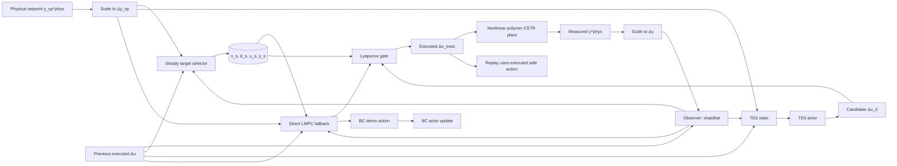
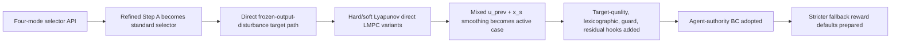

# Polymer CSTR Lyapunov Safety-Gate Analysis

## Executive summary

This project is trying to combine three control ideas in one loop: offset-free tracking for a nonlinear polymer CSTR, a direct Lyapunov certificate that enforces one-step contraction around a selected steady operating point, and a TD3 actor that keeps as much control authority as possible under a safety gate. In the attached handoff, the plant evolves in physical units \((\eta,T,Q_c,Q_m)\), while the controller and RL stack work mostly in min-max scaled deviation coordinates. The current active scripts use two setpoints, 200 episodes, `set_points_len = 400`, \(\rho_{\mathrm{lyap}}=0.99\), and \(\epsilon_{\mathrm{lyap}}=10^{-3}\). The active direct/RL path tracks raw \(y_{\mathrm{sp}}\) online but still uses the direct steady target as the Lyapunov center.

The accessible repository evidence points to a very specific split in behavior. Pretrained RL is currently the best RL case on full-horizon reward and RMSE. Cold-start RL has better gate authority: fewer fallbacks, smaller correction gaps, and smaller fallback penalty. Direct Lyapunov MPC has very good final-tail offset but clearly weaker full-horizon raw-setpoint RMSE and the slowest runtime. Those patterns are consistent with the literature on predictive safety filters and action-governor safe RL: a safety supervisor can keep learning-based control safe, but it does not automatically align the learner with the supervisor’s internal admissible target or safe set. citeturn14view0turn15view5turn18view2turn21view0

The deepest issue is not “RL is unstable.” The deeper issue is that the project currently has a **hidden artificial-reference problem**. The target selector computes a Lyapunov center \((x_s,u_s,y_s)\) that may differ from the raw command \(y_{\mathrm{sp}}\), while the online objective and report metrics still emphasize raw-setpoint tracking. Modern tracking MPC literature treats this case explicitly: when the requested setpoint is not safely or physically reachable, the controller should optimize an explicit admissible reference or artificial equilibrium and guarantee convergence to the optimal reachable equilibrium, rather than letting a hidden target drift become the de facto reference. Command-governor theory says the same thing in command-modification language: if a command must be changed for admissibility, the modified command should be explicit and closest to the original one. citeturn15view0turn15view1turn18view0turn18view1turn18view3

The top three root-cause hypotheses are therefore:

| Hypothesis | Why it is high priority |
|---|---|
| Hidden artificial-reference mismatch | The controller tracks raw \(y_{\mathrm{sp}}\), but the safety certificate contracts around \(x_s\) generated by a possibly modified \(y_s\). |
| Steady-target model mismatch | A frozen output-disturbance target is being used to represent mismatch that may actually deform the nonlinear steady-state manifold, not just add a constant output bias. |
| Gate/actor information mismatch | The actor is judged by a target-centered safety filter, but its observation does not appear to include target-quality or target-center information. |

Those hypotheses are also the ones most strongly supported by contemporary offset-free MPC, tracking MPC, command-governor, and safe-RL literature. Offset-free MPC under mismatch requires more than a frozen bias state; recent results emphasize robust state/disturbance estimation, steady-state backoffs, and robustness to setpoint and disturbance changes. Tracking MPC with artificial references and command governors provide a more principled way to handle setpoints that must be modified online. Predictive safety filters and generalized action governors clarify why a binary accept-or-fallback gate can create a performance-versus-authority split unless the learner is explicitly aligned with the safety layer’s internal geometry. citeturn16view0turn18view1turn19view0turn14view0turn18view2

A practical limit matters. Direct source-code inspection of the GitHub repository was **not** possible from this environment: the repository URL returned 404, and direct raw-file fetches for files such as `DirectLyapunovMPC.py` and `AGENTS.md` were also unavailable. Accordingly, the implementation audit below is a report-level audit grounded in the attached HTML handoff and the local project-history note files that were bundled alongside it, not a line-by-line source audit of the repository. citeturn1view0turn2view0turn2view2

## Mathematical reconstruction

The nonlinear plant can be written abstractly as

\[
x_{k+1}^{\mathrm{phys}} = f\!\left(x_k^{\mathrm{phys}},u_k^{\mathrm{phys}},w_k\right),
\qquad
y_k^{\mathrm{phys}} = h\!\left(x_k^{\mathrm{phys}}\right),
\]

with physical manipulated inputs

\[
u_k^{\mathrm{phys}}=
\begin{bmatrix}
Q_{c,k}\\
Q_{m,k}
\end{bmatrix},
\]

and physical controlled outputs

\[
y_k^{\mathrm{phys}}=
\begin{bmatrix}
\eta_k\\
T_k
\end{bmatrix}.
\]

The attached handoff makes the coordinate split explicit: the plant runs in physical units, while the controller and RL use min-max scaled deviation coordinates. With scaling map

\[
S(v)=\frac{v-v_{\min}}{v_{\max}-v_{\min}},
\qquad
S^{-1}(\bar v)=\bar v\,(v_{\max}-v_{\min})+v_{\min},
\]

the active controller variables are

\[
\Delta u_k=S(u_k^{\mathrm{phys}})-S(u_{\mathrm{ss}}^{\mathrm{phys}}),
\qquad
\Delta y_k=S(y_k^{\mathrm{phys}})-S(y_{\mathrm{ss}}^{\mathrm{phys}}),
\]

and the setpoint is converted in the same way,

\[
\Delta y_{\mathrm{sp},k}=S(y_{\mathrm{sp},k}^{\mathrm{phys}})-S(y_{\mathrm{ss}}^{\mathrm{phys}}).
\]

That physical-versus-scaled distinction is central. Physically good final-tail offset and low scaled RMSE are not identical objectives, and some of the report’s observed tradeoffs look exactly like that distinction.

The offset-free observer uses an augmented output-disturbance state,

\[
\hat z_k=
\begin{bmatrix}
\hat x_k\\
\hat d_k
\end{bmatrix},
\qquad
\hat z_{k+1}=A_{\mathrm{aug}}\hat z_k+B_{\mathrm{aug}}\Delta u_k,
\qquad
\hat y_k=C_{\mathrm{aug}}\hat z_k.
\]

The observer correction uses the previous measured scaled-deviation output,

\[
e_{\mathrm{obs},k}=\Delta y_{k-1}-C_{\mathrm{aug}}\hat z_k,
\]

\[
\hat z_{k+1}=A_{\mathrm{aug}}\hat z_k+B_{\mathrm{aug}}\Delta u_{\mathrm{exec},k}+L\,e_{\mathrm{obs},k}.
\]

So the common information state for the whole architecture is `xhatdhat = [\hat x_k,\hat d_k]`.

The baseline offset-free MPC objective is the standard output-tracking-plus-move-penalty form. Using prediction horizon \(N_P\), control horizon \(N_C\), output weight \(Q_y\), and move penalty \(R_{\Delta u}\),

\[
\min_{\Delta u_{0|k},\dots,\Delta u_{N_C-1|k}}
\sum_{i=0}^{N_P-1}
\|y_{i+1|k}-y_{\mathrm{target}}\|_{Q_y}^2
+
\sum_{j=0}^{N_C-1}
\|\Delta u_{j|k}-\Delta u_{j-1|k}\|_{R_{\Delta u}}^2,
\]

subject to augmented dynamics and input bounds. The project-history notes say that the direct path deliberately removed extra steady-input objective terms and extra terminal objective terms, so the active direct objective is now **output tracking plus move penalty**, with Lyapunov behavior enforced through the contraction check rather than through additional terminal costs.

The active standard selector is the refined Step A selector. It fixes the target disturbance to the current estimate,

\[
d_s=\hat d_k,
\]

and computes an equilibrium package \((x_s,d_s,u_s,y_s)\) using output tracking, input anchoring, previous-input smoothing, previous-state smoothing, and a weak current-state anchor. The handoff summarizes it as

\[
\begin{aligned}
J_{\mathrm{sel}}={}&
\|r_s-y_{\mathrm{sp}}\|_{Q_r}^2
+\alpha_u\|u_s-u_{k-1}\|_{R_u}^2
+\alpha_{\Delta u}\|u_s-u_{s,k-1}\|_{R_{\Delta u}}^2\\
&+\alpha_{\Delta x}\|x_s-x_{s,k-1}\|_{Q_{\Delta x}}^2
+\alpha_x\|x_s-\hat x_k\|_{Q_x}^2.
\end{aligned}
\]

The current active direct target in the three root scripts is the frozen-output-disturbance direct target. It solves

\[
x_s=Ax_s+Bu_s,
\qquad
y_s=Cx_s+d_s,
\qquad
d_s=\hat d_k.
\]

If the exact target is input-feasible, then

\[
y_s=\Delta y_{\mathrm{sp},k},
\qquad
\Delta u_{\min}\le u_s\le \Delta u_{\max}.
\]

Otherwise the bounded target solves a residual-type steady problem,

\[
J_{\mathrm{target}}
=
\|x_s-Ax_s-Bu_s\|^2
+
\|Cx_s+d_s-\Delta y_{\mathrm{sp},k}\|^2
+
J_u+J_x,
\]

with optional regularization

\[
J_u=(u_s-u_{\mathrm{ref}})^\top R_{u\mathrm{ref}}(u_s-u_{\mathrm{ref}}),
\qquad
J_x=(x_s-x_{\mathrm{ref}})^\top Q_{x\mathrm{ref}}(x_s-x_{\mathrm{ref}}).
\]

In the active scripts, both the \(u_{k-1}\) anchor and the previous-\(x_s\) smoothing are set to weight \(0.1\), and `case_variants = ("mixed",)`.

The direct Lyapunov MPC then optimizes tracking over a horizon but certifies stability around the target center. The Lyapunov function is defined on the plant-state part of the estimate,

\[
V_k=(\hat x_k-x_s)^\top P_x(\hat x_k-x_s).
\]

The first-step contraction requirement is

\[
V_{k+1}^{\mathrm{first}}
\le
\rho V_k+\epsilon_{\mathrm{lyap}},
\]

with current defaults

\[
\rho=0.99,\qquad \epsilon_{\mathrm{lyap}}=10^{-3}.
\]

The logged contraction margin is

\[
m_k = V_{k+1}^{\mathrm{first}}-(\rho V_k+\epsilon_{\mathrm{lyap}}),
\]

so \(m_k\le 0\) means the candidate is accepted. That sign convention is important, because the system-history notes explicitly warn against interpreting \(\epsilon_{\mathrm{lyap}}=10^{-3}\) as “the gate is gone.” A relaxed Lyapunov inequality is still a Lyapunov gate so long as activations, fallbacks, and margin logs remain meaningful.

The RL layer uses TD3 on top of the same observer. The active RL state is

\[
s_k=
\big[
S_{\pm 1}(\hat z_k),\,
S_{\pm 1}(\Delta y_{\mathrm{sp},k}),\,
S_{\pm 1}(\Delta u_{k-1})
\big],
\]

and the actor outputs \(a_k\in[-1,1]^m\), mapped to the scaled input box by

\[
\Delta u_{\mathrm{rl},k}
=
\Delta u_{\min}
+
\frac{1}{2}(a_k+1)(\Delta u_{\max}-\Delta u_{\min}).
\]

The inverse mapping used for replay on executed safe actions is

\[
a_{\mathrm{exec},k}
=
2\frac{\Delta u_{\mathrm{exec},k}-\Delta u_{\min}}
{\Delta u_{\max}-\Delta u_{\min}}-1.
\]

The current safe-RL architecture is best described as an **agent-authority behavioral cloning** setup protected by a predictive safety filter or action-governor-like supervisor. Predictive safety filters receive a proposed learning-based input and either certify it or modify it based on a model-predictive safety policy; action governors similarly supervise a nominal controller or learner through online action adjustment. That is exactly the architectural family the current project is now closest to. citeturn14view0turn15view5turn18view2

During BC, the actor still proposes the candidate policy action, and direct LMPC provides the demonstration target. In symbols,

\[
\Delta u_{\mathrm{cand},k}=\Delta u_{\mathrm{rl},k},
\qquad
\Delta u_{\mathrm{demo},k}=\Delta u_{\mathrm{LMPC},k}.
\]

The gate then chooses the executed input:

\[
\Delta u_{\mathrm{exec},k}
=
\begin{cases}
\Delta u_{\mathrm{cand},k}, & \text{if the candidate satisfies the Lyapunov gate},\\[4pt]
\Delta u_{\mathrm{LMPC},k}, & \text{otherwise.}
\end{cases}
\]

Behavioral cloning minimizes

\[
J_{\mathrm{BC}}=\|\pi_\theta(s_k)-a_{\mathrm{demo},k}\|^2,
\]

but replay stores the executed safe action,

\[
(s_k,a_{\mathrm{exec},k},r_k,s_{k+1},d_k),
\]

not an unsafe raw proposal.

The reward is computed after the plant step from raw setpoint tracking error in scaled coordinates,

\[
e_k=\Delta y_{k+1}-\Delta y_{\mathrm{sp},k},
\]

plus move shaping, in-band/out-of-band terms, and a fallback cost of the form

\[
J_{\mathrm{fb}}
=
\gamma_{\mathrm{fb}}\sum_j R_{\mathrm{fb},j}g_{k,j}^2
+
c_{\mathrm{fb}}\,I_{\mathrm{fb},k},
\]

where \(g_k=\Delta u_{\mathrm{cand},k}-\Delta u_{\mathrm{exec},k}\) is the correction gap. The attached notes are especially clear that the latest analyzed run used one reward setting, but the current next-run defaults are already stricter on fallback and in-band offset. That matters for how strongly one should generalize from the reported cold-versus-pretrained ranking.

The overall architecture can be visualized this way.



## Implementation audit

A hard boundary on this audit has to be stated first. The repository URL itself was not fetchable from this environment, and direct raw-file access for named files such as `DirectLyapunovMPC.py` and `AGENTS.md` also failed. That means `AGENTS.md`, the Python source files, and the Markdown reports in `report/` and `change-reports/` could not be verified line by line here. The audit below is therefore limited to what the attached HTML handoff and the local note extracts explicitly document. citeturn1view0turn2view0turn2view2

Within that boundary, several architectural facts are confirmed by the attached handoff rather than inferred. The current direct RL path tracks raw \(y_{\mathrm{sp}}\), not \(y_s\). The direct safety gate uses an accept-or-fallback backend: actor proposes, Lyapunov gate decides, direct LMPC is the backup. Replay stores the executed safe action. Agent-authority BC is the current design, and direct teacher execution during BC is explicitly **not** the intended behavior. The current mixed direct target uses both \(u_{k-1}\) anchoring and previous-\(x_s\) smoothing at weight \(0.1\). Target-quality diagnostics, lexicographic bounded-target hooks, direct-gate performance-guard hooks, and residual-RL hooks already exist as options. None of those are missing features.

Since direct source inspection was unavailable, the most honest way to present the audit is to separate **confirmed design mismatches** from **plausible source-level concerns**.

| Status | Item | Why it matters |
|---|---|---|
| Confirmed design mismatch | Raw \(y_{\mathrm{sp}}\) tracking but target-centered Lyapunov certificate | Safety and performance are centered on different equilibria whenever \(y_s\neq y_{\mathrm{sp}}\). |
| Confirmed design mismatch | Actor state omits target-center and target-quality information | The actor is being supervised against a geometry it does not directly observe. |
| Confirmed design mismatch | Binary accept-or-fallback gate | This can exaggerate correction gaps and authority differences between otherwise similar policies. |
| Confirmed bookkeeping choice | Replay stores executed safe actions | This is correct for safety-gated RL and avoids critic training on unsafe proposals. |
| Confirmed historical caveat | Latest analyzed run and next-run defaults differ | Some conclusions need matched reruns under the stricter current reward defaults. |

The first design mismatch is the most important. From an implementation perspective, this is not a sign error; it is a **coordinate/reference mismatch** built into the architecture. When the direct target computes \(y_s\neq y_{\mathrm{sp}}\), the MPC objective and reward are still measuring error to \(y_{\mathrm{sp}}\), but the safety gate and direct Lyapunov logic measure contraction relative to \(x_s\). Formally,

\[
y_k-y_{\mathrm{sp},k}
=
(y_k-y_s)+(y_s-y_{\mathrm{sp},k}).
\]

The current gate only certifies the first term. This is the core implementation-level reason a target can be Lyapunov-admissible and still poor for raw tracking.

The second confirmed mismatch is informational. The actor state described in the handoff includes \(\hat z_k\), raw \(\Delta y_{\mathrm{sp},k}\), and previous executed \(\Delta u_{k-1}\), but not \(y_s\), \(u_s\), \(y_s-y_{\mathrm{sp}}\), exact-versus-bounded target stage, or target-quality flags. That is a strong candidate explanation for why cold-start RL learns better gate compatibility while pretrained RL retains better raw tracking: the gate’s internal objective is partly hidden from the actor.

Several source-level concerns remain plausible but not proven without direct code access. One is the absence of an explicit hard move-rate acceptance constraint in the active RL gate. The attached notes clearly mention move penalties in the reward and direct LMPC objective, but they do not document a hard slew-rate test in the accept-or-fallback path. Another is the exact equality of some summary metrics between “Direct LMPC” and “Direct MPC-only” despite very different per-step runtimes; without raw result files, that could be a real outcome, a naming overlap, or a reporting duplication. A third is the possibility that numerically successful but poor targets still update the “previous successful target” memory used for smoothing, because the handoff says quality diagnostics and bypass fields were added but does not prove that target memory updates are now gated by target quality. These are plausible concerns, not confirmed bugs.

That source-audit limitation aside, the most important scientific issue is already visible without line numbers: the present design conflates a hidden artificial reference with the raw requested reference. The literature would not treat that as a minor implementation detail. Tracking MPC with artificial references and command/reference governors were developed precisely to avoid this ambiguity by making the admissible reference explicit and optimizing its distance to the original command. citeturn15view0turn15view1turn18view0turn18view1

## Result interpretation and target-selector diagnosis

The current result pattern is actually coherent once the architecture is read through the lens of predictive safety filters. Cold-start RL is better on gate authority because it learns **inside the current gate from the beginning**. Pretrained RL is better on full-horizon reward and RMSE because it begins with a stronger raw-tracking prior, but that prior was not necessarily trained against the current target-centered safety geometry. This authority-versus-performance split is exactly the kind of tradeoff described in predictive safety filtering and action-governor safe RL: the supervisor certifies or minimally adjusts inputs, but it does not automatically make the learned policy align with the supervisor’s internal admissible set. citeturn14view0turn15view5turn18view2turn21view0

Direct Lyapunov MPC’s behavior is also consistent with theory. A controller that contracts around a selected center should look good on the **final tail** once it has settled near that center. But if the center is a modified admissible target rather than the raw setpoint, then full-horizon raw-setpoint RMSE can still be poor. This is exactly why modern tracking MPC distinguishes between reachable setpoints and the optimal reachable equilibrium when a setpoint is not directly admissible. Berberich and coauthors show that tracking MPC should converge to the optimal reachable equilibrium when the desired setpoint is unreachable, and that this structure extends usefully to nonlinear systems and even online linear identification. citeturn15view1turn18view0turn15view3turn18view1

That brings the target-selector problem into sharper focus. The current direct target can be perfectly admissible for Lyapunov contraction and still poor for raw tracking because the selected center is solving the wrong problem. The safety gate and direct fallback are organized around the equilibrium package \((x_s,u_s,y_s)\), while the report metrics and active online tracking remain centered on \(y_{\mathrm{sp}}\). If \(y_s\) must move to satisfy the frozen-disturbance target equations, input bounds, or regularization, then the active architecture becomes

\[
y_{\mathrm{sp}}
\longrightarrow
(x_s,u_s,y_s)
\longrightarrow
\text{contraction around }x_s
\]

instead of

\[
y_{\mathrm{sp}}
\longrightarrow
r_k
\longrightarrow
(x_s,u_s,y_s)
\longrightarrow
\text{tracking and contraction around a declared admissible command}.
\]

That is the core conceptual gap. It is also why turning target-output tracking back on is not the right answer by itself. If \(y_s\) is poor, then tracking \(y_s\) faithfully only hides the centered-tracking problem.

The frozen output-disturbance model is the second major issue. Classical offset-free MPC uses disturbance augmentation successfully, but recent nonlinear offset-free MPC results are much more careful: robust offset-free performance under plant-model mismatch needs a robustly stable state and disturbance estimator, constraint backoffs at steady state, and robustness to state/disturbance-estimation errors and setpoint/disturbance changes. If the real disturbed polymer CSTR changes the steady-state manifold or the effective dynamics in a way that is not well represented as “constant output bias plus fixed linear model,” then freezing \(d_s=\hat d_k\) can yield a target that is algebraically consistent and physically wrong. citeturn16view0

The recent reference-governor literature makes that point even more concrete. Robust reference governors under unmeasured set-bounded disturbances become conservative if they do not exploit disturbance estimation, and recent work reduces this conservatism by estimating the disturbance and working with time-varying error-bounding sets rather than assuming a static constant disturbance picture. That is very close to what this repository now needs at the target-selection layer: the direct target should not treat \(\hat d_k\) as an exact frozen truth when recent innovations indicate high uncertainty or transient mismatch. citeturn19view0

The final piece is controller aggressiveness versus target-center drift. The accessible evidence suggests that controller aggressiveness is **not** the dominant first-order explanation. The project history already says that \(u_{k-1}\) regularization, \(x_s\) smoothing, soft versus hard Lyapunov modes, lexicographic bounded targets, and performance-guard hooks were all added or tried. The persistent symptom is that the controller can contract around a poor or modified admissible target while raw tracking suffers. That points more strongly to target-model mismatch and hidden-command mismatch than to “RL too aggressive” or “Lyapunov too strict.”

A compact diagnosis table makes the hierarchy clearer.

| Mechanism | Present role | Why it matters most or less |
|---|---|---|
| Frozen \(d_s=\hat d_k\) | High | Good for nominal offset-free logic, weak if the disturbance changes equilibrium structure rather than only output bias. |
| Bounded target projection | High | Necessary for feasibility, but can silently move the center away from the raw command. |
| \(u_{k-1}\) anchoring | Medium | Smooths the target input but does not guarantee raw-setpoint fidelity. |
| \(x_s\) smoothing | Medium | Smooths the Lyapunov center but can also stabilize a bad center. |
| Raw \(y_{\mathrm{sp}}\) tracking | Necessary but incomplete | Prevents “tracking a bad \(y_s\),” but does not make the target itself trustworthy. |
| Target-quality bypass | Useful hook | Diagnostic and protective, but not yet a full command architecture. |
| Lexicographic bounded target | Useful hook | Promising only if the lexicographic priority is changed to raw-command fidelity first. |
| Controller aggressiveness | Secondary amplifier | Important, but likely not the root issue while the target center remains hidden and drifting. |

The literature-grounded interpretation is therefore this: the main issue is **objective alignment plus target-model mismatch**, with target-center drift as the symptom and controller aggressiveness as an amplifier. Tracking MPC with artificial references, command/reference governors, robust offset-free MPC, and predictive safety filters all point to the same prescription: make the admissible command explicit, preserve its closeness to the raw request, and robustify the target backend against estimator uncertainty and mismatch. citeturn15view0turn18view1turn16view0turn14view0turn18view3

A concise chronology of what the handoff says has already been built or tried is useful here.



The reason to draw the timeline is simple: the next method should not be a reworded version of steps A through F. It has to change the target-command architecture or the gate architecture in a way the project has not already implemented.

## Literature-grounded new methods

The proposals below are intentionally chosen so they are **not** just renamed versions of already-tried ideas such as generic \(u_{k-1}\) regularization, generic \(x_s\) smoothing, generic lexicographic hooks, generic target-quality logging, or teacher-executed BC.

| Proposal | Mathematical core | Why it addresses the observed failure | Main risk | Likely files to change |
|---|---|---|---|---|
| Governed artificial reference | Optimize explicit admissible command \(r_k\) before target solve | Removes the hidden artificial-reference problem | More online optimization | `Lyapunov/target_selector.py`, `Lyapunov/frozen_output_disturbance_target.py`, `Lyapunov/direct_lyapunov_mpc.py`, active root scripts |
| Adaptive equilibrium backend | Compute target on nonlinear or locally re-identified equilibrium manifold | Addresses wrong steady-state map, not just wrong regularization | Engineering complexity, runtime | target modules, direct LMPC target prep, possibly `utils/lyapunov_utils.py` |
| Uncertainty-aware robust target | Target solve over disturbance-estimation uncertainty set with headroom | Reduces brittle drift from over-trusting \(\hat d_k\) | Conservatism | target modules, observer diagnostics, direct LMPC prep |
| Quality-gated target memory and hysteresis | Only commit a target if it is quality-valid; add exact/bounded dwell | Suppresses target flip-flop and bad-center persistence | Slower adaptation if thresholds are too tight | target memory/update logic in target/direct modules |
| Minimally invasive corrective safety filter | Solve nearest-safe correction QP instead of binary fallback | Shrinks correction gap and gives smoother authority transfer | More online compute | `Lyapunov/lyapunov_core.py`, `Simulation/run_rl_lyapunov.py`, RL root scripts |

The first and best proposal is an **explicit commanded artificial reference** \(r_k\). The key idea is to separate the raw request \(y_{\mathrm{sp},k}\) from the admissible command used by the controller:

\[
r_k
=
\arg\min_r
\|r-y_{\mathrm{sp},k}\|_{W_r}^2
+
\lambda_r\|r-r_{k-1}\|^2
\]

subject to the existence of a feasible steady target and a one-step certified backup:

\[
\exists\,x_s,u_s:
\quad
x_s=Ax_s+Bu_s,
\qquad
r=Cx_s+\hat d_k,
\qquad
u_s\in U,
\]

and optionally

\[
\exists\,u_0\in U:
\quad
V(A(\hat x_k-x_s)+B(u_0-u_s))
\le
\rho V(\hat x_k-x_s)+\epsilon.
\]

This is not the same as “just track \(y_s\)” or “just use lexicographic bounded targets.” It makes the command modification explicit, logged, and optimized. The literature support is direct: command governors explicitly solve a QP for the modified command closest to the original one subject to admissibility, and artificial-reference tracking MPC makes the admissible reference a decision variable with recursive-feasibility and stability benefits. citeturn15view0turn18view1

The second proposal is an **adaptive equilibrium backend**. Instead of always solving the target in a fixed frozen-disturbance linear model, solve it on a better local equilibrium manifold. The lighter-weight version is local online linear identification over a moving window,

\[
(A_k,B_k,C_k)=\mathcal I\big(\{x_{j},u_{j},y_j\}_{j=k-M}^{k}\big),
\]

followed by a target solve in that local model. The more ambitious version solves the nonlinear steady-state equations directly in physical coordinates,

\[
0=f_{\mathrm{phys}}(x_s^{\mathrm{phys}},u_s^{\mathrm{phys}},p_k),
\qquad
r=h_{\mathrm{phys}}(x_s^{\mathrm{phys}},u_s^{\mathrm{phys}},p_k).
\]

This proposal is motivated by linear tracking MPC for nonlinear systems and by adaptive tracking MPC via online linear identification. Those works show that a local linear model can be enough to stabilize the optimal reachable equilibrium of a nonlinear system and can be updated online from recent measurements. In fact, the 2021 model-based paper demonstrates the approach on a nonlinear CSTR while keeping the online optimization convex. citeturn18view0turn15view3

The third proposal is an **uncertainty-aware robust target selector**. Instead of setting \(d_s=\hat d_k\) exactly, define an uncertainty set

\[
d_s=\hat d_k+\delta_d,
\qquad
\delta_d\in\mathcal D_k,
\]

with \(\mathcal D_k\) derived from recent innovation magnitudes or a running covariance proxy. Then solve a robust or worst-case weighted target fit,

\[
\min_{x_s,u_s}\max_{\delta_d\in\mathcal D_k}
\|Cx_s+\hat d_k+\delta_d-r_k\|_{W_y}^2
+
\lambda_u\|u_s-u_{k-1}\|^2
+
\lambda_x\|x_s-x_{s,\mathrm{prev}}\|^2,
\]

subject to steady equations and headroom constraints

\[
u_{\min}+h\le u_s\le u_{\max}-h.
\]

This is a genuine new variant relative to the already-tried “free disturbance prior,” because it does not let the disturbance move freely; it explicitly bounds the disturbance adjustment with a time-varying uncertainty set. The most relevant literature is recent offset-free MPC under mismatch and robust reference governors with disturbance-estimation error bounds. citeturn16view0turn19view0

The fourth proposal is **quality-gated target memory with hysteresis**. This may look small, but it is a high-leverage change if the current code still commits poor targets into the smoothing memory. The rule is

\[
(x_{s,\mathrm{prev}},u_{s,\mathrm{prev}})
\leftarrow
(x_s,u_s)
\quad\text{only if}\quad
\texttt{target\_success}\wedge\texttt{target\_quality\_ok}.
\]

Then add mode hysteresis so that an exact target is not immediately abandoned for a bounded target unless the improvement is persistent. This is **not** a repeat of generic backup or generic smoothing. The already-tried features detect failure or smooth across time; this proposal changes the **state machine** of target commitment and mode transitions. It is the cheapest way to test whether target-center recentering is self-inflicted by update logic.

The fifth proposal is a **minimally invasive corrective safety filter** rather than a binary accept-or-fallback gate. The controller solves

\[
\min_{u}
\|u-u_{\mathrm{RL}}\|_{W_{\mathrm{RL}}}^2
+
\lambda_f\|u-u_{\mathrm{LMPC}}\|_{W_f}^2
\]

subject to

\[
u\in U,
\qquad
\|u-u_{k-1}\|_\infty\le \Delta u_{\max},
\qquad
V(x_{k+1}(u))\le \rho V(x_k)+\epsilon-\eta_{\mathrm{reserve}}.
\]

This differs materially from the current binary gate and from the earlier first-step-constrained upstream-MPC experiment, because it is a **projection/correction stage around the actor proposal**, not merely a separate constrained MPC solve without projection. The literature support is strong: predictive safety filters, action governors, generalized action governors, and model-predictive shielding all emphasize minimal or structured adjustment of proposed actions to keep learning safe while preserving as much nominal authority as possible. citeturn14view0turn15view5turn18view2turn21view0

A final note on prioritization: although residual-RL hooks already exist, I would **not** make residual RL the next main intervention. If the target layer remains wrong, a residual actor only learns to compensate for a miscentered certificate. Residual RL becomes more interesting only *after* an explicit command layer or improved target backend removes the hidden-reference problem. The most relevant process-control evidence comes from a 2025 polymerisation CSTR offline-RL paper, which found steady-state offsets and degraded near-setpoint performance, then improved deployment using an action-correction layer rather than by relying on the policy alone. That paper strongly supports target- and action-correction first, policy retuning second. citeturn17view0

## Experiment plan and implementation sketch

The next experiment sequence should be staged and deliberately small. The lowest-cost stage is a **forensic pass over existing result bundles**, not a new training run. For every saved controller and episode, compute these quantities from the step tables:

\[
\|y_k-y_{\mathrm{sp},k}\|,\qquad
\|y_k-y_{s,k}\|,\qquad
\|y_{s,k}-y_{\mathrm{sp},k}\|,
\]

\[
\|x_{s,k}-x_{s,k-1}\|,\qquad
\|u_{s,k}-u_{s,k-1}\|,\qquad
m_k,
\]

together with saturation fraction and fallback or would-be activation. The crucial analysis is whether raw tracking error co-moves primarily with target mismatch \(\|y_s-y_{\mathrm{sp}}\|\) or with small contraction margins \(m_k\). If raw error rises mostly when target mismatch rises, the target layer is the bottleneck. If raw error rises even when target mismatch is small, then the online controller or binary gate is the next target.

Only after that should there be new runs, and they should begin with **direct-only** cases.

| Stage | Case | Purpose |
|---|---|---|
| Direct-only baseline | Current mixed bounded direct target | Reference trajectory |
| Direct-only variant A | Governed explicit command \(r_k\) + existing direct target | Tests hidden artificial-reference hypothesis |
| Direct-only variant B | Variant A + quality-gated memory and mode hysteresis | Tests recentering/flip-flop hypothesis |
| Direct-only variant C | Adaptive equilibrium backend | Tests steady-state model mismatch hypothesis |

Those direct-only runs should be compared on exactly these metrics: raw-setpoint RMSE, \(y_s\)-target RMSE, final-tail offset, target residual \(\|y_s-y_{\mathrm{sp}}\|\), target movement, input saturation, Lyapunov contraction margin, would-be activation rate, and wall-clock seconds per step.

Then, and only then, run RL again with the best direct-only target layer.

| RL stage | Case |
|---|---|
| RL baseline | Current cold-start RL |
| RL target-fixed | Cold-start RL + best direct-only target fix |
| RL target-fixed | Pretrained RL + best direct-only target fix |
| Optional RL gate-fixed | Best target fix + corrective safety filter QP |

That is enough to answer the two critical questions: whether better target quality narrows the cold-versus-pretrained authority split, and whether binary accept/fallback is still too coarse after a better target layer is installed.

The best first implementation is the **governed-command target layer** with quality-gated memory. Patch-level pseudocode is below.

```python
def solve_governed_target(xhatdhat, y_sp_raw, u_prev, xs_prev, cfg):
    # 1) Explicit admissible command near the raw request
    #    minimize ||r - y_sp_raw||^2 + lambda_cmd_move ||r - r_prev||^2
    #    subject to existence of a feasible steady target and optional one-step probe
    r_cmd = command_governor_qp(
        xhatdhat=xhatdhat,
        y_sp_raw=y_sp_raw,
        u_prev=u_prev,
        cfg=cfg.governor,
    )

    # 2) Steady target around the explicit commanded reference, not raw y_sp directly
    target = direct_bounded_target(
        xhatdhat=xhatdhat,
        y_ref=r_cmd,
        u_ref=u_prev,
        x_ref=xs_prev,
        regularization=cfg.target_reg,
    )

    # 3) Quality gate before target memory update
    quality = {
        "raw_offset_inf": norm_inf(target.y_s - y_sp_raw),
        "cmd_offset_inf": norm_inf(target.y_s - r_cmd),
        "target_move_x": norm_inf(target.x_s - xs_prev),
        "target_move_u": norm_inf(target.u_s - u_prev),
        "input_headroom_min": min(target.u_s - u_min, u_max - target.u_s),
        "target_stage": target.stage,   # exact / bounded / held
    }

    quality_ok = check_target_quality(quality, cfg.quality)

    if not quality_ok:
        if cfg.quality.reject_policy == "hold_last_good":
            target = last_good_target()
        else:
            target = target  # but memory update disabled

    target.memory_update = target.success and quality_ok
    return r_cmd, target, quality
```

A reasonable first config, expressed in the same notation already used in the project, would be something like this:

```python
direct_target_config = {
    "governed_reference_enabled": True,
    "governor_lambda_cmd_move": 1.0,
    "governor_input_headroom_frac": 0.03,
    "governor_one_step_probe": True,
    "raw_offset_soft_phys": [0.012, 0.14],
    "raw_offset_hard_phys": [0.024, 0.28],
    "quality_gate_enabled": True,
    "memory_update_requires_quality_ok": True,
    "mode_hysteresis_steps": 8,
    "u_prev_penalty_weight": 0.1,
    "xs_prev_penalty_weight": 0.1,
}
```

Those starting numbers are intentionally modest and interpretable relative to the current direct-study band floors already documented in the handoff. They are not meant to be final tuning; they are meant to make the new diagnostics readable.

The logging must be expanded enough to prove the fix worked. At minimum, every step table should include:

| Diagnostic | Why it is needed |
|---|---|
| `target_raw_offset_inf` | Direct measure of hidden target mismatch |
| `cmd_offset_inf` | How far the governed command moved from raw request |
| `target_stage` | Exact / bounded / held target mode |
| `target_memory_update` | Whether target smoothing memory was updated |
| `target_quality_ok` | Whether the target was allowed to become authoritative |
| `target_input_headroom_min` | Whether target sits too close to saturation |
| `lyap_margin` | Whether performance gains came from more or less reserve |
| `gate_mode` | accept / corrected / fallback |
| `correction_gap_inf` | Authority loss in the gate |
| `actor_visible_target_features` | Only if target-aware RL state is enabled |

A successful experiment should not just lower raw RMSE. It should also reduce \(\|y_s-y_{\mathrm{sp}}\|\), reduce unnecessary target movement, keep or improve final-tail offset, and avoid a strong runtime penalty. If those diagnostics do not move in the right direction, the target layer has not actually been fixed.

## Things not to suggest again

The attached project-history notes are unusually explicit about what should **not** be re-proposed as if it were missing. The table below reflects that history and explains why the proposals in this report are materially different.

| Already tried or already present | Why it is not being re-suggested | If revisited, what is materially different now |
|---|---|---|
| Old four-mode selector API | Already implemented and collapsed to refined Step A | Only revisit if the target **backend** changes, e.g. adaptive or nonlinear equilibrium manifold |
| Selector warm-start | Already implemented | Not a next-step fix by itself |
| Last-valid / effective-target backup | Already implemented | New variant is quality-gated **commit/hysteresis**, not mere backup on failure |
| Generic \(u_{k-1}\) anchoring | Already implemented; active at 0.1 | New variant is explicit command optimization before target calculation |
| Generic \(x_s\) smoothing | Already implemented; active at 0.1 | New variant is quality-gated memory and stage hysteresis |
| Generic first-step-constrained upstream MPC | Already built without projection/QCQP stage | New variant is a **corrective safety filter** around the actor proposal |
| Generic target-quality diagnostics | Already implemented | New variant is to make quality control the **memory-update contract** |
| Generic lexicographic bounded targets | Already implemented as a hook | New variant is lexicographic or hard-priority **raw-command fidelity first** |
| Residual-RL hooks | Already implemented | Only worth revisiting after the target layer is fixed |
| Teacher-executed BC | Explicitly rejected in current design | Not being recommended |
| “Just increase fallback penalty” | Already implemented in stricter next-run defaults | The new proposals change architecture, not punishment strength |
| Maintenance or jitter penalties during high exploration | Intentionally disabled for now | Not a next-step diagnostic |

One older idea that *is* worth revisiting is lexicographic target design, but only in a new form. The new form would be:

\[
\text{raw-command fidelity first}
\;\rightarrow\;
\text{target admissibility and headroom second}
\;\rightarrow\;
\text{continuity regularization third}.
\]

That is materially different from simply “turning on the lexicographic target option.” The central lesson of the attached project history is that the codebase already has many useful tools. What it does not yet have is a target-command architecture that makes the admissible reference explicit and keeps that reference as close as possible to the raw setpoint while still preserving certification.

The practical conclusion is therefore narrow and strong: the next scientifically serious step is **not** more generic RL tuning. It is to repair the target-command interface. The best-order interventions are: explicit governed command, quality-gated target commitment, improved or adaptive equilibrium backend, and only then a minimally invasive corrective safety filter or target-aware RL state. That sequence is what the repository evidence points to, and it is also the sequence most strongly supported by the current control literature on tracking MPC, command governors, robust offset-free MPC, and safe learning. citeturn15view0turn18view1turn16view0turn14view0turn18view2turn17view0