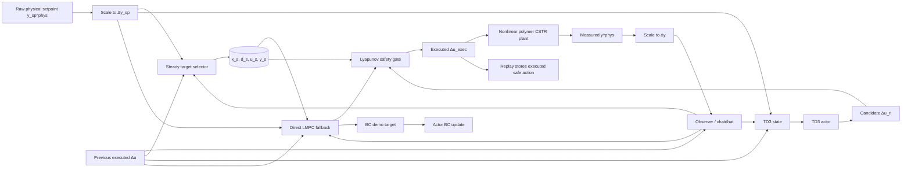

# Polymer CSTR Lyapunov Safety-Gate Analysis

## Executive summary

The accessible evidence shows a control architecture that is trying to do three things simultaneously: track a polymer CSTR output setpoint under persistent mismatch, maintain a Lyapunov-style contraction certificate around a computed steady center, and let a TD3 actor retain as much control authority as possible under a safety gate. In the active workflow described by the attached HTML report, the nonlinear plant evolves in physical units \((\eta,T,Q_c,Q_m)\), while the controller and RL pipeline operate mostly in min-max scaled deviation coordinates; the active root scripts are `DirectLyapunovMPC.py`, `DirectLyapunovSafetyGateRL_ColdStart.py`, and `DirectLyapunovSafetyGateRL_Pretrained.py`; and the current study uses two setpoints, 200 episodes, `set_points_len = 400`, \(\rho_{\text{lyap}}=0.99\), and \(\epsilon_{\text{lyap}}=10^{-3}\). The same report also states that the active direct/RL path tracks raw \(y_{\mathrm{sp}}\) online while using the direct steady target as the Lyapunov center, and that both \(u_{k-1}\) anchoring and previous-\(x_s\) smoothing are active at weight \(0.1\). fileciteturn0file0

What appears to work is quite specific. The latest analyzed run shows that pretrained RL is the best RL case on full-horizon reward and RMSE, whereas cold-start RL has better safety-gate authority: fewer fallback activations, smaller correction gaps, and smaller fallback penalty. Direct Lyapunov MPC has the best final-tail offset, but materially worse full-horizon raw-setpoint RMSE and the slowest runtime. The same report also says the current “agent-authority BC” update is functioning as intended: during BC the actor remains the candidate policy, the gate still decides the executed input, and the direct LMPC action is used only as the imitation target. fileciteturn0file0

What appears to fail is not merely RL exploration. The core methodological tension is that the current active scripts track raw \(y_{\mathrm{sp}}\), but the safety certificate is centered on \((x_s,u_s)\), whose output \(y_s\) may differ from the raw setpoint whenever the steady target is modified by constraints, disturbance freezing, or regularization. Modern tracking MPC literature treats exactly this situation as an **artificial-reference** problem: when the requested setpoint is unreachable or not safely trackable, the controller should optimize an explicit admissible reference and guarantee convergence to the optimal reachable equilibrium, rather than letting a hidden steady target drift become the de facto reference. Command-governor literature makes the same point from a different angle: if the closed loop must modify commands for safety or constraints, that modified command should be explicit and closest to the original request. fileciteturn0file0 citeturn12view0turn12view1turn13view4

The three strongest root-cause hypotheses are therefore these. First, the project has a **hidden artificial-reference architecture**: a target selector modifies the reference implicitly, but the optimization and reporting remain anchored to raw \(y_{\mathrm{sp}}\). Second, the current frozen output-disturbance target is likely too optimistic about how well a constant output-bias model represents the disturbed nonlinear plant; recent offset-free MPC theory emphasizes that robust offset-free performance depends not only on disturbance augmentation, but also on robust state/disturbance estimation, steady-state backoffs, and robustness to setpoint/disturbance changes. Third, the current gate is a binary “accept or fallback” safety filter around a target-centered Lyapunov inequality, while the actor state omits target-related quantities such as \(y_s\), \(u_s\), or target-quality indicators; that combination can make cold-start RL safer because it learns the gate geometry, while pretrained RL remains better on raw tracking because it starts closer to that objective. fileciteturn0file0 citeturn13view0turn13view1turn14view1turn14view2

A practical limitation matters: I could inspect the attached HTML report in detail, but I could not directly retrieve the GitHub repository source files or the separate Markdown/change-report files from this environment. Accordingly, the reconstruction and audit below are grounded in the attached report’s methodology section and in its final handoff section, “Project History And Already-Tried Changes,” which explicitly summarizes the implemented modules, options, and already-tried ideas. Where a claim would require line-by-line source verification, I mark it as unavailable or plausible rather than confirmed. fileciteturn0file0

## Mathematical reconstruction

The attached report does not enumerate every physical reactor state used by the nonlinear polymer CSTR simulator, so I denote the full physical plant state abstractly by \(x_k^{\mathrm{phys}}\). The manipulated physical inputs are

\[
u_k^{\mathrm{phys}}=
\begin{bmatrix}
Q_{c,k}\\
Q_{m,k}
\end{bmatrix},
\]

and the controlled physical outputs are

\[
y_k^{\mathrm{phys}}=
\begin{bmatrix}
\eta_k\\
T_k
\end{bmatrix}.
\]

The report states that the plant is simulated in physical units, but the controller and RL state use min-max scaling. For any physical vector \(v\), the scaling map is

\[
S(v)=\frac{v-v_{\min}}{v_{\max}-v_{\min}},
\qquad
S^{-1}(\bar v)=\bar v\,(v_{\max}-v_{\min})+v_{\min}.
\]

The controller works in scaled **deviation** coordinates,

\[
\Delta u_k = S(u_k^{\mathrm{phys}})-S(u_{\mathrm{ss}}^{\mathrm{phys}}),\qquad
\Delta y_k = S(y_k^{\mathrm{phys}})-S(y_{\mathrm{ss}}^{\mathrm{phys}}),
\]

and the physical setpoint is converted in the same way,

\[
\Delta y_{\mathrm{sp},k}=S(y_{\mathrm{sp},k}^{\mathrm{phys}})-S(y_{\mathrm{ss}}^{\mathrm{phys}}).
\]

This distinction between physical units in the plant and scaled deviations in the controller is central to the report’s reward definitions, target diagnostics, and the interpretation of “tail offset” versus “scaled tracking error.” fileciteturn0file0

The linear controller model is augmented with an output-disturbance estimate. Let

\[
\hat z_k=
\begin{bmatrix}
\hat x_k\\
\hat d_k
\end{bmatrix},
\]

with augmented prediction model

\[
\hat z_{k+1}=A_{\mathrm{aug}}\hat z_k+B_{\mathrm{aug}}\Delta u_k,
\qquad
\hat y_k=C_{\mathrm{aug}}\hat z_k.
\]

The report states that the observer uses the **previous measured scaled-deviation output** as its correction signal:

\[
e_{\mathrm{obs},k}=\Delta y_{k-1}-C_{\mathrm{aug}}\hat z_k,
\]

\[
\hat z_{k+1}=A_{\mathrm{aug}}\hat z_k+B_{\mathrm{aug}}\Delta u_{\mathrm{exec},k}+L\,e_{\mathrm{obs},k}.
\]

So \(\hat z_k\) is the common information state feeding the target selector, the MPC solver, the safety gate, and the RL observation. fileciteturn0file0

The baseline offset-free MPC path in the report tracks the raw setpoint in the augmented-output model. With horizon lengths \(N_P=9\) and \(N_C=3\), and with \(\Delta u_{k-1}\) denoting the previous executed deviation input, the generic tracking objective is

\[
J_{\mathrm{MPC}}=
\sum_{i=0}^{N_P-1}
(y_{i+1|k}-y_{\mathrm{target}})^\top Q_y (y_{i+1|k}-y_{\mathrm{target}})
+\sum_{j=0}^{N_C-1}
(\Delta u_{j|k}-\Delta u_{j-1|k})^\top R_{\Delta u}(\Delta u_{j|k}-\Delta u_{j-1|k}),
\]

subject to the augmented dynamics

\[
z_{0|k}=\hat z_k,
\qquad
z_{i+1|k}=A_{\mathrm{aug}}z_{i|k}+B_{\mathrm{aug}}\Delta u_{j|k},
\qquad
j=\min(i,N_C-1),
\]

and input-box constraints

\[
\Delta u_{\min}\le \Delta u_{j|k}\le \Delta u_{\max}.
\]

In the active direct path, the project-history section says that extra steady-input objective terms and terminal objective terms were deliberately removed, so the active direct objective is **output tracking plus input-move penalty**, with Lyapunov behavior handled by the contraction condition rather than by extra terminal penalties. fileciteturn0file0

The refined Step A target selector, which the final handoff calls the active standard selector, fixes \(d_s=\hat d_k\) and solves for a steady package \((x_s,d_s,u_s,y_s)\) using output tracking, input anchoring, previous-input smoothing, previous-state smoothing, and a weak current-state anchor. The report gives its conceptual objective as

\[
\begin{aligned}
J_{\mathrm{sel}}={}&
\|r_s-y_{\mathrm{sp}}\|_{Q_r}^2
+\alpha_u\|u_s-u_{k-1}\|_{R_u}^2
+\alpha_{\Delta u}\|u_s-u_{s,k-1}\|_{R_{\Delta u}}^2\\
&+\alpha_{\Delta x}\|x_s-x_{s,k-1}\|_{Q_{\Delta x}}^2
+\alpha_x\|x_s-\hat x_k\|_{Q_x}^2,
\end{aligned}
\]

with already-tried defaults including `alpha_u_ref = 0.5`, `alpha_du_sel = 0.5`, `alpha_dx_sel = 0.05`, `alpha_x_ref = 0.01`, `x_weight_base = "CtQC"`, and `use_output_bounds_in_selector = True`. The project history also states that selector warm-start and last-valid/effective-target backup are already implemented. fileciteturn0file0

The direct frozen-output-disturbance selector is a narrower direct path described in the methodology section and summarized again in the handoff. It computes a steady target around a frozen disturbance estimate:

\[
x_s=Ax_s+Bu_s,\qquad
y_s=Cx_s+d_s,\qquad
d_s=\hat d_k.
\]

If the exact target is feasible inside the input box, the direct target is exact:

\[
y_s=\Delta y_{\mathrm{sp},k},
\qquad
\Delta u_{\min}\le u_s\le \Delta u_{\max}.
\]

Otherwise the bounded solver searches for the closest admissible steady target, with a residual-like objective plus optional regularization toward \(u_{k-1}\) and \(x_{s,\mathrm{prev}}\):

\[
J_{\mathrm{target}}
=
\|x_s-Ax_s-Bu_s\|^2
+
\|Cx_s+d_s-\Delta y_{\mathrm{sp},k}\|^2
+
J_u+J_x,
\]

where

\[
J_u=(u_s-u_{\mathrm{ref}})^\top R_{u\mathrm{ref}}(u_s-u_{\mathrm{ref}}),
\qquad
J_x=(x_s-x_{\mathrm{ref}})^\top Q_{x\mathrm{ref}}(x_s-x_{\mathrm{ref}}).
\]

The attached report states that the active three-script workflow uses visible direct target regularization weights of \(0.1\) on both \(u_{k-1}\) anchoring and previous-\(x_s\) smoothing. fileciteturn0file0

The direct Lyapunov MPC path then optimizes over \(U=\{\Delta u_{0|k},\dots,\Delta u_{N_C-1|k}\}\) with the tracking objective above, but evaluates Lyapunov contraction on the **plant-state portion** of the augmented state. The Lyapunov function is

\[
V_k=(\hat x_k-x_s)^\top P_x(\hat x_k-x_s),
\]

the first-step predicted value is

\[
V_{k+1}^{\mathrm{first}}=(x_{1|k}-x_s)^\top P_x(x_{1|k}-x_s),
\]

and the hard contraction inequality is

\[
V_{k+1}^{\mathrm{first}}\le \rho V_k+\epsilon_{\mathrm{lyap}}.
\]

The logged contraction margin is

\[
m_k=V_{k+1}^{\mathrm{first}}-(\rho V_k+\epsilon_{\mathrm{lyap}}),
\]

so \(m_k\le 0\) means the contraction check is satisfied. The active scripts use \(\rho=0.99\) and \(\epsilon_{\mathrm{lyap}}=10^{-3}\). The project history says that both hard and soft Lyapunov modes were built, but the current active disturbance scripts use **bounded hard mixed** cases. fileciteturn0file0

The RL safety-gate path adds a TD3 actor on top of the same information state. The attached methodology defines the TD3 observation as

\[
s_k=
\big[
S_{\pm1}(\hat z_k),\,
S_{\pm1}(\Delta y_{\mathrm{sp},k}),\,
S_{\pm1}(\Delta u_{k-1})
\big],
\]

where \(S_{\pm1}(v)=2S(v)-1\) maps to \([-1,1]\). The actor outputs \(a_k=\pi_\theta(s_k)\in[-1,1]^m\), which is converted to the controller’s scaled input-deviation box by

\[
\Delta u_{\mathrm{rl},k}
=
\Delta u_{\min}
+
0.5(a_k+1)(\Delta u_{\max}-\Delta u_{\min}),
\]

and the inverse map used for replay storage is

\[
a_{\mathrm{exec},k}
=
2\frac{\Delta u_{\mathrm{exec},k}-\Delta u_{\min}}
{\Delta u_{\max}-\Delta u_{\min}}-1.
\]

This action-space bookkeeping is one of the more important implementation details, because the actor/critic work in normalized actor coordinates while the plant, MPC, and target logic work in scaled deviation coordinates. fileciteturn0file0

During the current **agent-authority BC** phase, the actor remains in authority as the proposed policy. At each BC step the report says two actions are computed: the actor candidate \(\Delta u_{\mathrm{rl},k}\) and the direct LMPC teacher \(\Delta u_{\mathrm{LMPC},k}\). The safety gate receives the actor action,

\[
\Delta u_{\mathrm{cand},k}=\Delta u_{\mathrm{rl},k},
\]

while the BC target stored for supervised actor updates is the teacher action mapped back to actor space,

\[
a_{\mathrm{demo},k}
=
2\frac{\Delta u_{\mathrm{LMPC},k}-\Delta u_{\min}}
{\Delta u_{\max}-\Delta u_{\min}}-1.
\]

The BC loss is a supervised action error,

\[
J_{\mathrm{BC}}=\|\pi_\theta(s_k)-a_{\mathrm{demo},k}\|^2,
\]

but the critic replay transition uses the **executed safe action** \((s_k,a_{\mathrm{exec},k},r_k,s_{k+1},d_k)\), not the unsafe raw proposal. The project history emphasizes that direct teacher execution during BC was tried previously and is *not* the current design. fileciteturn0file0

The gate itself uses `projection_backend = "direct_accept_or_fallback"`. If the actor candidate satisfies the direct Lyapunov contraction check, then

\[
\Delta u_{\mathrm{exec},k}=\Delta u_{\mathrm{rl},k}.
\]

Otherwise the executed action is the direct LMPC fallback,

\[
\Delta u_{\mathrm{exec},k}=\Delta u_{\mathrm{LMPC},k}.
\]

The report defines the correction gap as

\[
g_k=\Delta u_{\mathrm{cand},k}-\Delta u_{\mathrm{exec},k},
\qquad
g_{\infty,k}=\|g_k\|_\infty,
\]

and its fallback indicator is simply whether candidate and executed action differ. During the 5-episode handoff after BC, there is a linear blend between the teacher and the actor *before* gating,

\[
\Delta u_{\mathrm{handoff},k}
=
\alpha_h\,\Delta u_{\mathrm{LMPC},k}
+
(1-\alpha_h)\,\Delta u_{\mathrm{rl},k},
\qquad
\alpha_h=\max(0,1-h/H).
\]

All of that is explicitly described in the methodology section of the attached report. fileciteturn0file0

Finally, the reward is computed **after** the plant step using raw setpoint tracking error in scaled coordinates,

\[
e_k=\Delta y_{k+1}-\Delta y_{\mathrm{sp},k},
\]

together with move penalties, inside/outside-band shaping, a near-zero bonus, and a fallback penalty of the form

\[
J_{\mathrm{fb}}
=
\gamma_{\mathrm{fb}}\sum_j R_{\mathrm{fb},j}g_{k,j}^2
+
c_{\mathrm{fb}}\,I_{\mathrm{fb},k}.
\]

The attached report makes two timing distinctions that matter for interpretation: the currently analyzed run used an earlier “strict-offset” reward candidate with `fallback_event_penalty = 0.5`, but the *next-run* defaults in the active scripts have already been changed to stricter values including `gamma_fallback = 3.0` and `fallback_event_penalty = 2.0`; and `maintenance_move_weight` and `jitter_weight` are intentionally set to zero in the current high-exploration runs. So the latest analyzed result tables are historically valid for that run, but not guaranteed to remain unchanged in future reruns under the new reward defaults. fileciteturn0file0

The current architecture is therefore best summarized as follows.



That flowchart is a direct condensation of the attached methodology and final handoff notes. fileciteturn0file0

## Implementation audit

A code-level caveat comes first. I could not directly retrieve the GitHub repository or inspect the named Python files line by line from this environment, so exact function bodies and line numbers for `AGENTS.md`, `Lyapunov/target_selector.py`, `Lyapunov/direct_lyapunov_mpc.py`, `Simulation/run_rl_lyapunov.py`, and the other named files remain unavailable here. The audit below therefore separates **confirmed behaviors** that the attached report explicitly attributes to those file paths and options from **plausible concerns** that would still need a direct source read or rerun to elevate to a confirmed bug. fileciteturn0file0

The first set of behaviors looks internally consistent. The report explicitly says the active direct RL gate uses `projection_backend = "direct_accept_or_fallback"`, that the actor proposes the candidate action, that the gate accepts it only if the direct Lyapunov contraction check passes, and that replay stores the **executed safe action** rather than an unsafe raw proposal. That means the most common safe-RL bookkeeping failures—critic replay on unsafe actions and teacher-bypass during BC—are *not* present in the currently documented design. The same report also says the current BC setup is `WARMUP_EPISODES = 0`, `BC_TEACHER_EPISODES = 20`, `bc_actor_updates_per_step = 4`, with a 5-episode linear handoff, which is aligned with the intended “actor stays in authority” philosophy. fileciteturn0file0

The next confirmed point is the active reference/certificate mismatch. The attached handoff says, in plain language, that the current active direct/RL direct-tracking calls use `use_target_output_for_tracking = False`, so the online tracking objective follows raw \(y_{\mathrm{sp}}\) while the direct target still supplies the Lyapunov center. That is not a coding typo; it is an intentional design choice made after target-output tracking performed poorly in RL training. But it is still the single most important structural mismatch in the current method, because the performance objective and the safety certificate are not centered on the same equilibrium unless \(y_s \approx y_{\mathrm{sp}}\). fileciteturn0file0

The actor-space mapping also looks coherent in the accessible materials. The methodology defines a forward affine map from actor output \(a_k\in[-1,1]^m\) to the scaled deviation input box and an inverse affine map for replay storage, so there is no evidence of an action-scaling inconsistency between actor space and controller space. In the same spirit, the observer update, the direct target solve, the direct LMPC fallback, and the reward calculation all use post-step executed control rather than a stale or hypothetical control signal, which is the correct bookkeeping choice for a safety-gated loop. fileciteturn0file0

Several concerns are more methodological than buggy. The actor observation is built from \(\hat z_k\), the raw scaled setpoint \(\Delta y_{\mathrm{sp},k}\), and the previous executed input \(\Delta u_{k-1}\); it does **not** include \(y_s\), \(u_s\), \(y_s-y_{\mathrm{sp}}\), target-stage flags, or target-quality diagnostics. Since the gate is target-centered and the actor is not target-aware, the actor is being asked to learn a performance objective against information that is partially hidden. That is a confirmed design gap from the accessible methodology, and in my view it is one of the stronger explanations for the cold-start-versus-pretrained split. fileciteturn0file0

A second plausible concern is that the accessible methodology emphasizes the input box and first-step Lyapunov contraction in the gate, but it does not document a separate hard move-rate bound in the acceptance logic. The report does penalize move size in both the direct LMPC objective and the reward, but a move **penalty** is not the same thing as a move **constraint**. I cannot confirm from source whether the gate also enforces hard \(\Delta u\) rate bounds, so the honest reading is: if such a check exists, it was not visible in the attached documentation; if it does not, the actor can still propose very abrupt candidate moves as long as they remain inside the input box and satisfy the first-step Lyapunov test. fileciteturn0file0

A third concern is about result reporting rather than control logic. The summary table in the attached HTML shows identical reward and RMSE values for “Direct LMPC” and “Direct MPC-only,” but very different runtime values. That is not impossible, but it is unusual given the report’s own statement that MPC-only is a diagnostic baseline rather than the same controller. Without access to the saved step tables or run folders, I would treat the *exact equality* of those trajectory metrics as something that should be checked before drawing strong conclusions from that specific pair of rows. By contrast, the report’s qualitative point that MPC-only plots should use **would-be activation** rather than actual fallback is methodologically sound and strongly supported by the documented design. fileciteturn0file0

The last confirmed implementation-level point is historical drift in reward defaults. The attached report itself distinguishes the “latest analyzed run” from the “current next-run RL reward defaults,” and the two are not identical. So any interpretation of cold-start versus pretrained results must avoid overcommitting to a ranking that may have been obtained under an older fallback-penalty regime. That is not a bug, but it does mean some conclusions are historically supported for the analyzed folders and still need a matched rerun under the stricter current reward settings. fileciteturn0file0

## Result interpretation

The latest attached report gives the following full-horizon summary for the three main controllers and their diagnostic MPC-only companions. The table below transcribes the summary values from the HTML report. fileciteturn0file0

| Case | Reward mean | \(\eta\) RMSE | \(T\) RMSE | Mean RMSE | ms/step |
|---|---:|---:|---:|---:|---:|
| Cold RL | -6.791 | 0.130 | 0.297 | 0.214 | 14.31 |
| Cold MPC-only | -5.951 | 0.126 | 0.291 | 0.208 | 12.10 |
| Pretrained RL | -4.498 | 0.127 | 0.265 | 0.196 | 14.75 |
| Pretrained MPC-only | -3.445 | 0.124 | 0.273 | 0.198 | 11.99 |
| Direct LMPC | -4.331 | 0.191 | 0.565 | 0.378 | 26.78 |

The same report adds that cold RL has an actual intervention rate of \(1.35\%\), fallback rate of \(1.26\%\), mean fallback penalty \(0.413\), and mean action gap \(0.036\), while pretrained RL has \(2.86\%\), \(2.76\%\), \(0.674\), and \(0.062\), respectively. In phase-wise results, pretrained RL is already better in the online phase on both mean reward and mean episode RMSE, but it accumulates far more fallbacks than cold-start RL. Tail-offset metrics show that direct LMPC has the best final tail among the reported methods, with mean final-tail absolute offsets of \(0.0030\) for \(\eta\) and \(0.0164\) for \(T\), compared with \(0.0116/0.0121\) for cold RL and \(0.0175/0.0579\) for pretrained RL. fileciteturn0file0

Those numbers strongly support the report’s central interpretation: pretrained RL is the better **performance** controller on the full horizon, while cold-start RL is the better **gate-compatible** controller. Predictive safety-filter and MPSC literature make this split unsurprising. Safety filters are designed to be minimally invasive and certifying, not to ensure that the proposed learned input is already aligned with the filter’s admissible geometry; a learning controller can therefore score well on raw performance while still causing more corrections, and a more gate-compatible controller can conversely require fewer interventions while underperforming on the original task objective. fileciteturn0file0 citeturn13view1turn14view1turn14view2

The direct LMPC behavior is also interpretable once the target-center issue is foregrounded. A target-centered controller can look excellent on the **final tail** because, once it reaches a stable neighborhood of its chosen center, the Lyapunov design does exactly what it is supposed to do. But if the chosen center is a modified admissible target rather than the raw setpoint, then full-horizon raw-setpoint RMSE can still be poor. Tracking-MPC theory explains this split cleanly: for reachable setpoints, a properly designed tracking MPC should stabilize the requested equilibrium; for unreachable or effectively unsafe setpoints, it should converge to the **optimal reachable equilibrium**. The attached report’s own diagnosis—that “the Lyapunov controller can contract around a poor or modified admissible target while raw-setpoint tracking looks worse than MPC-only”—fits that literature almost exactly. fileciteturn0file0 citeturn12view1turn13view4turn13view2

The report’s recommendation on MPC-only diagnostics is especially well justified. Because MPC-only is not the safety-gated RL controller, its **actual** fallback rate should remain zero by construction. The useful diagnostic is therefore the **would-be activation rate**: how often the Lyapunov gate would have rejected the MPC-only candidate if the gate had been active. The report follows this logic and gives those rates explicitly: \(11.03\%\) for cold MPC-only, \(26.31\%\) for pretrained MPC-only, and \(2.75\%\) for direct MPC-only. That is the right quantity to compare if the question is compatibility with the gate, not actual interventions in a controller that did not use the gate. fileciteturn0file0

A small timeline helps clarify what is already in the repository’s experiment history, as summarized by the attached report.


That sequence matters because many apparently “new” ideas are already present as hooks or were deliberately tried and rejected. fileciteturn0file0

The strongest claims in the current evidence base are the following: the active architecture tracks raw \(y_{\mathrm{sp}}\) while certifying around a selected steady center; agent-authority BC is now the intended RL training mode; cold-start RL has better gate authority; pretrained RL has better full-horizon performance; and direct LMPC achieves good final-tail offset but poor full-horizon raw RMSE and slower runtime. The claims that still need matched reruns are narrower: whether the new stricter fallback-reward defaults materially change cold-start versus pretrained ordering, and whether the exact direct-versus-direct-MPC-only equality in the summary table reflects the saved trajectories or a reporting artifact. fileciteturn0file0

## Target selector deep dive

The most useful equation for interpreting your present failure mode is this decomposition of raw tracking error:

\[
y_k-y_{\mathrm{sp},k}
=
\underbrace{(y_k-y_s)}_{\text{tracking around the selected center}}
+
\underbrace{(y_s-y_{\mathrm{sp},k})}_{\text{target-quality mismatch}}.
\]

The Lyapunov gate and direct LMPC only regulate the first term, because contraction is defined with respect to \(x_s\) and \(u_s\). If the second term is non-negligible, then a controller can be perfectly Lyapunov-admissible and still be poor on the raw setpoint. That is the core reason a target can be “safe” and “wrong” at the same time. The attached report itself identifies this in words when it warns that the direct controller can contract around a poor or modified admissible target while raw-setpoint tracking looks worse than MPC-only, and modern tracking-MPC theory would classify the missing ingredient as an explicit artificial reference or reachable-equilibrium formulation. fileciteturn0file0 citeturn12view1turn13view4turn13view2

Freezing \(d_s=\hat d_k\) is not, by itself, a mistake. Constant-disturbance augmentation is the classical route to offset-free tracking, and the report’s direct target does exactly that. But recent offset-free MPC work stresses that good offset-free performance does **not** follow automatically from adding a constant disturbance state; the design also needs a robustly stable state-and-disturbance estimator, constraint backoffs at steady state, and robustness to setpoint and disturbance changes. If the plant-model mismatch is more dynamic than a constant output bias, freezing \(\hat d_k\) can still yield a nominally self-consistent steady target that is poor for the real nonlinear plant. That makes the frozen-disturbance target a likely source of target-center drift whenever disturbances alter the steady-state manifold rather than just the measured output. fileciteturn0file0 citeturn13view0turn13view3

Bounded target projection is similarly necessary but insufficient. The direct bounded solver prevents impossible steady inputs by replacing an exact target with the closest admissible steady target under the frozen disturbance estimate and the chosen regularization. But “closest admissible” is only useful if the closeness criterion encodes the right priority. At present, the attached report says the active target family uses regularization toward \(u_{k-1}\) and previous \(x_s\), i.e., continuity of the center and input. Those are reasonable regularizers, yet they do not impose a **hard contract** on \(\|y_s-y_{\mathrm{sp}}\|\). In tracking-MPC terms, a continuity-regularized steady target is not the same thing as an explicitly optimized artificial reference that is guaranteed to be the optimal reachable equilibrium. fileciteturn0file0 citeturn12view1turn13view4

That same logic clarifies the roles of \(u_{k-1}\) anchoring and previous-\(x_s\) smoothing. Input anchoring reduces sudden motion of the steady input \(u_s\), and \(x_s\) smoothing reduces sudden motion of the Lyapunov center itself. Both are helpful for numerical stability, and the attached report is clear that both were already implemented and are active at weight \(0.1\). But neither guarantees that the selected target output remains a good surrogate for the raw setpoint. They are regularizers on **how the center moves**, not constraints on **where the center must stay**. fileciteturn0file0

The project history also explains why simply switching back to target-output tracking is not the right answer. That idea was tried in the direct-gate RL path, and the active scripts explicitly reverted to raw \(y_{\mathrm{sp}}\) because target-output tracking produced poor RL training behavior. The report therefore already rules out the naïve fix of “make the controller track \(y_s\) instead.” Once \(y_s\) can be poor, tracking \(y_s\) faithfully can actually *hide* raw-setpoint error rather than solve it. This is consistent with tracking-MPC theory: if an artificial reference is used, the controller must also optimize the distance between that artificial reference and the original setpoint. Otherwise, the optimization can become internally coherent and externally wrong. fileciteturn0file0 citeturn12view1turn13view2

Target-quality bypass, lexicographic bounded targets, residual-RL hooks, and performance guards are all real assets in the current codebase—but the attached handoff explicitly says these are already implemented hooks, not missing concepts. That means the problem is no longer diagnosis alone. The problem is that the existing selector/gate stack does not yet make **raw-setpoint fidelity** or an explicit **governed command** a first-class optimization object that dominates continuity regularization. This is exactly where reference/command-governor formulations and artificial-reference MPC are strongest: they make the modified command explicit, closest to the original request, and certified/admissible by design. fileciteturn0file0 citeturn12view0turn12view1

My bottom-line diagnosis is therefore this: the main issue is **not simple feasibility**. It is a combination of **objective alignment** and **steady-target model mismatch**, with **target-center drift** as the operational symptom. Controller aggressiveness and RL mismatch matter, but they appear to be secondary amplifiers. If the selected center is good, the direct Lyapunov machinery should do much better than it currently does on the full horizon. If the selected center is poor, neither direct LMPC nor RL safety-gating can fully compensate, because both inherit the same target-centered certificate. The literature points in the same direction: modern tracking MPC addresses changing or unreachable references by making the artificial reference explicit; robust tracking MPC addresses uncertainty by adding backoffs and robust terminal ingredients; and modern offset-free MPC emphasizes estimator robustness and disturbance-model quality as key prerequisites for reliable offset-free behavior. fileciteturn0file0 citeturn12view1turn13view0turn13view2turn14view0turn18view0

## New method proposals

The proposals below are deliberately chosen to avoid re-suggesting items that the attached report says were already tried or already implemented as generic hooks. In particular, I am **not** re-proposing the old four-mode selector, generic \(u_{k-1}\) anchoring, generic \(x_s\) smoothing, a generic first-step-constrained upstream MPC, generic target-quality diagnostics, generic lexicographic switches, generic residual-RL hooks, or teacher-executed BC. The new proposals differ because they elevate the admissible command or the reachable-equilibrium target to the center of the formulation, or they redesign the gate itself rather than merely tuning existing penalties. fileciteturn0file0

| Proposal | Main idea | Why it is genuinely new relative to tried work | Main risk |
|---|---|---|---|
| Governed artificial reference | Add an explicit command governor \(r_k\) before target selection | The existing code has target-quality hooks and bounded targets, but not an explicit closest-admissible command layer | Extra optimization per step |
| Adaptive equilibrium backend | Compute \(x_s,u_s\) from a nonlinear or locally re-identified steady-state map | Existing selector is a frozen output-disturbance linear target; this proposal changes the target model, not just its penalties | Higher implementation complexity |
| Robust uncertainty-aware target | Optimize over a disturbance-estimation uncertainty set and enforce headroom/backoffs | Existing hooks are not a robust target with explicit disturbance uncertainty and reserve | More conservative targets |
| Quality-gated memory and hysteresis | Prevent poor targets from becoming the next smoothing anchor; suppress exact/bounded flip-flop | Different from generic backup or smoothing because it changes the target-update logic | Can slow adaptation if thresholds are too strict |
| Minimally invasive corrective safety filter | Replace binary accept-or-fallback with a correction QP and reserve-margin/dwell logic | Existing gate is binary; upstream first-step MPC was tried without projection, but a minimal-correction safety filter is distinct | More online computation |

That table condenses the proposal set; the details matter more. fileciteturn0file0

The proposal I would prioritize scientifically is an **explicit governed command** \(r_k\), distinct from both raw \(y_{\mathrm{sp},k}\) and the selected steady output \(y_s\). The command governor solves

\[
r_k
=
\arg\min_r
\|r-y_{\mathrm{sp},k}\|_{W_r}^2
+
\lambda_r\|r-r_{k-1}\|^2
\]

subject to the existence of a feasible steady target and a certified first-step backup around that command. In a repository-compatible form, the admissibility constraints can remain linear and use the current target/backend model,

\[
\exists\,x_s,u_s:
\quad
x_s=Ax_s+Bu_s,\qquad
r=Cx_s+\hat d_k,\qquad
u_s\in U,
\]

plus a certificate condition of the form

\[
\exists\,u_0\in U:
\quad
V\!\left(A(\hat x_k-x_s)+B(u_0-u_s)\right)
\le
\rho V(\hat x_k-x_s)+\epsilon.
\]

This is directly aligned with command-governor theory, which modifies the reference only when necessary and chooses the reference closest to the original command such that the current state/reference pair is constraint-admissible. It also aligns with MPC-for-tracking formulations, which include an artificial reference as a decision variable and penalize its distance to the requested setpoint. The key differences from what you have already tried are that command modification becomes explicit, logged, and controllably bounded, and that \(r_k\) rather than a hidden \(y_s\) becomes the declared admissible reference. The most relevant file touchpoints would be the target path modules named in the report—especially `Lyapunov/frozen_output_disturbance_target.py`, `Lyapunov/direct_lyapunov_mpc.py`, and the three active root scripts that set the current target/gate options. A small validation experiment would compare current mixed bounded direct LMPC against governed-command direct LMPC on the same two-setpoint run, measuring \(\|r_k-y_{\mathrm{sp},k}\|\), \(\|y_s-r_k\|\), raw RMSE, tail offset, and would-be activation. citeturn12view0turn12view1turn13view4

The second proposal is an **adaptive equilibrium-manifold target backend**. Instead of always solving the steady target in the fixed linear frozen-output-disturbance model, introduce a backend that either solves the nonlinear steady-state equations of the simulated plant directly,

\[
0=f_{\mathrm{phys}}(x_s^{\mathrm{phys}},u_s^{\mathrm{phys}},p_k),
\qquad
r=h_{\mathrm{phys}}(x_s^{\mathrm{phys}},u_s^{\mathrm{phys}},p_k),
\]

or, if that is too costly online, identifies a local linear model around the current operating neighborhood using a moving window and solves the target in that local model. The latter is supported by recent adaptive tracking MPC results showing practical exponential stability of the optimal reachable equilibrium for nonlinear systems using an adaptively estimated local linear model. This proposal is materially different from the already-tried regularization and lexicographic options because it changes the *steady-state map* rather than only the *steady-state objective*. Expected benefits are better target fidelity under the nonlinear plant and less need for the safety layer to contract around a bad center. Risks are runtime and implementation complexity. The natural files to change would be the same target modules plus a new backend module such as `Lyapunov/nonlinear_target_backend.py` or an adaptive-equilibrium helper. A minimal validation is a “truth-test” on the two physical setpoints with and without disturbance, comparing the current steady target’s physical residual to the new backend’s residual before any closed-loop experiments. citeturn18view0turn17view0turn13view2

The third proposal is a **robust uncertainty-aware offset-free target selector**. Instead of freezing \(d_s=\hat d_k\) exactly, use an uncertainty set around the disturbance estimate,

\[
d_s=\hat d_k+\Delta d,
\qquad
\Delta d\in \mathcal D_k,
\]

where \(\mathcal D_k\) is estimated from recent observer innovations or from an explicit disturbance-estimator covariance proxy. Then solve a robust target problem such as

\[
\min_{x_s,u_s,\Delta d}
\;\max_{\delta d\in \mathcal D_k}
\|Cx_s+\hat d_k+\delta d-r_k\|_{W_y}^2
+
\lambda_u\|u_s-u_{k-1}\|^2
+
\lambda_x\|x_s-x_{s,\mathrm{prev}}\|^2
\]

subject to the steady equations and **headroom/backoff** constraints

\[
u_{\min}+h \le u_s \le u_{\max}-h.
\]

This is not the same as the earlier four-mode “free disturbance prior,” because the disturbance deviation is not allowed to float freely; it is bounded by a confidence set tied to estimator uncertainty. The literature support comes from both offset-free MPC robustness and robust tracking MPC: recent work emphasizes steady-state backoffs, robust estimators, and explicit conservative constraints for changing references under uncertainty. Benefits would be less target-center overreaction to transient estimator errors and more reliable contraction margins near constraints. Risks are conservatism and more solver burden. The smallest validation would compare target residual, contraction margin, and headroom/saturation statistics before and after introducing \(\mathcal D_k\). citeturn13view0turn13view2turn14view0turn13view3

The fourth proposal is **quality-gated target memory with exact/bounded hysteresis**. This is intentionally smaller than the others and could be implemented first. The rule is simple: a new target should only become the next smoothing center if it is not only numerically successful, but also **quality-valid**. In logic form,

\[
(x_{s,\mathrm{prev}},u_{s,\mathrm{prev}})
\leftarrow
(x_s,u_s)
\quad\text{only if}\quad
\texttt{target\_success}\land \texttt{target\_quality\_ok}.
\]

And the exact/bounded target mode should use asymmetric thresholds or dwell logic, so that once an “exact-enough” target is reached, the controller does not immediately flip to a bounded target unless there is a clear and persistent improvement. This is different from generic backup and generic smoothing because it changes the **target-update state machine**, not just the target objective. The main benefit is suppressing target-center recentering and mode flip-flop; the main risk is stale targets when the plant actually has moved. The files to change are the direct target/runner modules that already carry previous target values, explicitly named in the report as the target and direct LMPC path files. The validation is cheap: compare target-stage switch count, target movement, and post-settling excursions with and without hysteresis. fileciteturn0file0

The fifth proposal is a **minimally invasive corrective safety filter** in place of binary accept-or-fallback. The current gate is a hard accept/reject rule. A more modern safety-filter design would solve a small QP around the proposed actor input,

\[
\min_{u}
\|u-u_{\mathrm{RL}}\|_{W_{\mathrm{RL}}}^2
+
\lambda_f\|u-u_{\mathrm{LMPC}}\|_{W_f}^2
\]

subject to

\[
u\in U,\qquad
\|u-u_{k-1}\|_{\infty}\le \Delta u_{\max},
\qquad
V(x_{k+1}(u)) \le \rho V(x_k)+\epsilon-\eta_{\mathrm{reserve}}.
\]

When the correction policy is active, add a short dwell or hysteresis condition before the actor regains full authority, and augment the actor state with \(r_k\), \(y_s-r_k\), and the previous correction margin so the actor can learn the filter geometry it is currently blind to. This proposal is new relative to what the handoff lists because the already-tried first-step-constrained upstream MPC explicitly did **not** include a projection stage, while the current gate is purely accept-or-fallback. The literature support is strong: MPSC and predictive safety filters are explicitly designed to modify a proposed learning-based input **as little as necessary**, and robust/tube-based variants reduce conservatism by connecting the current state to a safe target set with a certified backup plan. Benefits would be smaller action gaps, smoother authority transfer, and less chattering than binary fallback. Risks are extra computation and the fact that a bad target can still poison the filter unless the target layer is improved first. Files to change would include the RL runner and Lyapunov-core acceptance logic. A small experiment would compare current gate versus correction-QP gate on fallback rate, mean correction gap, contraction-margin histogram, and raw RMSE. citeturn13view1turn14view1turn14view2turn15view0

## Experiment and implementation plan

The lowest-cost next step is not more RL training. It is a **data audit of the existing result artifacts**. Using the existing step-level exports described in the attached report, compute and plot the following correlations: raw-setpoint error \(\|y-y_{\mathrm{sp}}\|\), target-centered error \(\|y-y_s\|\), target mismatch \(\|y_s-y_{\mathrm{sp}}\|\), target movement \(\|x_{s,k}-x_{s,k-1}\|\) and \(\|u_{s,k}-u_{s,k-1}\|\), input saturation fraction, and Lyapunov margin \(m_k\). If raw tracking degrades primarily when \(\|y_s-y_{\mathrm{sp}}\|\) grows, then the target layer is dominant; if it degrades even when \(\|y_s-y_{\mathrm{sp}}\|\) is small, then the online controller/gate logic is the next bottleneck. The attached report says these diagnostic exports already exist in the result bundles, so this stage should be almost free computationally. fileciteturn0file0

After that, run a **direct-only ablation** before touching RL. The minimal direct-only matrix I would use is shown below.

| Case | Change from baseline | Why first |
|---|---|---|
| A0 | Current active mixed bounded direct target | Reference point |
| A1 | Governed command \(r_k\) with hard raw-offset envelope | Directly tests hidden-artificial-reference hypothesis |
| A2 | A1 + quality-gated target memory and hysteresis | Directly tests recentering/flip-flop hypothesis |
| A3 | Adaptive equilibrium backend or local re-identified backend | Directly tests target-model mismatch hypothesis |

Every case should be compared on exactly the metrics you requested: raw-setpoint RMSE, \(y_s\)-target RMSE, final-tail offset, target residual \(\|y_s-y_{\mathrm{sp}}\|\), target movement, input saturation, Lyapunov contraction margin, would-be activation rate for MPC-only or diagnostic candidates, and wall-clock seconds per step. This is a deliberately small matrix: it isolates the target layer first, does not explode combinatorially, and makes it easy to see whether the target-center problem is mostly about hidden command modification, target-memory instability, or steady-state model error. fileciteturn0file0

Only once that direct-only screening identifies a better target layer would I run RL again. The minimal RL matrix should then be:

| RL case | Target/gate variant |
|---|---|
| R0 | Current cold-start baseline |
| R1 | Cold-start + best direct-only target fix |
| R2 | Pretrained + best direct-only target fix |
| R3 | Optional: best target fix + corrective safety filter QP |

This is enough to answer the most important question: does better target quality reduce the cold-versus-pretrained authority/performance split, or is a deeper gate redesign still required? If the split narrows after the target fix, the current actor/gate mismatch was largely inherited from the target layer. If it does not, then the minimally invasive corrective safety filter and target-aware actor observation become the next priority. fileciteturn0file0

The best concrete implementation target, in my view, is the **governed command with raw-offset envelope**, because it is the smallest change that makes the hidden artificial reference explicit. A patch-level sketch looks like this:

```python
# Pseudocode: command-governed direct target

def solve_governed_command(xhatdhat, y_sp_raw, u_prev, xs_prev, cfg):
    # Stage 1: choose explicit admissible command r_k near raw setpoint
    # minimize ||r - y_sp_raw||^2 + lambda_r ||r - r_prev||^2
    # subject to existence of a feasible steady target and one-step backup/certificate
    r_cmd = command_governor_qp(...)

    # Stage 2: solve steady target around r_cmd, not directly around y_sp_raw
    target = solve_direct_target(
        xhatdhat=xhatdhat,
        y_ref=r_cmd,
        u_ref=u_prev,
        x_ref=xs_prev,
        mode="bounded_mixed",
    )

    # Stage 3: reject or hold target if target quality is poor
    quality = {
        "raw_offset_phys": abs(target.y_s_phys - y_sp_raw_phys),
        "cmd_offset_phys": abs(target.y_s_phys - r_cmd_phys),
        "target_move": norm_inf(target.x_s - xs_prev),
        "headroom": min(target.u_s - u_min, u_max - target.u_s),
    }

    if not quality_ok(quality, cfg):
        target = hold_last_good_target_or_use_fallback()
        target.memory_update = False
    else:
        target.memory_update = True

    return r_cmd, target
```

That pseudocode is consistent with the current modular architecture summarized in the attached report: target solve, direct LMPC solve, RL candidate, gate, logging. It inserts a new explicit command layer without discarding the existing direct target machinery. fileciteturn0file0 citeturn12view0turn12view1

For a first implementation, I would expose the following configuration knobs, with starting values chosen to be interpretable from the currently documented direct-study reward bands:

```python
governed_reference = {
    "enabled": True,
    "lambda_cmd_move": 1.0,
    "raw_offset_soft_phys": [0.012, 0.14],   # about 2x current direct-study band floors
    "raw_offset_hard_phys": [0.024, 0.28],   # about 4x current direct-study band floors
    "input_headroom_frac": 0.03,
    "quality_gate_enabled": True,
    "mode_hysteresis_steps": 8,
    "memory_update_requires_quality_ok": True,
}

corrective_gate = {
    "enabled": False,        # start with current accept/fallback
    "reserve_margin": 5e-4,  # only when enabling corrective QP gate
    "dwell_steps": 3,
}
```

I am picking those defaults not because they are uniquely right, but because they are anchored to the direct-study physical band floors explicitly documented in the attached handoff instead of being arbitrary magic numbers. If the target layer is the dominant issue, these values should already move the diagnostics in the right direction. fileciteturn0file0

To prove whether the change works, the logging has to become more decisive than it currently is. In addition to the existing exports, I would log at every step: raw target mismatch \(\|y_s-y_{\mathrm{sp}}\|_{\infty}\), governed-command mismatch \(\|r_k-y_{\mathrm{sp}}\|_{\infty}\), center quality flags, target-memory update flags, target mode (`exact`, `bounded`, `held`), input headroom, margin reserve used by the safety filter, and actor-side visibility quantities if those are added to the state. Those quantities will tell you whether improvement came from a genuinely better target layer or merely from a more conservative gate. fileciteturn0file0

## Things not to suggest again

The attached handoff is unusually explicit about what should not be re-proposed as if it were missing, and I agree with that caution. I am *not* recommending the old four-mode target-selector API again; the project history says it was already built and then collapsed into the refined Step A selector because it added complexity without solving the centering problem. I am not recommending generic selector warm-start, last-valid target backup, or current-versus-effective target logging, because the report says those are already implemented. I am not recommending generic \(u_{k-1}\) regularization or previous-\(x_s\) smoothing, because both are already implemented and the current active mixed case uses both at weight \(0.1\). And I am not recommending a generic first-step-constrained upstream MPC as a new architecture, because the report says that experiment was already built without QCQP projection. fileciteturn0file0

I am also not recommending generic target-quality diagnostics, lexicographic bounded target support, performance-guard hooks, or residual-RL hooks as if they were absent. The handoff states that all of these are already in the codebase as available options. Likewise, I am not recommending “increase fallback penalty from 0.5” as a new idea, because the attached report explicitly says the current next-run defaults already increased both the gap multiplier and the fixed fallback event penalty. The same goes for “reduce pretrained exploration to \(0.02 \to 0.01\),” “use cold exploration \(0.2 \to 0.1\),” “save trained agents,” “clean the entrypoints,” “add wall-clock timing,” “plot MPC-only fallback as zero,” or “execute the LMPC teacher directly during BC”: all of those are already implemented, already active, or deliberately rejected. fileciteturn0file0

Two older ideas are worth revisiting only in materially different forms. The first is lexicographic target selection, but only if the lexicographic priority is changed to **raw-setpoint/command fidelity first, continuity second**, rather than generic bounded-target solving. The second is residual RL, but only *after* the target layer is fixed and only as a narrow residual around a certified baseline or corrective safety filter, not as a generic “turn on residual hooks” suggestion. Those are not repetitions of earlier work; they are structurally different variants that specifically address the objective-alignment problem the attached report has already isolated. fileciteturn0file0

The overall recommendation is therefore narrow and actionable. Do not spend the next iteration on broad RL retuning. First make the admissible command explicit, bound the hidden target mismatch, gate target-memory updates on quality, and then—if needed—move to a better steady-state backend or a minimally invasive corrective safety filter. That sequence is most faithful to the evidence in the attached report and most consistent with the modern literature on tracking MPC, command governors, offset-free MPC, and predictive safety filters. fileciteturn0file0 citeturn12view0turn12view1turn13view0turn13view1turn13view2turn13view3turn14view0turn14view2turn17view0turn18view0