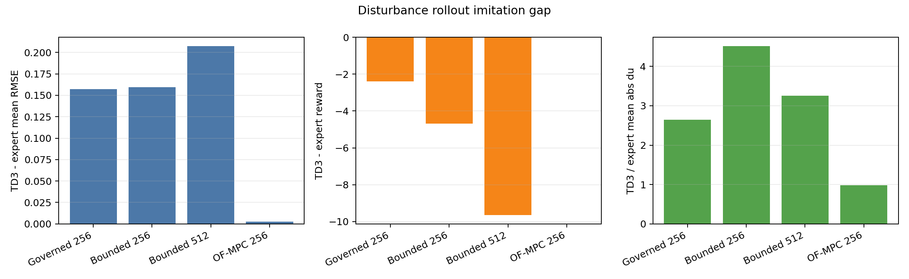
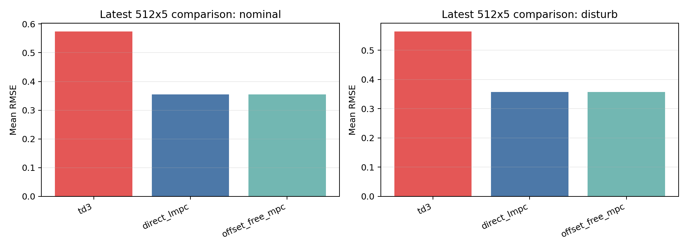
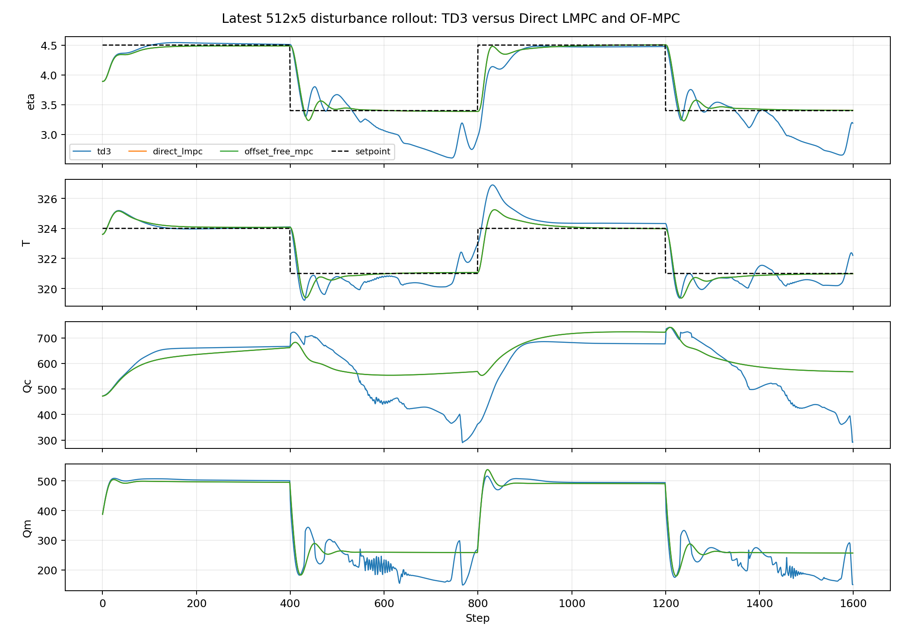
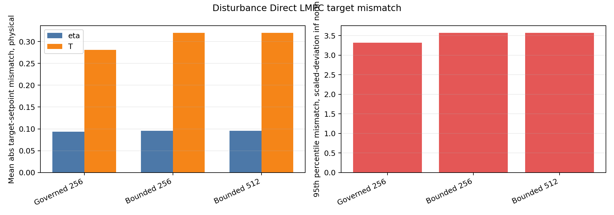
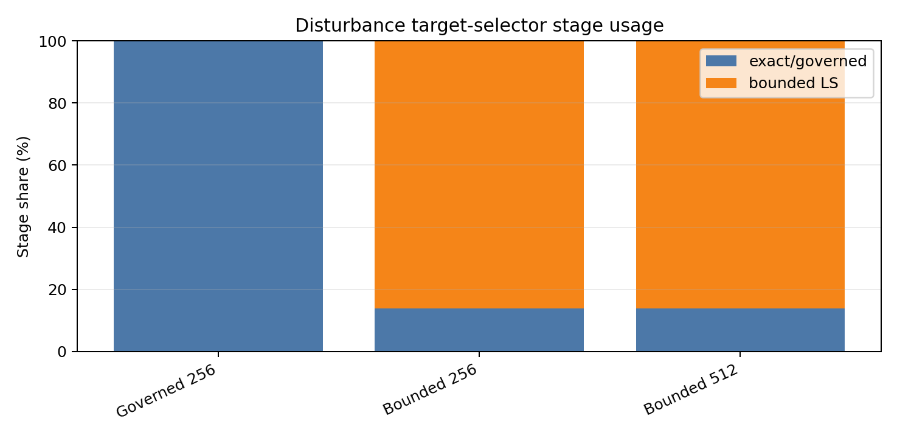
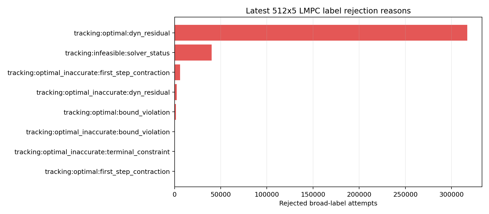

# LMPC Target Selector Research Bundle

Date: 2026-06-13

## Purpose

This bundle summarizes why the latest Direct LMPC TD3 pretraining result is
still not convincing, even with a much larger `[512, 512, 512, 512, 512]`
actor/critic. It is intended to be shared with ChatGPT or a deep-research
agent to search for better target-selector designs.

## Executive Finding

The result does not look like a network-capacity problem. The latest 512x5
bounded-mixed LMPC actor reaches a very small final BC loss
(`1.39e-05`), but its disturbance
rollout is worse than the older 256x3 bounded-mixed actor and worse than the
historical governed-reference actor. In the disturbance comparison, the latest
TD3 policy has mean RMSE `0.564` versus Direct
LMPC `0.357`, and it moves the inputs
`3.253x` as much as the expert.

The governed-reference selector was also not a sufficient answer. Its
disturbance TD3-vs-expert RMSE gap was `0.157`,
while bounded-mixed 256 had gap `0.159`
and bounded-mixed 512 has gap `0.207`.
By contrast, the OF-MPC pretrained TD3 positive control has a disturbance gap
of only `0.003`.

## Runs In This Bundle

| Run | Layers | Samples | Selector | Accept | BC last |
| :--- | ---: | ---: | ---: | ---: | ---: |
| Governed 256 | [256, 256, 256] | 2,000,000 | governed_reference | 0.992 | 7.87e-05 |
| Bounded 256 | [256, 256, 256] | 3,000,000 | bounded_mixed_u0p1_x0p1 | 0.894 | 5.05e-05 |
| Bounded 512 | [512, 512, 512, 512, 512] | 3,000,000 | bounded_mixed_u0p1_x0p1 | 0.894 | 1.39e-05 |

The latest run used:

- `target_mode = bounded`
- `target_selector_variant = bounded_mixed_u0p1_x0p1`
- `target_config = {"u_ref_weight": 0.1, "x_ref_weight": 0.1}`
- `rho_lyap = 0.99`
- `lyap_eps = 1e-3`
- `predict_h = 9`, `cont_h = 3`
- `use_target_output_for_tracking = False`

## Scaling Contract Check

The LMPC pretraining and comparison runs use the same TD3 scaled-deviation
state/action contract. The comparison setpoints are inside the exported
physical setpoint scaler for all LMPC runs, so the latest failure is not
explained by the earlier setpoint-range mismatch problem.

| Run | SP scaler | Comparison SP | Inside | u phys |
| :--- | ---: | ---: | ---: | ---: |
| Governed 256 | [[2.8, 320.0], [5.0, 326.0]] | [[4.5, 324.0], [3.4, 321.0]] | True | [71.6, 78.0] to [870.0, 670.0] |
| Bounded 256 | [[2.8, 320.0], [5.0, 326.0]] | [[4.5, 324.0], [3.4, 321.0]] | True | [71.6, 78.0] to [870.0, 670.0] |
| Bounded 512 | [[2.8, 320.0], [5.0, 326.0]] | [[4.5, 324.0], [3.4, 321.0]] | True | [71.6, 78.0] to [870.0, 670.0] |

## Mathematical Reconstruction

The target selector is solving a steady target for the output-disturbance model
in scaled deviation coordinates. With augmented observer state
$\hat z_k=[\hat x_k^\top,\hat d_k^\top]^\top$, the target satisfies

$$
x_s = A x_s + B u_s, \qquad
y_s = C x_s + d_s,
$$

with $d_s=\hat d_k$ and input bounds $u_{\min}\le u_s\le u_{\max}$.

The bounded-mixed selector first tries the exact raw-setpoint steady target. If
the exact input is outside bounds, it solves a bounded least-squares target with
small anchoring penalties,

$$
\min_{x_s,u_s}
\left\|y_s-y_{sp}\right\|^2
 + 0.1\left\|u_s-u_{k-1}\right\|^2
 + 0.1\left\|x_s-x_{s,k-1}\right\|^2,
$$

subject to the steady-state equations and input bounds. The Direct LMPC
tracking objective still tracks the raw setpoint because
`use_target_output_for_tracking=False`, but the Lyapunov certificate is centered
on $(x_s,u_s,y_s)$.

For the governed-reference selector, the target command $r_s$ is itself
governed before solving the steady target. That made the target smoother and
often feasible, but it also means the certified target can be away from the raw
setpoint.

## Comparison Performance

| Run | Expert | TD3 RMSE | Expert RMSE | RMSE gap | Reward gap | dU ratio |
| :--- | ---: | ---: | ---: | ---: | ---: | ---: |
| Governed 256 | direct_lmpc | 0.513 | 0.356 | 0.157 | -2.387 | 2.644 |
| Bounded 256 | direct_lmpc | 0.516 | 0.357 | 0.159 | -4.678 | 4.513 |
| Bounded 512 | direct_lmpc | 0.564 | 0.357 | 0.207 | -9.645 | 3.253 |
| OF-MPC 256 | offset_free_mpc | 0.359 | 0.357 | 0.003 | -0.011 | 0.986 |

The latest 512x5 model is not an improvement over the 256x3 bounded-mixed
model. Its final BC loss is lower, but deterministic closed-loop comparison is
worse. This is the strongest evidence that lower supervised loss on the broad
offline replay distribution is not the same as learning the closed-loop LMPC
expert behavior that matters.

## Target Selector Diagnostics

| Run | Stages | eta mismatch | T mismatch | p95 dev | max T mismatch |
| :--- | ---: | ---: | ---: | ---: | ---: |
| Governed 256 | {"governed_reference_target": 1600} | 0.093 | 0.281 | 3.321 | 3.445 |
| Bounded 256 | {"frozen_output_disturbance_bounded_ls": 1379, "frozen_output_disturbance_exact_bounded": 221} | 0.096 | 0.320 | 3.572 | 3.742 |
| Bounded 512 | {"frozen_output_disturbance_bounded_ls": 1379, "frozen_output_disturbance_exact_bounded": 221} | 0.096 | 0.320 | 3.572 | 3.742 |

For the latest bounded-mixed disturbance Direct LMPC baseline, the exact raw
setpoint target is usable in only `221`
of 1600 steps. The bounded least-squares selector is used in
`1379` steps. Its mean physical
target-setpoint mismatch is `0.096`
in eta and `0.320` in T, with
maximum T mismatch `3.742`.

This does not mean Direct LMPC itself is bad. Direct LMPC tracks well in the
comparison. The problem is that the offline supervised actor sees a label map
generated by a target-selection plus tracking plus Lyapunov-feasibility
pipeline. That map is much more conditional and less smooth than the OF-MPC
expert map.

## Label Rejection Pattern

| Failure | Count | Share % |
| :--- | ---: | ---: |
| tracking:optimal:dyn_residual | 317,185 | 86.174 |
| tracking:infeasible:solver_status | 40,302 | 10.949 |
| tracking:optimal_inaccurate:first_step_contraction | 6,028 | 1.638 |
| tracking:optimal_inaccurate:dyn_residual | 2,359 | 0.641 |
| tracking:optimal:bound_violation | 1,555 | 0.422 |
| tracking:optimal_inaccurate:bound_violation | 423 | 0.115 |
| tracking:optimal_inaccurate:terminal_constraint | 192 | 0.052 |
| tracking:optimal:first_step_contraction | 21 | 0.006 |

The latest broad label pool accepts about `0.894`
of attempts overall. The largest rejected class is
`tracking:optimal:dyn_residual`, which means the optimizer status can be
acceptable but the post-check rejects the candidate because it does not satisfy
the model consistency check. This creates a conditional replay set: the actor
sees successful labels but not the surrounding feasibility boundary.

## Why The Target Selector Is The Main Suspect

1. Scaling is consistent across the pretraining and comparison contracts.
2. Direct LMPC and OF-MPC baselines track almost identically in the comparison.
3. OF-MPC TD3 imitation is excellent under the same TD3 state/action dimensions.
4. LMPC TD3 imitation is poor for governed-reference, bounded-mixed 256, and
   bounded-mixed 512.
5. The latest larger network reduces supervised loss but worsens rollout
   behavior, so architecture size alone is not the bottleneck.
6. Both target selectors can move the certified target away from the raw
   setpoint. This is acceptable for practical Lyapunov certification, but it
   creates a hard expert map for offline actor imitation.

## Research Directions To Explore

The next target-selector search should focus on making the expert map smoother,
more closed-loop relevant, and less sensitive to target-stage switches:

- A two-layer selector that first minimizes raw output mismatch, then only uses
  $u_{k-1}$ and $x_{s,k-1}$ as true tie-breakers.
- A reference-governor selector with an explicit bound on target movement and a
  reported raw-setpoint tracking loss.
- A multi-step reachable target selector instead of a steady target only.
- A soft Lyapunov/filter formulation that returns a correction direction and
  margin rather than a hard accept/reject label.
- DAgger-style relabeling on states visited by the current actor instead of only
  broad-uniform synthetic states.
- A selector-quality gate for pretraining labels, so labels with large
  target-setpoint mismatch or large target jumps are either separated, weighted,
  or excluded from actor BC.

## Bundle Files

- Pretraining summary table: `tables/pretrain.csv`
- Comparison metrics table: `tables/comparison.csv`
- TD3 expert gap table: `tables/gap.csv`
- Target diagnostics table: `tables/target.csv`
- Label failure table: `tables/failures.csv`
- Scaling consistency table: `tables/scaler_consistency.csv`
- Source artifact paths: `tables/source_artifacts.csv`
- Deep research prompt: `deep_research_prompt.md`

## What To Hand To A Research Agent

Give the agent this whole folder and ask it to read `README.md`,
`deep_research_prompt.md`, and the CSV files under `tables/`. The raw run
artifacts remain in `results/` and are referenced in `tables/source_artifacts.csv`.
