# Direct Lyapunov Three-Method Contraction-Factor Sensitivity Report

This report rewrites the previous note around the four latest nominal
single-setpoint sweeps with
$\rho_{\mathrm{lyap}} \in \{0.95, 0.98, 0.985, 0.99\}$.

The report is now organized method by method. For each method it states:

- what the method is
- the method-specific mathematics
- output tracking performance
- applied inputs and steady inputs $u_s$
- steady target state $x_s$
- steady disturbance target $d_s$
- Lyapunov evidence through both the contraction-ratio plot and
  $\Delta V_{\mathrm{pred}} = V_{k+1|k} - V_k$

## Objective

The question is not only which method gives the smallest RMSE. The more
important question is how the contraction factor changes the target selected by
the direct controller, and whether the Lyapunov evidence shows genuine
contraction rather than only a visually good output transient.

All runs use:

- one physical setpoint: $[4.5,\ 324.0]$
- nominal plant
- one episode
- 2000 control steps
- raw-setpoint tracking in the MPC stage cost
- hard first-step Lyapunov contraction
- zero Lyapunov slack activation in the saved bundles

## Bundles Used

| $\rho_{\mathrm{lyap}}$ | Bundle |
| --- | --- |
| `0.95` | `Data/debug_exports/direct_lyapunov_mpc_bounded_three_scenario_single_setpoint_nominal/20260501_001425` |
| `0.98` | `Data/debug_exports/direct_lyapunov_mpc_bounded_three_scenario_single_setpoint_nominal/20260501_003638` |
| `0.985` | `Data/debug_exports/direct_lyapunov_mpc_bounded_three_scenario_single_setpoint_nominal/20260501_002805` |
| `0.99` | `Data/debug_exports/direct_lyapunov_mpc_bounded_three_scenario_single_setpoint_nominal/20260501_001948` |

`20260501_000956` is a duplicate export of the `0.98` sweep and is not used for
the report figures.

## Common Formulation

For all three methods, the direct controller uses the output-disturbance
augmented model

$$
x_{k+1} = A x_k + B u_k, \qquad d_{k+1} = d_k, \qquad y_k = C x_k + d_k.
$$

At each step, the target solve returns a steady target
$(x_s, u_s, d_s, y_s)$. The online MPC then tracks the raw scheduled setpoint
$y_{\mathrm{sp}}$, not the modified target output $y_s$, because
`use_target_output_for_tracking = False`.

The direct tracking problem is

$$
\min_{\{u_{k+i|k}\}}
\sum_{i=1}^{N_p}
\left\| y_{k+i|k} - y_{\mathrm{sp}} \right\|_{Q_y}^2
+
\sum_{i=0}^{N_c-1}
\left\| \Delta u_{k+i|k} \right\|_{R_{\Delta u}}^2
$$

subject to the model, the input bounds, and the hard first-step Lyapunov
condition

$$
V(e_{k+1|k}) \le \rho_{\mathrm{lyap}} V(e_k), \qquad
e_k = \hat x_k - x_s, \qquad
V(e) = e^\top P_x e.
$$

The predicted Lyapunov decrement used in this report is

$$
\Delta V_{\mathrm{pred}}(k) = V_{k+1|k} - V_k.
$$

For a good run, the expected pattern is:

1. $\Delta V_{\mathrm{pred}} < 0$ during the transient
2. $\Delta V_{\mathrm{pred}} \to 0$ as the controller reaches a consistent
   steady target

That is the correct quantity to examine for contraction. The raw logged
step-to-step change in $V$ is less informative because the center $x_s(k)$ can
move across time.

The bounded steady-target solve is the place where the three methods differ. In
generic form, the bounded least-squares fallback minimizes

$$
J_{\mathrm{target}}
=
\left\| M_k
\begin{bmatrix}
x_s \\
u_s
\end{bmatrix}
- r_k \right\|_2^2
+
\lambda_u \left\| u_s - u_{\mathrm{ref}} \right\|_2^2
+
\lambda_x \left\| x_s - x_{\mathrm{ref}} \right\|_2^2
$$

with input bounds on $u_s$.

The three methods only change $\lambda_u$, $\lambda_x$, and the meaning of the
references:

- `bounded_hard`: $\lambda_u = 0$, $\lambda_x = 0$
- `bounded_hard_u_prev_0p1`: $\lambda_u = 0.1$ with
  $u_{\mathrm{ref}} = u_{k-1}$
- `bounded_hard_xs_prev_0p1`: $\lambda_x = 0.1$ with
  $x_{\mathrm{ref}} = x_{s,\mathrm{prev}}^{\mathrm{succ}}$

Tail steady-target values below are reported as means over steps `1900-1999`.
`u_s` is reported in physical units. `x_s` and `d_s` are reported in the saved
augmented-model coordinates.

## Method 1: `bounded_hard`

`bounded_hard` is the plain bounded target solve with no extra target
regularization. It is the cleanest baseline because the steady-target optimizer
is only trying to satisfy the bounded steady-state equations and the setpoint
fit.

Its bounded target objective is

$$
J_{\mathrm{target}}^{\mathrm{BH}}
=
\left\| M_k
\begin{bmatrix}
x_s \\
u_s
\end{bmatrix}
- r_k \right\|_2^2.
$$

### Tracking Performance

| $\rho_{\mathrm{lyap}}$ | Reward mean | RMSE $y[0]$ | RMSE $y[1]$ | RMSE mean |
| --- | ---: | ---: | ---: | ---: |
| `0.95` | -46.759 | 0.590 | 2.373 | 1.481 |
| `0.98` | -11.801 | 0.280 | 1.434 | 0.857 |
| `0.985` | -2.948 | 0.145 | 0.647 | 0.396 |
| `0.99` | -0.362 | 0.056 | 0.170 | 0.113 |

| $\rho_{\mathrm{lyap}}$ | Solver success | Hard contraction | Bounded-LS steps | Violation steps |
| --- | ---: | ---: | ---: | ---: |
| `0.95` | 90.25% | 90.20% | 2000 | 196 |
| `0.98` | 97.95% | 97.95% | 1152 | 41 |
| `0.985` | 96.50% | 96.50% | 1263 | 70 |
| `0.99` | 99.85% | 99.85% | 221 | 3 |

### Lyapunov Summary

| $\rho_{\mathrm{lyap}}$ | $\min \Delta V_{\mathrm{pred}}$ | Tail mean $\Delta V_{\mathrm{pred}}$ | Tail mean $|\Delta V_{\mathrm{pred}}|$ |
| --- | ---: | ---: | ---: |
| `0.95` | -252.149 | -14.626 | 14.626 |
| `0.98` | -145.671 | 0.000 | 0.000 |
| `0.985` | -77.771 | 0.000 | 0.000 |
| `0.99` | -1.948 | 0.000 | 0.000 |

The key point is that `bounded_hard` only shows the expected
"negative first, then zero" pattern when $\rho_{\mathrm{lyap}}$ is relaxed
enough. At `0.95`, $\Delta V_{\mathrm{pred}}$ stays substantially nonzero in the
tail, which means the controller does not settle around a consistent steady
target.

### Tail Steady Targets

`u_s^\infty` and `d_s^\infty`:

| $\rho_{\mathrm{lyap}}$ | $u_s^\infty[0]$ | $u_s^\infty[1]$ | $d_s^\infty[0]$ | $d_s^\infty[1]$ |
| --- | ---: | ---: | ---: | ---: |
| `0.95` | 618.625 | 305.154 | 1.052 | 0.799 |
| `0.98` | 621.026 | 498.623 | 2.735 | 0.492 |
| `0.985` | 621.023 | 498.620 | 2.735 | 0.492 |
| `0.99` | 621.026 | 498.623 | 2.735 | 0.492 |

`x_s^\infty[0:3]`:

| $\rho_{\mathrm{lyap}}$ | $x_s^\infty[0]$ | $x_s^\infty[1]$ | $x_s^\infty[2]$ | $x_s^\infty[3]$ |
| --- | ---: | ---: | ---: | ---: |
| `0.95` | 0.5212 | 0.8787 | -0.2348 | -0.7598 |
| `0.98` | 0.5297 | 0.8931 | 0.3887 | 1.2581 |
| `0.985` | 0.5297 | 0.8930 | 0.3887 | 1.2580 |
| `0.99` | 0.5297 | 0.8931 | 0.3887 | 1.2581 |

`x_s^\infty[4:6]`:

| $\rho_{\mathrm{lyap}}$ | $x_s^\infty[4]$ | $x_s^\infty[5]$ | $x_s^\infty[6]$ |
| --- | ---: | ---: | ---: |
| `0.95` | 0.0055 | 0.0055 | 0.0055 |
| `0.98` | 0.0056 | 0.0056 | 0.0056 |
| `0.985` | 0.0056 | 0.0056 | 0.0056 |
| `0.99` | 0.0056 | 0.0056 | 0.0056 |

The `0.95` run does not only track poorly. It also converges to a different
steady target, especially in $u_s$, $d_s$, and the main state coordinates
$x_s[2:3]$.

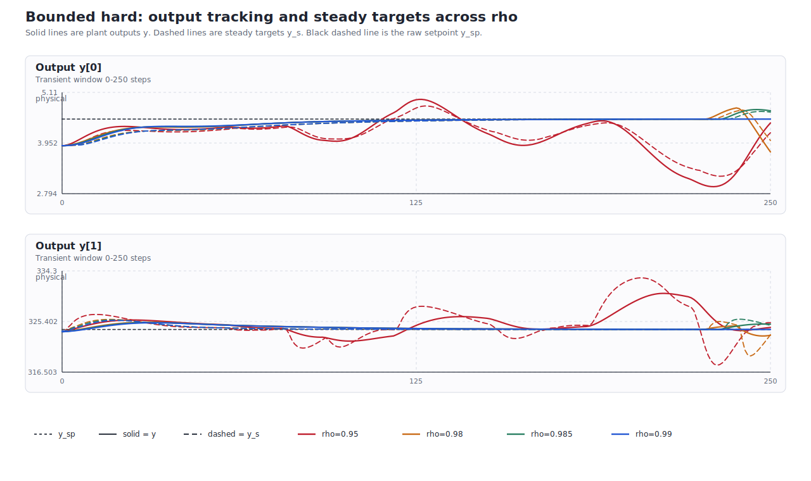

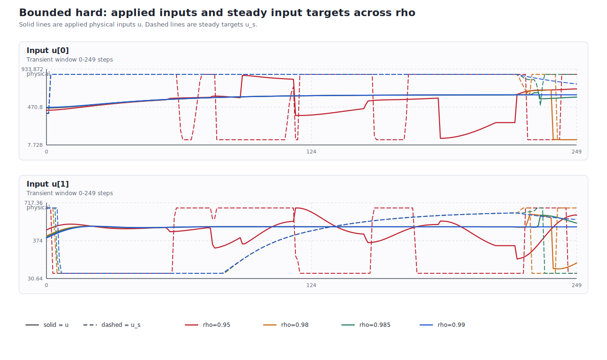

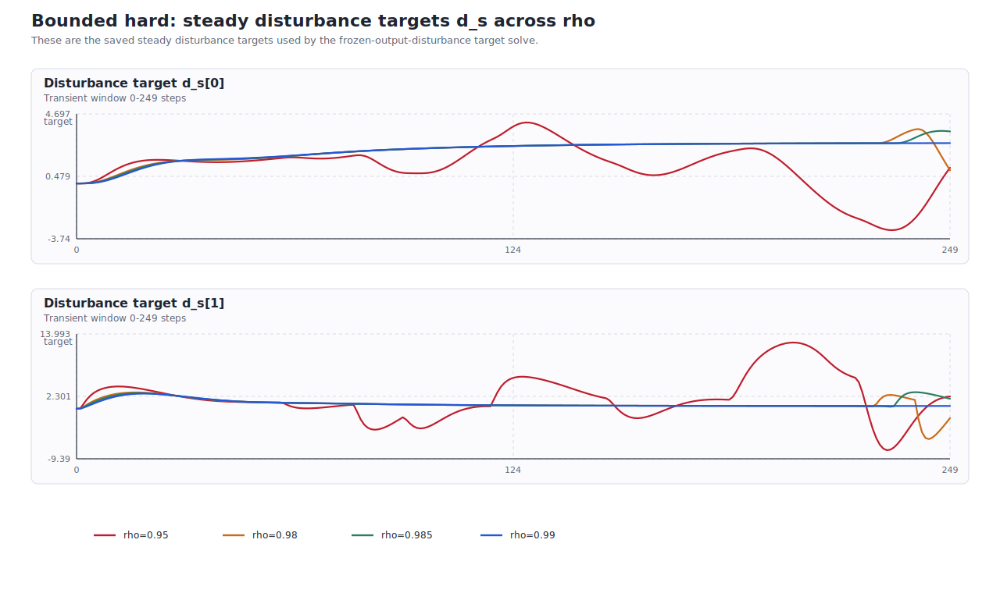

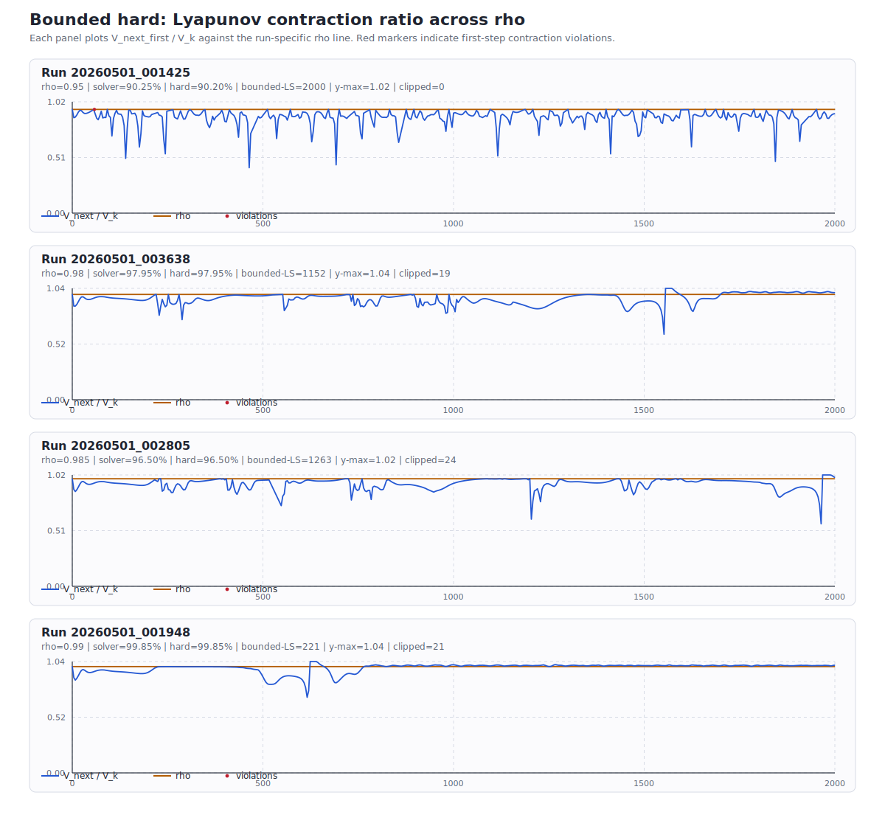

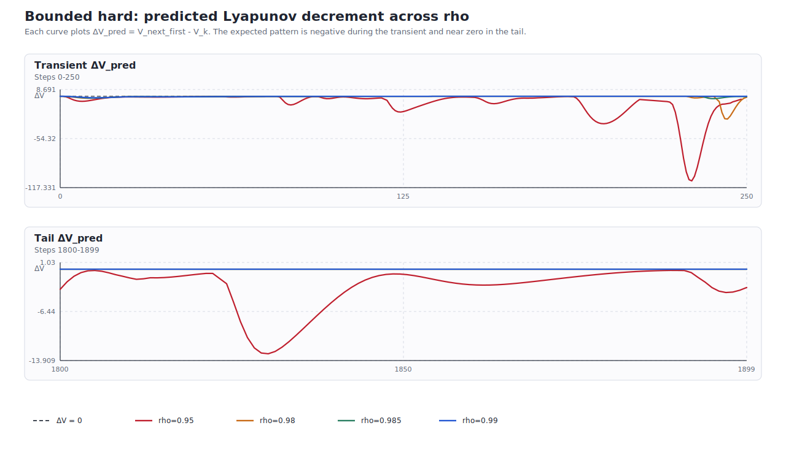

Interpretation:

- `bounded_hard` is highly sensitive to $\rho_{\mathrm{lyap}}$.
- `0.99` is the clean nominal operating point for this method.
- `0.95` is not acceptable here because the controller spends the full episode
  in bounded-LS mode and settles to the wrong target.

## Method 2: `bounded_hard_u_prev_0p1`

`bounded_hard_u_prev_0p1` adds a steady-input anchor in the bounded target
solve. The reference is the previous applied input in deviation coordinates.

Its method-specific target objective is

$$
J_{\mathrm{target}}^{u\text{-anchor}}
=
\left\| M_k
\begin{bmatrix}
x_s \\
u_s
\end{bmatrix}
- r_k \right\|_2^2
+
0.1 \left\| u_s - u_{k-1} \right\|_2^2.
$$

This term does not directly smooth the state target. It biases the bounded
steady-target solve toward an input that is reachable from the current operating
region.

### Tracking Performance

| $\rho_{\mathrm{lyap}}$ | Reward mean | RMSE $y[0]$ | RMSE $y[1]$ | RMSE mean |
| --- | ---: | ---: | ---: | ---: |
| `0.95` | -10.659 | 0.275 | 1.176 | 0.726 |
| `0.98` | -0.467 | 0.062 | 0.202 | 0.132 |
| `0.985` | -9.880 | 0.261 | 1.272 | 0.766 |
| `0.99` | -0.370 | 0.057 | 0.164 | 0.110 |

| $\rho_{\mathrm{lyap}}$ | Solver success | Hard contraction | Bounded-LS steps | Violation steps |
| --- | ---: | ---: | ---: | ---: |
| `0.95` | 95.85% | 95.80% | 1986 | 84 |
| `0.98` | 100.00% | 100.00% | 311 | 0 |
| `0.985` | 98.60% | 98.60% | 1570 | 28 |
| `0.99` | 100.00% | 100.00% | 221 | 0 |

### Lyapunov Summary

| $\rho_{\mathrm{lyap}}$ | $\min \Delta V_{\mathrm{pred}}$ | Tail mean $\Delta V_{\mathrm{pred}}$ | Tail mean $|\Delta V_{\mathrm{pred}}|$ |
| --- | ---: | ---: | ---: |
| `0.95` | -145.366 | -0.223 | 0.223 |
| `0.98` | -6.406 | 0.000 | 0.000 |
| `0.985` | -148.749 | 0.000 | 0.000 |
| `0.99` | -2.222 | 0.000 | 0.000 |

This method shows an important subtlety. At `0.985`, the predicted decrement
does go negative first and then to zero, so the Lyapunov story is internally
consistent. But the run is still poor on tracking RMSE because it converges to a
bad steady target.

### Tail Steady Targets

`u_s^\infty` and `d_s^\infty`:

| $\rho_{\mathrm{lyap}}$ | $u_s^\infty[0]$ | $u_s^\infty[1]$ | $d_s^\infty[0]$ | $d_s^\infty[1]$ |
| --- | ---: | ---: | ---: | ---: |
| `0.95` | 590.708 | 494.788 | 2.812 | 0.840 |
| `0.98` | 621.026 | 498.623 | 2.735 | 0.492 |
| `0.985` | 659.540 | 519.402 | 2.731 | 0.494 |
| `0.99` | 621.026 | 498.623 | 2.735 | 0.492 |

`x_s^\infty[0:3]`:

| $\rho_{\mathrm{lyap}}$ | $x_s^\infty[0]$ | $x_s^\infty[1]$ | $x_s^\infty[2]$ | $x_s^\infty[3]$ |
| --- | ---: | ---: | ---: | ---: |
| `0.95` | 0.4222 | 0.7119 | 0.3764 | 1.2181 |
| `0.98` | 0.5297 | 0.8931 | 0.3887 | 1.2581 |
| `0.985` | 0.6662 | 1.1232 | 0.4557 | 1.4748 |
| `0.99` | 0.5297 | 0.8931 | 0.3887 | 1.2581 |

`x_s^\infty[4:6]`:

| $\rho_{\mathrm{lyap}}$ | $x_s^\infty[4]$ | $x_s^\infty[5]$ | $x_s^\infty[6]$ |
| --- | ---: | ---: | ---: |
| `0.95` | 0.0045 | 0.0045 | 0.0045 |
| `0.98` | 0.0056 | 0.0056 | 0.0056 |
| `0.985` | 0.0070 | 0.0070 | 0.0070 |
| `0.99` | 0.0056 | 0.0056 | 0.0056 |

The abnormal case is `0.985`. The method contracts, but it contracts around a
shifted target with much larger $u_s$ and $x_s$. So Lyapunov contraction alone
is not enough; the steady target itself must also be checked.

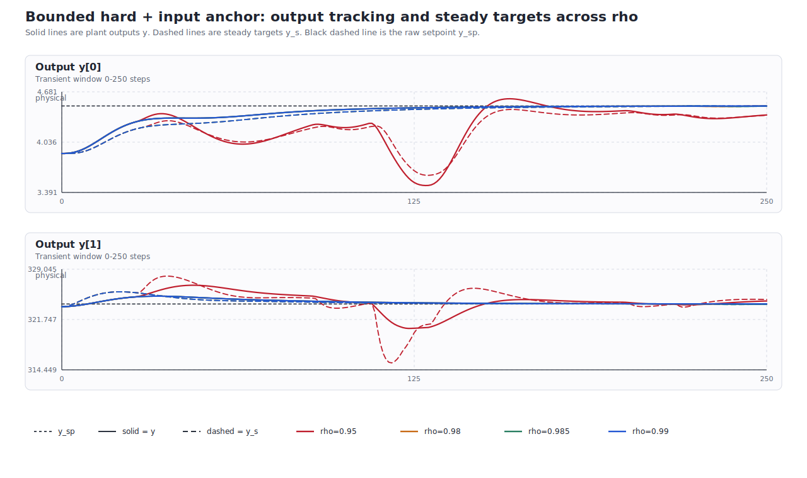

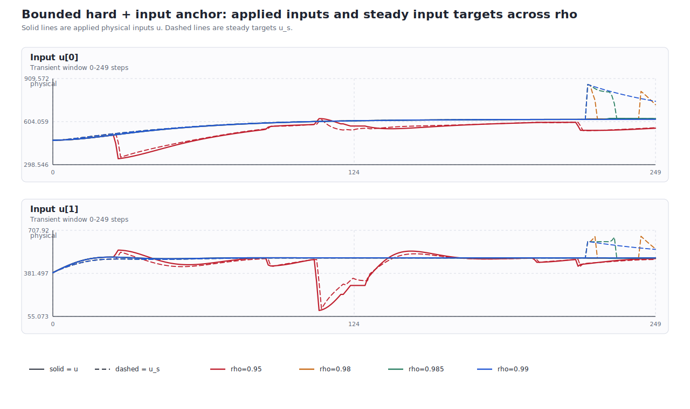

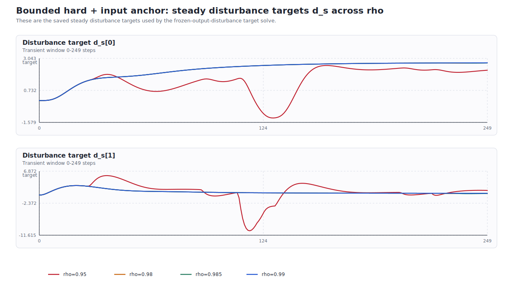

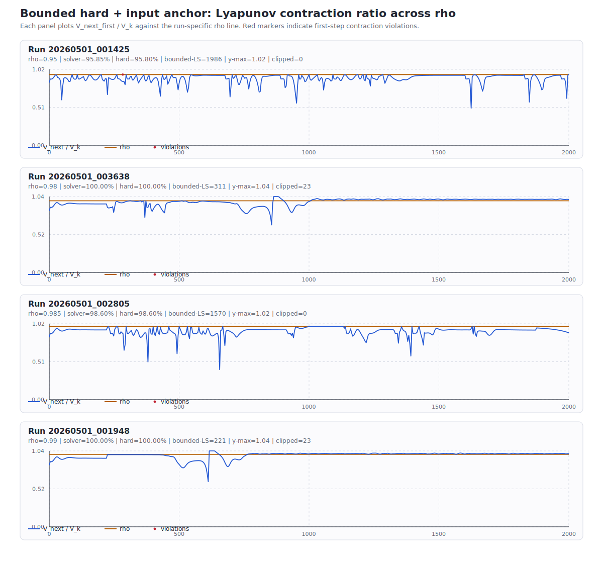

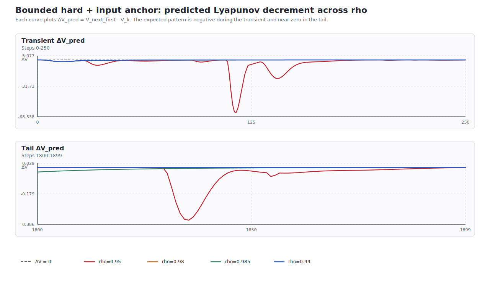

Interpretation:

- `0.98` is the best operating point for this method.
- `0.99` is also excellent and nearly tied with the other good methods.
- `0.985` is the main warning case: the controller contracts, but the target
  it contracts around is wrong.

## Method 3: `bounded_hard_xs_prev_0p1`

`bounded_hard_xs_prev_0p1` adds smoothing directly on the steady target state.
The reference is the previous successful steady target state.

Its method-specific target objective is

$$
J_{\mathrm{target}}^{x_s\text{-smooth}}
=
\left\| M_k
\begin{bmatrix}
x_s \\
u_s
\end{bmatrix}
- r_k \right\|_2^2
+
0.1 \left\| x_s - x_{s,\mathrm{prev}}^{\mathrm{succ}} \right\|_2^2.
$$

This term smooths the internal Lyapunov center rather than the applied input.

### Tracking Performance

| $\rho_{\mathrm{lyap}}$ | Reward mean | RMSE $y[0]$ | RMSE $y[1]$ | RMSE mean |
| --- | ---: | ---: | ---: | ---: |
| `0.95` | -28.395 | 0.457 | 1.932 | 1.195 |
| `0.98` | -2.002 | 0.127 | 0.428 | 0.277 |
| `0.985` | -0.448 | 0.061 | 0.193 | 0.127 |
| `0.99` | -0.362 | 0.056 | 0.171 | 0.113 |

| $\rho_{\mathrm{lyap}}$ | Solver success | Hard contraction | Bounded-LS steps | Violation steps |
| --- | ---: | ---: | ---: | ---: |
| `0.95` | 95.00% | 94.95% | 1999 | 101 |
| `0.98` | 99.85% | 99.85% | 510 | 3 |
| `0.985` | 99.90% | 99.90% | 201 | 2 |
| `0.99` | 99.85% | 99.85% | 227 | 3 |

### Lyapunov Summary

| $\rho_{\mathrm{lyap}}$ | $\min \Delta V_{\mathrm{pred}}$ | Tail mean $\Delta V_{\mathrm{pred}}$ | Tail mean $|\Delta V_{\mathrm{pred}}|$ |
| --- | ---: | ---: | ---: |
| `0.95` | -199.912 | -1.589 | 1.589 |
| `0.98` | -13.182 | 0.000 | 0.000 |
| `0.985` | -5.870 | 0.000 | 0.000 |
| `0.99` | -2.226 | 0.000 | 0.000 |

The good `0.985-0.99` runs show exactly the pattern that should be stated in
the paper: the predicted decrement is negative first and then goes to zero.
The `0.95` run does not.

### Tail Steady Targets

`u_s^\infty` and `d_s^\infty`:

| $\rho_{\mathrm{lyap}}$ | $u_s^\infty[0]$ | $u_s^\infty[1]$ | $d_s^\infty[0]$ | $d_s^\infty[1]$ |
| --- | ---: | ---: | ---: | ---: |
| `0.95` | 663.866 | 300.063 | 2.283 | 0.551 |
| `0.98` | 621.026 | 498.623 | 2.735 | 0.492 |
| `0.985` | 621.026 | 498.623 | 2.735 | 0.492 |
| `0.99` | 621.026 | 498.623 | 2.735 | 0.492 |

`x_s^\infty[0:3]`:

| $\rho_{\mathrm{lyap}}$ | $x_s^\infty[0]$ | $x_s^\infty[1]$ | $x_s^\infty[2]$ | $x_s^\infty[3]$ |
| --- | ---: | ---: | ---: | ---: |
| `0.95` | 0.6816 | 1.1491 | -0.2512 | -0.8129 |
| `0.98` | 0.5297 | 0.8931 | 0.3887 | 1.2581 |
| `0.985` | 0.5297 | 0.8931 | 0.3887 | 1.2581 |
| `0.99` | 0.5297 | 0.8931 | 0.3887 | 1.2581 |

`x_s^\infty[4:6]`:

| $\rho_{\mathrm{lyap}}$ | $x_s^\infty[4]$ | $x_s^\infty[5]$ | $x_s^\infty[6]$ |
| --- | ---: | ---: | ---: |
| `0.95` | 0.0072 | 0.0072 | 0.0072 |
| `0.98` | 0.0056 | 0.0056 | 0.0056 |
| `0.985` | 0.0056 | 0.0056 | 0.0056 |
| `0.99` | 0.0056 | 0.0056 | 0.0056 |

This method has the clearest success case at `0.985`. It also has the clearest
strict-rho failure case at `0.95`, where both the tail target and the Lyapunov
tail behavior are wrong.

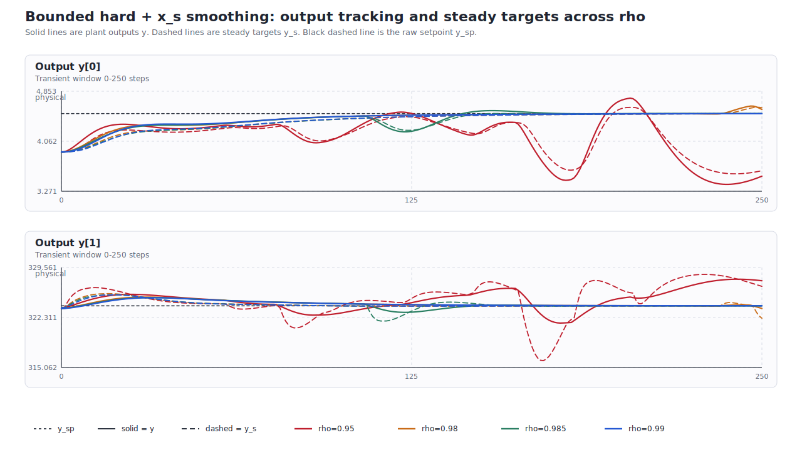

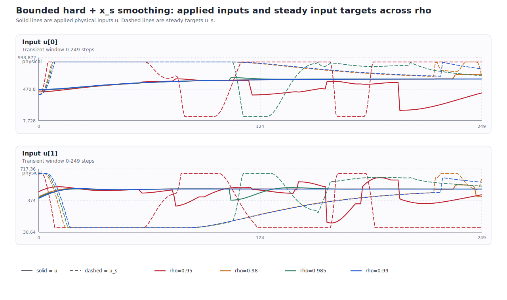

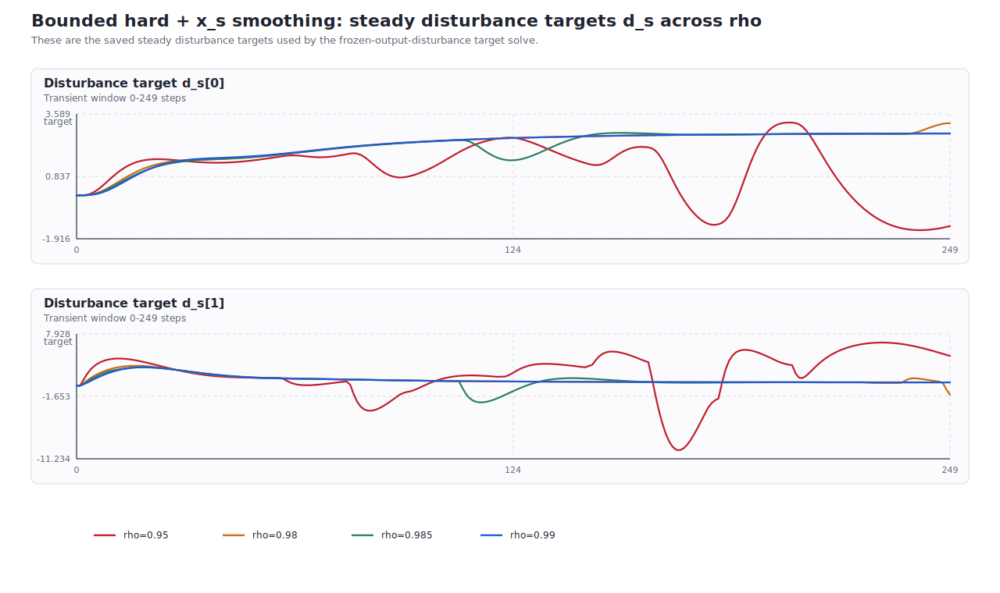

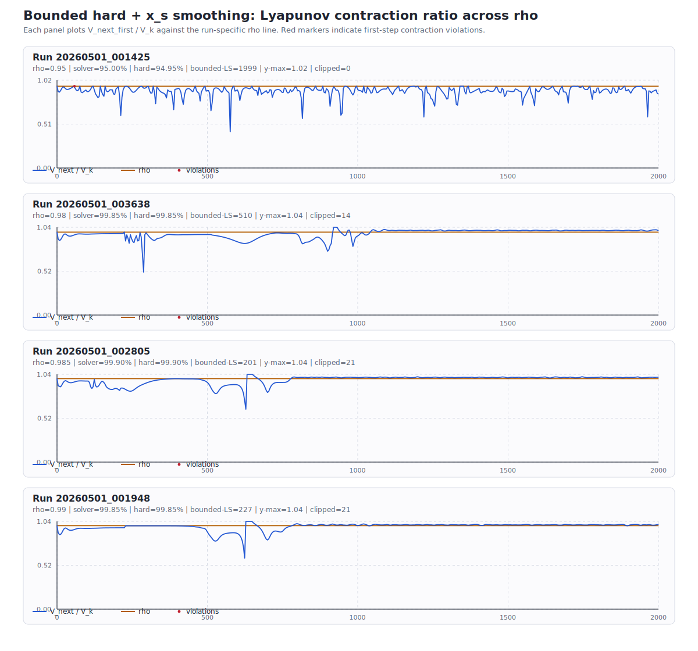

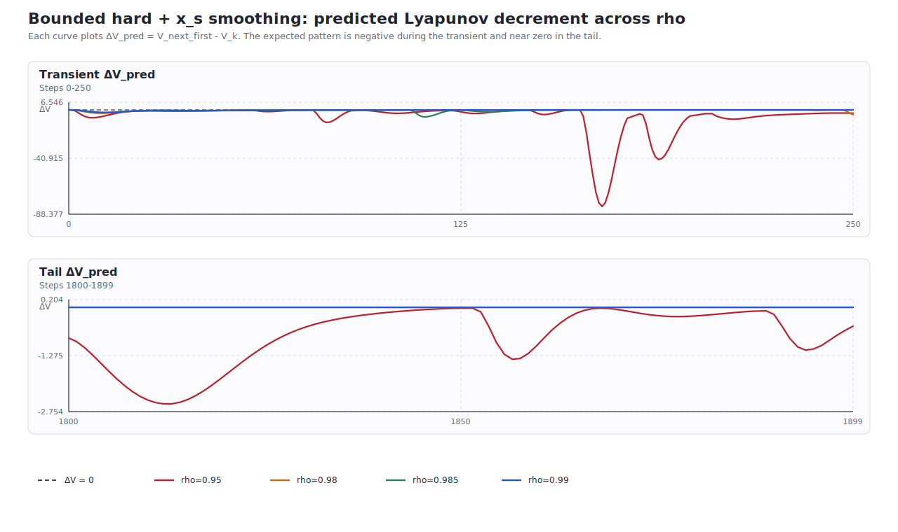

Interpretation:

- `x_s` smoothing is the best method at `0.985`.
- It is also near-tied at `0.99`.
- It should not be described as uniformly better, because at `0.95` it fails
  badly.

## Cross-Method Comparison

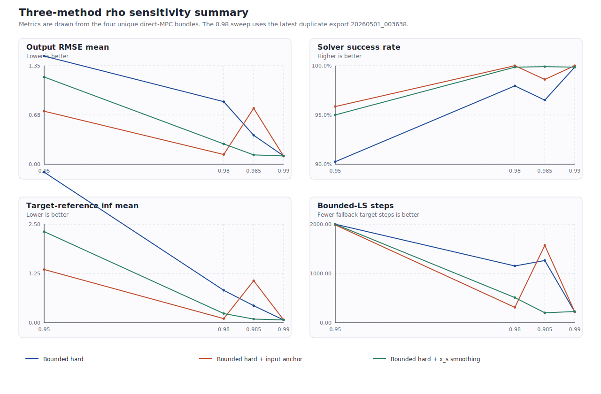

| $\rho_{\mathrm{lyap}}$ | Best method on RMSE mean | Main reason |
| --- | --- | --- |
| `0.95` | `bounded_hard_u_prev_0p1` | Least damaged by the strict contraction, but still poor overall. |
| `0.98` | `bounded_hard_u_prev_0p1` | Only case with 100% solver success, 100% hard contraction, and zero violations. |
| `0.985` | `bounded_hard_xs_prev_0p1` | Best compromise between target stability and tracking. |
| `0.99` | effectively tied | All three methods reach the same nominal steady target and nearly identical tracking. |

The comparison reveals two different failure modes:

1. Over-strict contraction can keep the target moving, so
   $\Delta V_{\mathrm{pred}}$ does not go to zero in the tail.
   This happens clearly for `bounded_hard` at `0.95` and
   `bounded_hard_xs_prev_0p1` at `0.95`.
2. A run can satisfy the Lyapunov contraction pattern and still be a poor
   controller because it converges to the wrong steady target.
   The best example is `bounded_hard_u_prev_0p1` at `0.985`.

That distinction is important. The report should not claim that contraction by
itself proves good closed-loop performance. It only proves that the controller
is contracting around the target it selected.

## What Should Be Stated

The main statement for the report should be:

1. The Lyapunov contraction factor is a first-order tuning variable for the
   direct controller and must always be reported.
2. Each method must be described with both target-selection mathematics and
   closed-loop results. It is not enough to show only final RMSE.
3. The Lyapunov evidence should include:
   - the contraction ratio plot
   - the predicted decrement
     $\Delta V_{\mathrm{pred}} = V_{k+1|k} - V_k$
   - the statement that a good run should show negative $\Delta V_{\mathrm{pred}}$
     first and then approach zero
4. The report must also show the steady targets $u_s$, $x_s$, and $d_s$,
   because poor runs can converge to the wrong target even when contraction is
   satisfied.
5. In this nominal study:
   - `0.95` is too strict
   - `0.99` is the best default nominal choice
   - `0.98` favors the input-anchor method
   - `0.985` favors the `x_s`-smoothing method

## Summary

The most important new conclusion is not just which method won which run. The
more important conclusion is how to interpret the direct controller correctly.

- `bounded_hard` needs a relaxed contraction factor. Its clean nominal result is
  at `0.99`.
- `bounded_hard_u_prev_0p1` is best at `0.98`, but `0.985` shows that it can
  contract around the wrong steady target.
- `bounded_hard_xs_prev_0p1` is best at `0.985` and nearly tied at `0.99`, but
  it fails strongly at `0.95`.
- Therefore, the direct method should always be evaluated with both:
  steady-target diagnostics and Lyapunov diagnostics.

The most defensible nominal recommendation from this sweep is:

- use `rho_lyap = 0.99` as the default nominal baseline
- keep `rho_lyap = 0.985` as the discriminating comparison point
- explicitly show $u_s$, $x_s$, $d_s$, the contraction ratio, and
  $\Delta V_{\mathrm{pred}}$
