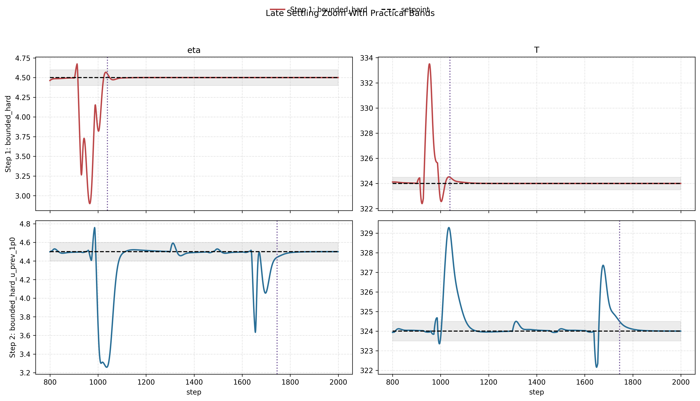
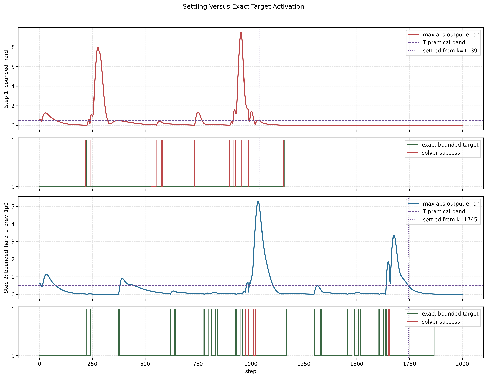
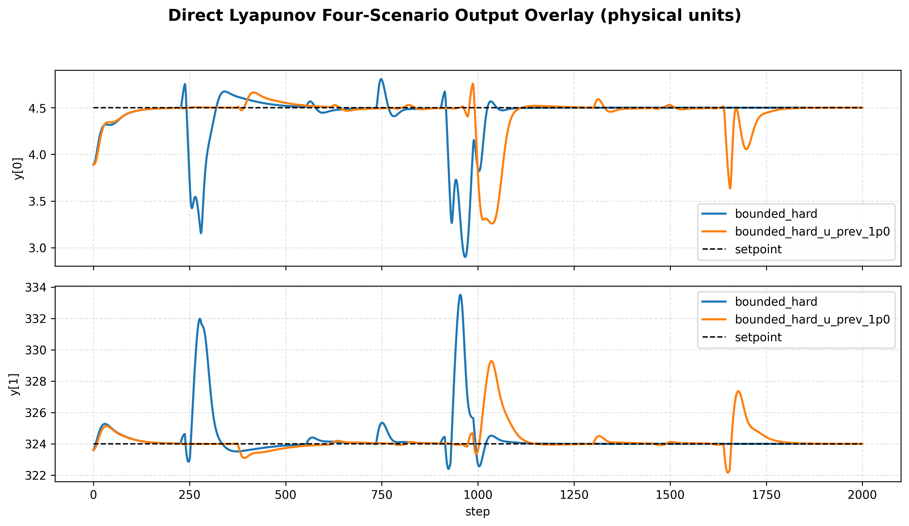
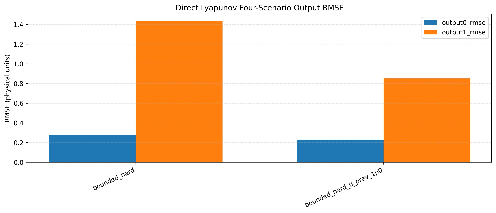
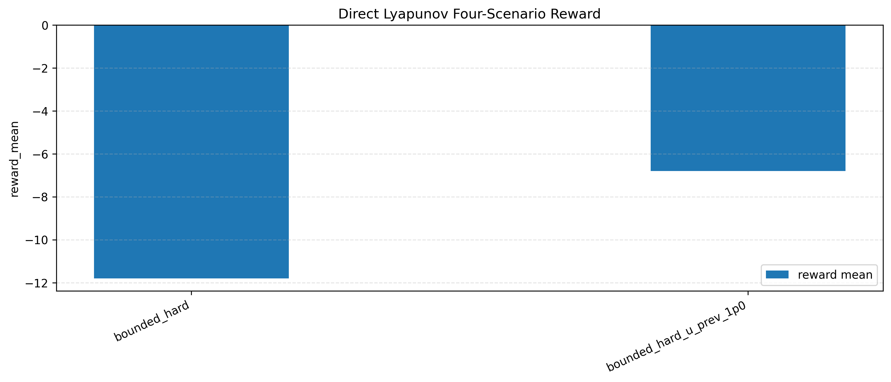
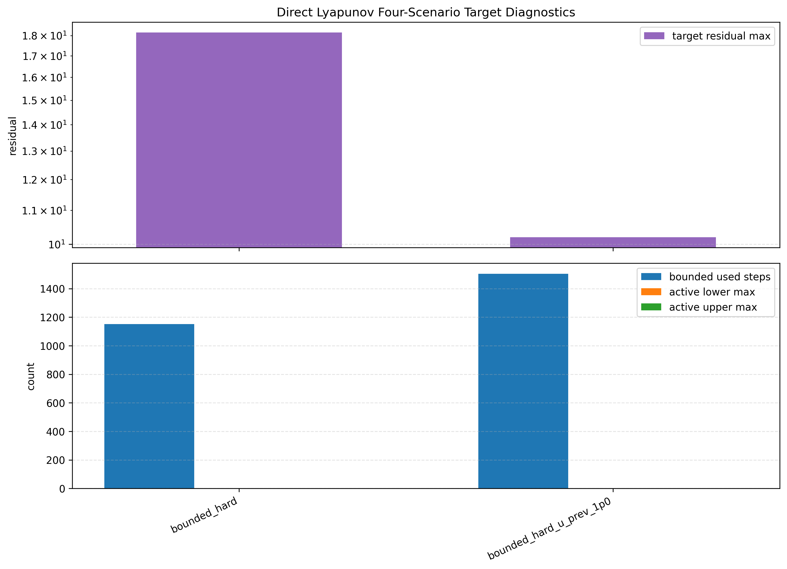

# Direct Lyapunov Bounded Single-Setpoint Settling Report

This report analyzes the focused nominal direct Lyapunov MPC run saved at:

`Data/debug_exports/direct_lyapunov_mpc_bounded_hard_single_setpoint_nominal/20260430_232523`

The setup is:

- one physical setpoint: `[4.5, 324.0]`
- nominal plant
- one episode
- 2000 control steps
- raw-setpoint tracking in the online MPC objective
- frozen output-disturbance target construction

The two cases are:

1. `bounded_hard`
2. `bounded_hard_u_prev_1p0`

The quantitative results below still refer to that saved two-case run.

The direct notebook and target-solver code have now been extended for the next
rerun to use a three-scenario default:

1. `bounded_hard`
2. `bounded_hard_u_prev_0p1`
3. `bounded_hard_xs_prev_0p1`

## Objective

The key question in this run is not only which case has the better average reward.
The more interesting question is:

Does the bounded direct Lyapunov controller eventually settle to the raw setpoint
if the setpoint is held long enough?

The answer is yes.

That is the most interesting outcome of this run. In particular, `bounded_hard`
shows a clear late-settling phase: after about step `k ~ 1039` it enters a
practical tracking band and never leaves it, and by `k >= 1500` the output is
essentially at the setpoint up to numerical precision.

## Controller Interpretation

The frozen-output-disturbance direct target is built around the current
disturbance estimate $\hat d_k$. In simplified form, the bounded target solve is:

$$
\min_{x_s,u_s}
J_{\mathrm{tgt}}(x_s,u_s)
$$

with

$$
J_{\mathrm{tgt}}(x_s,u_s)
=
\left\|
x_s - A x_s - B u_s - B_d \hat d_k
\right\|_2^2
+
\left\|
C x_s + C_d \hat d_k - y_{\mathrm{sp}}
\right\|_2^2
+
\lambda_{\mathrm{prev}}
\left\|
u_s - u_{\mathrm{prev}}
\right\|_2^2
$$

subject to the input bounds.

For `bounded_hard`, $\lambda_{\mathrm{prev}} = 0$.

For `bounded_hard_u_prev_1p0`, $\lambda_{\mathrm{prev}} = 1.0$.

The online Lyapunov MPC then tracks the raw setpoint $y_{\mathrm{sp}}$, not $y_s$, but the
Lyapunov center and terminal ingredients are still defined around `(x_s,u_s)`.
That is why target quality still matters even though the stage objective uses the
raw setpoint.

## Implemented $x_s$-Smoothing Extension

For the next rerun, the direct bounded target stage now also supports a state
smoothing term:

$$
J_{\mathrm{tgt,ext}}(x_s,u_s)
=
J_{\mathrm{tgt}}(x_s,u_s)
+
\lambda_x
\left\|
x_s - x_{s,\mathrm{prev}}
\right\|_2^2
$$

Here $x_{s,\mathrm{prev}}$ is the previous successful steady target state from the
earlier control step.

This term is different from the previous-input penalty:

- $\lambda_{\mathrm{prev}} \|u_s-u_{\mathrm{prev}}\|_2^2$ suppresses movement in the steady input.
- $\lambda_x \|x_s-x_{s,\mathrm{prev}}\|_2^2$ suppresses movement in the steady target state.

So the new term does not directly penalize the applied control move. It penalizes
how quickly the Lyapunov center itself drifts from one step to the next.

In the current implementation, this new term is active only inside the bounded
least-squares fallback stage. If the exact steady target is already feasible
within the input bounds, the controller keeps that exact target and no
state-smoothing penalty is applied.

The first step also has no $x_s$ smoothing reference yet, because there is no
previous successful steady target available. So the term becomes active only
after the controller has produced at least one successful target and only on
later steps where the bounded least-squares target stage is actually used.

The intended control effect is:

- less abrupt motion of the internal steady target
- smaller step-to-step changes in the Lyapunov center during the bounded regime
- a possible compromise between the aggressive `bounded_hard` target motion and
  the slower but better-conditioned `u_prev`-regularized case

## Executive Findings

Two different advantages appear in this run:

- `bounded_hard` gives the clearest proof of eventual settling.
- `bounded_hard_u_prev_1p0` gives the better aggregate closed-loop performance.

This is not a contradiction. The `u_prev` penalty improves the early transient
and reduces solver failures, but it also keeps the steady target in the bounded
least-squares regime for longer, which delays the final exact convergence phase.

## Overall Comparison

| Case | Reward mean | Solver success | Output 0 RMSE | Output 1 RMSE |
| --- | ---: | ---: | ---: | ---: |
| `bounded_hard` | -11.801 | 97.95% | 0.280 | 1.434 |
| `bounded_hard_u_prev_1p0` | -6.804 | 99.35% | 0.230 | 0.851 |

| Case | Target-ref inf mean | Target-ref inf max | Bounded-LS steps | Solver-fail hold-prev |
| --- | ---: | ---: | ---: | ---: |
| `bounded_hard` | 0.822 | 17.935 | 1152 | 41 |
| `bounded_hard_u_prev_1p0` | 0.600 | 9.157 | 1503 | 13 |

The second case is better on the aggregate statistics. It has:

- better reward
- better RMSE
- lower target-reference mismatch
- fewer solver-fail hold steps

So the `u_prev` penalty is genuinely helpful overall.

## Settling Metrics

I used two sustained-settling bands in physical units:

- practical band: eta error <= 0.1 and T error <= 0.5
- tight band: eta error <= 0.05 and T error <= 0.2

The first index after which the outputs stay inside the band for the rest of the
episode is:

| Case | Practical settling index | Tight settling index |
| --- | ---: | ---: |
| `bounded_hard` | 1039 | 1061 |
| `bounded_hard_u_prev_1p0` | 1745 | 1774 |

This is the main result.

The step-1 case really does settle after about index 1000. The step-2 case also
settles, but much later.

## Windowed Performance

### Step 1: `bounded_hard`

| Window | Output 0 RMSE | Output 1 RMSE | Exact-bounded target fraction | Solver-fail hold-prev |
| --- | ---: | ---: | ---: | ---: |
| `0-999` | 0.389 | 2.021 | 0.5% | 39 |
| `1000-1499` | 0.102 | 0.235 | 68.6% | 2 |
| `1500-1999` | ~0.000 | ~0.000 | 100.0% | 0 |
| `1800-1999` | ~0.000 | ~0.000 | 100.0% | 0 |

Interpretation:

- The early transient is poor.
- But once the controller passes the long initial adaptation, the behavior changes
  qualitatively.
- From `k >= 1500`, the tracking is essentially exact.

This is the strongest evidence in the run that the bounded-hard direct Lyapunov
design is not fundamentally oscillatory. With a long enough dwell time, it can
become perfectly aligned with the requested setpoint.

### Step 2: `bounded_hard_u_prev_1p0`

| Window | Output 0 RMSE | Output 1 RMSE | Exact-bounded target fraction | Solver-fail hold-prev |
| --- | ---: | ---: | ---: | ---: |
| `0-999` | 0.100 | 0.322 | 18.4% | 2 |
| `1000-1499` | 0.406 | 1.408 | 30.6% | 8 |
| `1500-1999` | 0.166 | 0.842 | 32.0% | 3 |
| `1800-1999` | 0.003 | 0.029 | 67.0% | 0 |

Interpretation:

- This case is much better at the beginning.
- The previous-input penalty suppresses the large early mismatch seen in
  `bounded_hard`.
- But the same regularization also delays the final transition into the exact
  bounded target regime.

So the step-2 case is better if the metric is overall episode quality. It is not
better if the metric is "how soon do we enter the final exact-settled regime?"

## Why Step 1 Settles Earlier But Step 2 Scores Better

This is the most important control interpretation.

For `bounded_hard`, the target is freer to move aggressively. That hurts the
early transient:

- larger target-reference error
- more solver failures
- more bounded-face activity

But that same freedom lets the internal steady target reach the exact bounded
solution sooner in a sustained way. The first index after which the exact bounded
target remains active for the rest of the run is:

- `bounded_hard`: `k = 1157`
- `bounded_hard_u_prev_1p0`: `k = 1866`

For `bounded_hard_u_prev_1p0`, the `u_prev` penalty keeps `u_s` close to the
previous input and removes the repeated target-bound activation:

- `target_u_ref_active_steps = 1503`
- `bounded_active_lower_count_max = 0`
- `bounded_active_upper_count_max = 0`

That improves early behavior and average reward. But it also keeps the internal
target in the bounded least-squares compromise for longer. The controller tracks
the raw setpoint better on average, yet it reaches the final exact-target regime
later.

This is why the two cases rank differently depending on the metric:

- `bounded_hard` is the more convincing eventual-settling result.
- `bounded_hard_u_prev_1p0` is the better practical controller over a finite
  2000-step episode.

## Mechanism Figure

The figure below shows the link between output-error decay and the transition to
the exact bounded target stage.

The main pattern is:

- Step 1 enters its sustained exact-target phase much earlier.
- Step 2 keeps returning to bounded least-squares for much longer.
- The late exact-target transition is what allows the very small final errors.

## Existing Comparison Figures

The aggregate comparison still matters, because it shows the practical value of
the `u_prev` penalty.

## What Progress This Shows

This run changes the interpretation of the direct controller in an important way.

Before this, the bounded-hard direct formulation could easily be read as
"oscillatory and not really converging." The new 2000-step single-setpoint run
shows that this is too pessimistic.

The controller can converge.

More precisely:

- the hard bounded direct formulation is capable of eventual exact-setpoint
  convergence in the nominal case
- the previous-input penalty improves overall practical performance
- but that regularization can delay the final exact-settled phase

So the real design question is no longer "can it settle at all?" The better
question is:

How do we retain the strong early transient of the `u_prev`-regularized case
while recovering the earlier exact-target transition of `bounded_hard`?

## Recommended Next Experiment

The next notebook rerun should use the now-implemented three-scenario setup:

- `bounded_hard`
- `bounded_hard_u_prev_0p1`
- `bounded_hard_xs_prev_0p1`

The key metrics should be:

- practical settling index
- tight settling index
- first sustained exact-target index
- full-episode RMSE
- `0-999` RMSE
- `1000-1999` RMSE
- solver-fail hold-prev count
- mean target-reference mismatch
- mean inf-norm of `u_s-u_prev`
- mean inf-norm of $x_s-x_{s,\mathrm{prev}}$

That rerun should show whether $x_s$ smoothing can retain the cleaner early
behavior of regularized targets without delaying the exact-target transition as
much as the earlier strong previous-input penalty.
