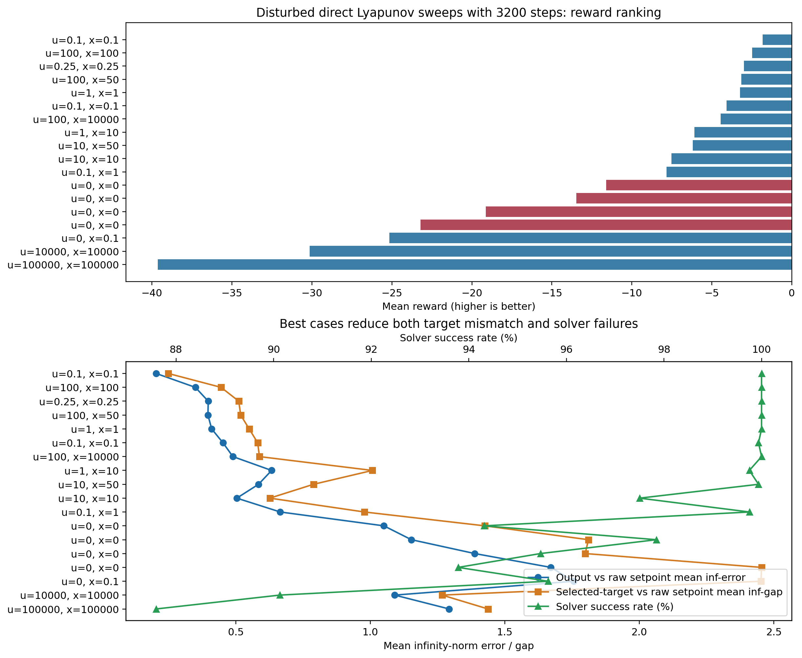

# Direct Lyapunov No-RL Disturbance Diagnosis And Remedy Path

Date: 2026-05-17

## Question

Why does the direct Lyapunov MPC without RL settle acceptably in nominal runs, but fail to settle cleanly in the disturbed runs of [DirectLyapunovMPC_FourMethodDisturbance.ipynb](../DirectLyapunovMPC_FourMethodDisturbance.ipynb)? What is the right technical fix?

## Short answer

The disturbed direct notebook currently suffers from two stacked problems:

1. the tracking MPC still follows the raw setpoint $y_{\mathrm{sp}}$ instead of the admissible target output $y_s$ because `use_target_output_for_tracking = False`;
2. the disturbance model used by the observer and target selector is a frozen output-disturbance model, while the simulated plant disturbance is actually a change in reactor parameters and flows (`Qi`, `Qs`, `hA`) that affects the state dynamics and steady-state map.

So the main problem is not simply "the direct Lyapunov idea fails under disturbance." The main problem is that the disturbed plant and the disturbance model assumed by the controller are not aligned.

## Files and runs inspected

- Notebook:
  [DirectLyapunovMPC_FourMethodDisturbance.ipynb](../DirectLyapunovMPC_FourMethodDisturbance.ipynb)
- Main direct rollout:
  [Lyapunov/direct_lyapunov_mpc.py](../Lyapunov/direct_lyapunov_mpc.py)
- Disturbance-target solver:
  [Lyapunov/frozen_output_disturbance_target.py](../Lyapunov/frozen_output_disturbance_target.py)
- Plant model:
  [Simulation/system_functions.py](../Simulation/system_functions.py)
- Main method report:
  [direct_lyapunov_direct_and_rl_method_2026-05-16.md](./direct_lyapunov_direct_and_rl_method_2026-05-16.md)
- Disturbed run folders under:
  `results/direct_lyapunov_mpc_bounded_four_method_two_setpoint_disturb/`

The strongest same-length disturbed sweep currently available is the 3200-step group ending at:

- `2026-05-16 20:23:36`
- `2026-05-16 22:15:57`
- `2026-05-16 23:47:28`
- `2026-05-17 00:01:04`
- `2026-05-17 01:06:02`
- `2026-05-17 14:11:40`
- `2026-05-17 14:58:30`
- `2026-05-17 15:01:58`
- `2026-05-17 15:31:53`

## 1. What the disturbed notebook is actually doing

### 1.1 The tracking target is still the raw setpoint

The direct tracking MPC is built around the admissible target $(x_{s,k}, u_{s,k})$, but the stage-cost reference is still the raw requested setpoint:

$$
y_{\mathrm{target},k} = y_{\mathrm{sp},k}
$$

because the notebook sets

```python
use_target_output_for_tracking = False
```

This means the controller can be Lyapunov-consistent around $(x_s, u_s)$ while the objective still keeps pulling toward a different output reference.

### 1.2 The disturbance injected into the plant is not an output bias

The disturbed direct notebook sets

```python
plant_mode = "disturb"
disturbance_after_step = False
```

and passes:

- `qi_change = 0.95`
- `qs_change = 1.05`
- `ha_change = 0.92`

Inside the rollout, the disturbed mode changes the plant parameters `Qi`, `Qs`, and `hA` online before the plant step. These are not simple output-bias disturbances. They change the plant dynamics and the steady-state mapping itself.

### 1.3 But the controller assumes a frozen output-disturbance model

The direct controller uses

```python
augmentation_mode = "output_disturbance"
```

with the model

$$
x_{k+1} = A x_k + B u_k,
\qquad
d_{k+1} = d_k,
\qquad
y_k = C x_k + d_k.
$$

The target solver in [frozen_output_disturbance_target.py](../Lyapunov/frozen_output_disturbance_target.py) explicitly expects:

- no disturbance term in the state dynamics,
- zero disturbance-input channel in the disturbance rows,
- disturbance integrator dynamics,
- and $C_d = I$.

So the controller is trying to explain a parameter disturbance as if it were only a constant output bias.

## 2. Why nominal runs can still look good

In nominal runs, the model-plant mismatch is much smaller, so two structural approximations are less damaging:

1. using $y_{\mathrm{sp}}$ instead of $y_s$ in the stage cost;
2. using an output-disturbance model instead of a disturbance model that acts through the state dynamics.

Under disturbance, both approximations become active at the same time:

- the reachable admissible target can move away from the raw setpoint,
- and the observer/target selector are estimating the wrong class of disturbance.

That is why nominal settling can look acceptable while disturbed settling does not.

## 3. What the disturbed sweeps show

To compare fairly, I filtered to the saved disturbed runs with `n_steps = 3200`.

The figure below summarizes the saved weight sweeps.



Raw data table:
[direct_disturbance_weight_sweep_summary_3200steps.csv](./figures/2026-05-17_direct_disturbance_gap/direct_disturbance_weight_sweep_summary_3200steps.csv)

### 3.1 Best and worst cases from the saved 3200-step disturbed sweeps

| Case | $u_{\mathrm{ref}}$ weight | $x_s$ weight | Mean reward | Solver success | Mean output error to raw setpoint | Mean selected-target gap to raw setpoint |
| --- | ---: | ---: | ---: | ---: | ---: | ---: |
| `bounded_hard_u_prev_0p1_xs_prev_0p1` | 0.1 | 0.1 | -1.825 | 1.0000 | 0.204 | 0.249 |
| `bounded_hard_u_prev_0p25_xs_prev_0p25` | 0.25 | 0.25 | -2.995 | 1.0000 | 0.397 | 0.511 |
| `bounded_hard_u_prev_1_xs_prev_1` | 1.0 | 1.0 | -3.249 | 1.0000 | 0.410 | 0.549 |
| `bounded_hard` | 0.0 | 0.0 | -11.597 to -23.212 | 0.9378 to 0.9784 | 1.050 to 1.671 | 1.425 to 2.454 |
| `bounded_hard_xs_prev_0p1` | 0.0 | 0.1 | -25.161 | 0.9563 | 1.756 | 2.452 |
| `bounded_hard_u_prev_100000_xs_prev_100000` | 100000 | 100000 | -39.641 | 0.8759 | 1.293 | 1.437 |

### 3.2 What this means

The saved sweeps support four strong conclusions:

1. moderate joint regularization helps a lot under disturbance;
2. state-smoothing alone does not solve the problem;
3. very large regularization is harmful;
4. the plain `bounded_hard` disturbance case is dominated by both target mismatch and solver unreliability.

The best currently saved disturbed case is:

$$
u_{\mathrm{ref}}\text{ weight} = 0.1,
\qquad
x_s\text{ weight} = 0.1.
$$

That case reduces all three critical symptoms at once:

- lower raw tracking error,
- lower selected-target mismatch relative to the raw setpoint,
- and zero fallback steps in the saved run.

## 4. The real mechanism behind the poor disturbed settling

The disturbed behavior is most consistent with the following chain:

1. the plant disturbance changes the true reachable steady state because `Qi`, `Qs`, and `hA` are modified;
2. the controller estimates only an output disturbance, so the internal steady-state target problem is solving the wrong disturbance-compensation structure;
3. the bounded target solve is then active for many steps, especially in `bounded_hard`;
4. the Lyapunov certificate is centered on $(x_s, u_s)$, but the MPC stage cost still tracks $y_{\mathrm{sp}}$;
5. the controller therefore keeps trading between feasibility, contraction, and raw-setpoint pursuit instead of settling to one consistent disturbed operating point.

This is why the best regularized cases help. They do not fix the disturbance-model mismatch, but they reduce target drift and nonuniqueness enough to make the closed loop look much better.

## 5. Literature-guided interpretation

### 5.1 Output-disturbance augmentation is not the right default for every disturbance

Muske and Badgwell (2002) explicitly warn that the common constant output-disturbance model can reject disturbances poorly when the true disturbance enters elsewhere in the process. They advocate a more general disturbance model that can enter through the input, state, or output, together with a consistent steady-state target calculation.

- K. R. Muske and T. A. Badgwell, "Disturbance modeling for offset-free linear model predictive control," *Journal of Process Control*, 2002.
  DOI: https://doi.org/10.1016/S0959-1524(01)00051-8

This matches the present code very closely: your disturbed plant changes physical process parameters, while the controller assumes only output bias.

### 5.2 The disturbance-model choice should match the mismatch channel

Pannocchia's 2024 tutorial review makes the same point in a broader way: offset-free MPC can be built with different disturbance formulations, including output disturbance, state disturbance, and velocity-form methods. The right formulation depends on the disturbance path and what is measurable.

- G. Pannocchia, "Offset-free tracking MPC: A tutorial review," 2024.
  PDF: https://arpi.unipi.it/bitstream/11568/759798/1/paper.pdf

That is directly relevant here. Your current formulation uses one specific option, not the only option.

### 5.3 Under active constraints, the feasible target itself can be wrong or move too much

Shead, Muske, and Rossiter (2008) show that even with offset-free target logic, constrained steady-state target calculation can converge to a feasible target that is not the closest or most appropriate constrained target when the desired target is unreachable.

- L. R. E. Shead, K. R. Muske, and J. A. Rossiter, "Conditions for which MPC fails to converge to the correct target," IFAC, 2008.
  DOI: https://doi.org/10.3182/20080706-5-KR-1001.01181

That helps explain why your disturbance case can still look unsatisfactory even after adding target regularization: the bounded target stage itself can remain the main bottleneck.

### 5.4 Disturbance model and observer should be designed together

Pannocchia and Bemporad (2007) argue that offset-free performance depends on the combined choice of disturbance model and observer, not only on the existence of disturbance integrators. Their proposed design explicitly trades off disturbance rejection against noise sensitivity.

- G. Pannocchia and A. Bemporad, "Combined Design of Disturbance Model and Observer for Offset-Free Model Predictive Control," *IEEE Transactions on Automatic Control*, 2007.
  DOI: https://doi.org/10.1109/TAC.2007.899096

This is relevant because your current observer poles were selected for the present augmented model. If the disturbance model changes, the observer should change too.

### 5.5 If the residual disturbed problem is genuinely robust-tracking, use robust tracking MPC

Limon, Alvarado, Alamo, and Camacho (2010) propose robust tube-based tracking MPC for constrained systems with additive disturbances. Their formulation is designed to preserve feasibility under target changes and to steer the plant to the closest admissible operating point when the desired target is unreachable.

- D. Limon, I. Alvarado, T. Alamo, and E. F. Camacho, "Robust tube-based MPC for tracking of constrained linear systems with additive disturbances," *Journal of Process Control*, 2010.
  DOI: https://doi.org/10.1016/j.jprocont.2009.11.007

That is the right direction if, after fixing the disturbance model mismatch, the remaining issue is still bounded persistent uncertainty.

### 5.6 Recent literature keeps pushing toward tunable disturbance estimates, not one fixed bias model

A recent 2026 open-access paper on offset-free MPC with parametric models again emphasizes augmented disturbance estimates with tunable dynamics and their impact on noise sensitivity.

- P. Tatjewski, "Offset-free Model Predictive Control with parametric models: Augmented disturbance estimates with tunable dynamics and impact on noise sensitivity," *Journal of Process Control*, 2026.
  DOI: https://doi.org/10.1016/j.jprocont.2026.103637

This supports a practical next step in your codebase: do not only change the disturbance channel; retune the estimator/observer around that new augmentation.

## 6. What we should do next

## 6.1 Immediate low-cost experiment

Before changing the controller architecture, rerun the disturbed direct notebook with:

- `use_target_output_for_tracking = True`
- `u_prev_weight = 0.1`
- `x_s_prev_weight = 0.1`

Why this first:

- it directly removes the raw-setpoint versus admissible-target mismatch;
- it uses the best currently saved disturbed regularization pair;
- and it tells us whether the remaining problem is mostly tracking-reference inconsistency or deeper disturbance-model mismatch.

Interpretation of that experiment:

- if the outputs settle well to $y_s$ but not to raw $y_{\mathrm{sp}}$, then the disturbance model or target model is still wrong;
- if the outputs still do not settle even to $y_s$, then target drift and disturbance-estimation mismatch remain dominant.

## 6.2 Structural fix: use a disturbance model consistent with the actual disturbance

The proper model-based fix is to replace the pure output-disturbance augmentation with a more general offset-free form such as

$$
x_{k+1} = A x_k + B u_k + B_d d_k,
\qquad
d_{k+1} = d_k,
\qquad
y_k = C x_k + C_d d_k.
$$

In your case, this is not just a theoretical preference. The simulated disturbance acts through process parameters and flow terms, so a state-disturbance or mixed state/output disturbance model is a better fit than $B_d = 0,\ C_d = I$.

## 6.3 If the disturbance is known, treat it as known

In the notebook, the disturbance schedule is generated explicitly through `qi_change`, `qs_change`, and `ha_change`. In simulation, those changes are therefore known.

That means the best long-term fix may be even better than generic offset-free disturbance estimation:

- include the disturbance as a measured disturbance in prediction,
- or use an LPV / scheduled linear model around the current `Qi`, `Qs`, `hA`,
- or recompute the local linear model under the disturbed operating condition.

This is more faithful than pretending the disturbance is an unknown output bias.

## 6.4 Keep target regularization, but keep it moderate

The saved sweeps show that moderate regularization helps, while huge regularization hurts.

So the right lesson is not "increase the weights until it settles." The right lesson is:

- keep a previous-input anchor,
- keep an $x_s$ smoothing term,
- but use them as tie-breakers and drift suppressors, not as dominant artificial objectives.

Among the saved 3200-step sweeps, the best current disturbed tie-breaker remains:

$$
\lambda_u = 0.1,
\qquad
\lambda_x = 0.1.
$$

## 6.5 If disturbance remains the main issue, move from nominal tracking MPC to robust tracking MPC

If the controller still behaves poorly after fixing the target reference and disturbance model, then the remaining problem is likely not offset-free estimation alone. It is a robust constrained tracking problem.

At that point, the correct next architecture is:

- robust tracking MPC,
- tube-based MPC,
- or target-tracking MPC with tightened constraints and a tracking terminal set.

That is the literature-consistent answer for persistent bounded disturbances and changing admissible steady states.

## 7. Concrete recommendation order for this repository

The best step order for this codebase is:

1. rerun the disturbed direct notebook with `use_target_output_for_tracking = True` and the saved-best weights `(0.1, 0.1)`;
2. compare settling to both $y_{\mathrm{sp}}$ and $y_s$;
3. replace the pure output-disturbance augmentation with a state/output disturbance model, or explicitly model `Qi`, `Qs`, `hA` as measured disturbances or scheduling variables;
4. redesign the observer together with the new disturbance model;
5. if necessary, move from the current nominal tracking MPC with Lyapunov first-step contraction to a robust tracking MPC formulation.

## Bottom line

The disturbed direct Lyapunov notebook is currently asking too much from the wrong disturbance model.

Nominal success does not contradict that. In nominal operation, the structural mismatch is mild enough that the controller still looks acceptable. Under disturbance, the mismatch becomes visible:

- the selected admissible target moves,
- the stage cost still chases the raw setpoint,
- and the observer/target layer are estimating the wrong kind of disturbance.

So the proper solution is not only more target regularization. The proper solution is:

1. align the tracking reference with the admissible target in the disturbed test,
2. use a disturbance model consistent with the actual disturbance channel,
3. and move to robust tracking MPC if the residual mismatch is still too large.
