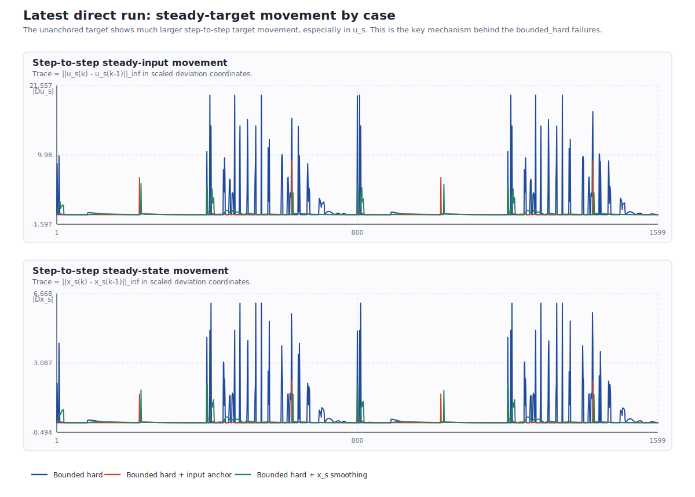
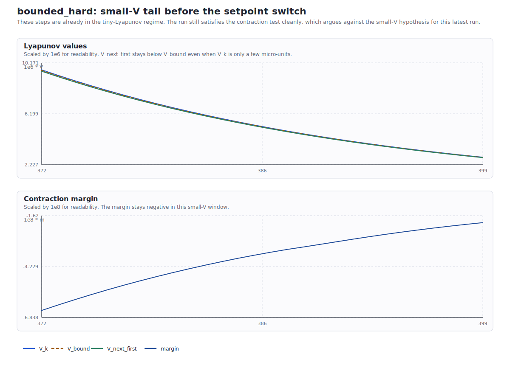
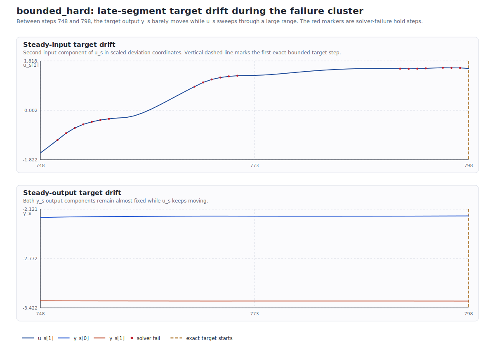

# Direct Lyapunov Latest Two-Setpoint Run: Numerical Diagnosis

## Run Under Analysis

- Latest run directory: `C:\Users\HAMEDI\OneDrive - McMaster University\PythonProjects\Lyapunov_polymer\Data\debug_exports\direct_lyapunov_mpc_bounded_three_scenario_two_setpoint_nominal\20260501_205019`
- Saved comparison bundle created at `2026-05-01T20:52:52`
- Study: `direct_lyapunov_mpc_bounded_three_scenario_two_setpoint_nominal`
- Plant mode: nominal
- Schedule: two setpoints, `n_tests = 2`, `set_points_len = 400`, total `1600` steps
- Direct MPC settings: `predict_h = 9`, `cont_h = 3`, `Qy_diag = [5, 1]`, `Rdu_diag = [1, 1]`
- Lyapunov settings: `rho_lyap = 0.98`, `eps_lyap = 1e-9`, hard first-step contraction
- Stage objective tracks the raw scheduled setpoint: `use_target_output_for_tracking = False`
- Fallback on solver failure is `hold_prev`, because `use_target_on_solver_fail = False`

## Method Reconstruction

The direct controller solves a bounded frozen-output-disturbance steady-target problem first, then uses that target inside the online MPC.

For each step, the target stage computes $(x_s, u_s, d_s, y_s)$ from the current augmented estimate and the requested setpoint $y_{\mathrm{sp}}$. The three compared target variants are:

- `bounded_hard`: bounded target solve with no anchor term on the steady target.
- `bounded_hard_u_prev_0p1`: same bounded target solve plus a steady-input anchor term $\lambda_u \|u_s - u_{k-1}\|^2$ with $\lambda_u = 0.1$.
- `bounded_hard_xs_prev_0p1`: same bounded target solve plus a steady-state smoothing term $\lambda_x \|x_s - x_{s,\mathrm{prev}}\|^2$ with $\lambda_x = 0.1$.

The online direct MPC then minimizes output tracking and input-move suppression subject to the model, bounds, and the hard first-step Lyapunov constraint

$$
V_{k+1\mid k}^{(1)} \le \rho_{\mathrm{lyap}} V_k + \varepsilon_{\mathrm{lyap}},
$$

with $V_k = (x_k - x_s)^\top P_x (x_k - x_s)$, $\rho_{\mathrm{lyap}} = 0.98$, and $\varepsilon_{\mathrm{lyap}} = 10^{-9}$.

## Main Finding

The latest run does **not** support the idea that the bad `bounded_hard` behavior is mainly a tiny-$V$ numerical issue or a target-matrix conditioning issue. The data support a different mechanism:

- The plain unanchored bounded target drifts substantially in $(u_s, x_s)$ even when $y_s$ is almost stationary.
- Those target moves happen only in the `bounded_ls` target stage, and every solver failure in this run also happens only in that stage.
- Once a failure occurs, the controller applies `hold_prev`, which produces the visible stop-go oscillation.
- The input-anchor and `x_s`-smoothing variants suppress that drift and almost eliminate the failures.

## Case Comparison

| Case | Solver success | Failed steps | Fail clusters | Stage switches | Mean $\|\Delta u_s\|_\infty$ | Mean $\|\Delta x_s\|_\infty$ | Mean $\|y-y_{\mathrm{sp}}\|_\infty$ |
| --- | ---: | ---: | ---: | ---: | ---: | ---: | ---: |
| `bounded_hard` | 0.9675 | 52 | 9 | 14 | 0.683 | 0.218 | 0.720 |
| `bounded_hard_u_prev_0p1` | 1.0000 | 0 | 0 | 7 | 0.060 | 0.017 | 0.408 |
| `bounded_hard_xs_prev_0p1` | 0.9950 | 8 | 6 | 7 | 0.173 | 0.059 | 0.410 |

Interpretation:
- `bounded_hard` is the only case with a large failure count: 52 failed steps in 9 clusters.
- The input anchor removes failures completely. The `x_s` smoother leaves only 8 failed steps.
- The unanchored case has about 11.3x larger mean $\|\Delta u_s\|_\infty$ than the input-anchor case.

## Why Conditioning Does Not Look Like the Main Cause

The target linear system metrics are effectively constant across the entire run and across all three cases:

- `target_cond_M` stays at about `1205.832`
- `target_cond_G` stays at about `7.052`
- the target rank remains full in the saved diagnostics

If raw matrix conditioning were the dominant problem, the two anchored variants should show the same failure pattern because they use the same target equations and nearly the same condition numbers. They do not. Their main difference is the regularization that selects a smoother steady target from the same feasible geometry.

A second signal is the solver-status mix:

- `bounded_hard`: 46 `infeasible` and 6 `optimal_inaccurate` steps
- `bounded_hard_u_prev_0p1`: all 1600 steps `optimal`
- `bounded_hard_xs_prev_0p1`: 8 `infeasible` steps

Most failures are therefore not borderline acceptance rejections. They are actual QP infeasibility events under the current target choice.

## Why the Small-$V$ Hypothesis Is Not the Best Explanation

Two points matter here.

1. A larger $\rho$ makes the Lyapunov bound **looser**, not tighter.

Because

$$
V_{\mathrm{bound}} = \rho V_k + \varepsilon,
$$

moving from $\rho = 0.98$ to $\rho = 0.995$ increases the allowed $V_{k+1}^{(1)}$. So `0.995` is less likely to trigger a violation than `0.98`, not more likely.

2. In this latest run, the stored $V_k$ values do not get small enough for $\varepsilon_{\mathrm{lyap}} = 10^{-9}$ to dominate.

| Case | Min $V_k$ | Min $V_k / [\varepsilon / (1-0.98)]$ | Min $V_k / [\varepsilon / (1-0.995)]$ | Successful steps with $V_k < 10^{-4}$ | Successful steps with $|m| < 5\times 10^{-8}$ |
| --- | ---: | ---: | ---: | ---: | ---: |
| `bounded_hard` | 2.360e-06 | 47.2 | 11.8 | 160 | 65 |
| `bounded_hard_u_prev_0p1` | 1.230e-06 | 24.6 | 6.2 | 308 | 47 |
| `bounded_hard_xs_prev_0p1` | 2.700e-06 | 54.0 | 13.5 | 279 | 34 |

For the current run, the strict-decrease floor is only `5.000e-08` at `rho = 0.98` and `2.000e-07` at `rho = 0.995`. Even the smallest observed `bounded_hard` value, `2.360e-06`, is still about `11.8` times larger than the `rho = 0.995` floor.

That means the contraction test is still meaningfully active in the saved tiny-$V$ regime. The report data also contain many successful steps with both:

- $V_k < 10^{-4}$: 160 successful `bounded_hard` steps
- $|m| < 5\times 10^{-8}$: 65 successful `bounded_hard` steps, where $m = V_{k+1\mid k}^{(1)} - (\rho V_k + \varepsilon)$

So the saved data do not show the controller oscillating because a numerically tiny positive Lyapunov margin keeps flipping the acceptance logic. The small-$V$ windows are mostly solved successfully.

## What Actually Happens in the Bad `bounded_hard` Windows

The clearest late-segment failure cluster is around steps `748:798` in the second setpoint segment.

- Over that window, the second steady-input component `u_s[1]` spans `3.138` in scaled deviation coordinates.
- Over the same window, the first steady-output target component spans only `0.021`.
- The second steady-output target component spans only `0.004`.

So the target output is almost fixed, but the steady input target keeps sliding. That is exactly the kind of non-unique target motion that an anchor term is supposed to suppress.

This same pattern appears in the failure logs:

- `bounded_hard` failure steps: 217, 219, 220, 712, 750, 751, 752, 753, 754, 755, 756, 766, 767, 768, 769, 770, 771, 790, 791, 792, 793, 795, 796, 797, 1018, 1019, 1021, 1022, 1502, 1511, 1553, 1554, 1555, 1556, 1557, 1558, 1559, 1560, 1561, 1562, 1563, 1564, 1565, 1566, 1567, 1568, 1569, 1570, 1571, 1572, 1573, 1574
- grouped into clusters: 217-220, 712, 750-756, 766-771, 790-797, 1018-1022, 1502, 1511, 1553-1574

All 52 failed `bounded_hard` steps happen while the target stage is `frozen_output_disturbance_bounded_ls`. None happen during `frozen_output_disturbance_exact_bounded`.

That does **not** mean every failure is caused by the exact/bounded handoff. The long last cluster near the end of the run stays inside `bounded_ls` the whole time. The stronger statement is:

- when the target stage is still using the bounded least-squares selection, the unanchored problem allows substantial target drift
- that drift sometimes makes the hard-contraction MPC infeasible
- the fallback `hold_prev` action then produces the apparent oscillation

## Final Diagnosis

For the latest direct run saved on `2026-05-01`, the evidence points to **target-selection drift / non-uniqueness** as the main mechanism behind the bad `bounded_hard` behavior.

The evidence against the competing explanations is:

- Not mainly raw conditioning: the same target matrix conditioning appears in all three cases, but only the unanchored case fails badly.
- Not mainly tiny-$V$ Lyapunov sensitivity: the run contains many successful near-tight small-$V$ steps, and `rho = 0.995` would be looser than the current `rho = 0.98` anyway.
- Not mainly post-check rejection noise: the dominant bad status is `infeasible`, not a successful solution with a tiny positive contraction margin.

The anchor terms help because they pick a consistent member of the bounded steady-target family. Once `u_s` or `x_s` is stabilized, the direct hard-contraction MPC remains feasible much more reliably.

## Recommended Next Experiments

1. Keep one anchor active by default for bounded direct runs. The input anchor is the cleanest choice because it completely removed failures in this latest run.
2. Add a bounded-target hysteresis rule: once the residual is below a small threshold, freeze `u_s` or freeze the active target branch until the next setpoint switch.
3. Log and monitor `||u_s(k)-u_s(k-1)||_inf`, `||x_s(k)-x_s(k-1)||_inf`, and target-stage switches as first-class diagnostics in future runs.
4. Only revisit `eps_lyap` scaling if future longer-settling runs actually drive $V_k$ below about `2e-7` for the `rho = 0.995` case. That is not the regime reached in this latest saved run.

