# Long-Setpoint Direct Lyapunov Settling Analysis

This report analyzes the latest direct frozen-output-disturbance Lyapunov MPC
ten-scenario run with longer setpoint segments:

`Data/debug_exports/direct_lyapunov_mpc_ten_scenario/20260424_105932`

The comparison summary was created at `2026-04-24T11:48:29`. The notebook used:

| Quantity | Value |
| --- | ---: |
| Cases | 10 |
| Logged steps per case | 6000 |
| Setpoint segment length | 1500 |
| Number of setpoint segments | 4 |
| Plant mode | `nominal` |
| Disturbance after step | `False` |

The previous reference run used 400-step setpoint segments:

`Data/debug_exports/direct_lyapunov_mpc_ten_scenario/20260423_234338`

The question was:

> If the setpoint is held long enough, does the controller eventually settle?

The answer is:

The best current setting, `bounded_soft_u_prev_1p0`, does eventually settle
inside all four 1500-step setpoint segments by a practical tolerance test, but
some low-setpoint segments settle very late. More time helps this case. More
time does not rescue every tuning. The strongest previous-input regularization
(`lambda_prev = 10.0`) exposes a slow failure mode over long windows; it looked
competitive in the 400-step run but becomes one of the worst choices in the
6000-step run.

## Executive Finding

Longer constant setpoints separate two different questions:

1. Can a case eventually settle after the initial nonlinear transient?
2. Is the case robust enough to remain well behaved over long operation?

For `bounded_soft_u_prev_1p0`, the answer to the first question is yes. It
eventually satisfies the practical settling band in all four setpoint segments.
For the second question, the answer is more cautious: it is still the best
regularized soft case overall, but it is no longer perfectly clean. In the
long run it has:

- 30 held/failed steps out of 6000;
- 22 active slack steps;
- mean output RMSE `0.605`, worse than the earlier `0.371`;
- late low-setpoint settling only near the end of the segment.

The longer run therefore supports the idea that the controller can settle, but
it also shows that the current two-stage target selector is still not a final
architecture. It is a useful diagnostic and baseline, not yet the stability
guarantee we want for the eventual RL safety layer.

## Why More Time Does Not Guarantee Settling

A constant scheduled setpoint is not enough to guarantee settling. Standard MPC
stability results require the closed-loop optimization to remain feasible, the
terminal ingredients to be compatible with the target, and the reference or
artificial steady state to be admissible. In this controller, the scheduled
setpoint is constant inside a segment, but the internal target can still move:

```math
\hat d_k
\longrightarrow
y_{\mathrm{sp}}-\hat d_k
\longrightarrow
u_s(k)
\longrightarrow
x_s(k)
\longrightarrow
V_k(x_s(k)).
```

If `d_hat` keeps moving or the bounded target projection changes active set,
the Lyapunov center moves even though `y_sp` is fixed. In that situation, the
usual intuition "give it enough time and it must settle" is not a theorem. It
only becomes credible when the target selector, observer estimate, and
Lyapunov-constrained MPC become mutually consistent.

For a fixed admissible artificial target `(x_s,u_s)`, first-step Lyapunov
contraction gives:

```math
V_{k+1} \le \rho V_k + \epsilon,
\qquad 0 < \rho < 1.
```

If the same target is used and the inequality remains feasible, this implies:

```math
V_k \le \rho^k V_0 + \frac{1-\rho^k}{1-\rho}\epsilon,
```

so the state approaches a small neighborhood of that target. But if the target
changes with time, the Lyapunov function itself changes:

```math
V_k = (\hat x_k-x_s(k))^T P(\hat x_k-x_s(k)).
```

Then a decreasing value around yesterday's target does not prove convergence
around today's target. That is why target motion and active-set jumps matter.

The literature points to the same condition. Limon et al. show that constrained
tracking MPC should optimize an artificial steady state and input, and should
move to the closest admissible steady state when the requested target is not
admissible. Mayne et al. emphasize recursive feasibility and terminal
ingredients in constrained MPC. Muske and Badgwell explain why offset-free MPC
depends on the disturbance model and target calculation. Mhaskar et al. discuss
hard and soft Lyapunov predictive control under constraints. Reference
governor literature frames the same issue as modifying references only when
needed to preserve constraints.

## Overall Short-Run Versus Long-Run Comparison

The table below compares the 400-step-segment run against the new
1500-step-segment run.

| Case | Reward 400 | Reward 1500 | RMSE 400 | RMSE 1500 | Solver 400 | Solver 1500 | Slack steps 400 | Slack steps 1500 | Held/fail steps 1500 |
| --- | ---: | ---: | ---: | ---: | ---: | ---: | ---: | ---: | ---: |
| `unbounded_hard` | -36.833 | -36.833 | 1.208 | 1.208 | 0.00% | 0.00% | 0 | 0 | 6000 |
| `bounded_hard` | -26.442 | -19.394 | 1.146 | 0.831 | 96.75% | 95.83% | 0 | 0 | 249 |
| `unbounded_soft` | -98.829 | -96.810 | 0.543 | 0.540 | 97.31% | 97.42% | 1131 | 4171 | 155 |
| `bounded_soft` | -33.560 | -22.288 | 1.358 | 0.963 | 97.38% | 94.80% | 16 | 40 | 312 |
| `bounded_hard_u_prev` | -11.640 | -11.214 | 0.644 | 0.669 | 99.50% | 98.68% | 0 | 0 | 78 |
| `bounded_soft_u_prev` | -15.989 | -17.552 | 0.821 | 0.844 | 100.00% | 99.93% | 5 | 26 | 4 |
| `bounded_hard_u_prev_1p0` | -7.694 | -10.075 | 0.567 | 0.637 | 99.81% | 98.87% | 0 | 0 | 67 |
| `bounded_soft_u_prev_1p0` | -3.598 | -9.648 | 0.371 | 0.605 | 100.00% | 99.50% | 0 | 22 | 30 |
| `bounded_hard_u_prev_10p0` | -6.568 | -92.414 | 0.487 | 3.516 | 99.31% | 91.70% | 0 | 0 | 497 |
| `bounded_soft_u_prev_10p0` | -4.183 | -120.213 | 0.405 | 3.303 | 100.00% | 85.60% | 0 | 28 | 864 |

The major change is the ranking of `lambda_prev = 10.0`. In the short run it
looked competitive. In the long run it is not. The strong anchor suppresses
local target movement, but over long operation it can resist necessary target
adaptation and create large target residuals, infeasibilities, and poor
tracking.

The long-run comparison plots support the same conclusion.

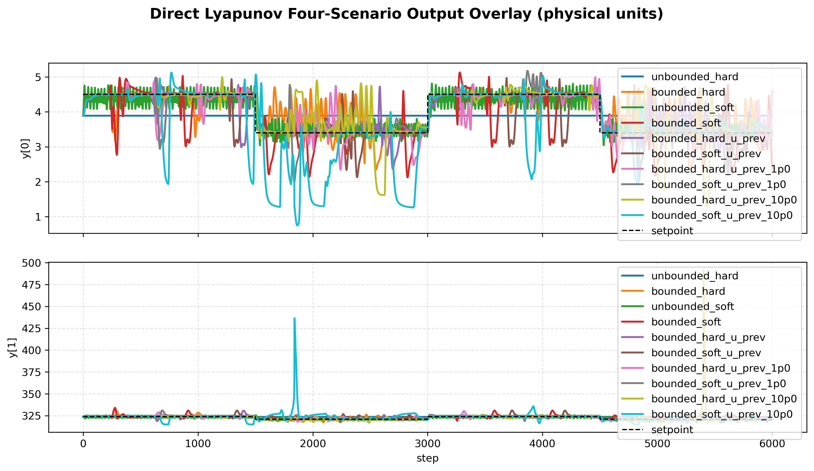

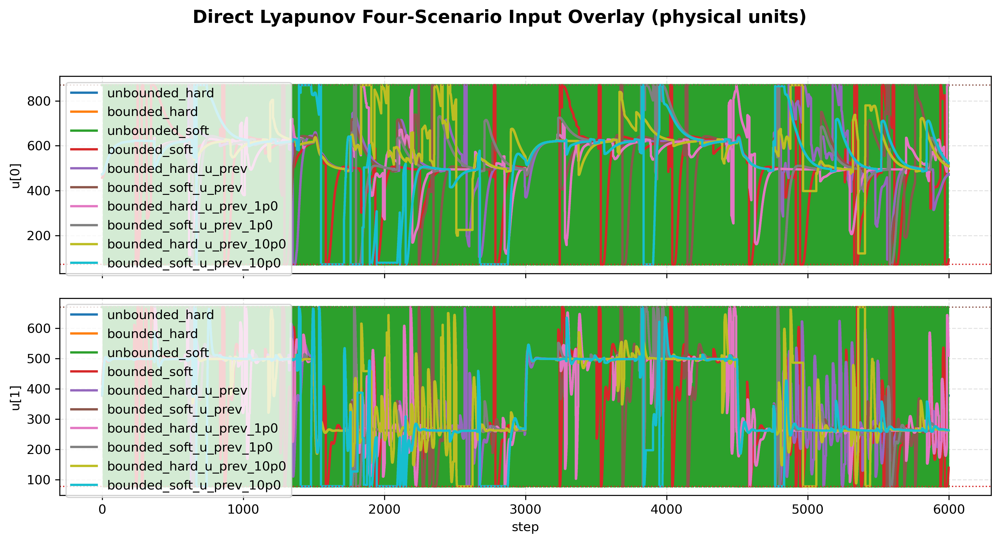


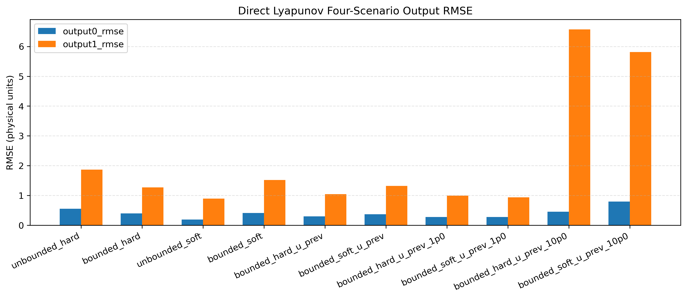

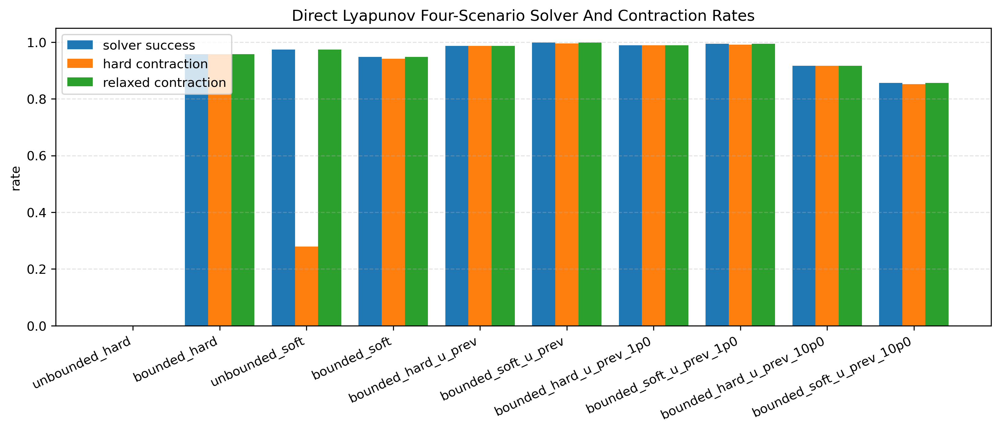

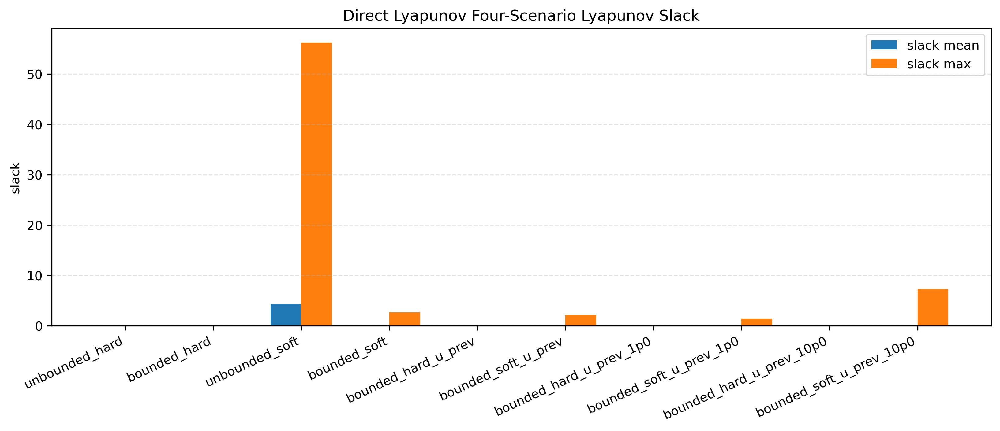

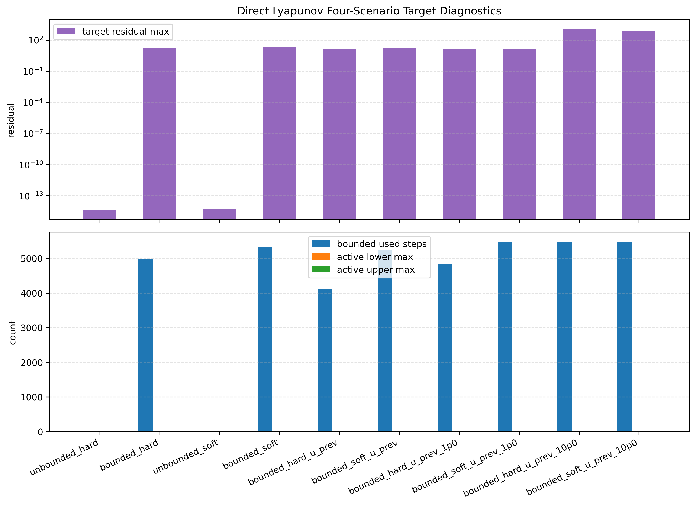

## Late-Window Settling Metrics

For each 1500-step segment, I computed metrics over the last 300 samples. The
table reports physical output RMSE, physical output range, solver failures,
slack activity, target residual, target motion relative to previous input, and
input range.

### Recommended Soft Case

`bounded_soft_u_prev_1p0` is the best current practical case. It is no longer
perfect over 6000 steps, but it is the cleanest long-run soft setting.

| Segment | eta RMSE | T RMSE | eta range | T range | eta bias | T bias | Solver fails | Slack active | Target residual mean | Mean `||u_s-u_prev||_inf` | Qc range | Qm range |
| --- | ---: | ---: | ---: | ---: | ---: | ---: | ---: | ---: | ---: | ---: | ---: | ---: |
| 1 high | 0.0155 | 0.0767 | 0.0599 | 0.2396 | -0.0046 | 0.0439 | 0 | 0 | 0.1099 | 0.6720 | 25.78 | 20.81 |
| 2 low | 0.1449 | 0.5360 | 0.4244 | 1.6186 | 0.1000 | -0.3690 | 0 | 0 | 0.7291 | 0.2133 | 228.99 | 100.75 |
| 3 high | 0.0159 | 0.0830 | 0.0615 | 0.3152 | -0.0015 | 0.0293 | 0 | 0 | 0.1179 | 0.5825 | 33.78 | 20.11 |
| 4 low | 0.0811 | 0.3381 | 0.1977 | 1.0050 | 0.0553 | -0.2116 | 0 | 0 | 0.3980 | 2.0636 | 142.82 | 26.63 |

The high setpoint settles well. The low setpoint settles more slowly and with
larger residual thermal motion. That is visible in the full-run outputs and
inputs.

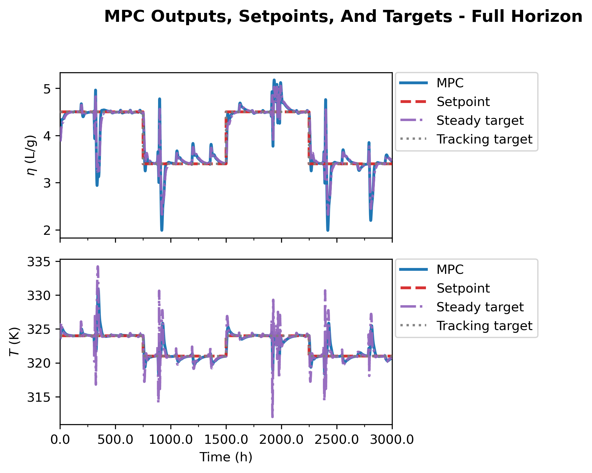

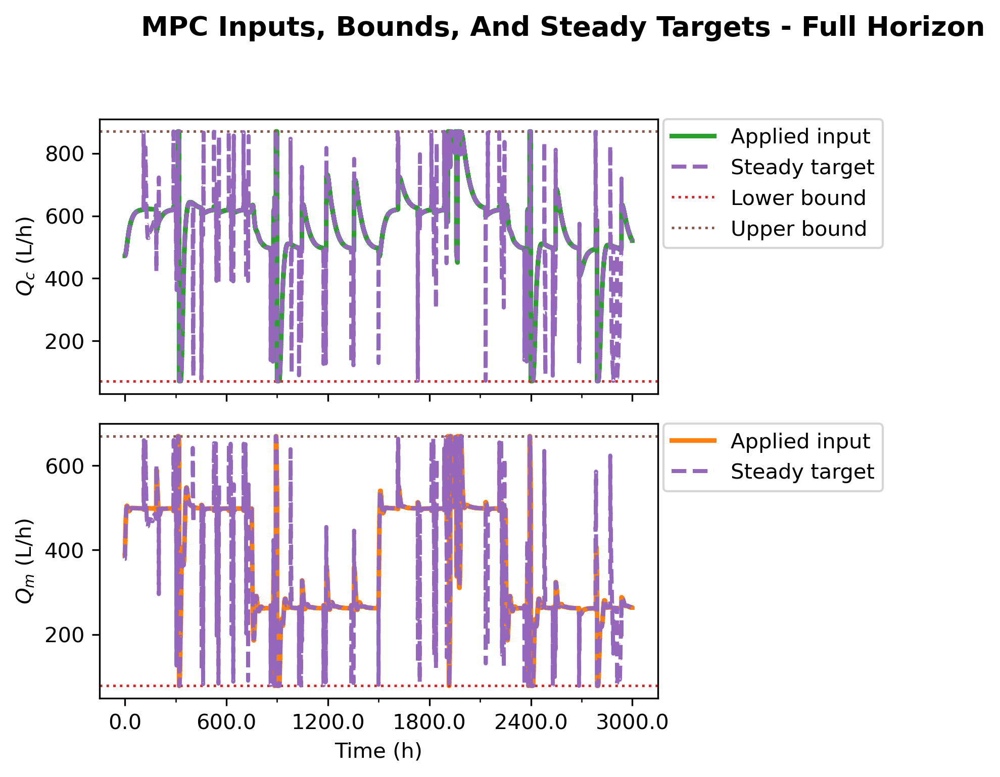

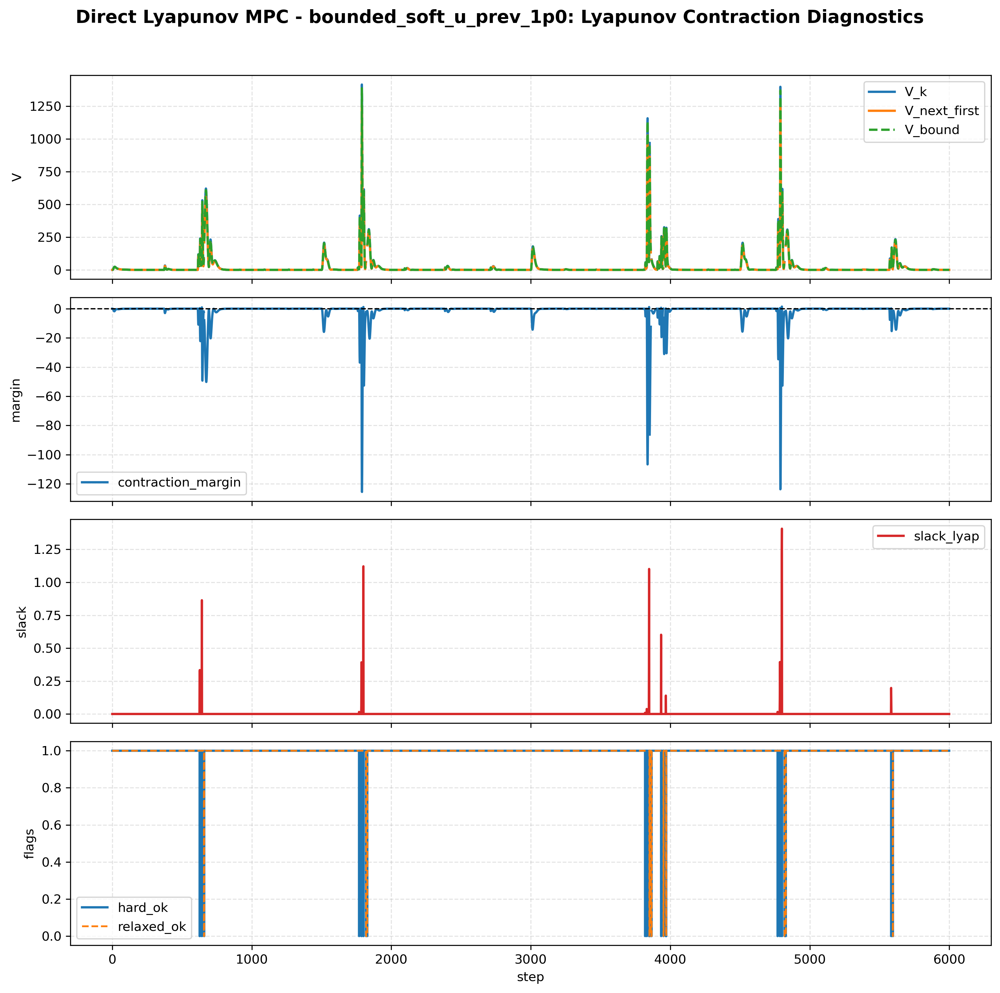

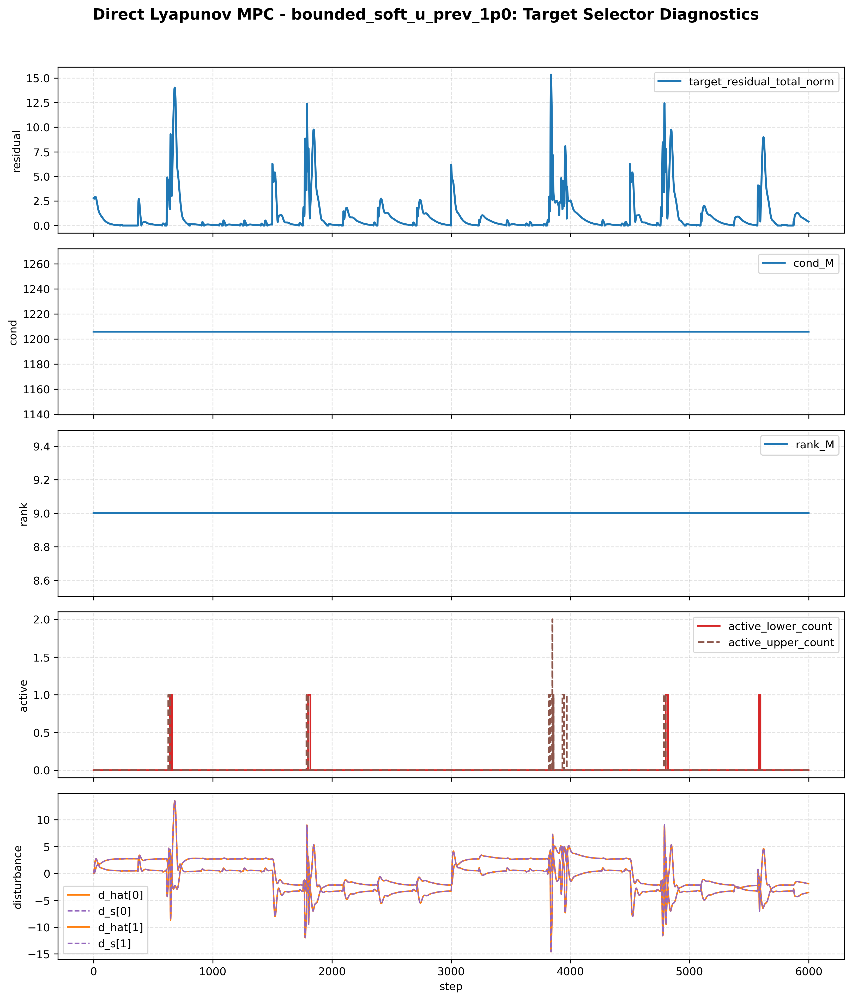

### Strong-Anchor Cases

The `lambda_prev = 10.0` cases are the important negative result. They do not
validate the "more time always fixes it" hypothesis. They expose a slow
failure mode.

| Case | Segment | eta RMSE | T RMSE | eta range | T range | Solver fails | Slack active | Target residual mean | Mean `||u_s-u_prev||_inf` | Qc range | Qm range |
| --- | --- | ---: | ---: | ---: | ---: | ---: | ---: | ---: | ---: | ---: | ---: |
| `bounded_hard_u_prev_10p0` | 1 high | 0.1040 | 0.4710 | 0.6787 | 2.0745 | 5 | 0 | 0.5184 | 0.2101 | 205.06 | 285.10 |
| `bounded_hard_u_prev_10p0` | 2 low | 0.1141 | 0.4205 | 0.3100 | 1.1723 | 0 | 0 | 0.5390 | 0.1826 | 190.64 | 64.35 |
| `bounded_hard_u_prev_10p0` | 3 high | 0.1034 | 0.4564 | 0.7231 | 2.6978 | 2 | 0 | 0.5649 | 0.6054 | 108.62 | 324.94 |
| `bounded_hard_u_prev_10p0` | 4 low | 0.1491 | 0.5547 | 0.4349 | 1.6515 | 0 | 0 | 0.7545 | 0.2065 | 238.02 | 102.44 |
| `bounded_soft_u_prev_10p0` | 1 high | 0.9984 | 4.1491 | 3.0208 | 9.5649 | 72 | 2 | 4.1461 | 0.5715 | 289.43 | 592.00 |
| `bounded_soft_u_prev_10p0` | 2 low | 1.6320 | 4.6804 | 2.2625 | 7.1778 | 175 | 0 | 8.0608 | 0.0079 | 492.30 | 224.51 |
| `bounded_soft_u_prev_10p0` | 3 high | 0.0156 | 0.0795 | 0.0610 | 0.2890 | 0 | 0 | 0.1129 | 0.5879 | 31.40 | 19.69 |
| `bounded_soft_u_prev_10p0` | 4 low | 0.1431 | 0.5248 | 0.4205 | 1.6060 | 0 | 0 | 0.7090 | 0.2041 | 225.98 | 100.08 |

The soft `10.0` case is especially revealing. It eventually looks good in the
third segment, but it has severe early long-run failure clusters. Its maximum
target residual is `739.49`, with 864 held/failed steps over the run.

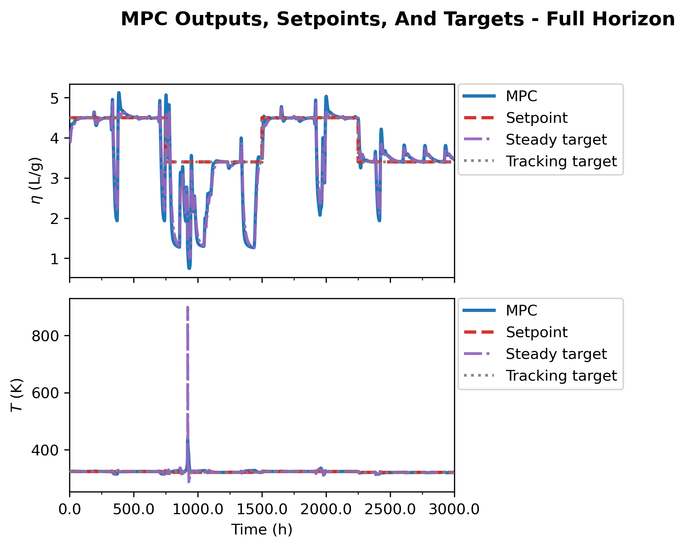

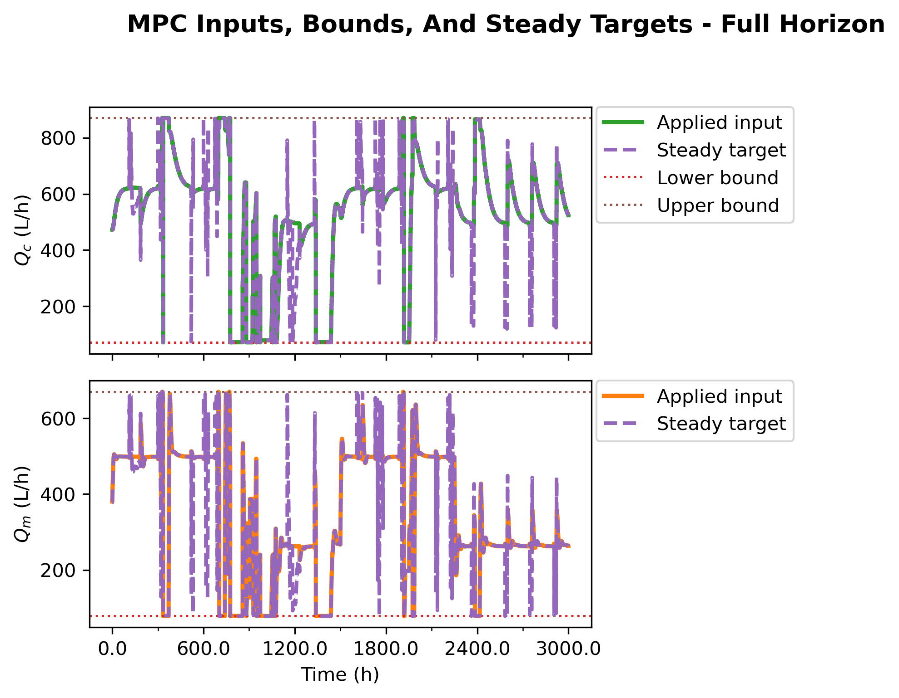

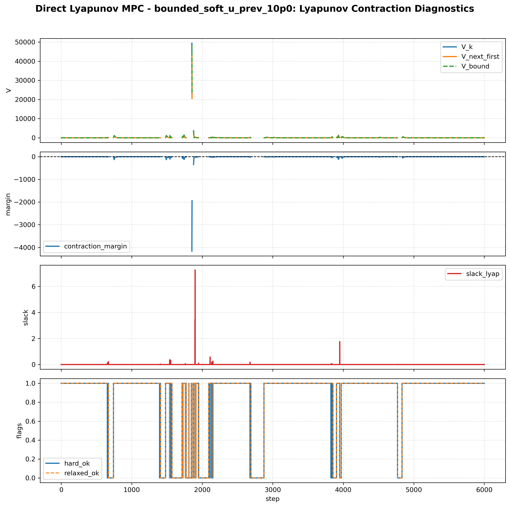

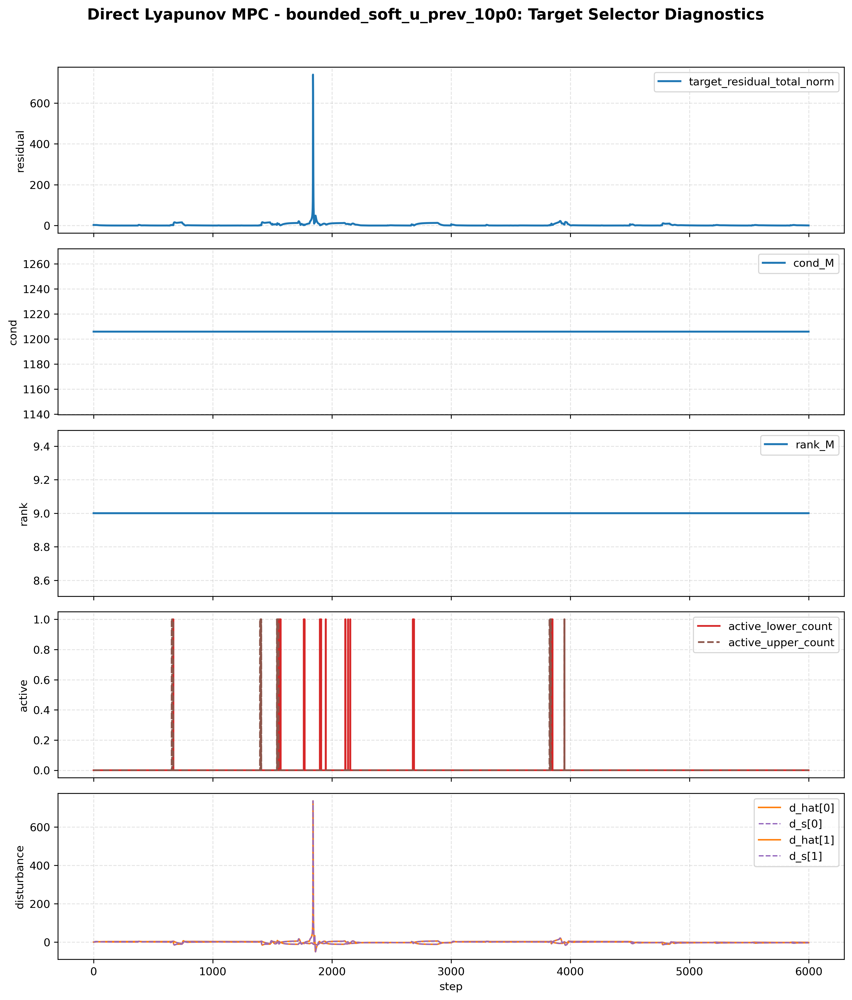

The hard `10.0` case is less visually bad than soft `10.0`, but the long run
still demotes it: 498 held/failed steps and a maximum target residual
`1232.66`.

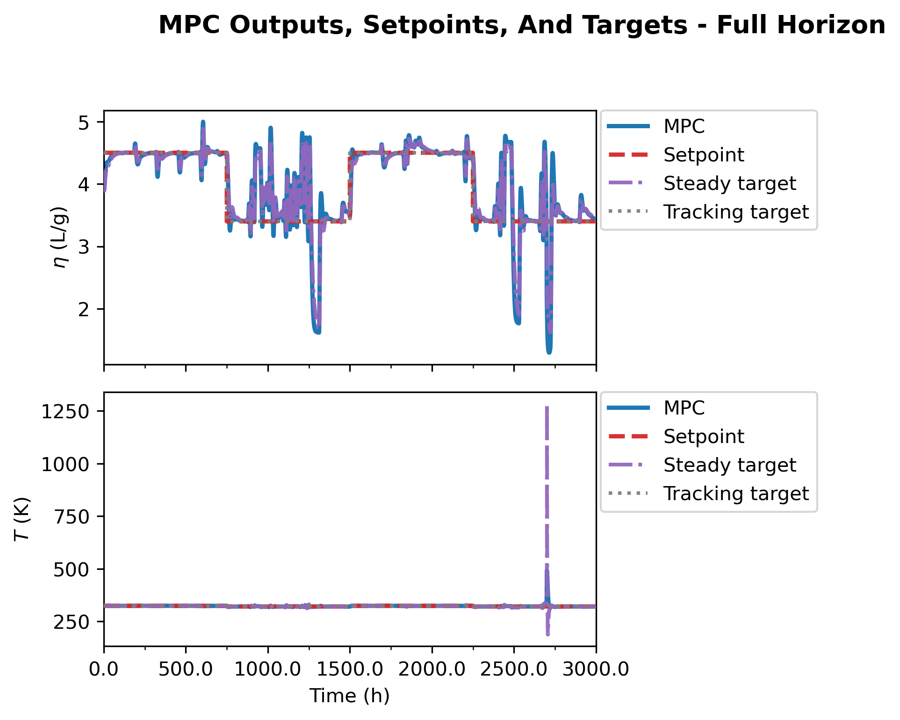


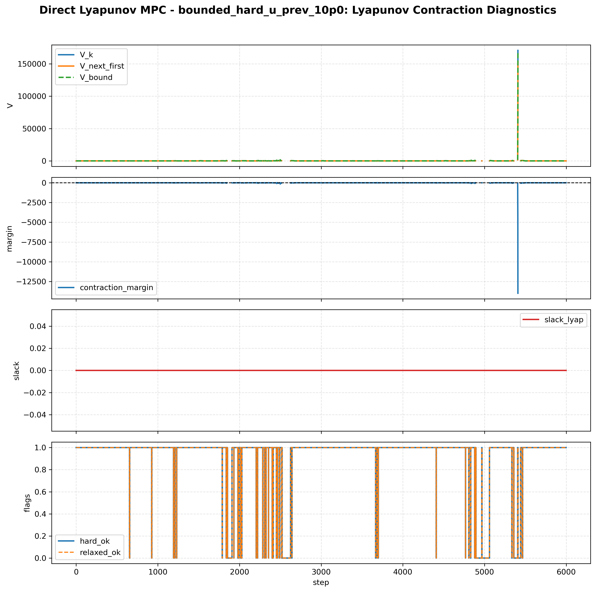

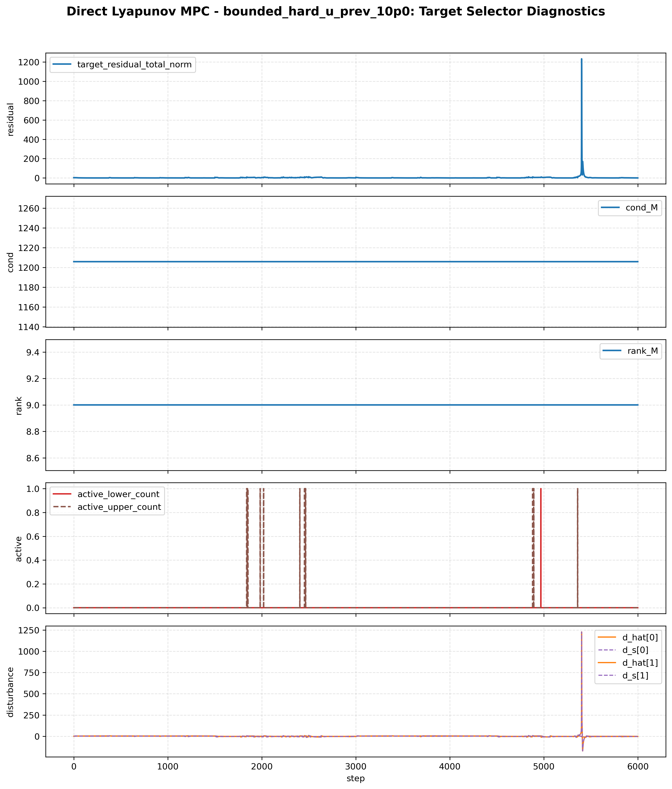

### Unregularized Bounded Cases

Longer setpoint segments improve the averages for the unregularized bounded
cases, but they do not make them final candidates. They still have many held
steps and larger target motion.

| Case | Segment | eta RMSE | T RMSE | eta range | T range | Solver fails | Slack active | Target residual mean | Mean `||u_s-u_prev||_inf` |
| --- | --- | ---: | ---: | ---: | ---: | ---: | ---: | ---: | ---: |
| `bounded_hard` | 1 high | 0.0009 | 0.0049 | 0.0057 | 0.0164 | 0 | 0 | 0.0000 | 0.9260 |
| `bounded_hard` | 2 low | 0.0055 | 0.0223 | 0.0159 | 0.0552 | 0 | 0 | 0.0000 | 3.0364 |
| `bounded_hard` | 3 high | 0.0602 | 0.3410 | 0.3280 | 1.5856 | 22 | 0 | 0.2702 | 10.8520 |
| `bounded_hard` | 4 low | 0.4543 | 1.2934 | 1.5182 | 5.8882 | 6 | 0 | 2.6933 | 11.5396 |
| `bounded_soft` | 1 high | 0.0704 | 0.4197 | 0.3633 | 1.3511 | 3 | 0 | 0.3460 | 7.4713 |
| `bounded_soft` | 2 low | 0.4791 | 1.5710 | 2.4750 | 4.7494 | 5 | 3 | 1.8626 | 9.8587 |
| `bounded_soft` | 3 high | 0.0339 | 0.1726 | 0.1423 | 0.5774 | 64 | 0 | 0.1232 | 10.1106 |
| `bounded_soft` | 4 low | 0.3180 | 1.0603 | 2.0801 | 6.1447 | 15 | 2 | 1.7902 | 11.1521 |

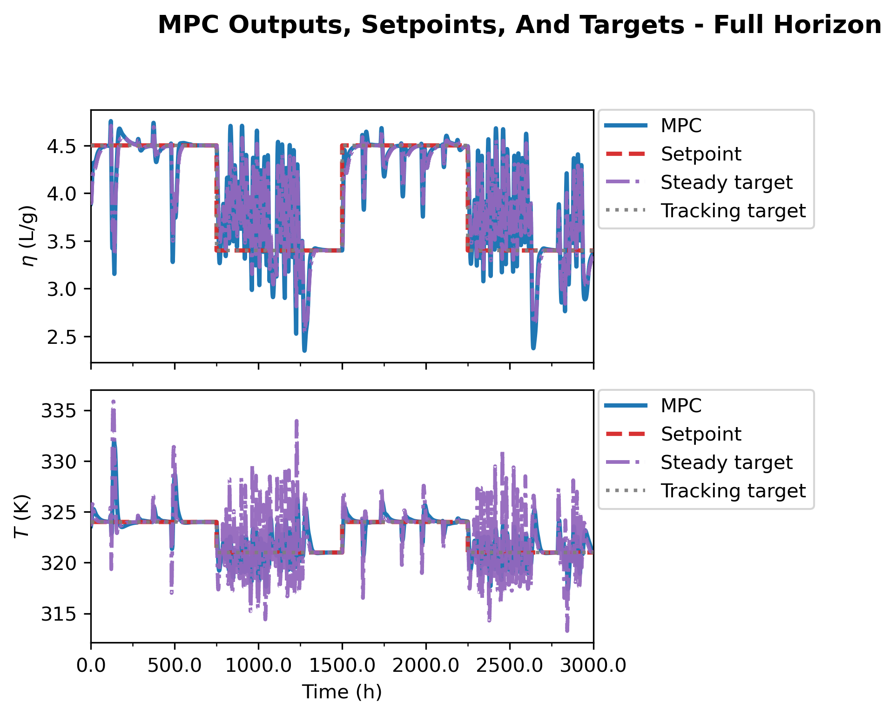

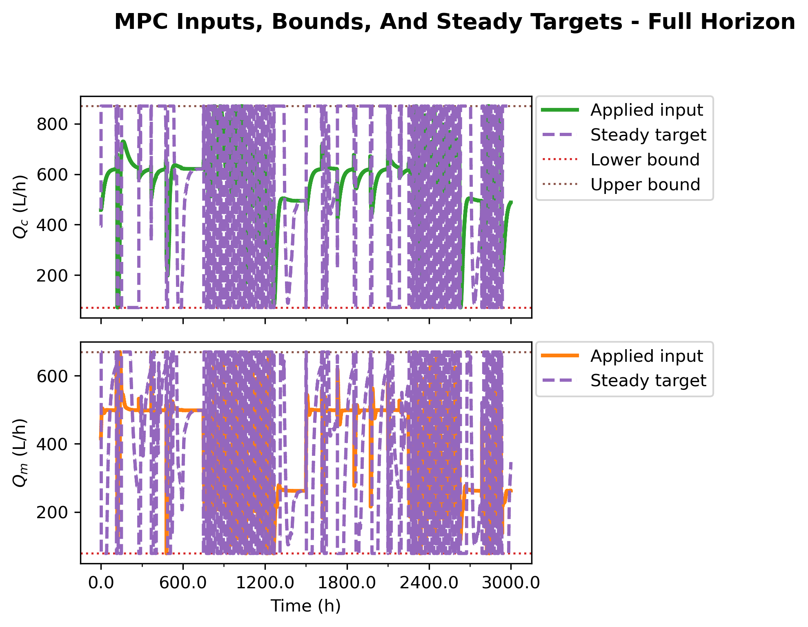

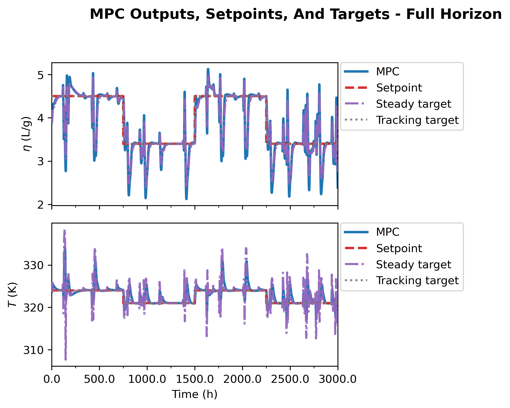

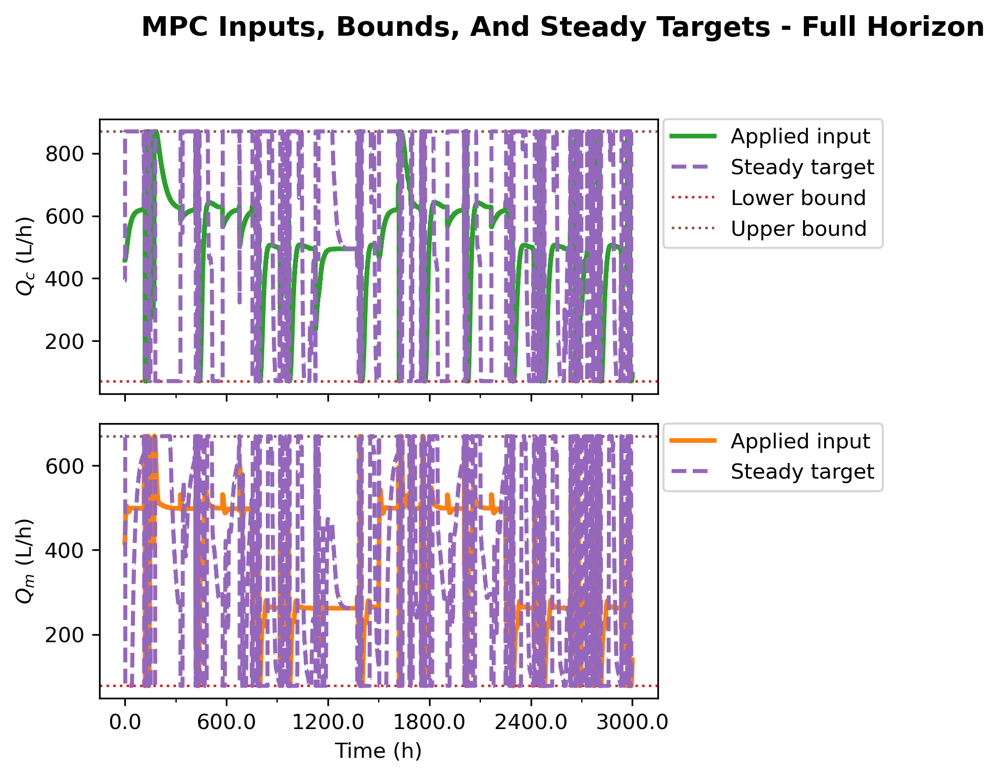

## Practical Settling Test

I used the following diagnostic settling band:

```math
|e_\eta| \le 0.10,
\qquad
|e_T| \le 0.50\;\mathrm{K},
```

and asked whether the output stayed inside that band for the rest of the
1500-step segment. This is not a formal proof; it is a practical check for the
"give it enough time" hypothesis.

| Case | Segment 1 high | Segment 2 low | Segment 3 high | Segment 4 low |
| --- | --- | --- | --- | --- |
| `bounded_hard` | settles at step 1057 | settles at step 2631 | settles at step 4247 | settles at step 5971 |
| `bounded_soft` | settles at step 1419 | settles at step 2902 | settles at step 4152 | does not settle |
| `bounded_hard_u_prev_1p0` | settles at step 1450 | settles at step 2963 | does not settle | does not settle |
| `bounded_soft_u_prev_1p0` | settles at step 754 | settles at step 2833 | settles at step 4103 | settles at step 5959 |
| `bounded_hard_u_prev_10p0` | settles at step 1253 | does not settle | settles at step 4449 | settles at step 5927 |
| `bounded_soft_u_prev_10p0` | does not settle | settles at step 2970 | settles at step 4088 | settles at step 5966 |

This table supports a nuanced conclusion:

- More time helps `bounded_soft_u_prev_1p0`; it eventually settles in every
  segment.
- Some cases settle only at the very end of a segment, which is not enough for
  a confident supervisor.
- A case can eventually settle and still be unacceptable because it has long
  failure clusters earlier in the segment.
- The long run is therefore valuable because it reveals slow failure modes that
  the 400-step run could hide.

## Extreme Events

The latest run has three important extreme-event observations:

| Case | Max target residual step | Max target residual | Held/fail steps | First failure clusters | Slack active | Max slack |
| --- | ---: | ---: | ---: | --- | ---: | ---: |
| `bounded_soft_u_prev_1p0` | 3838 | 15.341 | 30 | 657-658, 1819-1827, 3850-3851, 3861-3865 | 22 | 1.407 |
| `bounded_hard_u_prev_10p0` | 5402 | 1232.656 | 498 | 653-655, 924-926, 1192-1192, 1208-1210 | 0 | 0.000 |
| `bounded_soft_u_prev_10p0` | 1841 | 739.489 | 864 | 670-740, 1408-1479, 1540-1540, 1570-1713 | 28 | 7.264 |

These events explain why the `10.0` cases are demoted. Their target anchoring
can keep `||u_s-u_prev||` small while allowing the output residual or state
target error to become enormous. Smooth target motion is not the same as a
good target.

## Interpretation

Your hypothesis was right in an important way: when the target selector is not
too aggressive and not too anchored, longer setpoint holds allow the plant and
observer-target loop to settle. The best evidence is `bounded_soft_u_prev_1p0`.
Its high-setpoint tail windows are very quiet, and both low-setpoint segments
eventually enter the practical settling band.

But the hypothesis is not universally true. A constrained nonlinear MPC loop
does not have to settle merely because the scheduled setpoint is held constant.
The internal target must also become steady, the artificial target must remain
admissible, the Lyapunov constraint must stay feasible, and the observer
disturbance estimate must stop driving the target selector through active-set
changes.

This is exactly why the next architecture should move toward an
artificial-target tracking MPC or RL safety certificate in which the target and
the safety action are optimized together. The long run shows that target
regularization is essential, but it also shows that fixed weights in an
external target selector are fragile.

## Recommendation

Use the long-run result to update the tuning conclusion:

1. Keep `bounded_soft_u_prev_1p0` as the current best nominal long-run
   candidate.
2. Drop `lambda_prev = 10.0` as a primary candidate. It is useful only as an
   over-anchoring stress test.
3. Run a focused long-window sweep around the current winner:

```python
lambda_prev_grid = [0.5, 1.0, 1.5, 2.0]
```

4. Add per-segment settling metrics to the export:
   - settling time inside each constant setpoint segment;
   - last-300-sample RMSE;
   - last-300-sample output range;
   - last-300-sample target residual;
   - failure and slack clusters.
5. For the RL safety-layer path, do not rely on longer settling time alone.
   Build the fixed-action certificate:

```math
u_{0|k}=u_{\mathrm{RL}},
\qquad
\text{find } x_a,u_a
\text{ such that Lyapunov contraction is certified.}
```

Only if that certificate fails should the shield solve a correction with
`u_{0|k}` free.

## References

- D. Limon, I. Alvarado, T. Alamo, and E. F. Camacho, "MPC for tracking
  piecewise constant references for constrained linear systems," *Automatica*,
  2008. https://doi.org/10.1016/j.automatica.2008.01.023
- D. Q. Mayne, J. B. Rawlings, C. V. Rao, and P. O. M. Scokaert,
  "Constrained model predictive control: Stability and optimality,"
  *Automatica*, 2000. https://doi.org/10.1016/S0005-1098(99)00214-9
- K. R. Muske and T. A. Badgwell, "Disturbance modeling for offset-free linear
  model predictive control," *Journal of Process Control*, 2002.
  https://doi.org/10.1016/S0959-1524(01)00051-8
- P. Mhaskar, N. H. El-Farra, and P. D. Christofides, "Stabilization of
  nonlinear systems with state and control constraints using Lyapunov-based
  predictive control," *Systems & Control Letters*, 2006.
  https://doi.org/10.1016/j.sysconle.2005.09.014
- E. Garone, S. Di Cairano, and I. V. Kolmanovsky, "Reference and command
  governors for systems with constraints: A survey on theory and applications,"
  *Automatica*, 2017. https://doi.org/10.1016/j.automatica.2016.08.013
