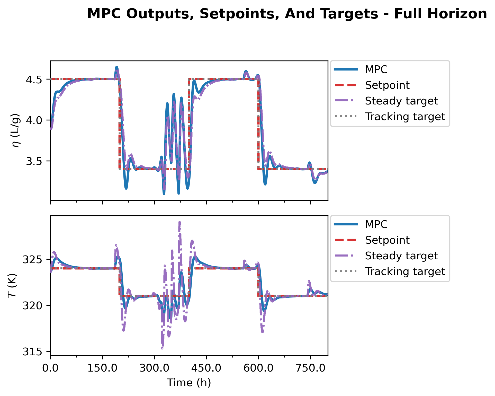
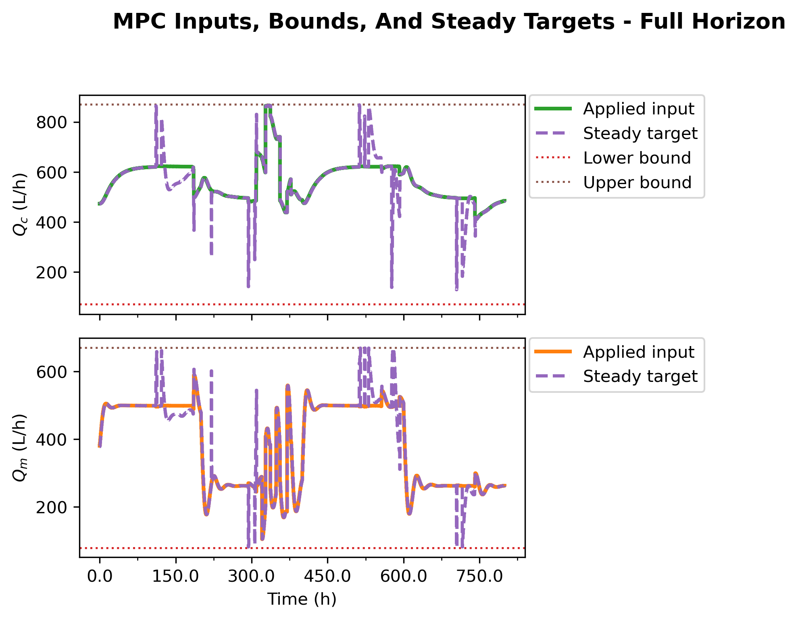

# Nominal Ten-Scenario Direct Lyapunov MPC Supervisor Report

This report rewrites the direct frozen-output-disturbance Lyapunov MPC
supervisor study around the latest nominal ten-scenario export:

`Data/debug_exports/direct_lyapunov_mpc_ten_scenario/20260423_234338`

The comparison summary was created at `2026-04-23T23:57:04`. Report-ready
figures are stored in:

`report/figures/direct_lyapunov_mpc_frozen_output_disturbance/`

The study is nominal. Every case reports `plant_mode = nominal`,
`disturbance_after_step = False`, and unchanged plant disturbance parameters:
`Qi = 108.0`, `Qs = 459.0`, and `hA = 1050000.0` at both run start and run end.

## Executive Conclusion

The ten-scenario run keeps the main recommendation from the previous nominal
study, but adds a useful upper bound on target previous-input regularization.
The best nominal supervisor candidate is still:

| Role | Case | Reason |
| --- | --- | --- |
| Primary nominal supervisor | `bounded_soft_u_prev_1p0` | Best reward, best mean output RMSE, 100% solver success, 100% hard and relaxed contraction, no active Lyapunov slack |
| Strong soft comparison | `bounded_soft_u_prev_10p0` | Second-best reward/RMSE overall, 100% solver success, 100% contraction, no active slack, but slightly worse tracking than `lambda_prev = 1.0` |
| Strict hard tracking candidate | `bounded_hard_u_prev_10p0` | Best reward and output RMSE among hard no-slack cases, but lower success rate than the hard `lambda_prev = 1.0` case |
| Strict hard reliability candidate | `bounded_hard_u_prev_1p0` | Higher hard-mode solver/contraction rate than hard `lambda_prev = 10.0`, with still strong tracking |
| Diagnostic controls | `unbounded_hard`, `unbounded_soft` | Exact output targets but inadmissible steady inputs; useful for exposing target infeasibility, not for deployment |

The new `lambda_prev = 10.0` cases show that stronger target anchoring is not
monotonically better. It further reduces the mean selected-target jump in soft
mode from `0.5176` to `0.3197` in scaled-deviation infinity norm, but the
closed-loop reward worsens from `-3.598` to `-4.183` and mean physical output
RMSE worsens from `0.3705` to `0.4054`. That is still very good, but it suggests
the best nominal soft setting in this run is near `lambda_prev = 1.0`, not at
the largest tested weight.

The hard cases tell a slightly different story. `bounded_hard_u_prev_10p0`
improves reward and output RMSE relative to `bounded_hard_u_prev_1p0`, but its
solver/contraction success rate drops from `99.81%` to `99.31%`. For a
supervisor, that creates a clean tradeoff: use the soft `lambda_prev = 1.0`
case as the primary nominal controller, and keep both hard `1.0` and hard
`10.0` in the diagnostic set until the few hard `10.0` rejected/held steps are
understood.

The important interpretation is:

- Unbounded targets make the steady output equation exact, but the associated
  steady input is outside the admissible box for all 1600 steps.
- Bounded targets make the target admissible, but unregularized bounded
  projections can jump across the input box and give the Lyapunov constraint a
  moving center.
- Adding `u_s-u_{k-1}` regularization stabilizes the selected target center.
- Too much previous-input anchoring can start to resist useful target movement,
  which explains why soft `lambda_prev = 10.0` is slightly worse than
  `lambda_prev = 1.0`.
- The main MPC objective remains normal MPC: output tracking plus input move
  penalty. The `u_prev` term is in the target selector, not in the MPC cost.

## Study Matrix

All ten cases use the same plant, observer, setpoint schedule, horizons, MPC
weights, failure policy, and nominal plant mode.

| Case | Target selector | Lyapunov mode | `lambda_prev` |
| --- | --- | --- | ---: |
| `unbounded_hard` | exact unbounded steady target | hard | n/a |
| `bounded_hard` | bounded target projection | hard | 0 |
| `unbounded_soft` | exact unbounded steady target | soft | n/a |
| `bounded_soft` | bounded target projection | soft | 0 |
| `bounded_hard_u_prev` | bounded target projection with previous-input regularization | hard | 0.1 |
| `bounded_soft_u_prev` | bounded target projection with previous-input regularization | soft | 0.1 |
| `bounded_hard_u_prev_1p0` | bounded target projection with previous-input regularization | hard | 1.0 |
| `bounded_soft_u_prev_1p0` | bounded target projection with previous-input regularization | soft | 1.0 |
| `bounded_hard_u_prev_10p0` | bounded target projection with previous-input regularization | hard | 10.0 |
| `bounded_soft_u_prev_10p0` | bounded target projection with previous-input regularization | soft | 10.0 |

The visible notebook defaults for this run were:

| Setting | Value |
| --- | --- |
| Plant mode | `nominal` |
| Disturbance after step | `False` |
| Prediction horizon | 9 |
| Control horizon | 3 |
| `rho_lyap` | 0.98 |
| `lyap_eps` | `1e-9` |
| `slack_penalty` | `1e6` |
| Terminal cost scale | 0.0 |
| Track target output instead of setpoint | `False` |
| Steady-input objective term | `False` |
| Terminal objective term | `False` |
| Logged steps per case | 1600 |

## Mathematical Formulation

The direct controller uses the frozen output-disturbance model in scaled
deviation coordinates:

```math
x_{k+1}=Ax_k+Bu_k,
\qquad
y_k=Cx_k+d_k,
\qquad
d_{k+1}=d_k .
```

The observer state is:

```math
\hat z_k =
\begin{bmatrix}
\hat x_k\\
\hat d_k
\end{bmatrix}.
```

At every time step, the target selector freezes the estimated output
disturbance:

```math
d_s = \hat d_k .
```

Only the steady state `x_s` and steady input `u_s` are selected. The exact
unbounded target solves:

```math
(I-A)x_s - Bu_s = 0,
\qquad
Cx_s = y_{\mathrm{sp},k} - \hat d_k .
```

Equivalently, after eliminating `x_s` when the reduced map is available:

```math
x_s = (I-A)^{-1}Bu_s,
\qquad
G = C(I-A)^{-1}B,
```

```math
G u_s = y_{\mathrm{sp},k}-\hat d_k .
```

This exact target is mathematically clean but ignores actuator limits. The
bounded selector first checks whether the exact `u_s` satisfies:

```math
u_{\min} \le u_s \le u_{\max}.
```

If it does, the exact target is kept. If the exact target is outside the box,
the unregularized bounded projection solves:

```math
\min_{u_{\min}\le u_s\le u_{\max}}
\left\|G u_s - \left(y_{\mathrm{sp},k}-\hat d_k\right)\right\|_2^2 .
```

The regularized bounded target selectors solve instead:

```math
\min_{u_{\min}\le u_s\le u_{\max}}
\left\|G u_s - \left(y_{\mathrm{sp},k}-\hat d_k\right)\right\|_2^2
+
\lambda_{\mathrm{prev}}
\left\|u_s-u_{k-1}\right\|_2^2 .
```

Here `u_{k-1}` is the previous applied input in scaled deviation coordinates.
The three tested weights are:

```math
\lambda_{\mathrm{prev}}\in\{0.1,\;1.0,\;10.0\}.
```

For inactive bounds, the regularized stationarity condition is:

```math
\left(G^\top G+\lambda_{\mathrm{prev}}I\right)u_s
=
G^\top\left(y_{\mathrm{sp},k}-\hat d_k\right)
+
\lambda_{\mathrm{prev}}u_{k-1}.
```

With active bounds, the same balance appears in the KKT system with bound
multipliers. Increasing `lambda_prev` adds curvature to the target problem and
pulls weakly determined steady-input directions toward the previous applied
input. The ten-scenario run shows the useful range: enough regularization
suppresses target jumps, while excessive anchoring can slightly slow useful
target adaptation.

The MPC optimization itself remains the normal tracking MPC objective:

```math
J_k =
\sum_{i=1}^{N_p}
\left\|y_{k+i|k}-y_{\mathrm{sp},k}\right\|_Q^2
+
\left\|u_{k|k}-u_{k-1}\right\|_R^2
+
\sum_{i=1}^{N_c-1}
\left\|u_{k+i|k}-u_{k+i-1|k}\right\|_R^2 .
```

There is no active objective term of the form:

```math
\left\|u_{k+i|k}-u_s\right\|_{S_u}^2
```

and there is no active terminal objective term in this run. The target `x_s`
enters through the Lyapunov constraint. Define:

```math
V_k = \left(\hat x_k-x_s\right)^\top P\left(\hat x_k-x_s\right).
```

The hard first-step Lyapunov condition is:

```math
\left(x_{k+1|k}-x_s\right)^\top P\left(x_{k+1|k}-x_s\right)
\le
\rho V_k+\epsilon .
```

The soft mode adds a nonnegative slack:

```math
\left(x_{k+1|k}-x_s\right)^\top P\left(x_{k+1|k}-x_s\right)
\le
\rho V_k+\epsilon+s_k,
\qquad
s_k\ge 0,
```

and penalizes it:

```math
J_k^{\mathrm{soft}} = J_k + p_s s_k .
```

In the two best soft cases, `bounded_soft_u_prev_1p0` and
`bounded_soft_u_prev_10p0`, the exported slack is only numerical roundoff and
has zero active steps.

## Nominal-Mode Audit

The latest run confirms nominal plant operation in the exported comparison
table.

| Quantity | Value |
| --- | --- |
| `plant_mode` | `nominal` for all ten cases |
| `disturbance_after_step` | `False` for all ten cases |
| `Qi` nominal/final | `108.0 / 108.0` |
| `Qs` nominal/final | `459.0 / 459.0` |
| `hA` nominal/final | `1050000.0 / 1050000.0` |

Therefore the oscillations and performance differences in this report should
not be attributed to disturbance injection. They are generated by the
controller-target interaction under nominal nonlinear plant simulation.

## Performance Results

| Case | `lambda_prev` | Reward mean | Solver success | Hard contraction | Relaxed contraction | Slack active | Slack max | Mean output RMSE |
| --- | ---: | ---: | ---: | ---: | ---: | ---: | ---: | ---: |
| `unbounded_hard` | n/a | -36.83 | 0.00% | 0.00% | 0.00% | 0 | 0.0000 | 1.208 |
| `bounded_hard` | 0 | -26.44 | 96.75% | 96.75% | 96.75% | 0 | 0.0000 | 1.146 |
| `unbounded_soft` | n/a | -98.83 | 97.31% | 26.62% | 97.31% | 1131 | 32.23 | 0.5434 |
| `bounded_soft` | 0 | -33.56 | 97.38% | 96.38% | 97.38% | 16 | 0.9876 | 1.358 |
| `bounded_hard_u_prev` | 0.1 | -11.64 | 99.50% | 99.50% | 99.50% | 0 | 0.0000 | 0.6442 |
| `bounded_soft_u_prev` | 0.1 | -15.99 | 100.00% | 99.69% | 100.00% | 5 | 0.7129 | 0.8207 |
| `bounded_hard_u_prev_1p0` | 1.0 | -7.694 | 99.81% | 99.81% | 99.81% | 0 | 0.0000 | 0.5669 |
| `bounded_soft_u_prev_1p0` | 1.0 | -3.598 | 100.00% | 100.00% | 100.00% | 0 | 0.0000 | 0.3705 |
| `bounded_hard_u_prev_10p0` | 10.0 | -6.568 | 99.31% | 99.31% | 99.31% | 0 | 0.0000 | 0.4871 |
| `bounded_soft_u_prev_10p0` | 10.0 | -4.183 | 100.00% | 100.00% | 100.00% | 0 | 0.0000 | 0.4054 |

The ranking by reward is:

| Rank | Case | Reward mean |
| ---: | --- | ---: |
| 1 | `bounded_soft_u_prev_1p0` | -3.598 |
| 2 | `bounded_soft_u_prev_10p0` | -4.183 |
| 3 | `bounded_hard_u_prev_10p0` | -6.568 |
| 4 | `bounded_hard_u_prev_1p0` | -7.694 |
| 5 | `bounded_hard_u_prev` | -11.64 |
| 6 | `bounded_soft_u_prev` | -15.99 |
| 7 | `bounded_hard` | -26.44 |
| 8 | `bounded_soft` | -33.56 |
| 9 | `unbounded_hard` | -36.83 |
| 10 | `unbounded_soft` | -98.83 |

The reward and RMSE rankings both identify `bounded_soft_u_prev_1p0` as the
best nominal case. The new `10.0` cases are valuable because they show the
performance curve beginning to flatten or reverse: stronger target anchoring
still helps hard tracking, but it no longer improves the best soft result.


## Target-Selector Results

| Case | Exact in-bounds steps | Bounded LS steps | Target residual max | Mean `||u_s-u_prev||_inf` | Max `||u_s-u_prev||_inf` | Active `u_prev` steps |
| --- | ---: | ---: | ---: | ---: | ---: | ---: |
| `unbounded_hard` | 0 | 0 | 0.0000 | 555.3 | 689.1 | 0 |
| `bounded_hard` | 37 | 1563 | 15.56 | 11.67 | 19.96 | 0 |
| `unbounded_soft` | 0 | 0 | 0.0000 | 457.7 | 1690.7 | 0 |
| `bounded_soft` | 88 | 1512 | 21.83 | 12.06 | 19.96 | 0 |
| `bounded_hard_u_prev` | 350 | 1250 | 11.01 | 0.5241 | 9.230 | 1250 |
| `bounded_soft_u_prev` | 416 | 1184 | 14.06 | 0.9895 | 12.93 | 1184 |
| `bounded_hard_u_prev_1p0` | 332 | 1268 | 14.69 | 0.4304 | 9.122 | 1268 |
| `bounded_soft_u_prev_1p0` | 373 | 1227 | 6.476 | 0.5176 | 13.76 | 1227 |
| `bounded_hard_u_prev_10p0` | 291 | 1309 | 10.27 | 0.4316 | 12.11 | 1309 |
| `bounded_soft_u_prev_10p0` | 318 | 1282 | 6.536 | 0.3197 | 9.957 | 1282 |

The unbounded rows show why exact output matching is misleading. Their target
residual is essentially zero, but the exact steady input is outside the box at
every step. That is why `unbounded_hard` is infeasible for all 1600 MPC solves,
and why `unbounded_soft` needs large slack on 1131 steps.

The unregularized bounded rows show the real problem. The selected target input
is often far from the previously applied input: the mean
`||u_s-u_prev||_inf` is about `11.67` for `bounded_hard` and `12.06` for
`bounded_soft`. With previous-input regularization, that mean drops below
`1.0` for every regularized bounded case.

The strongest target-smoothing result is `bounded_soft_u_prev_10p0`, with mean
`||u_s-u_prev||_inf = 0.3197`. However, the best closed-loop result is still
`bounded_soft_u_prev_1p0`. This distinction matters: the target selector should
be smooth enough to avoid moving-center Lyapunov pressure, but not so anchored
that it resists beneficial setpoint adaptation.


## Solver And Lyapunov Results

| Case | Method counts | Solver statuses | Target stages |
| --- | --- | --- | --- |
| `unbounded_hard` | `solver_fail_hold_prev: 1600` | `infeasible: 1600` | `unbounded: 1600` |
| `bounded_hard` | `direct: 1548`, `hold-prev: 52` | `infeasible: 46`, `optimal: 1545`, `optimal_inaccurate: 9` | `bounded LS: 1563`, `exact bounded: 37` |
| `unbounded_soft` | `direct: 1557`, `hold-prev: 43` | `optimal: 899`, `optimal_inaccurate: 701` | `unbounded: 1600` |
| `bounded_soft` | `direct: 1558`, `hold-prev: 42` | `infeasible: 4`, `optimal: 1541`, `optimal_inaccurate: 55` | `bounded LS: 1512`, `exact bounded: 88` |
| `bounded_hard_u_prev` | `direct: 1592`, `hold-prev: 8` | `infeasible: 3`, `optimal: 1594`, `optimal_inaccurate: 3` | `bounded LS: 1250`, `exact bounded: 350` |
| `bounded_soft_u_prev` | `direct: 1600` | `optimal: 1596`, `optimal_inaccurate: 4` | `bounded LS: 1184`, `exact bounded: 416` |
| `bounded_hard_u_prev_1p0` | `direct: 1597`, `hold-prev: 3` | `infeasible: 1`, `optimal: 1599` | `bounded LS: 1268`, `exact bounded: 332` |
| `bounded_soft_u_prev_1p0` | `direct: 1600` | `optimal: 1600` | `bounded LS: 1227`, `exact bounded: 373` |
| `bounded_hard_u_prev_10p0` | `direct: 1589`, `hold-prev: 11` | `optimal: 1590`, `optimal_inaccurate: 10` | `bounded LS: 1309`, `exact bounded: 291` |
| `bounded_soft_u_prev_10p0` | `direct: 1600` | `optimal: 1600` | `bounded LS: 1282`, `exact bounded: 318` |

The soft `lambda_prev = 1.0` and `lambda_prev = 10.0` cases are both clean:
all 1600 steps solve optimally, all 1600 satisfy the hard contraction
diagnostic, and both have zero active slack. The difference is performance,
not feasibility: `1.0` tracks slightly better.

The hard `lambda_prev = 10.0` case deserves a focused follow-up because it has
the best hard-mode reward and RMSE but more held/rejected steps than hard
`lambda_prev = 1.0`. Before selecting it as the strict deployment backup, the
11 held steps should be inspected in the step table.


## Output And Input Behavior

The comparison overlays make the ten-case picture visually clear. The
unbounded cases remain diagnostic extremes: hard cannot move because the
problem is infeasible, and soft can move but pays for infeasible target centers
through slack. The bounded `u_prev` cases reduce target jumps and give the MPC a
smoother Lyapunov center.


The recommended soft `lambda_prev = 1.0` case has the cleanest overall
closed-loop metrics in this export.


The soft `lambda_prev = 10.0` case is the nearest competitor. It is useful as a
stress test for whether target anchoring is starting to dominate tracking.


For a no-slack hard comparison, the `lambda_prev = 10.0` case gives the best
tracking metrics among hard cases, while the `lambda_prev = 1.0` hard case is
more reliable by solver/contraction rate.





## Why The Previous-Input Term Helps

The earlier oscillation concern was that a nominal run could sit close to a
steady behavior and then suddenly become oscillatory. This ten-scenario run
supports the hypothesis that the issue is not nominal disturbance injection.
Instead, the dangerous object is the selected target center.

The Lyapunov constraint is centered at `x_s`, while the MPC objective tracks
`y_sp`. When the setpoint is not exactly reachable by an admissible steady
input, the bounded selector chooses a compromise `u_s`. If that compromise
jumps between active-set faces of the input box, the Lyapunov center moves even
though the plant is nominal. The controller then has to satisfy contraction
relative to a moving center while still tracking the setpoint. That is a
natural recipe for late input motion or oscillatory output behavior.

The regularized selector modifies the bounded projection by adding a memory
term:

```math
\lambda_{\mathrm{prev}}\left\|u_s-u_{k-1}\right\|_2^2 .
```

That term does not ask the plant to stay still. It asks the target selector not
to move the steady target unless the output residual benefit justifies the
move. In KKT terms, `lambda_prev` adds positive curvature to the target problem
and pulls weakly determined target directions toward the previous input.

The ten-scenario result gives a practical tuning picture:

| Selector family | What happened |
| --- | --- |
| no bounded target | exact output target, but inadmissible steady input |
| bounded, no `u_prev` term | admissible target, but large target jumps and weaker closed-loop behavior |
| `lambda_prev = 0.1` | major improvement over unregularized bounded targets |
| `lambda_prev = 1.0` | best soft supervisor result and strongest overall recommendation |
| `lambda_prev = 10.0` | still strong, but soft tracking slightly worsens, suggesting over-anchoring begins |

This does not prove that `lambda_prev = 1.0` is globally optimal for every
future setpoint or disturbed run. It does prove that the target selector was
part of the nominal oscillation mechanism, because changing only the bounded
target projection substantially improved nominal closed-loop behavior.

## Recommendation

Use the following supervisor order for nominal direct Lyapunov testing:

1. `bounded_soft_u_prev_1p0`
2. `bounded_soft_u_prev_10p0`
3. `bounded_hard_u_prev_10p0`
4. `bounded_hard_u_prev_1p0`
5. `bounded_hard_u_prev`
6. `bounded_soft_u_prev`
7. unregularized bounded cases only as ablations
8. unbounded cases only as infeasibility diagnostics

For the next notebook pass, keep the ten-scenario matrix, but treat
`bounded_soft_u_prev_1p0` as the main candidate. The immediate follow-up checks
should be:

- inspect the 11 held/rejected steps in `bounded_hard_u_prev_10p0`;
- run a finer nominal soft sweep around `lambda_prev = 1.0`, for example
  `0.5`, `1.0`, `2.0`, and `5.0`;
- repeat the best soft settings under disturbed plant mode;
- keep logging `target_us_u_ref_inf`, `target_u_ref_penalty`,
  `target_residual_total_norm`, bounded target stage counts, first-step
  contraction margin, slack activation, and physical-unit output RMSE.

If the soft `lambda_prev = 1.0` behavior persists under disturbed runs, then
the supervisor should prefer the bounded soft previous-input-regularized
selector, with hard `lambda_prev = 1.0` and hard `lambda_prev = 10.0` retained
as strict no-slack comparisons.
