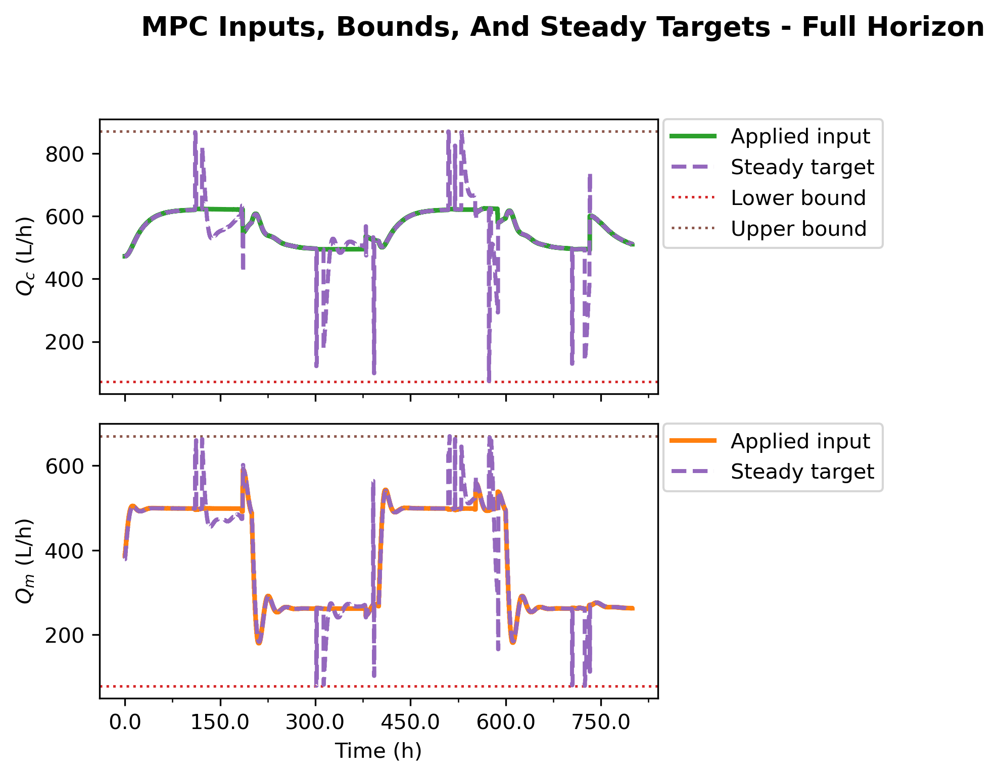
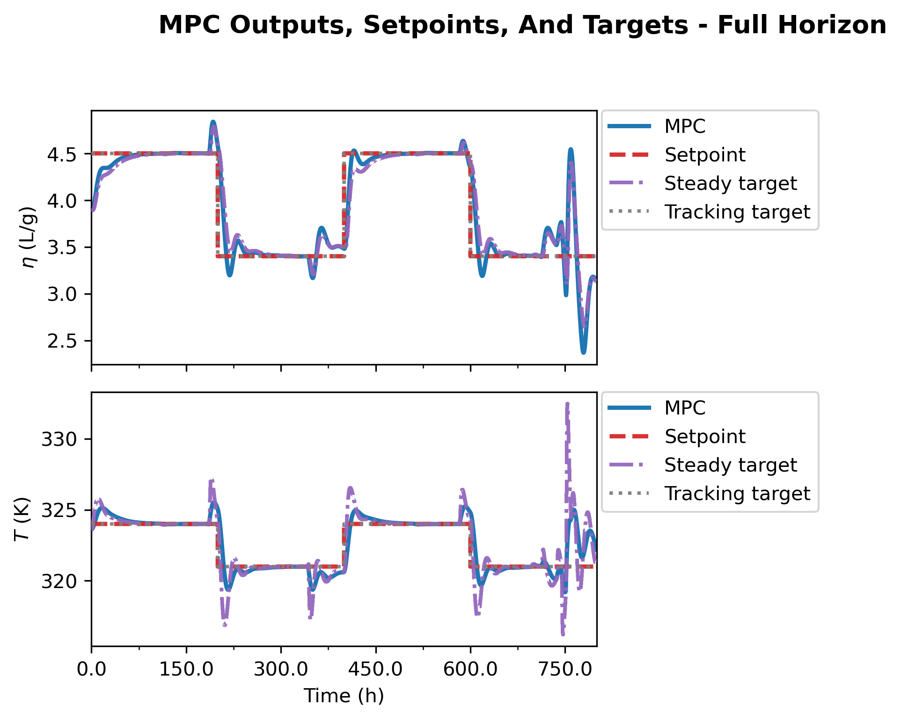
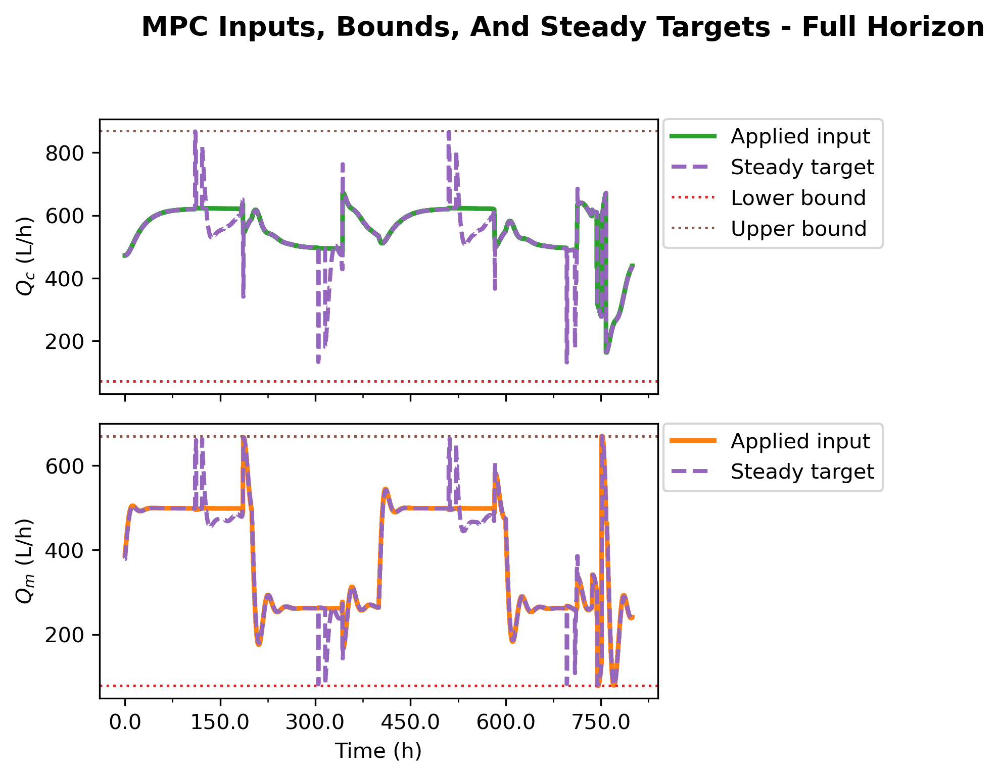

# Nominal Eight-Scenario Direct Lyapunov MPC Supervisor Report

This report rewrites the direct frozen-output-disturbance Lyapunov MPC
supervisor study around the latest nominal eight-scenario export:

`Data/debug_exports/direct_lyapunov_mpc_eight_scenario/20260423_231816`

The comparison summary was created at `2026-04-23T23:29:52`. The report-ready
figures were copied into:

`report/figures/direct_lyapunov_mpc_frozen_output_disturbance/`

The study is nominal. Every case reports `plant_mode = nominal`,
`disturbance_after_step = False`, and unchanged plant disturbance parameters:
`Qi = 108.0`, `Qs = 459.0`, and `hA = 1050000.0` at both run start and run end.

## Executive Conclusion

The eight-scenario run changes the recommendation. The best nominal supervisor
candidate is now:

| Role | Case | Reason |
| --- | --- | --- |
| Primary nominal supervisor | `bounded_soft_u_prev_1p0` | Best reward, best mean output RMSE, 100% solver success, 100% contraction, no active Lyapunov slack |
| Strict no-slack backup | `bounded_hard_u_prev_1p0` | Zero slack by construction, 99.81% solver success, strong reward improvement over unregularized hard bounded MPC |
| Diagnostic controls | `unbounded_hard`, `unbounded_soft` | Exact output targets but inadmissible steady inputs; useful for exposing target infeasibility, not for deployment |

The previous-input target regularization is not a cosmetic change. It changes
the steady target selected by the bounded target projection when the exact
steady input lies outside the admissible box. In this nominal run, increasing
the regularization from `lambda_prev = 0.1` to `lambda_prev = 1.0` improves the
best soft bounded case from reward `-15.99` to `-3.60` and reduces the mean
physical output RMSE from `0.8207` to `0.3705`.

The important interpretation is this:

- Unbounded targets make the output equation look perfect, but the associated
  steady input is inadmissible for all 1600 steps.
- Bounded targets make the steady target admissible, but unregularized bounded
  projections can jump across the input box and give the MPC a moving Lyapunov
  center.
- Adding `u_s-u_{k-1}` regularization makes the bounded target selector choose
  the reachable steady target closest to the previously applied input, which
  stabilizes the target center seen by the Lyapunov constraint.
- The main MPC objective remains normal MPC: output tracking plus input move
  penalty. The `u_prev` term lives in the target selector, not in the MPC cost.

## Study Matrix

All eight cases use the same plant, observer, setpoint schedule, horizons,
MPC weights, failure policy, and nominal plant mode.

| Case | Target selector | Lyapunov mode | `lambda_prev` |
| --- | --- | --- | ---: |
| `unbounded_hard` | exact unbounded steady target | hard | n/a |
| `bounded_hard` | bounded target projection | hard | 0 |
| `unbounded_soft` | exact unbounded steady target | soft | n/a |
| `bounded_soft` | bounded target projection | soft | 0 |
| `bounded_hard_u_prev` | bounded target projection with previous-input regularization | hard | 0.1 |
| `bounded_soft_u_prev` | bounded target projection with previous-input regularization | soft | 0.1 |
| `bounded_hard_u_prev_1p0` | bounded target projection with previous-input regularization | hard | 1.0 |
| `bounded_soft_u_prev_1p0` | bounded target projection with previous-input regularization | soft | 1.0 |

The visible notebook defaults for this run were:

| Setting | Value |
| --- | --- |
| Plant mode | `nominal` |
| Disturbance after step | `False` |
| Prediction horizon | 9 |
| Control horizon | 3 |
| `rho_lyap` | 0.98 |
| `lyap_eps` | `1e-9` |
| `slack_penalty` | `1e6` |
| Terminal cost scale | 0.0 |
| Track target output instead of setpoint | `False` |
| Steady-input objective term | `False` |
| Terminal objective term | `False` |
| Logged steps per case | 1600 |

## Mathematical Formulation

The direct controller uses the frozen output-disturbance model in scaled
deviation coordinates:

```math
x_{k+1}=Ax_k+Bu_k,
\qquad
y_k=Cx_k+d_k,
\qquad
d_{k+1}=d_k .
```

The observer state is:

```math
\hat z_k =
\begin{bmatrix}
\hat x_k\\
\hat d_k
\end{bmatrix}.
```

At every time step, the target selector freezes the estimated output
disturbance:

```math
d_s = \hat d_k .
```

Only the steady state `x_s` and steady input `u_s` are selected. The exact
unbounded target solves:

```math
(I-A)x_s - Bu_s = 0,
\qquad
Cx_s = y_{\mathrm{sp},k} - \hat d_k .
```

Equivalently, after eliminating `x_s` when the reduced map is available:

```math
x_s = (I-A)^{-1}Bu_s,
\qquad
G = C(I-A)^{-1}B,
```

```math
G u_s = y_{\mathrm{sp},k}-\hat d_k .
```

This is the clean mathematical target, but it ignores actuator limits. The
bounded selector first checks whether the exact `u_s` satisfies:

```math
u_{\min} \le u_s \le u_{\max}.
```

If it does, the exact target is kept. This matters: the regularization does
not pull an already feasible exact target away from the setpoint. If the exact
target is outside the box, the unregularized bounded projection solves:

```math
\min_{u_{\min}\le u_s\le u_{\max}}
\left\|G u_s - \left(y_{\mathrm{sp},k}-\hat d_k\right)\right\|_2^2 .
```

The two new regularized target selectors solve instead:

```math
\min_{u_{\min}\le u_s\le u_{\max}}
\left\|G u_s - \left(y_{\mathrm{sp},k}-\hat d_k\right)\right\|_2^2
+
\lambda_{\mathrm{prev}}
\left\|u_s-u_{k-1}\right\|_2^2 .
```

Here `u_{k-1}` is the previous applied input in scaled deviation coordinates.
The two weights in this run are:

```math
\lambda_{\mathrm{prev}}\in\{0.1,\;1.0\}.
```

For inactive bounds, the regularized stationarity condition is:

```math
\left(G^\top G+\lambda_{\mathrm{prev}}I\right)u_s
=
G^\top\left(y_{\mathrm{sp},k}-\hat d_k\right)
+
\lambda_{\mathrm{prev}}u_{k-1}.
```

With active bounds, the same balance appears in the KKT system with bound
multipliers. This equation explains the observed behavior: increasing
`lambda_prev` damps motion of the selected steady input in directions where the
output projection is weak or where the unconstrained target would jump to a box
corner.

The MPC optimization itself remains the normal tracking MPC objective:

```math
J_k =
\sum_{i=1}^{N_p}
\left\|y_{k+i|k}-y_{\mathrm{sp},k}\right\|_Q^2
+
\left\|u_{k|k}-u_{k-1}\right\|_R^2
+
\sum_{i=1}^{N_c-1}
\left\|u_{k+i|k}-u_{k+i-1|k}\right\|_R^2 .
```

There is no active objective term of the form:

```math
\left\|u_{k+i|k}-u_s\right\|_{S_u}^2
```

and there is no active terminal objective term in this run. The target `x_s`
enters through the Lyapunov constraint. Define:

```math
V_k = \left(\hat x_k-x_s\right)^\top P\left(\hat x_k-x_s\right).
```

The hard first-step Lyapunov condition is:

```math
\left(x_{k+1|k}-x_s\right)^\top P\left(x_{k+1|k}-x_s\right)
\le
\rho V_k+\epsilon .
```

The soft mode adds a nonnegative slack:

```math
\left(x_{k+1|k}-x_s\right)^\top P\left(x_{k+1|k}-x_s\right)
\le
\rho V_k+\epsilon+s_k,
\qquad
s_k\ge 0,
```

and penalizes it:

```math
J_k^{\mathrm{soft}} = J_k + p_s s_k .
```

In this run, the best soft regularized case has `s_k` numerically zero for all
steps, so soft mode behaves like hard mode while preserving a feasibility
escape hatch.

## Nominal-Mode Audit

The latest run confirms nominal plant operation in the exported comparison
table.

| Quantity | Value |
| --- | --- |
| `plant_mode` | `nominal` for all eight cases |
| `disturbance_after_step` | `False` for all eight cases |
| `Qi` nominal/final | `108.0 / 108.0` |
| `Qs` nominal/final | `459.0 / 459.0` |
| `hA` nominal/final | `1050000.0 / 1050000.0` |

Therefore the oscillations and performance differences in this report should
not be attributed to disturbance injection. They are generated by the
controller-target interaction under nominal nonlinear plant simulation.

## Performance Results

| Case | `lambda_prev` | Reward mean | Solver success | Hard contraction | Relaxed contraction | Slack active | Slack max | Mean output RMSE |
| --- | ---: | ---: | ---: | ---: | ---: | ---: | ---: | ---: |
| `unbounded_hard` | n/a | -36.83 | 0.00% | 0.00% | 0.00% | 0 | 0.0000 | 1.208 |
| `bounded_hard` | 0 | -26.44 | 96.75% | 96.75% | 96.75% | 0 | 0.0000 | 1.146 |
| `unbounded_soft` | n/a | -98.83 | 97.31% | 26.62% | 97.31% | 1131 | 32.23 | 0.5434 |
| `bounded_soft` | 0 | -33.56 | 97.38% | 96.38% | 97.38% | 16 | 0.9876 | 1.358 |
| `bounded_hard_u_prev` | 0.1 | -11.64 | 99.50% | 99.50% | 99.50% | 0 | 0.0000 | 0.6442 |
| `bounded_soft_u_prev` | 0.1 | -15.99 | 100.00% | 99.69% | 100.00% | 5 | 0.7129 | 0.8207 |
| `bounded_hard_u_prev_1p0` | 1.0 | -7.694 | 99.81% | 99.81% | 99.81% | 0 | 0.0000 | 0.5669 |
| `bounded_soft_u_prev_1p0` | 1.0 | -3.598 | 100.00% | 100.00% | 100.00% | 0 | 0.0000 | 0.3705 |

The ranking by reward is:

| Rank | Case | Reward mean |
| ---: | --- | ---: |
| 1 | `bounded_soft_u_prev_1p0` | -3.598 |
| 2 | `bounded_hard_u_prev_1p0` | -7.694 |
| 3 | `bounded_hard_u_prev` | -11.64 |
| 4 | `bounded_soft_u_prev` | -15.99 |
| 5 | `bounded_hard` | -26.44 |
| 6 | `bounded_soft` | -33.56 |
| 7 | `unbounded_hard` | -36.83 |
| 8 | `unbounded_soft` | -98.83 |

The reward ranking and RMSE ranking both point to the same conclusion: the
stronger previous-input regularization, especially in soft mode, is the most
useful nominal setting from this run.


## Target-Selector Results

| Case | Exact in-bounds steps | Bounded LS steps | Target residual max | Mean `||u_s-u_prev||_inf` | Max `||u_s-u_prev||_inf` | Active `u_prev` steps |
| --- | ---: | ---: | ---: | ---: | ---: | ---: |
| `unbounded_hard` | 0 | 0 | 0.0000 | 555.3 | 689.1 | 0 |
| `bounded_hard` | 37 | 1563 | 15.56 | 11.67 | 19.96 | 0 |
| `unbounded_soft` | 0 | 0 | 0.0000 | 457.7 | 1690.7 | 0 |
| `bounded_soft` | 88 | 1512 | 21.83 | 12.06 | 19.96 | 0 |
| `bounded_hard_u_prev` | 350 | 1250 | 11.01 | 0.5241 | 9.230 | 1250 |
| `bounded_soft_u_prev` | 416 | 1184 | 14.06 | 0.9895 | 12.93 | 1184 |
| `bounded_hard_u_prev_1p0` | 332 | 1268 | 14.69 | 0.4304 | 9.122 | 1268 |
| `bounded_soft_u_prev_1p0` | 373 | 1227 | 6.476 | 0.5176 | 13.76 | 1227 |

The unbounded rows show why exact output matching is misleading. Their target
residual is essentially zero, but the exact steady input is outside the box at
every step. That is why `unbounded_hard` is infeasible for all 1600 MPC solves,
and why `unbounded_soft` needs large slack on 1131 steps.

The bounded rows show the real tradeoff. The unregularized bounded projection
often selects a target far from the previously applied input: mean
`||u_s-u_prev||_inf` is about `11.67` for `bounded_hard` and `12.06` for
`bounded_soft`. With previous-input regularization, that mean drops below `1.0`
for all regularized bounded cases. This is the key mechanism that makes the
target center less jumpy.

The strongest result is `bounded_soft_u_prev_1p0`: it has the smallest target
residual max among bounded cases, full solver success, full contraction, and no
active slack. In other words, the stronger regularization did not merely smooth
the target at the cost of worse tracking; in this nominal run, it improved both
target consistency and closed-loop output performance.


## Solver And Lyapunov Results

| Case | Method counts | Solver statuses | Target stages |
| --- | --- | --- | --- |
| `unbounded_hard` | `solver_fail_hold_prev: 1600` | `infeasible: 1600` | `unbounded: 1600` |
| `bounded_hard` | `direct: 1548`, `hold-prev: 52` | `infeasible: 46`, `optimal: 1545`, `optimal_inaccurate: 9` | `bounded LS: 1563`, `exact bounded: 37` |
| `unbounded_soft` | `direct: 1557`, `hold-prev: 43` | `optimal: 899`, `optimal_inaccurate: 701` | `unbounded: 1600` |
| `bounded_soft` | `direct: 1558`, `hold-prev: 42` | `infeasible: 4`, `optimal: 1541`, `optimal_inaccurate: 55` | `bounded LS: 1512`, `exact bounded: 88` |
| `bounded_hard_u_prev` | `direct: 1592`, `hold-prev: 8` | `infeasible: 3`, `optimal: 1594`, `optimal_inaccurate: 3` | `bounded LS: 1250`, `exact bounded: 350` |
| `bounded_soft_u_prev` | `direct: 1600` | `optimal: 1596`, `optimal_inaccurate: 4` | `bounded LS: 1184`, `exact bounded: 416` |
| `bounded_hard_u_prev_1p0` | `direct: 1597`, `hold-prev: 3` | `infeasible: 1`, `optimal: 1599` | `bounded LS: 1268`, `exact bounded: 332` |
| `bounded_soft_u_prev_1p0` | `direct: 1600` | `optimal: 1600` | `bounded LS: 1227`, `exact bounded: 373` |

The soft `lambda_prev=1.0` case is unusually clean: all 1600 steps solve
optimally, all 1600 satisfy the hard contraction diagnostic, and the exported
slack is only numerical roundoff (`max = 1.686e-12`, active steps `0`).

The hard `lambda_prev=1.0` case is also much better than the unregularized hard
bounded case: solver failures drop from `52` to `3`, while the mean reward
improves from `-26.44` to `-7.694`.


## Output And Input Behavior

The comparison overlays make the eight-case picture visually clear. The
unbounded cases remain diagnostic extremes: hard cannot move because the
problem is infeasible, and soft can move but pays for infeasible target centers
through slack. The bounded `u_prev` cases reduce the target jumps and give the
MPC a smoother Lyapunov center.


The recommended soft regularized case has the cleanest full-run output and
input behavior in this export.




For a no-slack alternative, the hard `lambda_prev=1.0` case is the best strict
candidate.





## Why The Previous-Input Term Helps

The earlier oscillation concern was that a nominal run could sit close to a
steady behavior and then suddenly become oscillatory. This eight-scenario run
supports the hypothesis that the issue is not nominal disturbance injection.
Instead, the dangerous object is the selected target center.

The Lyapunov constraint is centered at `x_s`, while the MPC objective tracks
`y_sp`. When the setpoint is not exactly reachable by an admissible steady
input, the bounded selector chooses a compromise `u_s`. If that compromise
jumps between active-set faces of the input box, the Lyapunov center moves even
though the plant is nominal. The controller then has to satisfy contraction
relative to a moving center while still tracking the setpoint. That is a
natural recipe for late input motion or oscillatory output behavior.

The regularized selector modifies the bounded projection by adding a memory
term:

```math
\lambda_{\mathrm{prev}}\left\|u_s-u_{k-1}\right\|_2^2 .
```

That term does not ask the plant to stay still. It asks the target selector not
to move the steady target unless the output residual benefit justifies the
move. In KKT terms, `lambda_prev` adds positive curvature to the target problem
and pulls weakly determined target directions toward the previous input.

This is why the regularized cases show two good signs simultaneously:

- the distance between selected target input and previous applied input
  collapses from roughly `12` scaled-deviation units to below `1`;
- solver success and contraction rates improve, especially for the
  `lambda_prev=1.0` soft case.

The result does not prove that `lambda_prev=1.0` is globally optimal for every
future setpoint or disturbance run. It does prove that the target selector was
part of the nominal oscillation mechanism, because changing only the bounded
target projection substantially improved nominal closed-loop behavior.

## Recommendation

Use the following supervisor order for nominal direct Lyapunov testing:

1. `bounded_soft_u_prev_1p0`
2. `bounded_hard_u_prev_1p0`
3. `bounded_hard_u_prev`
4. `bounded_soft_u_prev`
5. unregularized bounded cases only as ablations
6. unbounded cases only as infeasibility diagnostics

For the next notebook run, keep the eight scenarios, but make
`bounded_soft_u_prev_1p0` the main case to inspect deeply. The key diagnostics
to watch are:

- `target_us_u_ref_inf`
- `target_u_ref_penalty`
- `target_residual_total_norm`
- active bounded target stages
- first-step contraction margin
- slack activation
- output RMSE in physical units

If this behavior persists under disturbed runs, then the supervisor should
prefer the bounded soft previous-input-regularized selector, with the hard
version available as the strict no-slack comparison.
