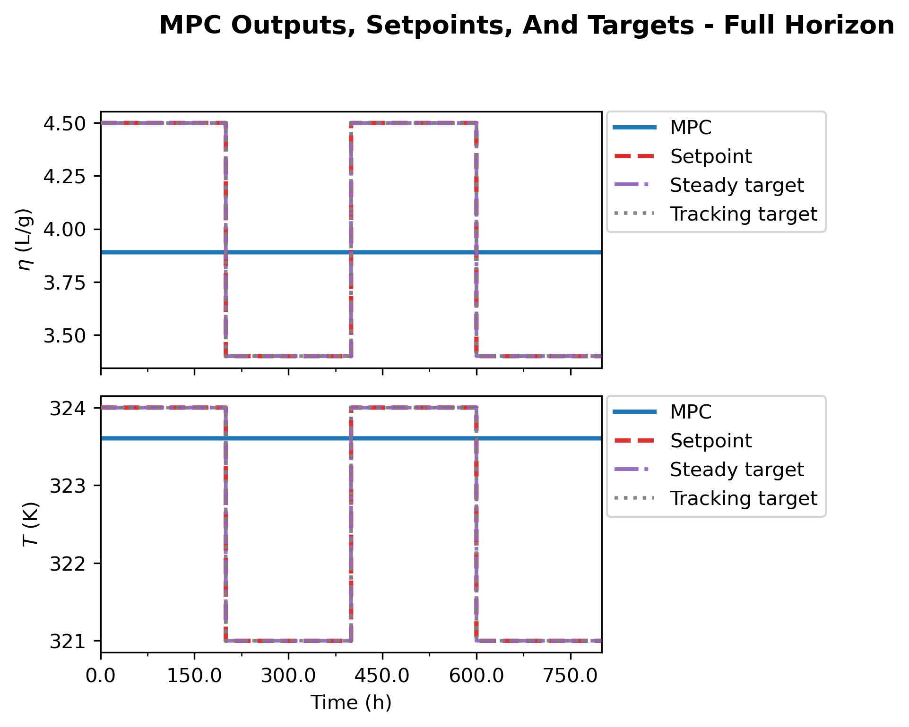
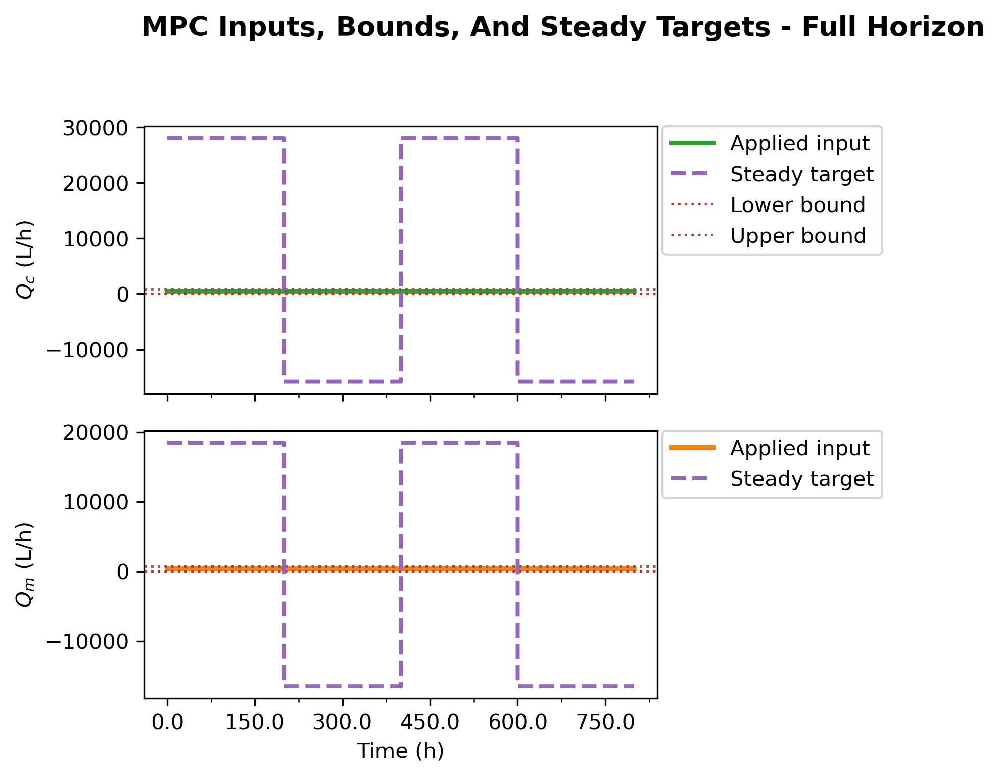
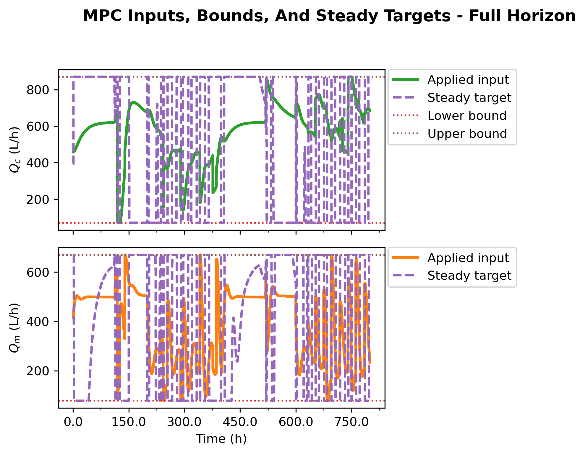
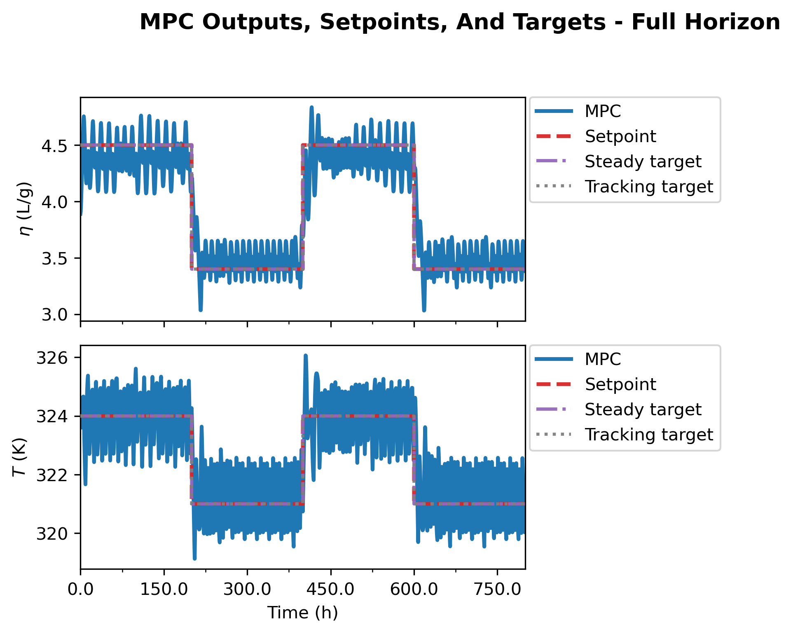
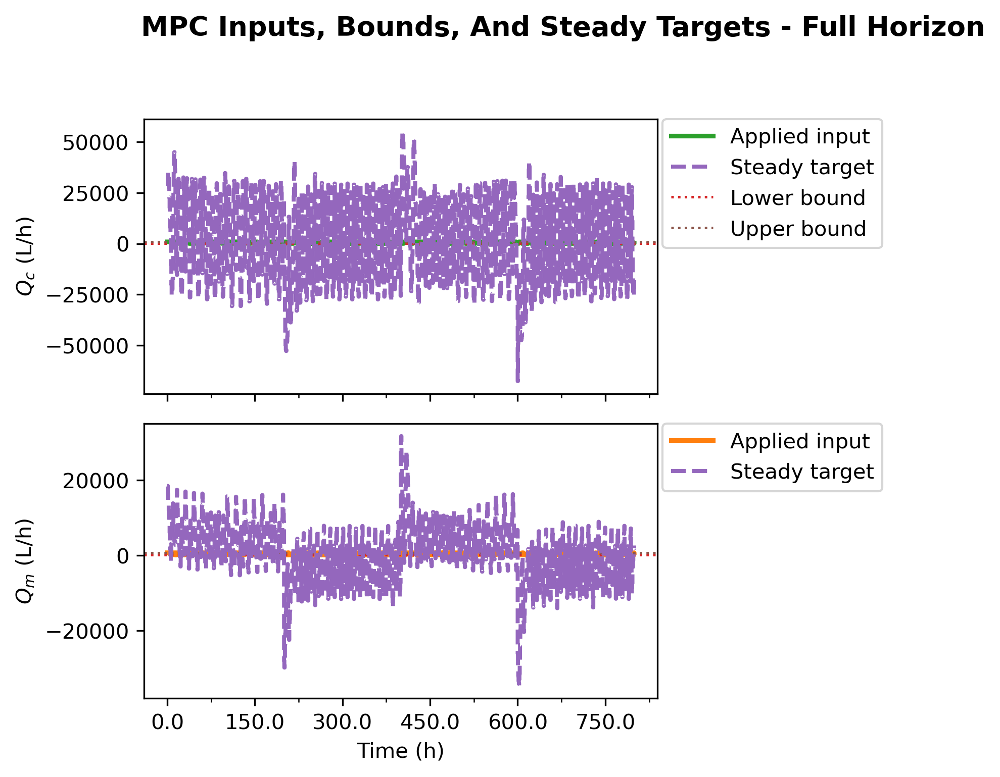
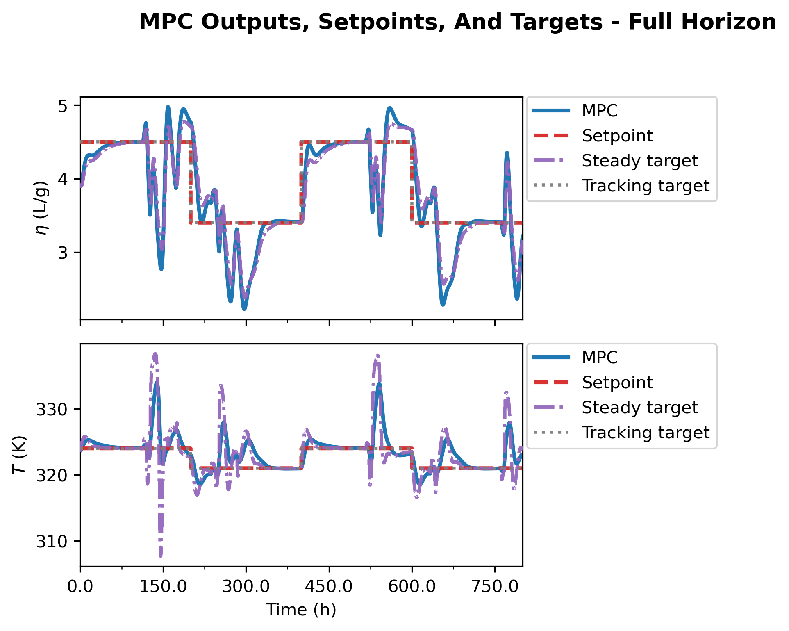
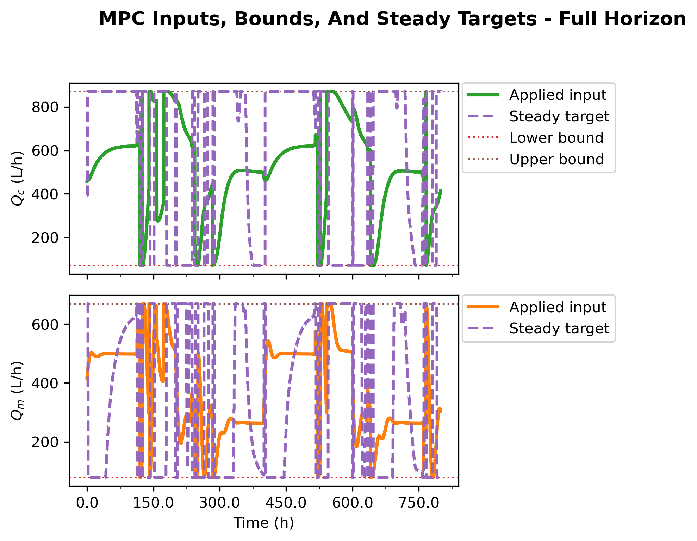

# Nominal Four-Scenario Direct Lyapunov MPC Report

This report rewrites the direct frozen-output-disturbance Lyapunov MPC study
around the latest nominal-mode export:

`Data/debug_exports/direct_lyapunov_mpc_four_scenario/20260423_221822`

The comparison summary was created at `2026-04-23T22:25:15`. The report-ready
figures were copied into:

`report/figures/direct_lyapunov_mpc_frozen_output_disturbance/`

The important change relative to the previous report is that this run uses the
nominal plant mode and the output plots are now in a consistent physical scale.
Measured outputs, scheduled setpoints, selected target outputs, and comparison
overlays are no longer mixing physical plant units with scaled-deviation target
coordinates.

## Executive Conclusion

The nominal run confirms that target admissibility is the deciding issue for the
direct Lyapunov MPC controller.

The unbounded target selector solves the steady output equations almost exactly,
so `y_s` is essentially equal to `y_sp`. That result is mathematically clean but
not operationally useful here: the associated steady input `u_s` is outside the
admissible input box for every logged step. With a hard Lyapunov constraint this
produces all-step infeasibility. With a soft Lyapunov constraint the controller
can often solve, but it does so by using large and frequent slack.

The bounded target selector gives the useful controller behavior. It accepts a
nonzero target residual when the requested setpoint is not reachable with an
admissible steady input. In exchange, the MPC has a feasible steady center. In
this nominal run, `bounded_hard` gives the best reward and strict first-step
Lyapunov contraction on every accepted solve. `bounded_soft` gives nearly the
same solve reliability while using only small, rare Lyapunov slack.

The recommended baseline pair after this run is:

| Role | Case | Reason |
| --- | --- | --- |
| Strict Lyapunov baseline | `bounded_hard` | Best reward, zero slack, contraction on all accepted solves |
| Robust fallback baseline | `bounded_soft` | Similar solve rate, tiny slack, softens only difficult steps |

The unbounded cases should remain in the study as diagnostic controls rather
than controller candidates.

## Study Setup

The notebook entrypoint is:

`DirectLyapunovMPC_FrozenOutputDisturbance.ipynb`

The current visible defaults for this study are:

| Setting | Value |
| --- | --- |
| Plant mode | `nominal` |
| Disturbance after step | `False` |
| Prediction horizon | 9 |
| Control horizon | 3 |
| `rho_lyap` | 0.98 |
| `lyap_eps` | `1e-9` |
| `slack_penalty` | `1e6` |
| Terminal cost scale | 0.0 |
| Track target output instead of setpoint | `False` |
| Steady-input objective term | `False` |
| Terminal objective term | `False` |
| Logged steps per case | 1600 |

The four cases are:

| Case | Target selector | Lyapunov constraint |
| --- | --- | --- |
| `unbounded_hard` | exact unbounded steady target | strict first-step contraction |
| `bounded_hard` | input-bounded steady target projection | strict first-step contraction |
| `unbounded_soft` | exact unbounded steady target | contraction relaxed by slack |
| `bounded_soft` | input-bounded steady target projection | contraction relaxed by slack |

All cases use the same plant, observer, setpoint schedule, horizons, cost
weights, and failure policy. Solver failures hold the previous input and are
logged as `solver_fail_hold_prev`.

## Model And Target Calculation

The direct controller uses a frozen output-disturbance model in scaled deviation
coordinates:

```math
x_{k+1}=Ax_k+Bu_k,
\qquad
y_k=Cx_k+d_k,
\qquad
d_{k+1}=d_k .
```

The online observer state is:

```math
\hat{z}_k =
\begin{bmatrix}
\hat{x}_k\\
\hat{d}_k
\end{bmatrix}.
```

At every step the target disturbance is frozen:

```math
d_s = \hat{d}_k .
```

Only `x_s` and `u_s` are selected. The exact steady equations are:

```math
(I-A)x_s-Bu_s=0,
\qquad
Cx_s = y_{\mathrm{sp},k}-\hat{d}_k .
```

Stacked into one least-squares system:

```math
\begin{bmatrix}
I-A & -B\\
C & 0
\end{bmatrix}
\begin{bmatrix}
x_s\\
u_s
\end{bmatrix}
=
\begin{bmatrix}
0\\
y_{\mathrm{sp},k}-\hat{d}_k
\end{bmatrix}.
```

The unbounded selector solves this system without input bounds. The bounded
selector enforces:

```math
u_{\min}\le u_s\le u_{\max}.
```

When the exact target is outside the input box, bounded mode returns the closest
input-admissible steady compromise. Therefore a nonzero bounded target residual
is not a failure by itself. It is the expected cost of replacing an unreachable
requested setpoint with an admissible steady target.

## Direct MPC Objective

The current direct MPC objective is the normal output-tracking objective:

```math
J_k =
\sum_{i=0}^{N_p-1}
\left(y_{i|k}-y_{\mathrm{sp},k}\right)^T
Q_y
\left(y_{i|k}-y_{\mathrm{sp},k}\right)
+
\sum_{i=0}^{N_c-1}
\Delta u_{i|k}^T
R_{\Delta u}
\Delta u_{i|k}.
```

The objective tracks the scheduled setpoint `y_sp`, not the selected steady
target output `y_s`. The steady variables `x_s`, `u_s`, and `y_s` are retained
for Lyapunov contraction and terminal admissibility, but they are not objective
anchors in this run. The extra `u-u_s` and terminal `x_N-x_s` cost terms are
disabled.

The first-step Lyapunov function is:

```math
V_k=(\hat{x}_k-x_s)^T P_x(\hat{x}_k-x_s).
```

Hard mode enforces:

```math
V_{1|k}\le \rho V_k+\epsilon_{\mathrm{lyap}}.
```

Soft mode adds one nonnegative slack:

```math
V_{1|k}\le \rho V_k+\epsilon_{\mathrm{lyap}}+\sigma_k,
\qquad
\sigma_k\ge 0,
```

and penalizes it with `slack_penalty = 1e6`.

## Nominal Run Metrics

The output RMSE values below are computed in physical output units from the
post-step plant output against the scheduled setpoint.

| Case | Mean reward | Output 0 RMSE | Output 1 RMSE | Mean output RMSE | Solver success | Hard contraction | Relaxed contraction |
| --- | ---: | ---: | ---: | ---: | ---: | ---: | ---: |
| `unbounded_hard` | -36.833 | 0.553 | 1.863 | 1.208 | 0.00% | 0.00% | 0.00% |
| `bounded_hard` | -26.442 | 0.438 | 1.854 | 1.146 | 96.75% | 96.75% | 96.75% |
| `unbounded_soft` | -98.829 | 0.198 | 0.889 | 0.543 | 97.31% | 26.62% | 97.31% |
| `bounded_soft` | -33.560 | 0.468 | 2.247 | 1.358 | 97.38% | 96.38% | 97.38% |

`unbounded_soft` has the lowest output RMSE, but it is not the best controller
interpretation. Its reward is the worst of the four cases and the Lyapunov
slack is active on most steps. This is output tracking bought with relaxation
against an inadmissible target, not clean Lyapunov tracking.

The slack and target-admissibility summary is:

| Case | Slack mean | Slack max | Slack active | Max target residual | Exact target in bounds | Bounded target used |
| --- | ---: | ---: | ---: | ---: | ---: | ---: |
| `unbounded_hard` | 0.000 | 0.000 | 0 / 1600 | `4.07e-15` | 0 / 1600 | 0 / 1600 |
| `bounded_hard` | 0.000 | 0.000 | 0 / 1600 | 15.555 | 37 / 1600 | 1563 / 1600 |
| `unbounded_soft` | 4.043 | 32.227 | 1131 / 1600 | `5.05e-15` | 0 / 1600 | 0 / 1600 |
| `bounded_soft` | 0.00242 | 0.988 | 16 / 1600 | 21.833 | 88 / 1600 | 1512 / 1600 |

The target-comparison diagnostics explain the result:

| Case | Mean `||u-u_s||_inf` | Max `||u-u_s||_inf` | Mean `||y_s-y_sp||_inf` | Max `||y_s-y_sp||_inf` | Mean `||d_s||_inf` | Lower-active steps | Upper-active steps |
| --- | ---: | ---: | ---: | ---: | ---: | ---: | ---: |
| `unbounded_hard` | 555.262 | 689.123 | `3.21e-16` | `3.66e-15` | `2.95e-09` | 0 / 1600 | 0 / 1600 |
| `bounded_hard` | 11.598 | 19.948 | 2.697 | 15.172 | 4.156 | 1179 / 1600 | 1349 / 1600 |
| `unbounded_soft` | 454.581 | 1690.670 | `6.05e-16` | `4.44e-15` | 6.927 | 0 / 1600 | 0 / 1600 |
| `bounded_soft` | 11.978 | 19.960 | 2.579 | 20.914 | 4.364 | 968 / 1600 | 1286 / 1600 |

The unbounded targets match the setpoint output almost exactly, but their
steady inputs are hundreds of input units away from the applied constrained
inputs. The bounded targets deliberately move `y_s` away from `y_sp` so that
`u_s` can remain admissible.

The first-step Lyapunov delta is the clean contraction diagnostic:

```math
\Delta V_{\mathrm{pred},k}=V_{1|k}-V_k .
```

The logged step-to-step delta,

```math
\Delta V_{\mathrm{logged},k}=V_k-V_{k-1},
```

is also informative, but it can jump when the target center `x_s(k)` changes.

| Case | First-step finite | First-step `Delta V <= 0` | First-step mean | Logged finite | Logged `Delta V <= 0` | Logged mean |
| --- | ---: | ---: | ---: | ---: | ---: | ---: |
| `unbounded_hard` | 0 | n/a | n/a | 0 | n/a | n/a |
| `bounded_hard` | 1548 | 1548 / 1548 (100.00%) | -10.588 | 1527 | 1179 / 1527 (77.21%) | -0.095 |
| `unbounded_soft` | 1557 | 523 / 1557 (33.59%) | 1.879 | 1516 | 747 / 1516 (49.27%) | -0.943 |
| `bounded_soft` | 1558 | 1558 / 1558 (100.00%) | -11.497 | 1545 | 1233 / 1545 (79.81%) | 0.007 |

Both bounded cases have negative first-step predicted Lyapunov delta on every
accepted solve. The unbounded-soft case solves often, but the first-step
Lyapunov delta is positive on most accepted solves.

## Comparison Figures


`bounded_hard` gives the least negative reward in the nominal run. The reward
ranking is the clearest practical argument for using bounded target selection
when evaluating the direct controller.


The output RMSE plot shows why RMSE cannot be read alone. `unbounded_soft`
tracks the scheduled output best, but it relies on frequent Lyapunov relaxation
and an inadmissible target.


The bounded cases recover the intended Lyapunov behavior. `bounded_hard`
satisfies hard contraction on all accepted solves. `bounded_soft` is nearly as
strong and uses slack only 16 times.


The slack plot separates the two soft cases. `unbounded_soft` uses large slack
often. `bounded_soft` has a mean slack of only `0.00242`, a maximum of `0.988`,
and only 16 active slack steps.


The target residual plot should be read together with target admissibility. The
unbounded cases have near-zero residuals but inadmissible `u_s`. The bounded
cases have nonzero residuals because they are projecting the target into the
input-admissible region.


The refreshed overlays are the most useful visual summary of the nominal run.
The outputs are plotted in physical units, and the input overlay shows the
operational consequence of the target choice.

## Case Notes

### `unbounded_hard`

| Metric | Value |
| --- | ---: |
| Solver success | 0 / 1600 |
| Solver statuses | `infeasible`: 1600 |
| Target success | 1600 / 1600 |
| Exact target in bounds | 0 / 1600 |
| Target residual max | `4.07e-15` |
| Mean `||u-u_s||_inf` | 555.262 |
| Mean `||y_s-y_sp||_inf` | `3.21e-16` |

This is the negative-control case. The target equations solve, but the target is
inadmissible at every step. The hard direct MPC cannot find an accepted
trajectory and holds the previous input throughout the run.






### `bounded_hard`

| Metric | Value |
| --- | ---: |
| Solver success | 1548 / 1600 |
| Solver statuses | `optimal`: 1545, `optimal_inaccurate`: 9, `infeasible`: 46 |
| Accepted control moves | 1548 / 1600 |
| Target success | 1600 / 1600 |
| Hard contraction | 1548 / 1600 |
| Exact target in bounds | 37 / 1600 |
| Bounded target used | 1563 / 1600 |
| Slack active | 0 / 1600 |
| Mean reward | -26.442 |

This is the best strict Lyapunov result in the nominal run. The bounded target
projection is active on nearly every step, which means the exact target is
usually outside the admissible region. Once the target is projected, hard MPC
can solve on 96.75% of the run and satisfies first-step contraction on every
accepted solve.





### `unbounded_soft`

| Metric | Value |
| --- | ---: |
| Solver success | 1557 / 1600 |
| Solver statuses | `optimal`: 899, `optimal_inaccurate`: 701 |
| Accepted control moves | 1557 / 1600 |
| Target success | 1600 / 1600 |
| Hard contraction | 426 / 1600 |
| Relaxed contraction | 1557 / 1600 |
| Exact target in bounds | 0 / 1600 |
| Slack active | 1131 / 1600 |
| Slack max | 32.227 |
| Mean reward | -98.829 |

This case is useful because it shows exactly what softening can hide. The
solver succeeds often, and output RMSE is the best of the four cases, but the
selected target is still inadmissible and hard contraction holds on only 26.62%
of logged steps. This is not the preferred controller.






### `bounded_soft`

| Metric | Value |
| --- | ---: |
| Solver success | 1558 / 1600 |
| Solver statuses | `optimal`: 1541, `optimal_inaccurate`: 55, `infeasible`: 4 |
| Accepted control moves | 1558 / 1600 |
| Target success | 1600 / 1600 |
| Hard contraction | 1542 / 1600 |
| Relaxed contraction | 1558 / 1600 |
| Exact target in bounds | 88 / 1600 |
| Bounded target used | 1512 / 1600 |
| Slack active | 16 / 1600 |
| Slack max | 0.988 |
| Mean reward | -33.560 |

This is the robust fallback case. It does not beat `bounded_hard` on reward, but
it keeps the same target-admissibility logic and only relaxes the Lyapunov
constraint on 16 steps. Its first-step predicted Lyapunov delta is nonpositive
on every accepted solve.






## Interpretation

The nominal run supports three conclusions.

First, exact output target matching is not enough. In the unbounded cases,
`||y_s-y_sp||_inf` is essentially zero, but `u_s` is far outside the feasible
input region. That is why `unbounded_hard` is completely infeasible and why
`unbounded_soft` needs frequent slack.

Second, the bounded target projection is doing real control work. Its residual
is not a defect; it is the evidence that the selector is replacing an
unreachable setpoint with an admissible steady target. The payoff is that the
bounded cases satisfy first-step Lyapunov decrease on every accepted solve.

Third, hard and soft Lyapunov modes have different roles. `bounded_hard` should
be reported as the strict controller because it has the best nominal reward and
zero slack. `bounded_soft` should be reported as the robustness controller
because it preserves almost all of the hard behavior while reducing sensitivity
to hard infeasibility.

## Literature Context

The frozen output-disturbance target calculation follows the offset-free MPC
idea of augmenting the model with a persistent disturbance and computing a
steady target compatible with the current disturbance estimate. Relevant
references are Muske and Badgwell, "Disturbance modeling for offset-free linear
model predictive control," Journal of Process Control, 2002, DOI:
[10.1016/S0959-1524(01)00051-8](https://doi.org/10.1016/S0959-1524(01)00051-8),
and Pannocchia and Rawlings, "Disturbance models for offset-free
model-predictive control," AIChE Journal, 2003, DOI:
[10.1002/aic.690490213](https://doi.org/10.1002/aic.690490213).

The use of terminal ingredients and constrained receding-horizon stability
conditions follows the standard constrained MPC framework in Mayne, Rawlings,
Rao, and Scokaert, "Constrained model predictive control: Stability and
optimality," Automatica, 2000, DOI:
[10.1016/S0005-1098(99)00214-9](https://doi.org/10.1016/S0005-1098(99)00214-9).

The bounded target projection is aligned with admissible artificial-reference
tracking MPC, especially Limon, Alvarado, Alamo, and Camacho, "MPC for tracking
piecewise constant references for constrained linear systems," Automatica,
2008, DOI:
[10.1016/j.automatica.2008.01.023](https://doi.org/10.1016/j.automatica.2008.01.023).

The hard and soft Lyapunov interpretations connect to Lyapunov-based predictive
control for constrained process systems; see Mhaskar, El-Farra, and Christofides,
"Stabilization of nonlinear systems with state and control constraints using
Lyapunov-based predictive control," Systems & Control Letters, 2006, DOI:
[10.1016/j.sysconle.2005.09.014](https://doi.org/10.1016/j.sysconle.2005.09.014).

## Recommended Next Steps

1. Treat `bounded_hard` as the nominal strict Lyapunov baseline.
2. Treat `bounded_soft` as the robust fallback baseline.
3. Keep `unbounded_hard` and `unbounded_soft` as diagnostic controls only.
4. Tune `bounded_soft` next, starting with `rho_lyap` and slack penalty, to see
   whether the reward gap to `bounded_hard` can be reduced while keeping the
   high solve rate.
5. Add a normal offset-free MPC baseline with the same bounded target selector
   and no Lyapunov contraction, so the marginal value of the Lyapunov constraint
   is measured directly.
6. Repeat the nominal four-scenario run across multiple schedules or seeds
   before making final supervisor-level claims.

## Final Takeaway

The nominal run gives a coherent result now that the plots are in the proper
scale. The direct Lyapunov MPC does not fail because the frozen
output-disturbance target equations are wrong. It fails when the exact target is
not input-admissible. Bounded target projection fixes that core issue. With the
bounded target, hard Lyapunov contraction gives the best nominal performance,
and soft Lyapunov contraction provides a controlled fallback with very little
slack.
