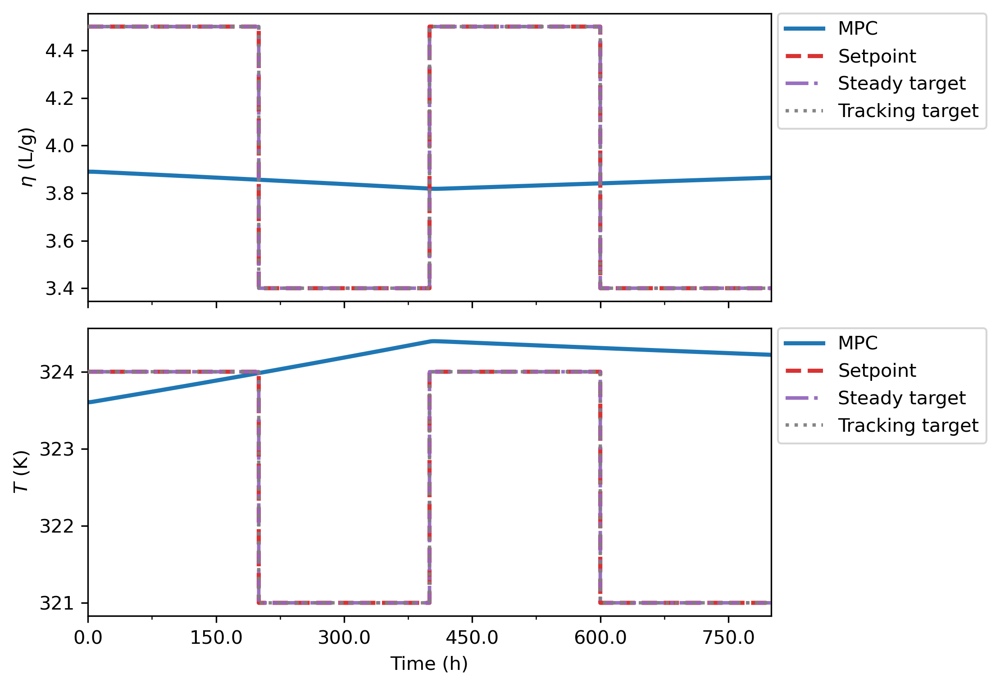
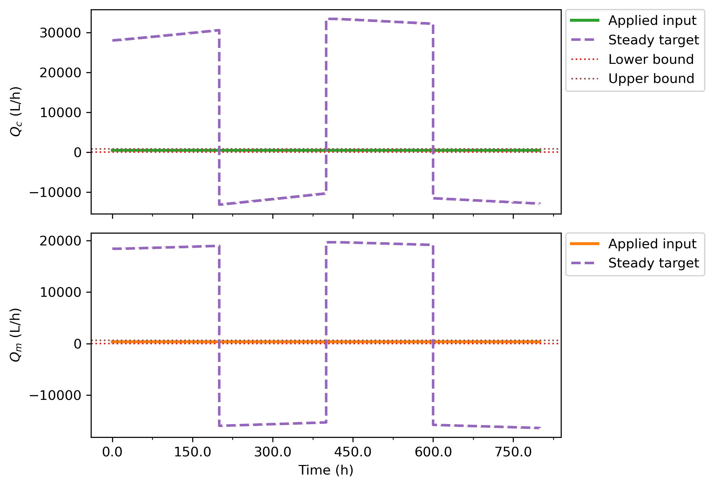
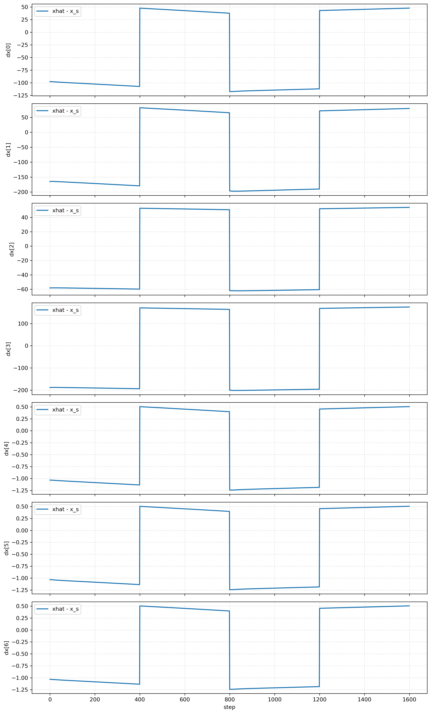
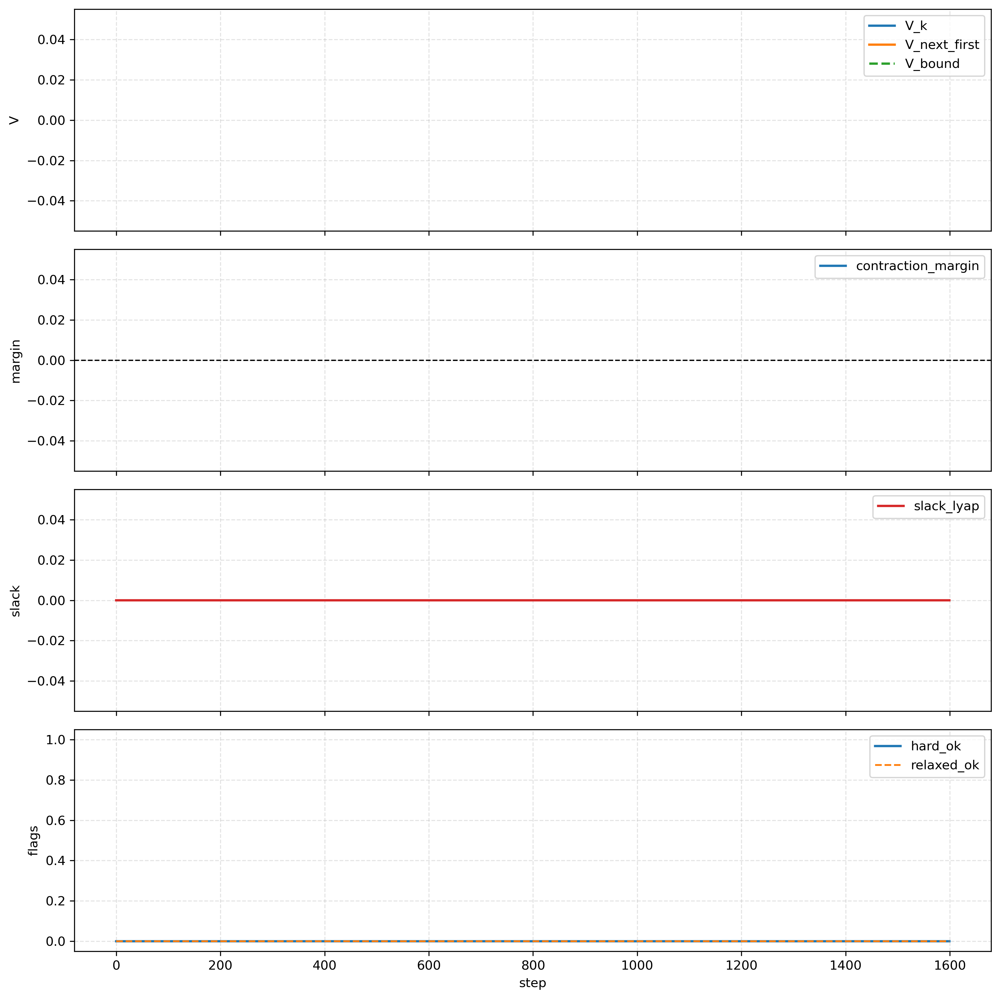

# Direct Lyapunov MPC With Frozen Output Disturbance

## Executive Summary

`DirectLyapunovMPC_FrozenOutputDisturbance.ipynb` is the clean experiment entrypoint for a direct Lyapunov MPC controller. It replaces the older candidate-and-filter workflow with one online controller solve:

1. estimate the augmented observer state,
2. freeze the output disturbance estimate,
3. solve a steady target,
4. solve a Lyapunov-constrained tracking MPC problem around that target,
5. export the target, solver, contraction, and plotting diagnostics.

The notebook has now been rewritten as a four-scenario study runner. It executes and saves:

- `unbounded_hard`
- `bounded_hard`
- `unbounded_soft`
- `bounded_soft`

Success in this study means all four cases complete, save their bundles, and report their behavior honestly. A hard-mode infeasible result is therefore a valid diagnostic outcome, not a failed notebook. The first earlier saved run remains useful context: with `target_mode="unbounded"` and `lyapunov_mode="hard"`, the frozen target solve succeeded exactly, but the target was outside the admissible input box at every step, making the hard direct MPC infeasible for all 1600 logged steps.

## Why This Exists

The strongest Lyapunov-related behavior so far appears to come from `LyapunovSafetyFilterMPCTargetSelectorTermAblation.ipynb`. That notebook studies the richer Step A target selector with five objective terms:

```math
\|r_s-y_{\mathrm{sp}}\|_{Q_r}^2
+\|u_s-u_{\mathrm{applied},k}\|_{R_{u,\mathrm{ref}}}^2
+\|u_s-u_{s,\mathrm{prev}}\|_{R_{\Delta u,\mathrm{sel}}}^2
+\|x_s-x_{s,\mathrm{prev}}\|_{Q_{\Delta x}}^2
+\|x_s-\hat{x}_k\|_{Q_{x,\mathrm{ref}}}^2 .
```

Those terms help in practice, but they also make interpretation harder. The direct frozen-output-disturbance path asks a simpler question:

Can we freeze the output disturbance, compute a physically meaningful steady target, and make one direct Lyapunov MPC solve work without a separate upstream candidate or a heavily regularized selector objective?

The prior `unbounded + hard` run says: not yet in that mode. It also tells us exactly why: the unbounded steady target is not admissible.

## Model And Coordinates

The controller model is an output-disturbance augmentation in scaled deviation coordinates:

```math
x_{k+1}=Ax_k+Bu_k,\qquad y_k=Cx_k+d_k,\qquad d_{k+1}=d_k .
```

The observer state is

```math
\hat{z}_k =
\begin{bmatrix}
\hat{x}_k\\
\hat{d}_k
\end{bmatrix}.
```

The direct target solver assumes no disturbance-to-state dynamics. In code, `Lyapunov/frozen_output_disturbance_target.py` rejects models with a nonzero `A_xd` block so the target math stays aligned with the clean output-disturbance model.

## Frozen Output-Disturbance Target

At each online step, the target disturbance is fixed:

```math
d_s=\hat{d}_k .
```

Only `x_s` and `u_s` are solved. The unbounded steady equations are

```math
(I-A)x_s-Bu_s=0,\qquad Cx_s=y_{\mathrm{sp},k}-\hat{d}_k .
```

Stacked:

```math
\begin{bmatrix}
I-A & -B\\
C & 0
\end{bmatrix}
\begin{bmatrix}
x_s\\
u_s
\end{bmatrix}
=
\begin{bmatrix}
0\\
y_{\mathrm{sp},k}-\hat{d}_k
\end{bmatrix}.
```

When `I-A` is invertible, the reduced form is

```math
G u_s = y_{\mathrm{sp},k}-\hat{d}_k,\qquad
G=C(I-A)^{-1}B .
```

Bounded target mode keeps the same physics but enforces

```math
u_{\min}\le u_s\le u_{\max}.
```

If the exact steady target is outside the input box, the bounded target solver finds the closest admissible steady compromise by minimizing dynamic and output residuals.

## Direct Lyapunov MPC

The direct MPC freezes the disturbance over the prediction horizon:

```math
x_{i+1|k}=Ax_{i|k}+Bu_{i|k},\qquad
y_{i|k}=Cx_{i|k}+\hat{d}_k,\qquad
x_{0|k}=\hat{x}_k .
```

The tracking objective is

```math
J_k =
\sum_{i=0}^{N_p-1}\|y_{i|k}-y_k^{\mathrm{track}}\|_Q^2
+\sum_{i=0}^{N_c-1}\|u_{i|k}-u_s\|_S^2
+\sum_{i=0}^{N_c-1}\|\Delta u_{i|k}\|_R^2
+\|x_{N_p|k}-x_s\|_{P_x}^2 .
```

The saved run used the raw scheduled setpoint as `y_track`, not the target output `y_s`.

The Lyapunov function is

```math
V_k=(\hat{x}_k-x_s)^T P_x(\hat{x}_k-x_s).
```

Hard mode enforces

```math
(x_{1|k}-x_s)^T P_x(x_{1|k}-x_s)
\le \rho V_k+\varepsilon_{\mathrm{lyap}} .
```

Soft mode relaxes that inequality with one nonnegative slack:

```math
(x_{1|k}-x_s)^T P_x(x_{1|k}-x_s)
\le \rho V_k+\varepsilon_{\mathrm{lyap}}+\sigma_k,\qquad
\sigma_k\ge 0,
```

and penalizes it as

```math
J_k^{\mathrm{soft}}=J_k+\lambda_\sigma\sigma_k .
```

## Implementation Map

- `DirectLyapunovMPC_FrozenOutputDisturbance.ipynb`: four-scenario study runner with visible experiment switches, per-case exports, comparison tables, and comparison plots.
- `Lyapunov/frozen_output_disturbance_target.py`: unbounded and bounded frozen-output-disturbance target solvers.
- `Lyapunov/direct_lyapunov_mpc.py`: direct solver, rollout, bundle, summary, per-case export, comparison-record, comparison-table, and comparison-plot helpers.
- `Lyapunov/lyapunov_core.py`: terminal ingredients and Lyapunov diagnostics.
- `Plotting_fns/mpc_plot_fns.py`: shared CSTR output/input figures reused by the direct exporter.

## Four-Scenario Study Workflow

The current notebook runs the fixed scenario matrix:

| Case | Target mode | Lyapunov mode | Meaning |
| --- | --- | --- | --- |
| `unbounded_hard` | `unbounded` | `hard` | Exact target, no Lyapunov slack |
| `bounded_hard` | `bounded` | `hard` | Admissible target projection, no Lyapunov slack |
| `unbounded_soft` | `unbounded` | `soft` | Exact target with Lyapunov slack |
| `bounded_soft` | `bounded` | `soft` | Admissible target projection with Lyapunov slack |

All four cases share the same plant, disturbance schedule, setpoint schedule, horizons, weights, and failure policy. The defaults intentionally keep:

- `use_target_output_for_tracking=False`
- `use_target_on_solver_fail=False`

Therefore solver failures hold the previous input and are logged through the `method_counts` and `solver_status_counts` fields. The comparison artifacts saved at the timestamped study root are:

- `comparison_table.csv`
- `comparison_table.pkl`
- `comparison_summary.json`
- `comparison_plots/comparison_reward_mean.png`
- `comparison_plots/comparison_output_rmse.png`
- `comparison_plots/comparison_solver_contraction_rates.png`
- `comparison_plots/comparison_slack.png`
- `comparison_plots/comparison_target_residual_bounded_activity.png`
- `comparison_plots/comparison_outputs_overlay.png`
- `comparison_plots/comparison_inputs_overlay.png`

Each case folder also saves `bundle.pkl`, `summary.json`, `summary.csv`, `step_table.csv`, `step_table.pkl`, `arrays.npz`, `plots/`, and `paper_plots/` when plotting is enabled.

## Prior Diagnostic Run

Source artifact:

`Data/debug_exports/direct_lyapunov_mpc_unbounded_hard/20260423_181204`

The figures used below were copied into:

`report/figures/direct_lyapunov_mpc_frozen_output_disturbance/`

### Run Configuration

| Quantity | Value |
| --- | --- |
| Target mode | `unbounded` |
| Lyapunov mode | `hard` |
| Prediction horizon | 9 |
| Control horizon | 3 |
| `rho_lyap` | 0.98 |
| `lyap_eps` | `1e-9` |
| `slack_penalty` | `1e6` |
| Tests | 2 |
| Setpoint segment length | 400 |
| Total logged steps | 1600 |
| Terminal set | enabled |
| Tracking target policy | raw setpoint, not `y_s` |

### Summary Metrics

| Metric | Value |
| --- | ---: |
| Mean reward | -40.1350 |
| Reward sum | -64216.0708 |
| Target success rate | 1.0 |
| Solver success rate | 0.0 |
| Hard contraction success rate | 0.0 |
| Relaxed contraction success rate | 0.0 |
| Maximum target residual norm | `4.58e-15` |
| Maximum target matrix condition number | 1205.83 |
| Bounded target solution used | 0 steps |
| Exact target within input bounds | 0 / 1600 steps |
| Solver method count | `solver_fail_hold_prev`: 1600 |
| Solver status count | `infeasible`: 1600 |

The target solve is exact, but the target is inadmissible. The step table records `target_exact_within_bounds=False` for every step. For 800 steps both input-target components are beyond the upper side of the box, and for 800 steps both are beyond the lower side. That is the central finding.

### Figures



The outputs reflect a held-input response because every direct hard MPC solve is infeasible.



The inputs show the previous move being held rather than a successful direct MPC policy.



The persistent target error is consistent with an exact but inadmissible unbounded steady target.



Contraction traces are not populated with successful values because the hard MPC problem never returns an accepted trajectory.


The target residual is near zero, but the target is still not suitable for the constrained controller because it violates the input admissibility check.

## Connection To The Ablation Notebook

The ablation path performed better because its target selector included practical guardrails:

- output target tracking keeps `y_s` near the scheduled setpoint,
- applied-input anchoring keeps `u_s` near the current operating region,
- previous-input smoothing suppresses target-input jumps,
- previous-state smoothing suppresses target-state jumps,
- the weak `xhat` anchor nudges the target toward the current estimated operating point.

The direct path intentionally removes these terms to clarify the mathematics. The prior saved run shows that a pure unbounded exact target can be too clean mathematically and too aggressive physically.

The next direct design should not immediately copy the whole five-term selector. A cleaner sequence is:

1. enforce admissibility with bounded target mode,
2. use soft Lyapunov mode to measure contraction pressure,
3. add at most one or two regularizers only if the bounded target is still too discontinuous or too far from the current operating region.

The most likely minimal regularizers, if needed, are the applied-input anchor and previous-target smoothing. Those preserve most of the interpretability of the direct path while borrowing the strongest lesson from the ablation study.

## Literature Context

Offset-free MPC commonly uses integrating disturbance models plus a steady-state target calculation. Muske and Badgwell describe disturbance modeling and target calculation for offset-free linear MPC, while Pannocchia and Rawlings give general zero-offset conditions for disturbance-augmented MPC.

The direct path's terminal set, terminal cost, and receding-horizon structure follow the standard constrained MPC stability logic summarized by Mayne, Rawlings, Rao, and Scokaert.

The prior run's failure mode is close to a tracking-MPC target admissibility issue. Limon, Alvarado, Alamo, and Camacho show why constrained tracking MPC benefits from artificial steady states and from steering toward the closest admissible target when the requested one cannot be reached.

The Lyapunov inequality in the direct solver is in the spirit of Lyapunov MPC for process systems. Mhaskar, El-Farra, and Christofides develop Lyapunov-based predictive control for nonlinear systems with state and input constraints, including hard and soft constraint interpretations.

The older safety-filter workflow is closer to predictive safety filtering. Wabersich and Zeilinger formulate a predictive safety filter that modifies learning-controller inputs only when needed for safety. The direct path here is different: it is a standalone controller, not a wrapper around an upstream MPC or RL action.

## Recommended Next Stage

Run the rewritten notebook in the scientific Python environment and use the generated comparison table as the next decision point. The default matrix is already:

```python
scenario_matrix = [
    {"case_name": "unbounded_hard", "target_mode": "unbounded", "lyapunov_mode": "hard"},
    {"case_name": "bounded_hard", "target_mode": "bounded", "lyapunov_mode": "hard"},
    {"case_name": "unbounded_soft", "target_mode": "unbounded", "lyapunov_mode": "soft"},
    {"case_name": "bounded_soft", "target_mode": "bounded", "lyapunov_mode": "soft"},
]
```

The first case to inspect closely is:

```python
target_mode = "bounded"
lyapunov_mode = "soft"
```

because it answers whether target admissibility plus one Lyapunov slack is enough to recover feasible direct MPC behavior. Track these metrics:

- solver success rate,
- target success rate,
- target residual and active input-bound counts,
- hard contraction rate,
- soft slack mean, max, and active-step count,
- output RMSE in physical units,
- whether `use_target_output_for_tracking=True` improves feasibility or tracking.

If bounded-soft succeeds but needs large slack, tune in this order:

1. relax `rho_lyap` slightly, for example from `0.98` toward `0.995`,
2. increase horizon or reduce terminal aggressiveness,
3. test `use_target_output_for_tracking=True`,
4. add a minimal applied-input anchor or previous-target smoother.

## References

- D. Q. Mayne, J. B. Rawlings, C. V. Rao, and P. O. M. Scokaert, "Constrained model predictive control: Stability and optimality," *Automatica*, 2000. https://doi.org/10.1016/S0005-1098(99)00214-9
- K. R. Muske and T. A. Badgwell, "Disturbance modeling for offset-free linear model predictive control," *Journal of Process Control*, 2002. https://doi.org/10.1016/S0959-1524(01)00051-8
- G. Pannocchia and J. B. Rawlings, "Disturbance models for offset-free model-predictive control," *AIChE Journal*, 2003. https://doi.org/10.1002/aic.690490213
- D. Limon, I. Alvarado, T. Alamo, and E. F. Camacho, "MPC for tracking piecewise constant references for constrained linear systems," *Automatica*, 2008. https://doi.org/10.1016/j.automatica.2008.01.023
- P. Mhaskar, N. H. El-Farra, and P. D. Christofides, "Stabilization of nonlinear systems with state and control constraints using Lyapunov-based predictive control," *Systems & Control Letters*, 2006. https://doi.org/10.1016/j.sysconle.2005.09.014
- K. P. Wabersich and M. N. Zeilinger, "A predictive safety filter for learning-based control of constrained nonlinear dynamical systems," *Automatica*, 2021. https://doi.org/10.1016/j.automatica.2021.109597
