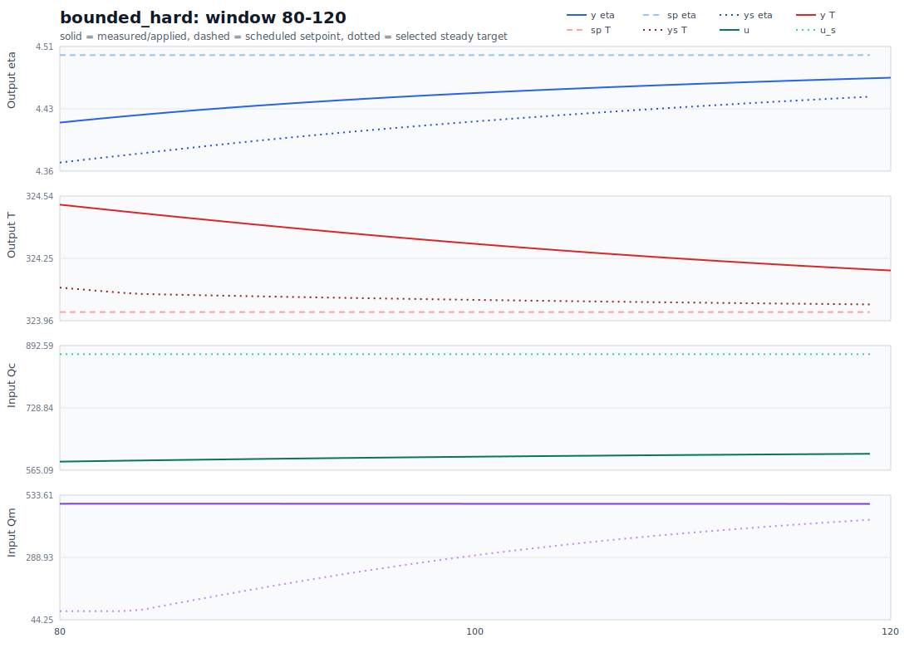
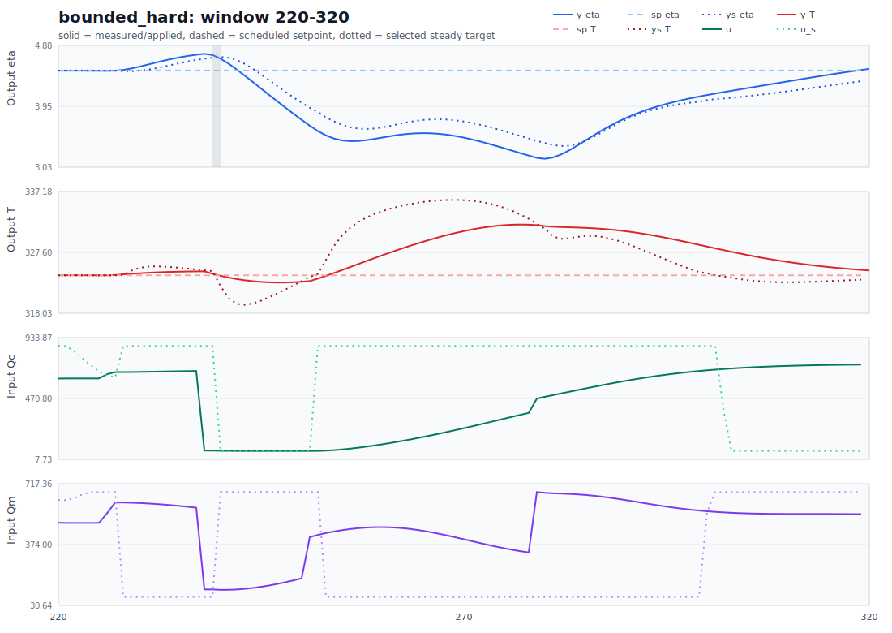
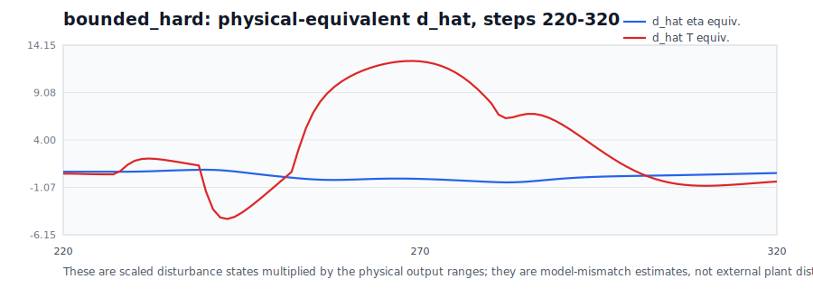
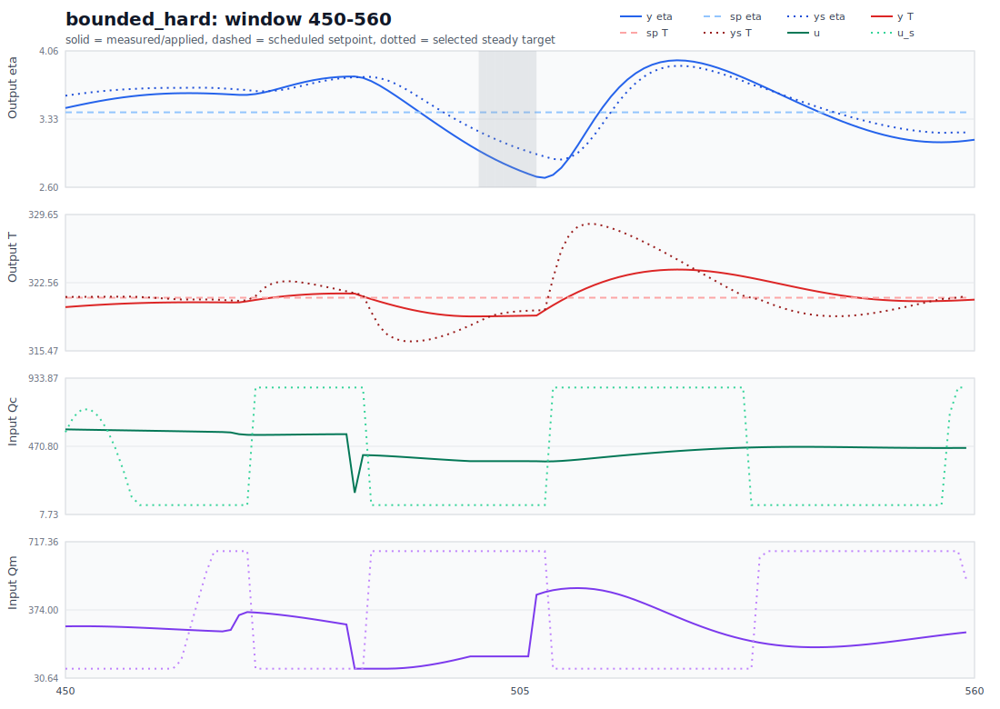
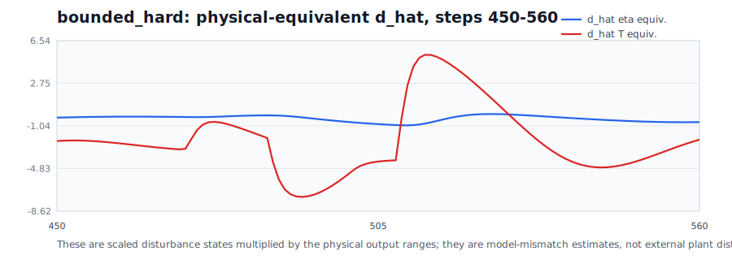
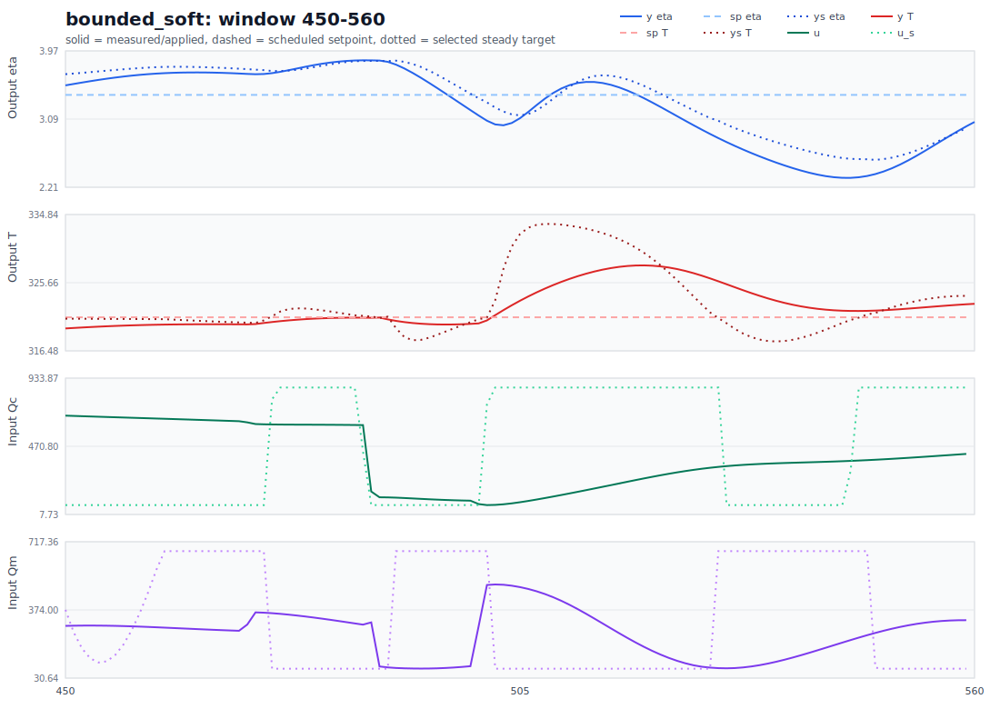
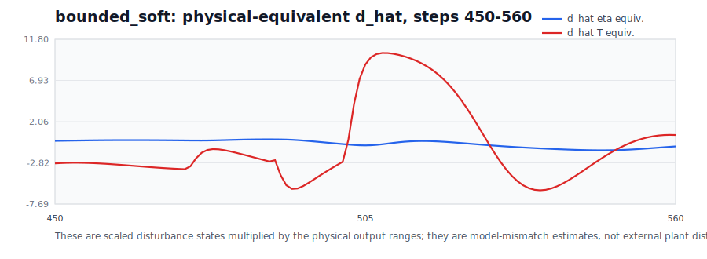

# Nominal Bounded-Mode Oscillation Analysis

This report analyzes the unexpected oscillations in the nominal direct
Lyapunov MPC run, with emphasis on the `bounded_hard` and `bounded_soft` cases.
It uses the latest nominal export:

`Data/debug_exports/direct_lyapunov_mpc_four_scenario/20260423_221822`

The short answer is:

The plant is nominal, but the target seen by the Lyapunov controller is not
steady. In bounded mode, the selected steady target is recomputed from the
observer disturbance estimate `d_hat` at every step. During nonlinear
transients, the output-disturbance observer treats model mismatch as an output
disturbance. That makes `d_hat` move even with no external disturbance. The
bounded least-squares target then jumps between different input-bound active
sets, often between opposite input corners. The MPC objective still tracks the
scheduled setpoint, while the Lyapunov constraint is centered on the moving
`x_s`. Those two pulls can create oscillatory behavior even in nominal mode.

I did not find evidence that the oscillation is caused by the corrected plotting
scale. The refreshed output plots are in physical units. I also did not find a
simple sign or scaling bug in the direct target equation. The behavior is
consistent with a controller-design mismatch: a fast frozen-disturbance target
selector with no smoothing or hysteresis is feeding a Lyapunov constraint whose
center can move sharply.

## Key Evidence

The bounded target projection solves a problem of the form:

```math
u_s(k)
=
\arg\min_{u_{\min}\le u\le u_{\max}}
\left\|G u - \left(y_{\mathrm{sp}}(k)-\hat d_k\right)\right\|_2^2,
\qquad
x_s(k)=(I-A)^{-1}B u_s(k),
```

where

```math
G=C(I-A)^{-1}B.
```

The direct MPC objective in the current run is:

```math
\sum_i
\left\|y_{i|k}-y_{\mathrm{sp}}(k)\right\|_{Q_y}^2
+
\sum_i
\left\|\Delta u_{i|k}\right\|_{R_{\Delta u}}^2 .
```

But the Lyapunov constraint is centered at the selected steady state:

```math
(x_{1|k}-x_s(k))^T P_x (x_{1|k}-x_s(k))
\le
\rho
(\hat x_k-x_s(k))^T P_x(\hat x_k-x_s(k))
+\epsilon .
```

So when bounded projection moves `x_s(k)` and `u_s(k)`, the optimizer is asked
to track one thing in the output objective and contract toward another thing in
the Lyapunov constraint. This is manageable when `x_s` moves slowly. It becomes
oscillatory when `x_s` jumps between bound-active regimes.

## Window Summary

The suspicious behavior is not strongest near step 100. In both bounded cases,
the `80-120` window is mostly smooth. The bigger events occur later, especially
near steps `220-320` and `450-560`, while the scheduled setpoint is flat inside
each segment.

| Case | Window | eta range | T range | `y_s` eta range | `y_s` T range | `u_s` Qc range | `u_s` Qm range | `u_s` corner toggles | corners | solver fails | slack active |
| --- | --- | ---: | ---: | ---: | ---: | ---: | ---: | ---: | --- | ---: | ---: |
| `bounded_hard` | 80-120 | 0.056 | 0.306 | 0.082 | 0.078 | 0.000 | 359.007 | 1 | `UI UL` | 0 | 0 |
| `bounded_hard` | 220-320 | 1.600 | 9.125 | 1.358 | 16.506 | 798.400 | 592.000 | 10 | `II IU LU UI UL UU` | 1 | 0 |
| `bounded_hard` | 450-560 | 1.258 | 4.873 | 1.003 | 12.224 | 798.400 | 592.000 | 12 | `IL IU LI LL LU UI UL UU` | 7 | 0 |
| `bounded_hard` | 580-700 | 1.756 | 6.597 | 1.427 | 14.292 | 798.400 | 592.000 | 13 | `IU LU UI UL UU` | 6 | 0 |
| `bounded_soft` | 80-120 | 0.056 | 0.306 | 0.082 | 0.078 | 0.000 | 359.007 | 1 | `UI UL` | 0 | 0 |
| `bounded_soft` | 220-320 | 2.208 | 12.317 | 1.666 | 30.707 | 798.400 | 592.000 | 8 | `II IU LU UI UL UU` | 0 | 5 |
| `bounded_soft` | 450-560 | 1.520 | 8.494 | 1.283 | 15.831 | 798.400 | 592.000 | 14 | `IL IU LI LL LU UI UL UU` | 0 | 0 |
| `bounded_soft` | 580-700 | 1.188 | 4.312 | 0.987 | 5.678 | 135.983 | 592.000 | 4 | `IU UI UL UU` | 0 | 0 |

Here `L` means the input target is on its lower bound, `U` means upper bound,
and `I` means interior. For example, `LU` means `Qc_s=Qc_min` and
`Qm_s=Qm_max`. The important quantity is the corner toggles: the target is not
sitting at one admissible steady point after the output looks settled.

The full table is saved at:

`report/figures/direct_lyapunov_nominal_oscillation_analysis/window_summary.csv`

## Figures: The Bounded Target Moves While The Setpoint Is Flat

### Bounded Hard Around Step 100



There is no major unexplained oscillation in this window. The scheduled setpoint
is flat at `[4.5, 324]`, the measured output is settling, and `y_s` is close to
the setpoint. The target input is already touching bounds, but it is not yet
flipping violently.

### Bounded Hard Around The First Constant-Setpoint Oscillation





The setpoint is still `[4.5, 324]`, yet the selected target output `y_s` and
input target `u_s` move substantially. The physical-equivalent disturbance
estimate also swings. This is the first strong sign that the observer-target
loop is moving the artificial steady target, not that the scheduled setpoint or
the nominal plant changed.

### Bounded Hard Around Step 500





The step-500 event is easier to diagnose. The target is on the `LU` corner for
many steps, then after a hard infeasibility/hold segment it flips to `UL`.
That is a command to move toward the opposite side of the admissible steady
input box.

Selected rows:

| step | y eta | y T | `y_s` eta | `y_s` T | u Qc | u Qm | `u_s` Qc | `u_s` Qm | corner | status |
| ---: | ---: | ---: | ---: | ---: | ---: | ---: | ---: | ---: | --- | --- |
| 488 | 3.687 | 320.600 | 3.766 | 317.990 | 407.7 | 78.0 | 71.6 | 670.0 | `LU` | `optimal` |
| 490 | 3.576 | 320.129 | 3.704 | 316.683 | 401.4 | 79.1 | 71.6 | 670.0 | `LU` | `optimal` |
| 500 | 2.990 | 319.058 | 3.196 | 318.522 | 369.8 | 140.0 | 71.6 | 670.0 | `LU` | `infeasible` |
| 501 | 2.941 | 319.065 | 3.154 | 318.932 | 369.8 | 140.0 | 71.6 | 670.0 | `LU` | `infeasible` |
| 502 | 2.895 | 319.076 | 3.114 | 319.221 | 369.8 | 140.0 | 71.6 | 670.0 | `LU` | `infeasible` |
| 509 | 2.731 | 320.218 | 2.900 | 323.025 | 368.8 | 473.4 | 870.0 | 78.0 | `UL` | `optimal` |
| 510 | 2.806 | 320.708 | 2.895 | 325.937 | 371.5 | 479.6 | 870.0 | 78.0 | `UL` | `optimal` |

This explains the visual oscillation. The hard controller first holds input
because the strict problem is infeasible, then the selected steady target jumps
from one input corner to the opposite corner. The plant response is not
mysterious after that.

### Bounded Soft Around Step 500





Soft mode avoids the hard infeasibility at this event, but it does not remove
the moving-target mechanism. Around step 501-502 the selected target moves from
`LU` to an interior/upper corner and then to `UL`. The selected target
temperature rises far above the scheduled setpoint.

Selected rows:

| step | y eta | y T | `y_s` eta | `y_s` T | u Qc | u Qm | `u_s` Qc | `u_s` Qm | corner | status |
| ---: | ---: | ---: | ---: | ---: | ---: | ---: | ---: | ---: | --- | --- |
| 488 | 3.844 | 320.965 | 3.840 | 320.926 | 124.5 | 89.2 | 71.6 | 78.0 | `LL` | `optimal` |
| 490 | 3.791 | 320.513 | 3.843 | 319.527 | 122.0 | 81.6 | 71.6 | 670.0 | `LU` | `optimal` |
| 500 | 3.133 | 320.176 | 3.356 | 320.734 | 78.4 | 293.1 | 71.6 | 670.0 | `LU` | `optimal` |
| 501 | 3.066 | 320.578 | 3.304 | 320.957 | 71.6 | 499.6 | 755.2 | 670.0 | `IU` | `optimal_inaccurate` |
| 502 | 3.018 | 321.286 | 3.236 | 323.300 | 72.9 | 502.2 | 870.0 | 78.0 | `UL` | `optimal` |
| 503 | 3.007 | 321.967 | 3.185 | 327.541 | 76.9 | 500.8 | 870.0 | 78.0 | `UL` | `optimal` |
| 505 | 3.099 | 323.228 | 3.135 | 332.209 | 90.9 | 488.9 | 870.0 | 78.0 | `UL` | `optimal` |
| 510 | 3.483 | 325.770 | 3.433 | 333.479 | 140.1 | 419.9 | 870.0 | 78.0 | `UL` | `optimal` |

This is even clearer than hard mode: the problem solves, but the target center
has moved to a very hot artificial steady target while the scheduled setpoint is
still `[3.4, 321]`.

## Why Nominal Mode Still Has A Moving Disturbance Estimate

Nominal mode means the plant parameters are not intentionally disturbed. It does
not mean the linear predictor is exact for every large nonlinear transient.

The observer update in the direct run is a predictor-form output-disturbance
observer:

```math
\hat z_{k+1}
=
A_{\mathrm{aug}}\hat z_k
+B_{\mathrm{aug}}u_k
+L\left(y_k^{\mathrm{scaled}}-C_{\mathrm{aug}}\hat z_k\right).
```

For an output-disturbance augmentation,

```math
\hat z_k =
\begin{bmatrix}
\hat x_k\\
\hat d_k
\end{bmatrix},
\qquad
\hat d_{k+1}
=
\hat d_k
+L_d
\left(y_k^{\mathrm{scaled}}-C_{\mathrm{aug}}\hat z_k\right).
```

So `d_hat` is an output-model-mismatch state. It is not a physical proof that
the plant has an external disturbance. If the nonlinear plant output and the
linear prediction disagree during a transient, the observer can assign that
error to `d_hat`.

The table below reports the physical-equivalent disturbance estimate, computed
by multiplying the scaled disturbance state by each output's physical range.

| Case | step | `d_hat` eta equiv. | `d_hat` T equiv. |
| --- | ---: | ---: | ---: |
| `bounded_hard` | 100 | 0.526 | 0.576 |
| `bounded_hard` | 220 | 0.601 | 0.395 |
| `bounded_hard` | 260 | -0.253 | 10.723 |
| `bounded_hard` | 300 | 0.152 | 0.731 |
| `bounded_hard` | 490 | -0.189 | -7.126 |
| `bounded_hard` | 500 | -0.697 | -5.287 |
| `bounded_hard` | 510 | -0.992 | 2.539 |
| `bounded_hard` | 600 | -0.719 | 8.963 |
| `bounded_soft` | 100 | 0.526 | 0.576 |
| `bounded_soft` | 260 | 0.069 | 12.981 |
| `bounded_soft` | 300 | -0.762 | -3.126 |
| `bounded_soft` | 490 | -0.050 | -4.282 |
| `bounded_soft` | 500 | -0.537 | -3.075 |
| `bounded_soft` | 510 | -0.454 | 10.082 |
| `bounded_soft` | 600 | -1.474 | 3.238 |

These are large swings relative to the output scales. Since the target
projection sees `y_sp - d_hat`, a large positive or negative `d_hat` can make a
constant scheduled setpoint look like a rapidly moving target request.

## Code Check

I checked the relevant direct-controller path.

### 1. Plot scaling

The report plots use the physical-unit output helpers in
`Lyapunov/direct_lyapunov_mpc.py`. In the latest nominal run, the full-horizon
case plots and comparison overlays use `y_system`, `y_tracking_phys_store`, and
`y_target_phys_store`. The oscillation is therefore not explained by the earlier
physical/scaled plotting mix.

### 2. Target calculation

The target calculation in `Lyapunov/frozen_output_disturbance_target.py` uses
the expected frozen output-disturbance equations. The bounded path calls
`solve_bounded_steady_state_least_squares(...)` with:

```python
u_ref=None,
u_ref_weight=0.0,
```

That is important. The bounded target has no previous-target smoothing, no
current-input anchor, and no hysteresis. If the least-squares projection changes
active set, nothing in the selector damps the movement.

### 3. Objective versus Lyapunov center

The direct objective tracks `y_sp`, not `y_s`, because
`use_target_output_for_tracking=False`. This is intentional and matches the
normal MPC objective requested for the study. But the Lyapunov constraint and
terminal ingredients still use `x_s` and `u_s`. Therefore, when bounded
projection puts `y_s` far from `y_sp`, the optimizer is balancing two different
references:

```math
\text{objective center: } y_{\mathrm{sp}},
\qquad
\text{Lyapunov center: } x_s,u_s .
```

At step 505 in `bounded_soft`, for example, the scheduled target is
`[3.4, 321]`, but the selected target is approximately `[3.135, 332.209]`.
That mismatch is enough to make the behavior look irrational if only the
scheduled setpoint is plotted.

### 4. Observer timing

The direct run computes the target from `xhatdhat[:, k]`, then later updates
`xhatdhat[:, k+1]` using the current innovation. This matches the existing
baseline predictor-form rollout convention in the repository. I would not call
it a typo. Still, it is worth testing a corrected-estimate variant where the
measurement at time `k` is assimilated before target selection:

```math
\hat z_{k|k}
=
\hat z_{k|k-1}
+L\left(y_k-C\hat z_{k|k-1}\right),
```

then using `\hat z_{k|k}` for target selection and MPC. This may reduce
one-step target lag and observer-induced target jumps.

## Mechanism

The oscillation is a feedback loop:

1. The nonlinear nominal plant moves through a transient.
2. The linear output-disturbance observer sees model mismatch and changes
   `d_hat`.
3. The bounded target selector solves a fresh projection for
   `y_sp - d_hat`.
4. The projected `u_s` moves between active input-bound regimes.
5. The Lyapunov constraint is re-centered at the new `x_s`.
6. The MPC either becomes infeasible and holds the previous input
   (`bounded_hard`) or solves while chasing a sharply moved Lyapunov center
   (`bounded_soft`).
7. The applied input changes the nonlinear plant output, causing a new
   observer innovation.

In equation form, the sensitive part is:

```math
\hat d_k
\longrightarrow
b_k=y_{\mathrm{sp}}-\hat d_k
\longrightarrow
u_s(k)=\Pi_{\mathcal U}^{G}(b_k)
\longrightarrow
x_s(k)
\longrightarrow
V_k(x_s(k)).
```

Even if `y_sp` is constant, this chain is not constant unless `d_hat` is
constant and the projection active set is stable.

## What To Test Next

1. Add target smoothing or an input anchor to the bounded selector:

```math
\min_{u_{\min}\le u_s\le u_{\max}}
\|G u_s-(y_{\mathrm{sp}}-\hat d)\|_2^2
+\lambda_u\|u_s-u_{\mathrm{prev}}\|_2^2 .
```

The bounded target helper already has `u_ref` and `u_ref_weight` parameters in
the lower-level least-squares function, but the direct frozen target wrapper
currently passes `u_ref=None` and `u_ref_weight=0.0`.

2. Add a previous-target smoothing term:

```math
\lambda_{\Delta u_s}\|u_s-u_{s,k-1}\|_2^2
+\lambda_{\Delta x_s}\|x_s-x_{s,k-1}\|_2^2 .
```

This is exactly the kind of guardrail that helped the earlier target-selector
ablation notebook.

3. Test `use_target_output_for_tracking=True` as a diagnostic only. If the
oscillation reduces, then the current conflict between output objective
`y_sp` and Lyapunov center `x_s` is a major contributor. It may not be the final
controller choice, but it will isolate the mechanism.

4. Test a measurement-corrected target timing variant:

```math
\hat z_{k|k}
=
\hat z_{k|k-1}
+L(y_k-C\hat z_{k|k-1}),
```

then compute `d_s`, `x_s`, and `u_s` from `\hat z_{k|k}`. This checks whether
one-step observer timing is amplifying the corner flips.

5. Add an explicit rate limit or hysteresis on target active-set changes. For
example, reject a bounded target corner flip unless it improves the residual by
a minimum threshold.

## Final Diagnosis

The oscillations are not impossible in nominal mode because the controller's
internal target is not nominally steady. The output-disturbance observer is
estimating model mismatch, and the bounded target selector converts that
estimate into a moving constrained steady target. Once the target jumps between
input-bound active sets, the Lyapunov constraint can force a large change in
controller behavior even while the scheduled setpoint is flat.

The next engineering fix should be target regularization, not another plotting
fix. The most direct first experiment is to add a small `u_s-u_prev` or
`u_s-u_{s,k-1}` penalty to bounded target selection and rerun only
`bounded_hard` and `bounded_soft` in nominal mode.
