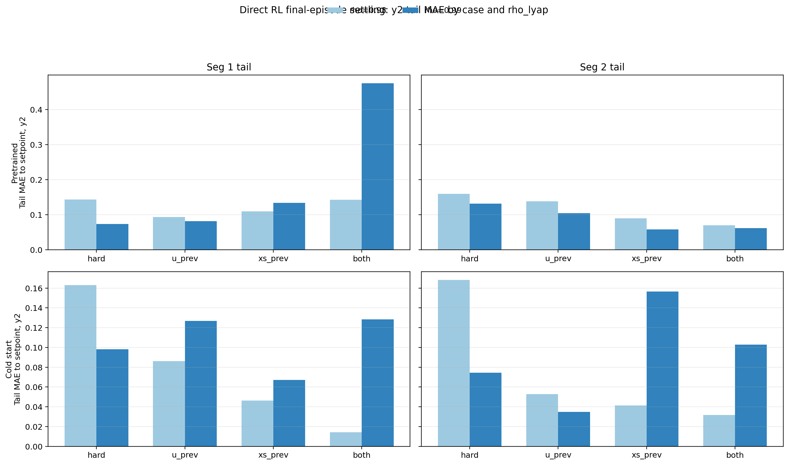
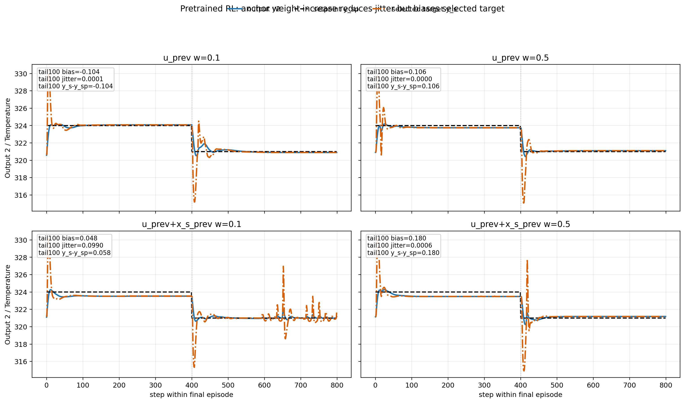

# Direct RL Last-Episode Settling Analysis

Date: 2026-05-11

## Scope

This rewritten note updates the earlier settling analysis using the newer direct safety-gate RL runs with `rho_lyap = 0.99`.

The two questions remain:

1. Why did the final episode appear not to settle in the earlier runs?
2. Is the final episode still receiving exploration noise?

The new evidence comes from:

- pretrained latest complete run: `20260511_171056`
- cold-start latest complete run: `20260511_170643`

and is compared against the earlier runs used in the previous version of this note:

- pretrained earlier comparison run: `20260511_104912`
- cold-start earlier comparison run: `20260511_104852`

## Files inspected

- [DirectLyapunovSafetyGateRL_Pretrained.ipynb](</c:/Users/HAMEDI/OneDrive - McMaster University/PythonProjects/Lyapunov_polymer/DirectLyapunovSafetyGateRL_Pretrained.ipynb>)
- [DirectLyapunovSafetyGateRL_ColdStart.ipynb](</c:/Users/HAMEDI/OneDrive - McMaster University/PythonProjects/Lyapunov_polymer/DirectLyapunovSafetyGateRL_ColdStart.ipynb>)
- [Simulation/run_rl_lyapunov.py](</c:/Users/HAMEDI/OneDrive - McMaster University/PythonProjects/Lyapunov_polymer/Simulation/run_rl_lyapunov.py>)
- [utils/helpers.py](</c:/Users/HAMEDI/OneDrive - McMaster University/PythonProjects/Lyapunov_polymer/utils/helpers.py>)
- [pretrained rho=0.99 comparison table](</c:/Users/HAMEDI/OneDrive - McMaster University/PythonProjects/Lyapunov_polymer/Data/debug_exports/rl_direct_safety_gate_four_method_two_setpoint_disturb_pretrained/20260511_171056/comparison_table.csv>)
- [cold-start rho=0.99 comparison table](</c:/Users/HAMEDI/OneDrive - McMaster University/PythonProjects/Lyapunov_polymer/Data/debug_exports/rl_direct_safety_gate_four_method_two_setpoint_disturb_cold_start/20260511_170643/comparison_table.csv>)
- [pretrained rho=0.98 comparison table](</c:/Users/HAMEDI/OneDrive - McMaster University/PythonProjects/Lyapunov_polymer/Data/debug_exports/rl_direct_safety_gate_four_method_two_setpoint_disturb_pretrained/20260511_104912/comparison_table.csv>)
- [cold-start rho=0.98 comparison table](</c:/Users/HAMEDI/OneDrive - McMaster University/PythonProjects/Lyapunov_polymer/Data/debug_exports/rl_direct_safety_gate_four_method_two_setpoint_disturb_cold_start/20260511_104852/comparison_table.csv>)

## What changed between the old and new comparison sets

The relevant configuration change is not inferred from notebook memory. It is recorded directly inside the saved bundles:

- earlier comparison runs: `rho_lyap = 0.98`
- newer comparison runs: `rho_lyap = 0.99`

So this update is specifically a `rho_lyap` comparison, not a vague "latest run" comparison.

## Last-episode noise question

The answer is still no at the code-path level.

The final cycle is forced to be a test cycle in [utils/helpers.py](</c:/Users/HAMEDI/OneDrive - McMaster University/PythonProjects/Lyapunov_polymer/utils/helpers.py>), and test cycles map to deterministic behavior in [Simulation/run_rl_lyapunov.py](</c:/Users/HAMEDI/OneDrive - McMaster University/PythonProjects/Lyapunov_polymer/Simulation/run_rl_lyapunov.py>).

So the final episode should still be interpreted as deterministic evaluation, not as an exploratory rollout.

One remaining limitation is that the exported safety step tables still do not include an explicit `behavior_noise_mode` column, so this remains a code-level conclusion rather than a direct saved-column confirmation.

## Main updated conclusion

The new `rho_lyap = 0.99` results materially change the earlier interpretation.

For the bounded-hard cases that originally motivated the settling concern, `rho_lyap = 0.99` clearly improves final-episode settling, especially for output 2. That means your hypothesis was directionally right: the older non-settling behavior was significantly influenced by the contraction setting.

However, the effect is not universal across all four-method variants:

- bounded-hard improves in both pretrained and cold-start
- several other second-setpoint tails also improve
- some first-setpoint tails worsen
- the combined `u_prev + x_s_prev` case does not improve consistently

So `rho_lyap = 0.99` is a major part of the story, but not the only part.

## Figure

The figure below compares final-episode tail-settling error for output 2 across all four cases, for pretrained and cold-start, under `rho_lyap = 0.98` versus `rho_lyap = 0.99`.

Figure 1. Final-episode tail mean absolute error to raw setpoint for output 2. Lower is better.

The next figure compares the actual bounded-hard final-episode output trajectories against the raw setpoint for both studies.

Figure 2. Bounded-hard final-episode output tracking for `rho_lyap = 0.98` versus `rho_lyap = 0.99`.

## Quantitative results

### Bounded-hard case: clear improvement with `rho_lyap = 0.99`

Final 50-step tail MAE to raw setpoint for output 2:

| Study | Seg 1, rho=0.98 | Seg 1, rho=0.99 | Seg 2, rho=0.98 | Seg 2, rho=0.99 |
| --- | ---: | ---: | ---: | ---: |
| Pretrained | 0.1431 | 0.0732 | 0.1593 | 0.1312 |
| Cold start | 0.1631 | 0.0981 | 0.1682 | 0.0744 |

This is the strongest updated result in the note. The bounded-hard final episode is substantially better with `rho_lyap = 0.99`, especially in the cold-start second setpoint segment.

### Bounded-hard output tracking comparison

The bounded-hard final-episode tail MAE to raw setpoint for both outputs is:

| Study | Segment | rho=0.98, y1 | rho=0.99, y1 | rho=0.98, y2 | rho=0.99, y2 |
| --- | --- | ---: | ---: | ---: | ---: |
| Pretrained | Seg 1 tail | 0.0433 | 0.0267 | 0.1431 | 0.0732 |
| Pretrained | Seg 2 tail | 0.0229 | 0.0295 | 0.1593 | 0.1312 |
| Cold start | Seg 1 tail | 0.0239 | 0.0273 | 0.1631 | 0.0981 |
| Cold start | Seg 2 tail | 0.0243 | 0.0193 | 0.1682 | 0.0744 |

Interpretation:

- For output 2, the bounded-hard tracking improvement with `rho_lyap = 0.99` is large and consistent in both studies.
- For output 1, the effect is smaller and mixed, which matches the visual impression that the main settling benefit is on the second output.
- Figure 2 shows that the `rho_lyap = 0.99` trajectories stay visibly tighter around the final setpoint in the bounded-hard case, especially for cold start.

### Segment-2 tail settling across all cases

Final 50-step tail MAE to raw setpoint for output 2:

| Case | Pretrained rho=0.98 | Pretrained rho=0.99 | Cold rho=0.98 | Cold rho=0.99 |
| --- | ---: | ---: | ---: | ---: |
| `bounded_hard` | 0.1593 | 0.1312 | 0.1682 | 0.0744 |
| `bounded_hard_u_prev_0p1` | 0.1380 | 0.1040 | 0.0527 | 0.0348 |
| `bounded_hard_xs_prev_0p1` | 0.0893 | 0.0577 | 0.0412 | 0.1565 |
| `bounded_hard_u_prev_0p1_xs_prev_0p1` | 0.0699 | 0.0618 | 0.0318 | 0.1028 |

Interpretation:

- In the second setpoint tail, `rho_lyap = 0.99` improves 6 of 8 study-case combinations.
- The clearest improvements are the bounded-hard cases and the pretrained `u_prev` and `x_s_prev` cases.
- The two regressions are both in cold-start regularized variants:
  - `bounded_hard_xs_prev_0p1`
  - `bounded_hard_u_prev_0p1_xs_prev_0p1`

### Segment-1 tail settling is more mixed

For the first setpoint tail, `rho_lyap = 0.99` improves only 3 of 8 study-case combinations.

That means the benefit of higher `rho_lyap` is more consistent near the second final target than near the first final target.

### Whole-run metrics can disagree with final-episode settling

Two cases are especially important here:

- pretrained `bounded_hard_u_prev_0p1` with `rho_lyap = 0.99`
- cold-start `bounded_hard_u_prev_0p1_xs_prev_0p1` with `rho_lyap = 0.99`

Their whole-run averages are poor:

- pretrained `u_prev`: `reward_mean = -346.7`, `output_rmse_mean = 7.31`
- cold-start combined: `reward_mean = -581.2`, `output_rmse_mean = 9.48`

But that does **not** mean the final episode tail is equally poor in every segment. So for this report's question, whole-run reward is a misleading proxy. The settling question has to be answered from the final-episode tail itself.

### Whole-run output tracking comparison

For completeness, whole-run output RMSE does move in the same direction as the bounded-hard tail improvement:

| Case | Pretrained rho=0.98 RMSE(y1) | Pretrained rho=0.99 RMSE(y1) | Pretrained rho=0.98 RMSE(y2) | Pretrained rho=0.99 RMSE(y2) |
| --- | ---: | ---: | ---: | ---: |
| `bounded_hard` | 0.2172 | 0.2251 | 0.6976 | 0.6272 |
| `bounded_hard_u_prev_0p1` | 0.2008 | 0.3356 | 0.6828 | 14.2899 |
| `bounded_hard_xs_prev_0p1` | 0.2055 | 0.1890 | 0.6697 | 0.5742 |
| `bounded_hard_u_prev_0p1_xs_prev_0p1` | 0.2054 | 0.1948 | 0.6445 | 0.6376 |

| Case | Cold rho=0.98 RMSE(y1) | Cold rho=0.99 RMSE(y1) | Cold rho=0.98 RMSE(y2) | Cold rho=0.99 RMSE(y2) |
| --- | ---: | ---: | ---: | ---: |
| `bounded_hard` | 0.2090 | 0.1848 | 0.6472 | 0.6492 |
| `bounded_hard_u_prev_0p1` | 0.1907 | 0.1674 | 0.5994 | 0.4721 |
| `bounded_hard_xs_prev_0p1` | 0.2067 | 0.1775 | 0.6235 | 0.6117 |
| `bounded_hard_u_prev_0p1_xs_prev_0p1` | 0.1918 | 0.3870 | 0.8696 | 18.5717 |

These RMSE tables reinforce the main point:

- bounded-hard tracking improved in the newer runs, especially where the last-episode tail also improved
- several regularized variants improved too
- the two outlier regularized cases are still problematic enough that whole-run RMSE becomes dramatically worse even if one segment of the final episode looks acceptable

## Latest pretrained anchor update

The report so far compared the earlier `rho_lyap = 0.98` and newer `rho_lyap = 0.99` runs. A newer pretrained export now exists at:

- `20260511_213850`

This latest pretrained run uses:

- `rho_lyap = 0.99`
- raw `y_sp` tracking in the direct path
- `u_ref_weight = 0.5`
- `x_ref_weight = 0.5` in the combined case

The most important new observation is:

- the visible jitter problem is largely solved in the strongly anchored pretrained runs
- but the output is settling around a biased target rather than around the raw setpoint

So the remaining issue is better described as **anchor-induced offset**, not residual oscillation.

### Why this is not mainly a tracking failure

For the latest pretrained anchored cases, the output tracks the selected target very closely in the final tails, but the selected target itself is shifted away from `y_sp`.

That means the chain is:

1. large anchor weight shifts the admissible target,
2. the controller settles well to that shifted target,
3. the final output appears offset relative to the raw setpoint.

So the controller is not failing to settle. It is settling to the wrong place because the target regularization is too strong.

Figure 3. Latest pretrained anchored runs: output 2, raw setpoint, and selected target. Higher anchor weights reduce jitter but pull the selected target away from `y_sp`.

### Quantitative anchor tradeoff in the latest pretrained run

Output 2, final 100-step tails:

| Run | Segment | Mean error to `y_sp` | Jitter std around `y_sp` | Mean `y_s - y_sp` | Mean error to `y_s` |
| --- | --- | ---: | ---: | ---: | ---: |
| `u_prev_weight=0.1` | Seg 1 tail | 0.0813 | 0.0005 | 0.0809 | 0.0005 |
| `u_prev_weight=0.1` | Seg 2 tail | -0.1041 | 0.0001 | -0.1036 | -0.0005 |
| `u_prev_weight=0.5` | Seg 1 tail | -0.2534 | 0.0015 | -0.2531 | -0.0002 |
| `u_prev_weight=0.5` | Seg 2 tail | 0.1059 | 0.0000 | 0.1058 | 0.0001 |
| `u_prev_weight=0.1, x_ref_weight=0.1` | Seg 1 tail | -0.4748 | 0.0028 | -0.4724 | -0.0024 |
| `u_prev_weight=0.1, x_ref_weight=0.1` | Seg 2 tail | 0.0483 | 0.0990 | 0.0580 | -0.0097 |
| `u_prev_weight=0.5, x_ref_weight=0.5` | Seg 1 tail | -0.5168 | 0.0013 | -0.5165 | -0.0003 |
| `u_prev_weight=0.5, x_ref_weight=0.5` | Seg 2 tail | 0.1801 | 0.0006 | 0.1798 | 0.0003 |

Interpretation:

- In the latest pretrained `u_prev_weight=0.5` case, jitter is essentially gone, but the offset from the raw setpoint grows to about `0.25` in the first tail and `0.11` in the second tail for output 2.
- The mean error to `y_s` is nearly zero, which shows the controller is settling to the selected target successfully.
- The combined `u_prev + x_ref` case with `0.5/0.5` is even more biased, especially in the first tail.

So the data support a sharper statement than before:

- large anchor weights are effective as anti-jitter regularizers
- but they can dominate the target generator enough to create a steady-state bias

## How to solve the anchor-induced offset

The cleanest fix is not to remove the anchor entirely. It is to make the anchor **strong in the transient and weak near steady state**.

### Recommended fix 1: decay the anchor near steady state

Use a larger anchor only while the controller is far from the setpoint or while contraction is difficult, then reduce it once the trajectory has settled.

For example, use:

$$
w_u(k) =
\begin{cases}
w_{u,\mathrm{high}}, & \|y_k - y_{\mathrm{sp},k}\|_\infty > \epsilon_y \\
w_{u,\mathrm{low}}, & \|y_k - y_{\mathrm{sp},k}\|_\infty \le \epsilon_y
\end{cases}
$$

with a persistence condition over several steps to avoid switching chatter.

Practical starting values from the current evidence:

- `w_u_high = 0.5`
- `w_u_low = 0.05` to `0.15`

### Recommended fix 2: keep `u_ref_weight` smaller than `x_ref_weight`

The latest pretrained results suggest that the input anchor is the main source of the offset. A useful next try is:

- `u_ref_weight = 0.15` to `0.25`
- `x_ref_weight = 0.1` to `0.2`

or even:

- `u_ref_weight = 0.15`
- `x_ref_weight = 0.0` to `0.1`

if the main goal is to reduce steady-state bias while preserving most of the anti-jitter benefit.

### Recommended fix 3: release the anchor when the target mismatch is already small

Because the problem shows up as settling to a shifted target, another direct rule is:

- if `target_mismatch_inf` is already below a small threshold for `M` consecutive steps, reduce `u_ref_weight`

This directly attacks the mechanism we observed in the latest pretrained runs.

### Recommended fix 4: do not increase both anchor terms aggressively together

The latest pretrained `0.5 / 0.5` combined case is the strongest evidence for over-regularization. It settles cleanly, but with even larger output-2 bias.

So the current results do **not** support setting both:

- `u_ref_weight = 0.5`
- `x_ref_weight = 0.5`

as the default steady-state tuning.

## Scientific interpretation

The updated evidence supports the following interpretation:

1. The earlier report was too cautious to center `rho_lyap` because it only had the `rho_lyap = 0.98` comparison set.
2. With the newer `rho_lyap = 0.99` runs available, the bounded-hard settling issue is clearly reduced.
3. So `rho_lyap` was indeed one of the important causes of the observed non-settling.
4. But the regularized variants still show case-dependent behavior, which means the final-episode shape is still also influenced by target regularization, accepted-versus-corrected action mix, and fallback interaction.
5. In the newest pretrained anchored runs, the dominant failure mode is no longer jitter. It is anchor-induced target bias.

## Updated answer to the two original questions

### 1. Why were we not reaching and settling in the last episode?

For the bounded-hard family, the new evidence indicates that `rho_lyap = 0.98` was a meaningful part of the problem. Increasing it to `0.99` improves the final tail noticeably.

For the regularized variants, the answer is more nuanced. Some improve with `rho_lyap = 0.99`, while others do not. So those cases still have additional structure beyond the contraction factor alone.

### 2. Are we adding noise in the last episode?

Still no by design. The last episode is intended to be deterministic evaluation.

## Recommended next step

The most useful next experiment is now narrower than before.

For pretrained RL, the next question is no longer "how do we remove jitter?" It is:

- how do we keep the anti-jitter benefit of anchoring without pulling the steady-state target away from `y_sp`?

The best next targeted experiment is:

1. keep `rho_lyap = 0.99`,
2. keep raw `y_sp` tracking in the direct path,
3. reduce `u_ref_weight` from `0.5` toward `0.15` to `0.25`,
4. avoid `0.5 / 0.5` combined anchoring as the default,
5. if needed, implement a transient-only anchor schedule with high early weight and low steady-state weight.

## Files changed

- [report/direct_rl_last_episode_settling_analysis_2026-05-11.md](</c:/Users/HAMEDI/OneDrive - McMaster University/PythonProjects/Lyapunov_polymer/report/direct_rl_last_episode_settling_analysis_2026-05-11.md>)
- [last_episode_settling_rho99_compare_2026-05-11.png](</c:/Users/HAMEDI/OneDrive - McMaster University/PythonProjects/Lyapunov_polymer/last_episode_settling_rho99_compare_2026-05-11.png>)
- [last_episode_output_tracking_rho99_compare_2026-05-11.png](</c:/Users/HAMEDI/OneDrive - McMaster University/PythonProjects/Lyapunov_polymer/last_episode_output_tracking_rho99_compare_2026-05-11.png>)
- [pretrained_anchor_bias_tracking_2026-05-12.png](</c:/Users/HAMEDI/OneDrive - McMaster University/PythonProjects/Lyapunov_polymer/pretrained_anchor_bias_tracking_2026-05-12.png>)

## Bottom line

The new complete `rho_lyap = 0.99` runs support your hypothesis for the main bounded-hard settling issue. The earlier apparent last-episode non-settling was significantly tied to using `rho_lyap = 0.98`. In the newest pretrained anchored runs, the jitter problem is largely solved, but the stronger anchor shifts the selected target away from `y_sp`, so the controller settles calmly with offset. The next fix should therefore be anchor release or anchor reduction near steady state, not more anchoring.
