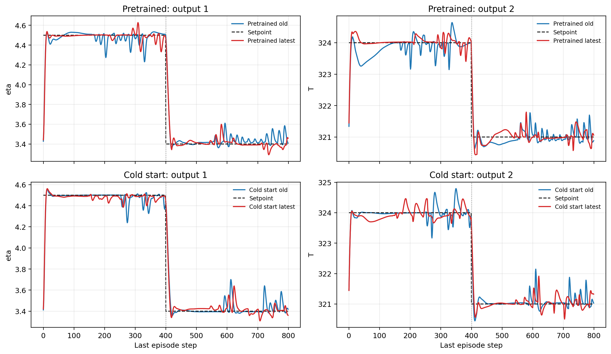

# Direct RL Last-Episode Settling Analysis

Date: 2026-05-11

## Scope

This note analyzes two questions for the direct safety-gate RL notebooks:

1. Why does the last episode appear not to reach and settle at the setpoint?
2. Is noise being added in the last episode?

The analysis uses the `research-result-loop` workflow and focuses on:

- [DirectLyapunovSafetyGateRL_Pretrained.ipynb](</c:/Users/HAMEDI/OneDrive - McMaster University/PythonProjects/Lyapunov_polymer/DirectLyapunovSafetyGateRL_Pretrained.ipynb>)
- [DirectLyapunovSafetyGateRL_ColdStart.ipynb](</c:/Users/HAMEDI/OneDrive - McMaster University/PythonProjects/Lyapunov_polymer/DirectLyapunovSafetyGateRL_ColdStart.ipynb>)
- [Simulation/run_rl_lyapunov.py](</c:/Users/HAMEDI/OneDrive - McMaster University/PythonProjects/Lyapunov_polymer/Simulation/run_rl_lyapunov.py>)
- [utils/helpers.py](</c:/Users/HAMEDI/OneDrive - McMaster University/PythonProjects/Lyapunov_polymer/utils/helpers.py>)

## 1. Files inspected

- [Simulation/run_rl_lyapunov.py](</c:/Users/HAMEDI/OneDrive - McMaster University/PythonProjects/Lyapunov_polymer/Simulation/run_rl_lyapunov.py>)
- [utils/helpers.py](</c:/Users/HAMEDI/OneDrive - McMaster University/PythonProjects/Lyapunov_polymer/utils/helpers.py>)
- [TD3Agent/agent.py](</c:/Users/HAMEDI/OneDrive - McMaster University/PythonProjects/Lyapunov_polymer/TD3Agent/agent.py>)
- [pretrained old run bundle](</c:/Users/HAMEDI/OneDrive - McMaster University/PythonProjects/Lyapunov_polymer/Data/debug_exports/rl_direct_safety_gate_four_method_two_setpoint_disturb_pretrained/20260511_012037/sf_5aabb97c/bundle.pkl>)
- [pretrained latest accessible run bundle](</c:/Users/HAMEDI/OneDrive - McMaster University/PythonProjects/Lyapunov_polymer/Data/debug_exports/rl_direct_safety_gate_four_method_two_setpoint_disturb_pretrained/20260511_104912/sf_5aabb97c/bundle.pkl>)
- [cold-start old run bundle](</c:/Users/HAMEDI/OneDrive - McMaster University/PythonProjects/Lyapunov_polymer/Data/debug_exports/rl_direct_safety_gate_four_method_two_setpoint_disturb_cold_start/20260511_012047/sf_5aabb97c/bundle.pkl>)
- [cold-start latest accessible run bundle](</c:/Users/HAMEDI/OneDrive - McMaster University/PythonProjects/Lyapunov_polymer/Data/debug_exports/rl_direct_safety_gate_four_method_two_setpoint_disturb_cold_start/20260511_104852/sf_5aabb97c/bundle.pkl>)

## 2. What the current method is doing

Each RL study runs 200 cycles, and each cycle has 800 control steps because the schedule contains two 400-step setpoints.

The most important scheduling fact is in [utils/helpers.py](</c:/Users/HAMEDI/OneDrive - McMaster University/PythonProjects/Lyapunov_polymer/utils/helpers.py>): the final cycle is always forced to be a test cycle by

$$
\texttt{test\_cycle[-1] = True}.
$$

Then in [Simulation/run_rl_lyapunov.py](</c:/Users/HAMEDI/OneDrive - McMaster University/PythonProjects/Lyapunov_polymer/Simulation/run_rl_lyapunov.py>), the test flag is used to disable behavior noise in the phase resolver. Under the current implementation:

- warm start test behavior uses no noise,
- BC test behavior uses no noise,
- full RL test behavior also uses no noise.

So the last episode is intended to be a deterministic evaluation episode, not an exploratory episode.

## 3. Mathematical interpretation

Let the final cycle be indexed by $k \in \{159200,\dots,159999\}$ for a 200-cycle, 800-step-per-cycle run. The observed plant output is $y_k$, and the scheduled reference is $y_{\mathrm{sp},k}$.

The key distinction is:

- training cycles may use exploratory behavior policy $\pi_{\mathrm{beh}}$,
- the final test cycle uses deterministic evaluation behavior.

So if the last cycle does not settle well, that effect should be interpreted as

$$
y_k \not\to y_{\mathrm{sp},k}
$$

under the learned deterministic policy plus the safety filter, not as a consequence of active last-episode exploration noise.

## 4. Main result interpretation

### Q1. Are we adding noise in the last episode?

For the current committed code, no.

The reason is structural, not inferential:

- [utils/helpers.py](</c:/Users/HAMEDI/OneDrive - McMaster University/PythonProjects/Lyapunov_polymer/utils/helpers.py>) forces the final cycle to be a test cycle.
- [Simulation/run_rl_lyapunov.py](</c:/Users/HAMEDI/OneDrive - McMaster University/PythonProjects/Lyapunov_polymer/Simulation/run_rl_lyapunov.py>) maps test cycles to `behavior_noise_mode = "none"`.

So if you rerun the notebooks on the current code, the final episode should be noise-free.

One caveat: the latest accessible saved step tables I could inspect were generated before the new noise-diagnostic columns were added, so I cannot prove this from those old CSV fields directly. But the current code path is unambiguous.

### Q2. Does the last episode actually fail to settle?

For the bounded-hard case shared between the older and newer accessible runs, the quantitative evidence does not show a dramatic final-episode settling collapse.

For episode 200 of the bounded-hard case:

| Run | Reward mean | Fallback count | Output RMSE mean |
| --- | ---: | ---: | ---: |
| Pretrained old | -3.903 | 49 | 0.2349 |
| Pretrained latest accessible | -2.906 | 52 | 0.1934 |
| Cold-start old | -3.756 | 45 | 0.2063 |
| Cold-start latest accessible | -3.146 | 51 | 0.2005 |

So on episode-level RMSE, the latest accessible bounded-hard runs are roughly comparable or slightly better, not worse.

However, there is evidence of changed terminal behavior in the last episode when we inspect tail errors more closely.

Tail mean absolute error over the last 50 steps of each 400-step setpoint segment in episode 200:

| Run | Segment 1 tail MAE, output 1 | Segment 1 tail MAE, output 2 | Segment 2 tail MAE, output 1 | Segment 2 tail MAE, output 2 |
| --- | ---: | ---: | ---: | ---: |
| Pretrained old | 0.0210 | 0.0700 | 0.0691 | 0.1897 |
| Pretrained latest accessible | 0.0436 | 0.1433 | 0.0237 | 0.1542 |
| Cold-start old | 0.0261 | 0.2019 | 0.0510 | 0.1687 |
| Cold-start latest accessible | 0.0244 | 0.1650 | 0.0239 | 0.1740 |

Interpretation:

- The pretrained latest accessible run is worse in the first setpoint tail than the earlier run, especially for output 2.
- The cold-start latest accessible run is mixed rather than uniformly worse.
- The effect is therefore not "the last episode is broken everywhere." It is more subtle: the terminal behavior changed, but not in a way consistent with active noise injection in the last episode.

## 5. Bugs, inconsistencies, or risks found

### Risk 1: last-episode noise is not the cause

The final cycle is explicitly marked as test, so the last-episode settling issue should not be blamed on behavior noise in the last episode itself.

### Risk 2: the learned policy entering the final test cycle may be worse

A deterministic final episode can still settle worse if the actor has drifted to a poorer policy by the time training reaches cycle 200. In that case, the symptom appears only at evaluation time even though the root cause came from earlier training episodes.

### Risk 3: fallback interaction may mask the true source

Episode 200 still contains nontrivial fallback counts, around 45 to 52 for the bounded-hard case. So the last-episode shape is not purely the raw actor policy. It is the actor plus the safety-gate correction path. A perceived lack of settling could therefore come from:

- degraded actor candidate quality,
- more frequent fallback usage,
- or a different pattern of accepted-versus-corrected actions near the terminal setpoint.

### Risk 4: the saved accessible runs do not yet expose the new noise diagnostics

The latest accessible bundles I inspected predate the new per-step fields such as `behavior_noise_mode` and `parameter_noise_std`. That limits direct post hoc auditing of exactly what happened in those older saved trajectories.

## 6. Figure and report updates made

Generated figure:

- [last_episode_settling_compare_2026-05-11.png](</c:/Users/HAMEDI/OneDrive - McMaster University/PythonProjects/Lyapunov_polymer/last_episode_settling_compare_2026-05-11.png>)

Figure 1. Last-episode output traces for the bounded-hard case, comparing the older accessible runs against the later accessible runs for the pretrained and cold-start studies.

## 7. Literature connections

No external literature was needed for this diagnosis. This note is based on local implementation inspection and saved run analysis.

## 8. Recommended next experiment

The most useful next check is not another broad rerun. It is a targeted audit run using the current code so the new diagnostics are actually present in the saved step table.

Specifically:

1. rerun one pretrained case and one cold-start case,
2. inspect the final 800 steps,
3. confirm directly from the saved per-step diagnostics that:
   - `behavior_noise_mode == "none"` during episode 200,
   - `parameter_noise_active == False` during episode 200,
   - fallback counts and accepted-candidate counts near the final setpoint match the visual behavior.

That would close the current observability gap in the older saved bundles.

## 9. Remaining uncertainty

The main uncertainty is that the latest saved bundles I could inspect were generated before the new behavior-noise diagnostic fields existed. So the answer to question 2 is code-level certain, but not yet corroborated by a new saved step-table trace from the updated implementation.

## 10. Files changed

- [report/direct_rl_last_episode_settling_analysis_2026-05-11.md](</c:/Users/HAMEDI/OneDrive - McMaster University/PythonProjects/Lyapunov_polymer/report/direct_rl_last_episode_settling_analysis_2026-05-11.md>)
- [last_episode_settling_compare_2026-05-11.png](</c:/Users/HAMEDI/OneDrive - McMaster University/PythonProjects/Lyapunov_polymer/last_episode_settling_compare_2026-05-11.png>)

## 11. How to verify the analysis

1. Open [utils/helpers.py](</c:/Users/HAMEDI/OneDrive - McMaster University/PythonProjects/Lyapunov_polymer/utils/helpers.py>) and confirm the final cycle is forced to test.
2. Open [Simulation/run_rl_lyapunov.py](</c:/Users/HAMEDI/OneDrive - McMaster University/PythonProjects/Lyapunov_polymer/Simulation/run_rl_lyapunov.py>) and confirm test cycles map to `behavior_noise_mode = "none"`.
3. Open [last_episode_settling_compare_2026-05-11.png](</c:/Users/HAMEDI/OneDrive - McMaster University/PythonProjects/Lyapunov_polymer/last_episode_settling_compare_2026-05-11.png>) and compare the last-episode tails.
4. If you rerun the notebooks now, inspect the saved step table for episode 200 and confirm the new behavior-noise fields are zero or inactive there.
