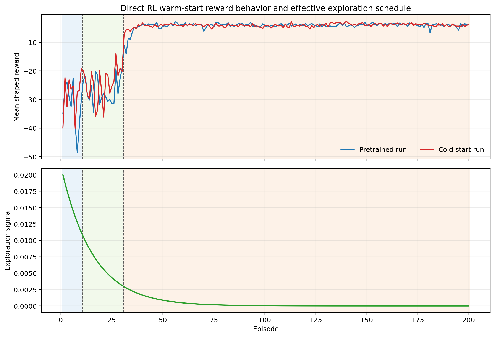

# Direct RL Warm-Start Exploration Fix Ideas

Date: 2026-05-11

## Scope

This note diagnoses the low warm-start reward behavior in the direct Lyapunov safety-gate RL studies and proposes literature-backed fixes. The main notebooks of interest are:

- [DirectLyapunovSafetyGateRL_Pretrained.ipynb](</c:/Users/HAMEDI/OneDrive - McMaster University/PythonProjects/Lyapunov_polymer/DirectLyapunovSafetyGateRL_Pretrained.ipynb>)
- [DirectLyapunovSafetyGateRL_ColdStart.ipynb](</c:/Users/HAMEDI/OneDrive - McMaster University/PythonProjects/Lyapunov_polymer/DirectLyapunovSafetyGateRL_ColdStart.ipynb>)

The main rollout logic is in:

- [Simulation/run_rl_lyapunov.py](</c:/Users/HAMEDI/OneDrive - McMaster University/PythonProjects/Lyapunov_polymer/Simulation/run_rl_lyapunov.py>)
- [TD3Agent/agent.py](</c:/Users/HAMEDI/OneDrive - McMaster University/PythonProjects/Lyapunov_polymer/TD3Agent/agent.py>)
- [TD3Agent/reward_functions.py](</c:/Users/HAMEDI/OneDrive - McMaster University/PythonProjects/Lyapunov_polymer/TD3Agent/reward_functions.py>)

Saved-run evidence comes from:

- [pretrained episode table](</c:/Users/HAMEDI/OneDrive - McMaster University/PythonProjects/Lyapunov_polymer/Data/debug_exports/rl_direct_safety_gate_four_method_two_setpoint_disturb_pretrained/20260511_012037/sf_5aabb97c/episode_table.csv>)
- [pretrained summary](</c:/Users/HAMEDI/OneDrive - McMaster University/PythonProjects/Lyapunov_polymer/Data/debug_exports/rl_direct_safety_gate_four_method_two_setpoint_disturb_pretrained/20260511_012037/sf_5aabb97c/summary.json>)
- [cold-start episode table](</c:/Users/HAMEDI/OneDrive - McMaster University/PythonProjects/Lyapunov_polymer/Data/debug_exports/rl_direct_safety_gate_four_method_two_setpoint_disturb_cold_start/20260511_012047/sf_5aabb97c/episode_table.csv>)
- [cold-start summary](</c:/Users/HAMEDI/OneDrive - McMaster University/PythonProjects/Lyapunov_polymer/Data/debug_exports/rl_direct_safety_gate_four_method_two_setpoint_disturb_cold_start/20260511_012047/sf_5aabb97c/summary.json>)

## 1. Files inspected

- [DirectLyapunovSafetyGateRL_Pretrained.ipynb](</c:/Users/HAMEDI/OneDrive - McMaster University/PythonProjects/Lyapunov_polymer/DirectLyapunovSafetyGateRL_Pretrained.ipynb>)
- [DirectLyapunovSafetyGateRL_ColdStart.ipynb](</c:/Users/HAMEDI/OneDrive - McMaster University/PythonProjects/Lyapunov_polymer/DirectLyapunovSafetyGateRL_ColdStart.ipynb>)
- [Simulation/run_rl_lyapunov.py](</c:/Users/HAMEDI/OneDrive - McMaster University/PythonProjects/Lyapunov_polymer/Simulation/run_rl_lyapunov.py>)
- [TD3Agent/agent.py](</c:/Users/HAMEDI/OneDrive - McMaster University/PythonProjects/Lyapunov_polymer/TD3Agent/agent.py>)
- [TD3Agent/reward_functions.py](</c:/Users/HAMEDI/OneDrive - McMaster University/PythonProjects/Lyapunov_polymer/TD3Agent/reward_functions.py>)
- [warm_start_reward_and_sigma_2026-05-11.png](</c:/Users/HAMEDI/OneDrive - McMaster University/PythonProjects/Lyapunov_polymer/warm_start_reward_and_sigma_2026-05-11.png>)

## 2. What the current method is doing

Both direct notebooks use the same three-phase training schedule:

1. warmup buffer-only phase for 10 episodes,
2. teacher behavior-cloning phase for 20 episodes,
3. full TD3 phase for the remaining episodes.

The important difference is the warmup behavior source:

- pretrained notebook: `warmup_behavior_source="policy"`
- cold-start notebook: `warmup_behavior_source="direct_lyapunov_mpc"`

The current exploration settings are:

- `exploration_std_start = 0.02`
- `exploration_std_end = 0.0`
- decay scope over the entire run
- TD3 actor action noise, not parameter-space exploration

In the pretrained notebook, the first 10 episodes therefore use:

- the pretrained actor,
- small Gaussian action noise,
- no learning updates,
- replay growth from whatever trajectories that policy already visits.

That is a particularly weak exploration design for a warm-start phase whose purpose is to diversify the replay buffer before full RL begins.

Both notebooks now use the shaped reward from [TD3Agent/reward_functions.py](</c:/Users/HAMEDI/OneDrive - McMaster University/PythonProjects/Lyapunov_polymer/TD3Agent/reward_functions.py>) rather than the old quadratic reward. However, the current direct notebooks do not apply the user-provided `reward_scale=0.01` wrapper, so the raw shaped reward is passed directly to TD3.

## 3. Mathematical interpretation

The per-step reward has the form

$$
r_k = -\Big(\mathrm{err}_{\mathrm{eff},k} + \mathrm{move}_k + \mathrm{lin}_{\mathrm{out},k} + \mathrm{lin}_{\mathrm{in},k}\Big) + \mathrm{bonus}_k
$$

where:

- $\mathrm{err}_{\mathrm{eff},k}$ is the weighted quadratic output error in scaled deviation coordinates,
- $\mathrm{move}_k$ penalizes scaled input moves,
- $\mathrm{lin}_{\mathrm{out},k}$ adds extra penalty outside the shaped tracking band,
- $\mathrm{lin}_{\mathrm{in},k}$ still penalizes error inside the band,
- $\mathrm{bonus}_k$ rewards staying near the band center.

The reward is therefore intentionally asymmetric: it provides only a small positive bonus near the target, but can become strongly negative when the early trajectory is far outside the band. That is desirable for control shaping, but it means early replay can be dominated by large negative returns.

The effective exploration schedule in the current direct notebooks is approximately

$$
\sigma_k = 0.02 \cdot 0.99992^k,
$$

with `k` measured in control steps. Because each episode has 800 steps:

- episode 1 starts at $\sigma \approx 0.0200$
- episode 11 starts at $\sigma \approx 0.0105$
- episode 31 starts at $\sigma \approx 0.0029$

So by the time full RL starts, only about 15% of the initial exploration amplitude remains.

## 4. Main result interpretation

The warm-start reward problem is real in both notebooks, not just in one run.

### Phase averages from saved runs

| Run | Phase | Mean reward | Mean fallback count | Mean output RMSE |
| --- | --- | ---: | ---: | ---: |
| pretrained | warmup, ep 1-10 | -32.49 | 23.10 | 1.063 |
| pretrained | BC, ep 11-30 | -26.80 | 13.50 | 1.001 |
| pretrained | RL, ep 31-50 | -5.58 | 55.30 | 0.322 |
| cold start | warmup, ep 1-10 | -28.32 | 11.70 | 1.015 |
| cold start | BC, ep 11-30 | -24.62 | 12.25 | 0.928 |
| cold start | RL, ep 31-50 | -4.66 | 52.10 | 0.269 |

Three points matter.

First, the pretrained notebook really does suffer from weak warmup exploration. The first 10 episodes are policy-generated, noisy only at $\sigma \in [0.02, 0.0105]$, and no learning occurs. This produces low-diversity data near the existing actor manifold rather than a useful broad replay seed.

Second, low warm-start reward is not caused only by weak exploration, because the cold-start notebook also has poor warmup reward even though its warmup actions come from `direct_lyapunov_mpc`. This means the issue is partly structural: early trajectories are still far enough from the shaped reward band that the reward remains strongly negative.

Third, the reward distribution is numerically harsh in the saved summaries. In the pretrained run, the overall reward statistics are:

- `reward_mean = -7.82`
- `reward_min = -558.52`
- `reward_max = 0.16`

That scale imbalance is not itself a bug, but it is a reasonable critic-conditioning risk, especially during the warmup and early BC phases.

## 5. Bugs, inconsistencies, or risks found

### Risk 1: pretrained warmup is almost replay collection without meaningful exploration

The current pretrained warmup phase uses the learned actor with tiny iid action noise and no updates. That is a poor match for the stated warm-start goal of collecting informative new transitions before online RL.

### Risk 2: exploration decays before full RL even starts

Because the same schedule is used across the entire run, full RL begins after the noise has already decayed from `0.02` to roughly `0.0029`. The actor starts genuine online improvement after most exploration authority has already been spent.

### Risk 3: both warmup modes are outside the shaped reward comfort zone

The cold-start run shows that even teacher-generated warmup data remains low reward. This suggests that the banded shaped reward is strict relative to the early transient trajectories and that simply increasing action noise will not fix the whole issue.

### Risk 4: missing reward scaling may amplify critic instability

The current direct notebooks do not use the user-specified `reward_scale=0.01`. Because the maximum positive reward is tiny while negative excursions can be hundreds of times larger in magnitude, the critic is likely trained on a numerically sharp target distribution during the least stable phase of learning.

## 6. Figure and report updates made

I generated:

- [warm_start_reward_and_sigma_2026-05-11.png](</c:/Users/HAMEDI/OneDrive - McMaster University/PythonProjects/Lyapunov_polymer/warm_start_reward_and_sigma_2026-05-11.png>)

Figure 1. Episode-mean shaped reward for the pretrained and cold-start runs, together with the effective exploration schedule used by the current direct RL setup.

This figure shows:

- episode mean reward for pretrained and cold-start runs,
- the warmup, BC, and full-RL phase boundaries,
- the effective action-noise schedule implied by the current configuration.

The intended figure destination was `report/figures/`, but this repository's OneDrive-backed report folders blocked new image writes during this session, so the figure was saved at the repo root instead.

## 7. Literature connections

### AWAC: offline data should reduce the exploration burden of online RL

Nair et al. argue that prior data should provide a starting point that mitigates exploration and sample-complexity challenges, while online learning then refines the policy. That fits this repository well: the direct Lyapunov MPC teacher is already a strong source of prior data, so the warm-start phase should exploit that more aggressively instead of relying on tiny policy noise alone.

Source:

- Nair et al., "AWAC: Accelerating Online Reinforcement Learning with Offline Datasets," arXiv:2006.09359. https://arxiv.org/abs/2006.09359

### RLPD: online RL with offline data can work with small but important design changes

Ball et al. show that existing off-policy RL algorithms can leverage offline data effectively online, but reliability depends on a small set of practical design choices. The direct implication here is that the fix may not require a new algorithm. A cleaner phase schedule, better use of prior trajectories, and better early-stage tuning may be enough.

Source:

- Ball et al., "Efficient Online Reinforcement Learning with Offline Data," arXiv:2302.02948. https://arxiv.org/abs/2302.02948

### TD3+BC: keep the actor close to the data distribution early

Fujimoto and Gu show that adding a behavior-cloning term to the policy update can stabilize training by regularizing the actor toward the dataset actions. For this project, that suggests extending the teacher-anchor idea slightly into the early full-RL phase instead of ending teacher guidance abruptly after episode 30.

Source:

- Fujimoto and Gu, "A Minimalist Approach to Offline Reinforcement Learning," arXiv:2106.06860. https://arxiv.org/abs/2106.06860

### Parameter-space noise: coherent exploration is often better than tiny iid action noise

Plappert et al. show that parameter noise can produce more consistent exploration than action-space noise in deep RL. In this polymer setting, that matters because the current $\sigma=0.02$ Gaussian action perturbations are both small and temporally unstructured. A coherent exploration mechanism is more likely to create meaningfully different closed-loop trajectories while still interacting sensibly with the safety gate.

Source:

- Plappert et al., "Parameter Space Noise for Exploration," arXiv:1706.01905. https://arxiv.org/abs/1706.01905

## 8. Recommended next experiment

The best next experiment is not "increase warmup sigma only." The better test is a targeted phase-schedule fix:

### Recommended experiment A

Apply all four changes together in the pretrained notebook:

1. change `warmup_behavior_source` from `"policy"` to `"direct_lyapunov_mpc"` for the 10 buffer-only warmup episodes,
2. reset exploration at the start of full RL instead of decaying from episode 1 through episode 30,
3. keep a decaying BC regularization term for the first 10 to 20 full-RL episodes,
4. multiply the shaped reward by `0.01` before storing it in replay or before critic target computation.

The logic is:

- change 1 improves replay coverage safely,
- change 2 restores actual exploration when learning begins,
- change 3 prevents the actor from drifting too abruptly away from the good teacher manifold,
- change 4 reduces critic target scale without changing the ordering of policies.

### Concrete parameter suggestion

For a first pass:

- warmup episodes 1-10: teacher-generated
- BC episodes 11-30: keep current design
- RL episodes 31-50: reset $\sigma$ to `0.06`
- RL episodes 31-200: decay `0.06 -> 0.01`
- BC anchor weight during episodes 31-50: linearly decay to zero
- reward scale: `0.01`

This is an inference from the current code and the cited papers, not a direct prescription copied from any one source.

## 9. Remaining uncertainty

Two uncertainties remain.

First, some of the warmup reward problem may come from the plant and observer transient itself rather than from the policy. The evidence suggests this because cold-start teacher warmup is still quite negative.

Second, the safety gate may alter the effective data distribution enough that some standard RL exploration fixes become weaker than they would be in an unconstrained benchmark. That is why teacher-seeded replay and phase-aware scheduling look more promising here than simply injecting larger open-loop noise.

## 10. Files changed

- [report/direct_rl_warm_start_exploration_fix_ideas_2026-05-11.md](</c:/Users/HAMEDI/OneDrive - McMaster University/PythonProjects/Lyapunov_polymer/report/direct_rl_warm_start_exploration_fix_ideas_2026-05-11.md>)
- [warm_start_reward_and_sigma_2026-05-11.png](</c:/Users/HAMEDI/OneDrive - McMaster University/PythonProjects/Lyapunov_polymer/warm_start_reward_and_sigma_2026-05-11.png>)

## 11. How to verify the analysis

1. Re-open the direct notebooks and confirm the current phase configuration values.
2. Inspect the saved episode tables and reproduce the phase-average reward, fallback count, and RMSE values.
3. Open [warm_start_reward_and_sigma_2026-05-11.png](</c:/Users/HAMEDI/OneDrive - McMaster University/PythonProjects/Lyapunov_polymer/warm_start_reward_and_sigma_2026-05-11.png>) and confirm that full RL begins after the exploration schedule has already decayed substantially.
4. If you implement experiment A, compare:
   - warmup reward,
   - BC-phase reward,
   - first 20 RL episodes,
   - critic loss scale,
   - accepted candidate rate,
   - fallback rate.
