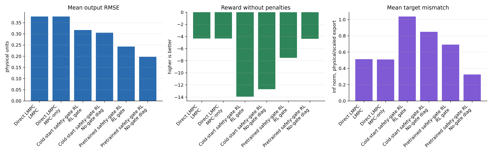
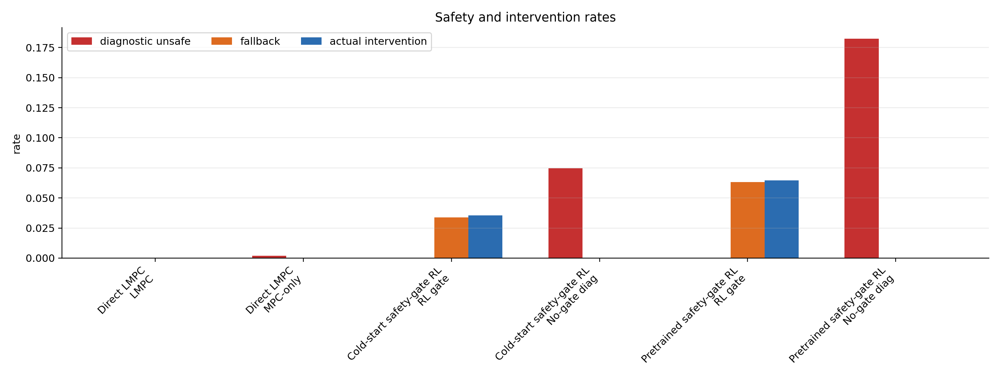
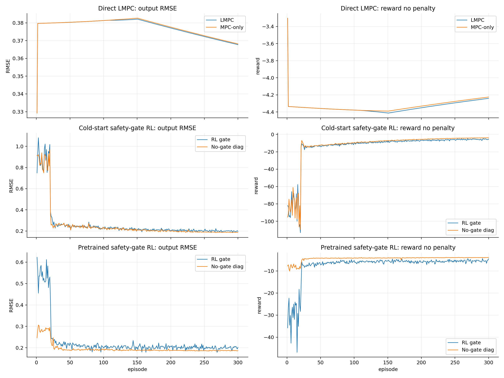
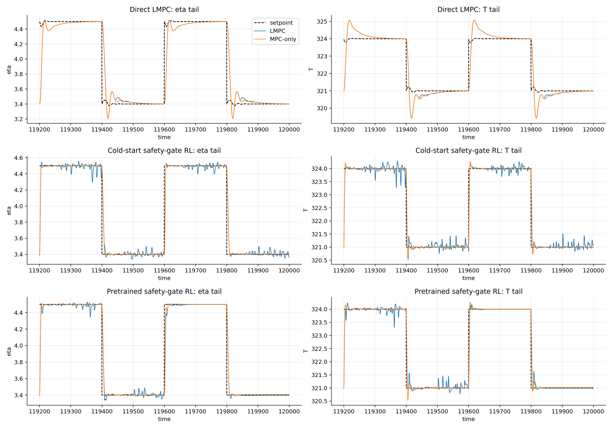
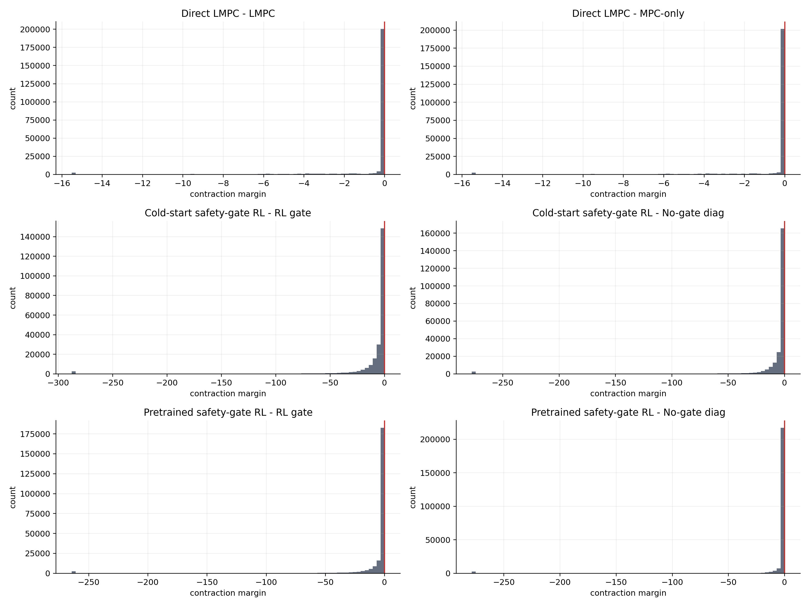
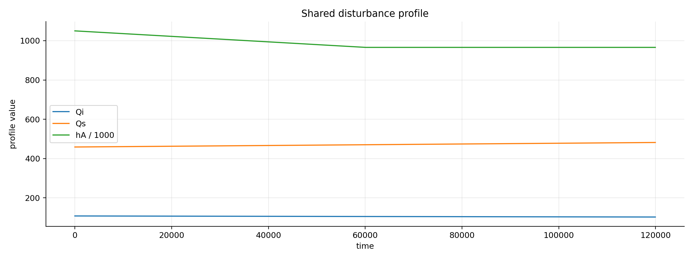

# Extended 300-Episode Direct LMPC And Safety-Gate RL Analysis

Date: 2026-06-06

## Objective

This report analyzes the latest 300-episode runs for:

- direct governed-reference Lyapunov MPC,
- cold-start TD3 with the direct Lyapunov safety gate,
- pretrained TD3 with the direct Lyapunov safety gate.

The analysis uses the fixed proof-track setting:

$$
\rho = 0.99,
\qquad
\epsilon = 5\times 10^{-3},
\qquad
N_{\mathrm{episodes}}=300.
$$

The goal is to decide whether the fixed-$\epsilon$ Lyapunov configuration is scientifically usable, whether the RL safety gate is helping, and what should be changed before moving toward a vanishing-$\epsilon$ proof.

## Result Bundles

| Study | Result root | Main case | Baseline/export case |
|---|---|---|---|
| Direct LMPC | `results/directLyap/20260606_020549` | `lyap_governed_reference` | `mpc_only` |
| Cold-start RL | `results/ColdStart/20260606_020555` | `rl_gate_governed_reference` | `mpc_only` |
| Pretrained RL | `results/Pretrain/20260606_020559` | `rl_gate_governed_reference` | `mpc_only` |

Each bundle has 240000 steps, corresponding to 300 episodes with 800 steps per episode.

Important naming caveat: the `mpc_only` export inside the RL training runner is best interpreted as a **no-gate diagnostic baseline inside the RL loop**, not necessarily the standalone pure offset-free MPC rollout. The disturbance and setpoint schedules match, but the no-gate trajectory can still depend on the RL-loop phase and agent behavior path. For the direct LMPC runner, `mpc_only` is the standalone offset-free MPC diagnostic case.

## Method Summary

The augmented output-disturbance prediction model is treated as:

$$
\hat z_k =
\begin{bmatrix}
\hat x_k \\
\hat d_k
\end{bmatrix},
\qquad
\hat z_{k+1}=A_{\mathrm{aug}}\hat z_k+B_{\mathrm{aug}}u_k,
\qquad
\hat y_k=C_{\mathrm{aug}}\hat z_k.
$$

The governed target is the reachable steady output closest to the governed command:

$$
(x_{s,k},u_{s,k})
\in
\arg\min_{x_s,u_s}
\|C x_s+C_d\hat d_k-r_{\mathrm{cmd},k}\|_{Q_r}^2
$$

subject to:

$$
\begin{aligned}
x_s &= A x_s+B u_s+B_d\hat d_k,\\
u_{\min}^{\mathrm{tight}} &\le u_s \le u_{\max}^{\mathrm{tight}},\\
d_s &= \hat d_k,\\
y_s &= Cx_s+C_d d_s.
\end{aligned}
$$

The Lyapunov function is centered on this governed equilibrium:

$$
V_k=(\hat x_k-x_{s,k})^\top P(\hat x_k-x_{s,k}).
$$

The fixed-$\epsilon$ contraction condition is:

$$
V_{k+1|k}\le 0.99V_k+5\times 10^{-3}.
$$

For a fixed target and exact prediction model, this gives practical stability:

$$
\limsup_{k\to\infty} V_k
\le
\frac{5\times10^{-3}}{1-0.99}
=0.5.
$$

For safety-gate RL, the TD3 action is treated as a candidate. If it passes the direct Lyapunov check, it is accepted. If not, the fallback LMPC action is used:

$$
u_k =
\begin{cases}
u_{\mathrm{RL},k}, & V(\hat x_{k+1}(u_{\mathrm{RL},k})-x_{s,k}) \le \rho V_k+\epsilon,\\
u_{\mathrm{LMPC},k}, & \text{otherwise.}
\end{cases}
$$

## Figures And Data Products

Generated analysis artifacts are saved under:

```text
report/figures/2026-06-06_lmpc_rl_300_episode_analysis/
```

The script used to generate them is:

```text
report/figures/2026-06-06_lmpc_rl_300_episode_analysis/make_figures.py
```

The metric files are:

- `metrics_table.csv`
- `metrics_summary.json`
- `late_episode_metrics.csv`
- `late_episode_metrics.json`
- `disturbance_equality_checks.json`

## Overall Results



Full-run tracking and reward:

| Study | Case | Mean RMSE | Reward no penalty | Mean target mismatch |
|---|---|---:|---:|---:|
| Direct LMPC | LMPC | 0.378 | -4.343 | 0.513 |
| Direct LMPC | MPC-only | 0.378 | -4.333 | 0.509 |
| Cold-start RL | RL gate | 0.317 | -13.937 | 1.038 |
| Cold-start RL | No-gate diag | 0.305 | -12.708 | 0.848 |
| Pretrained RL | RL gate | 0.243 | -7.528 | 0.692 |
| Pretrained RL | No-gate diag | 0.198 | -4.398 | 0.325 |

The direct LMPC result is the cleanest proof-track result. It matches the offset-free MPC diagnostic almost exactly in output RMSE while enforcing the hard Lyapunov condition at every step.

The RL results show learning improvement, especially from cold-start to pretrained. However, both safety-gate RL cases remain worse than their same-run no-gate diagnostic cases on full-run reward and tracking. The safety gate protects the rollout, but the learned policy is not yet outperforming the baseline behavior path.

## Safety And Intervention Results



Reliability and safety rates:

| Study | Case | Verified/contracting | Diagnostic unsafe | Fallback | Intervention |
|---|---|---:|---:|---:|---:|
| Direct LMPC | LMPC | 1.000 | 0.0000 | n/a | n/a |
| Direct LMPC | MPC-only | 0.998 | 0.0018 | n/a | 0.000 |
| Cold-start RL | RL gate | 0.999 | 0.0000 | 0.0339 | 0.0354 |
| Cold-start RL | No-gate diag | 1.000 | 0.0745 | 0.0000 | 0.0000 |
| Pretrained RL | RL gate | 0.999 | 0.0000 | 0.0631 | 0.0646 |
| Pretrained RL | No-gate diag | 1.000 | 0.1824 | 0.0000 | 0.0000 |

Interpretation:

- Direct LMPC eliminated all contraction violations.
- Direct MPC-only violated the same diagnostic at 0.18% of steps, so `epsilon = 5e-3` is still active but not overly restrictive.
- Cold-start RL required fallback on 3.39% of steps.
- Pretrained RL required fallback on 6.31% of steps.
- The no-gate RL diagnostics would have violated the Lyapunov test frequently, especially in the pretrained run.

The pretrained policy tracks better than the cold-start policy, but it also creates more safety-gate corrections. That suggests the pretrained policy is more capable but more aggressive relative to the Lyapunov certificate.

## Episode Trends



The episode trends separate two effects that the full-run averages mix together:

- early learning and behavior-cloning transients,
- late-run closed-loop behavior after the policies have adapted.

Last-50-episode metrics:

| Study | Case | Last 50 RMSE | Last 50 reward no penalty | Last 50 fallback |
|---|---|---:|---:|---:|
| Direct LMPC | LMPC | 0.370 | -4.267 | 0.0000 |
| Direct LMPC | MPC-only | 0.370 | -4.250 | 0.0000 |
| Cold-start RL | RL gate | 0.200 | -5.747 | 0.0561 |
| Cold-start RL | No-gate diag | 0.188 | -4.132 | 0.0000 |
| Pretrained RL | RL gate | 0.199 | -5.455 | 0.0637 |
| Pretrained RL | No-gate diag | 0.187 | -3.953 | 0.0000 |

Late-run interpretation:

- The cold-start RL gate improves dramatically after the first 20 episodes.
- The pretrained RL gate starts better and ends slightly better than cold-start in reward, but late-run RMSE is very similar.
- Neither RL gate beats the same-run no-gate diagnostic over the last 50 episodes.
- The safety gate is still active in the late run, which means the RL policy has not learned a naturally certified action distribution.

## Tail Tracking Behavior



The tail plots show that:

- Direct LMPC and direct MPC-only are almost indistinguishable.
- Cold-start RL has visible high-frequency action/output ripple around both setpoints.
- Pretrained RL is smoother than cold-start but still shows correction-driven deviations, especially around the temperature output after setpoint changes.
- The no-gate diagnostic trajectories are smoother in the final window, but they are not certified by the Lyapunov diagnostic.

This supports the main conclusion: the safety gate is doing its job, but the RL policy is still paying for unsafe or poorly aligned candidate actions.

## Lyapunov Contraction Margins



The margin is interpreted as:

$$
m_k=V_{k+1|k}-\left(\rho V_k+\epsilon\right).
$$

Negative margins satisfy the Lyapunov test. Positive margins violate it.

The direct LMPC margin distribution stays below zero because the hard constraint is enforced. The direct MPC-only case has a small positive tail. The RL no-gate diagnostic cases have much larger unsafe diagnostic rates, while the safety-gate RL cases use fallback to avoid reported unsafe applied actions.

The remaining proof risk in the RL runs is not target failure. Target success is 100%. The remaining risk is fallback/solver handling. Cold-start has 343 solver-fail-hold-previous steps, and pretrained has 345. For a strict theorem, those steps need either a verified hold-previous certificate or a clear numerical-exception statement.

## Disturbance Consistency



Within each latest result bundle, the saved disturbance arrays match exactly between the main case and the diagnostic case:

| Study | Max `qi` diff | Max `qs` diff | Max `ha` diff |
|---|---:|---:|---:|
| Direct LMPC | 0.0 | 0.0 | 0.0 |
| Cold-start RL | 0.0 | 0.0 | 0.0 |
| Pretrained RL | 0.0 | 0.0 | 0.0 |

Cold-start and pretrained also have identical `qi`, `qs`, `ha`, and physical setpoint arrays. The different trajectories therefore come from controller behavior, not from different disturbances or setpoints.

## Target Selector Diagnostics

The governed target selector remained numerically reliable.

| Study | Case | Target success | Max residual | Max mismatch |
|---|---|---:|---:|---:|
| Direct LMPC | LMPC | 1.000 | 5.32e-4 | 4.940 |
| Direct LMPC | MPC-only | 1.000 | 4.52e-4 | 4.940 |
| Cold-start RL | RL gate | 1.000 | 1.19e-3 | 18.852 |
| Cold-start RL | No-gate diag | 1.000 | 2.24e-4 | 15.416 |
| Pretrained RL | RL gate | 1.000 | 3.79e-4 | 12.606 |
| Pretrained RL | No-gate diag | 1.000 | 1.18e-3 | 9.988 |

The residuals are small, so the target selector is solving the model equilibrium problem. The mismatch values are not primarily numerical failures. They indicate the gap between the raw setpoint and the reachable governed target under the current estimate and constraints.

This supports the proof logic from the proof-track report: using the bare governed target does not weaken practical stability. The Lyapunov proof is centered on a feasible model equilibrium. The remaining issue is how much that target moves and how large the raw setpoint mismatch becomes.

## Main Interpretation

The direct LMPC run validates the fixed-epsilon proof-track configuration. The controller gives essentially the same tracking as the offset-free diagnostic case while removing the small contraction-violation tail.

The RL safety gate is effective as a safety mechanism. In both RL runs, the applied safety-gated controller reports zero diagnostic unsafe rate, while the no-gate diagnostic path shows substantial would-be unsafe rates. This is exactly what the safety gate should do.

The RL policies are not yet control-performance winners. Cold-start learning improves over time, and pretraining gives a large improvement over cold-start in the full-run average. However, the safety-gated RL cases still trail the same-run no-gate diagnostic cases in reward and RMSE. The fallback/intervention rates show why: the policy still proposes actions that the Lyapunov gate must correct.

The fixed-$\epsilon$ practical proof remains appropriate. The current evidence does not justify an asymptotic convergence claim for the full changing-disturbance, changing-reference run. A future vanishing-$\epsilon$ theorem should include target motion and disturbance-estimate motion:

$$
V_{k+1}
\le
\rho V_k
+\epsilon_k
+c_s\|x_{s,k+1}-x_{s,k}\|^2
+c_d\|\hat d_{k+1}-\hat d_k\|^2
+c_m\|\Delta_{\mathrm{model},k}\|^2.
$$

If the target, disturbance estimate, and model error settle, and $\epsilon_k\to 0$, then an asymptotic governed-equilibrium result is defensible. Otherwise, the correct claim remains practical or input-to-state Lyapunov stability.

## Bugs, Inconsistencies, And Risks

The RL `mpc_only` label is misleading. In the RL runner, the `mpc_only_diagnostic` backend bypasses the safety gate and records Lyapunov diagnostics on the candidate action generated inside the RL behavior path. It should be treated as a no-gate diagnostic baseline, not necessarily as pure offset-free MPC.

The RL aggregate metrics include early training transients. Final evaluation should use frozen saved agents with exploration disabled.

The safety-gate RL fallback solver has rare non-optimal events. Cold-start has 343 solver-fail-hold-previous steps, and pretrained has 345. These are small relative to 240000 steps, but they matter for proof language.

The target mismatch is larger in RL runs than in direct LMPC. This does not break the Lyapunov proof around the governed target, but it matters for raw setpoint tracking claims.

## Recommended Next Experiments

1. **Frozen saved-agent evaluation**

   Purpose: separate final policy quality from training transients.

   Change: run the latest saved cold-start and pretrained agents with exploration disabled and a fixed disturbance/setpoint profile.

   Metric to improve: last-episode RMSE, reward no penalty, fallback rate.

   Failure mode to watch: the policy still needs more than 2% fallback after training.

2. **Pure MPC baseline audit**

   Purpose: remove ambiguity from the RL `mpc_only` label.

   Change: either rename the RL export to `no_gate_diagnostic` or implement a true pure offset-free MPC branch that applies `solve_offset_free_mpc_candidate(...)` at every step.

   Metric to inspect: whether all pure MPC baselines match under identical setpoint/disturbance schedules.

3. **Policy certification loss**

   Purpose: reduce fallback rate.

   Change: add a behavior-cloning or auxiliary loss that penalizes the gap between policy action and certified safe action:

   $$
   J_{\mathrm{cert}} =
   J_{\mathrm{TD3}}
   +\lambda_{\mathrm{safe}}\|u_{\mathrm{policy}}-u_{\mathrm{safe}}\|^2.
   $$

   Metric to improve: fallback rate, weighted correction gap, reward no penalty.

4. **Adaptive epsilon prototype**

   Purpose: move toward an asymptotic-style proof without sacrificing robustness after setpoint/disturbance changes.

   Change:

   $$
   \epsilon_k =
   \epsilon_0\beta^{\tau_k}
   +c_s\|x_{s,k}-x_{s,k-1}\|^2
   +c_d\|\hat d_k-\hat d_{k-1}\|^2.
   $$

   Metric to inspect: contraction feasibility, fallback rate, and whether $\epsilon_k$ actually decays during steady segments.

## Current Phase

The project is now in a **fixed-epsilon proof validation and RL policy diagnosis phase**.

Direct LMPC is ready to be written as a practical Lyapunov result around the governed target. Safety-gate RL is safe enough to continue, but the policy needs final frozen-agent evaluation and a clearer baseline before claiming control-performance improvement.
