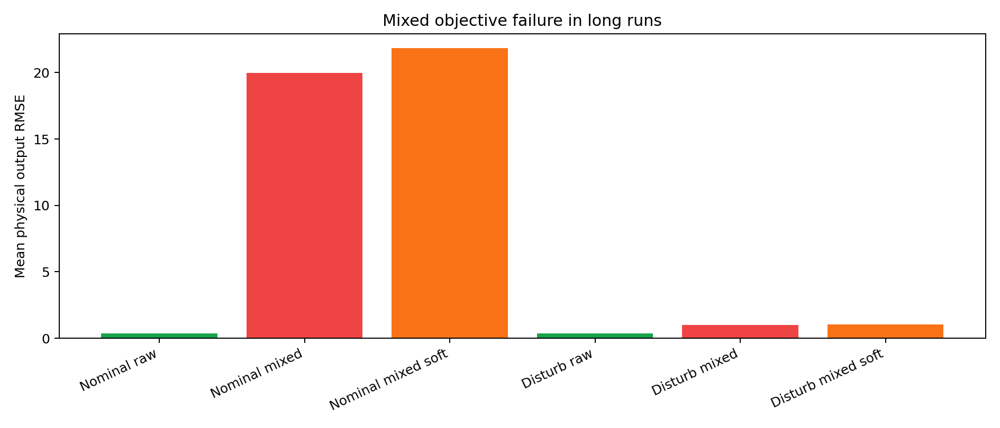
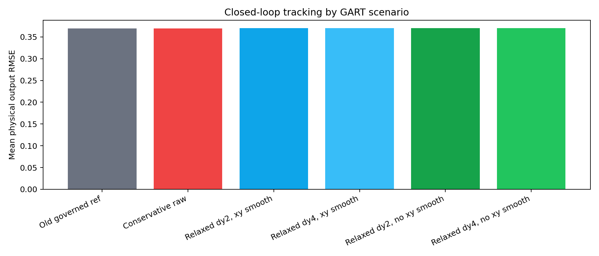
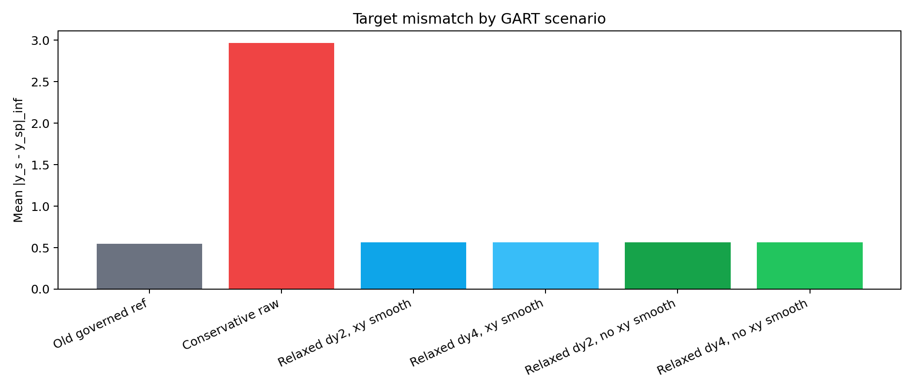
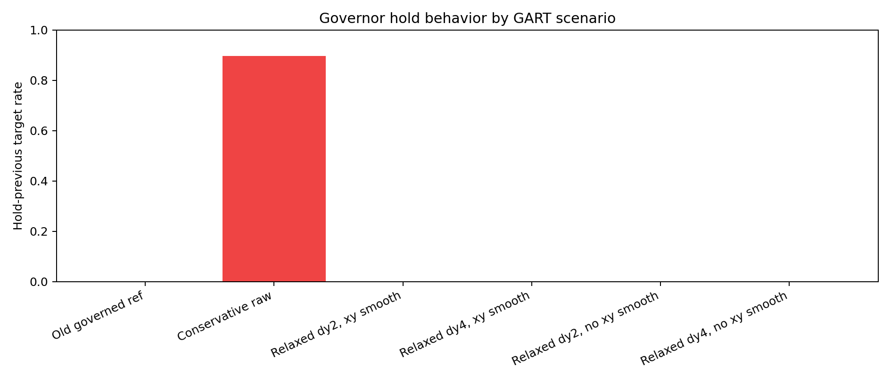

# GART-LMPC Scenario Analysis

This report rewrites the earlier post-patch run note into a scenario-level analysis of the GART-LMPC experiments completed on 2026-06-14.

## Recommendation

Move forward with:

`gart_target_raw_no_dx_headroom_0p01_dy2`

using the latest no-`x_s/y_s` smoothing configuration from `results/GARTLMPC/20260614_134444`.

This is the best forward method because it fixes the main target-selector failure mode without changing the closed-loop tracking objective:

- `hold_previous` drops from `89.6%` to `0.0%`.
- acceptable target rate rises from `7.8%` to `76.9%`.
- mean target mismatch drops from `2.966` to `0.561`.
- solver success remains `100%`.
- hard first-step Lyapunov contraction remains `100%`.
- physical tracking RMSE remains close to the old governed-reference baseline.

Do not move forward with mixed objective yet. Mixed objective still penalizes the controller toward `y_s/u_s`; when `y_s` is imperfect, mixed tracking pulls away from the raw setpoint. Raw objective is the stable path for RL safety integration.

## Method Summary

The GART target selector solves a steady-state target problem in scaled-deviation coordinates. Stage 1 finds the closest admissible output target:

$$
\min_{x_s,u_s}\; \|W_y(y_s-r)\|_2^2,
\qquad y_s = Cx_s + C_d d_{\mathrm{cert}}.
$$

Stage 2 stays inside the stage-1 primary-cost shell and applies only tie-breaker regularization. The latest forward configuration uses:

$$
\min_{x_s,u_s}\;
\|W_{\mathrm{mid}}(u_s-u_{\mathrm{mid}})\|_2^2
+ \|W_u(u_s-u_{t-1})\|_2^2 .
$$

The previous `x_s/y_s` smoothing terms are disabled for the forward cases:

$$
\|W_x(x_s-x_{s,\mathrm{prev}})\|_2^2
+ \|W_y(y_s-y_{s,\mathrm{prev}})\|_2^2
= 0.
$$

The MPC objective for the forward GART cases remains raw setpoint tracking:

$$
\sum_{k=1}^{N_p}\|y_k-y_{sp}\|_{Q_{\mathrm{raw}}}^2
+ \sum_{k=0}^{N_c-1}\|\Delta u_k\|_{R_{\Delta u}}^2 .
$$

The Lyapunov terminal and first-step contraction constraints are still centered on the accepted GART target.

## Case Study 1: Mixed Objective Fails

Runs:

- `results/GARTLMPC/20260613_235051`
- `results/GARTLMPC/20260614_003718`

These runs tested raw GART, mixed hard GART, and mixed soft GART in long 400-step-per-episode studies. The mixed objective is not ready.

| Run | Case | Reward Mean | Output RMSE | Solver | Contract |
|---|---|---:|---:|---:|---:|
| `20260613_235051` | raw | -4.127867 | 0.370129 | 1.000 | 1.000 |
| `20260613_235051` | mixed hard | -2748.021910 | 19.984340 | 0.881 | 0.881 |
| `20260613_235051` | mixed soft | -3248.074551 | 21.847675 | 0.799 | 0.799 |
| `20260614_003718` | raw | -4.145251 | 0.369627 | 1.000 | 1.000 |
| `20260614_003718` | mixed hard | -19.115195 | 0.985657 | 1.000 | 1.000 |
| `20260614_003718` | mixed soft | -19.174384 | 1.032055 | 1.000 | 1.000 |



Interpretation:

- Mixed hard/soft were damaged by poor or stale targets.
- In the nominal long run, mixed hard and mixed soft produced catastrophic RMSE.
- In the disturbed long run, mixed did not fully collapse but still performed much worse than raw.
- The failure is methodological: if `y_s` is not reliably close to `y_{sp}`, then penalizing `y-y_s` is the wrong performance objective.

Decision:

Do not use mixed objective for the next RL/safety experiments. Keep it disabled until the target selector is consistently high quality and a gated mixed test is run.

## Case Study 2: Conservative Raw GART Tracks, But Target Quality Is Bad

Run:

- `results/GARTLMPC/20260614_124954`

This was the first correctness-patch disturbance run. It used raw tracking, so plant tracking remained good, but target quality was poor.

| Case | Reward Mean | Output RMSE | Target Mean | Target Max | Hold Rate |
|---|---:|---:|---:|---:|---:|
| old governed reference | -4.143741 | 0.369616 | 0.548526 | 4.980628 | 0.000 |
| conservative GART raw | -4.143741 | 0.369616 | 2.966007 | 4.953267 | 0.896 |

Target quality:

| Metric | Conservative GART Raw |
|---|---:|
| Good target rate | 0.059 |
| Acceptable target rate | 0.078 |
| Unreachable classification rate | 0.922 |
| Hold-previous rate | 0.896 |
| Stage counts | `hold_previous`: 3584, `stage2`: 416 |

Interpretation:

- Raw objective hid the target-selector problem because the MPC still tracked `y_{sp}`.
- This was not good enough for mixed objective or RL pretraining.
- `y_s` was mostly constant because the governor held the previous target on most steps.

Decision:

Do not move forward with this conservative target selector. It is safe for raw tracking, but it is not useful as a certified target generator for RL exploration or mixed objectives.

## Case Study 3: Relaxed Target With X/Y Smoothing Fixes Hold Behavior

Run:

- `results/GARTLMPC/20260614_133147`

Configuration:

- `input_headroom_frac = 0.01`
- `dx_s_max = None`
- `dy_rate_scale = 2.0` or `4.0`
- `W_u_smooth_diag = [1.0, 1.0]`
- `W_x_smooth_diag = [0.01, ..., 0.01]`
- `W_y_smooth_diag = [1.0, 1.0]`
- stage-2 input smoothing source: `previous_applied_input`
- `eta_y = 0.0`, `eta_u = 0.0`

Performance:

| Case | Reward Mean | Output RMSE | Target Mean | Target Max | Hold Rate |
|---|---:|---:|---:|---:|---:|
| relaxed dy2, x/y smooth | -4.157946 | 0.370104 | 0.561506 | 4.958675 | 0.000 |
| relaxed dy4, x/y smooth | -4.157946 | 0.370104 | 0.562021 | 4.960374 | 0.000 |

Target quality:

| Case | Good | Acceptable | Unreachable | Stage-2 Smoothing |
|---|---:|---:|---:|---|
| relaxed dy2, x/y smooth | 0.458 | 0.769 | 0.231 | `previous_applied_input` |
| relaxed dy4, x/y smooth | 0.458 | 0.769 | 0.231 | `previous_applied_input` |

Interpretation:

- This is the first GART target selector that behaves like a usable online target generator.
- The large improvement came from removing the `dx_s` rate bottleneck, reducing input headroom to 1%, and smoothing `u_s` to the actual previous applied input.
- Dy4 reduced some governor-small-alpha events but did not improve tracking or target mismatch in a meaningful way.

Decision:

This case is viable. It already fixes the hold problem. However, because `x_s/y_s` smoothing is questionable for random or aggressive references, the next case is cleaner.

## Case Study 4: Relaxed Target With No X/Y Smoothing

Run:

- `results/GARTLMPC/20260614_134444`

Configuration:

- `input_headroom_frac = 0.01`
- `dx_s_max = None`
- `dy_rate_scale = 2.0` or `4.0`
- `W_u_smooth_diag = [1.0, 1.0]`
- `W_x_smooth_diag = [0.0, ..., 0.0]`
- `W_y_smooth_diag = [0.0, 0.0]`
- stage-2 input smoothing source: `previous_applied_input`
- contraction probe required
- raw objective only: `eta_y = 0.0`, `eta_u = 0.0`

Performance:

| Case | Reward Mean | Output RMSE | Target Mean | Target Max | Hold Rate |
|---|---:|---:|---:|---:|---:|
| relaxed dy2, no x/y smooth | -4.157946 | 0.370104 | 0.561282 | 4.958675 | 0.000 |
| relaxed dy4, no x/y smooth | -4.157946 | 0.370104 | 0.561340 | 4.958675 | 0.000 |

Target quality:

| Case | Good | Acceptable | Unreachable | Stage-2 Smoothing |
|---|---:|---:|---:|---|
| relaxed dy2, no x/y smooth | 0.458 | 0.769 | 0.231 | `previous_applied_input` |
| relaxed dy4, no x/y smooth | 0.458 | 0.769 | 0.231 | `previous_applied_input` |







Interpretation:

- Removing `x_s/y_s` smoothing did not materially change performance compared with the already-relaxed x/y-smooth case.
- That means the dominant fix was not only the smoothing removal. The dominant fix was the combined relaxation of `dx_s`, input headroom, and the use of `u_{t-1}` as the input smoothing reference.
- Still, disabling `x_s/y_s` smoothing is the cleaner forward formulation for random setpoint schedules and RL exploration. It avoids artificial target stickiness without increasing the input-smoothing burden.

Decision:

Use the dy2 no-`x_s/y_s` smoothing case as the forward controller. Keep dy4 as a sensitivity option, not the default, because it gives no meaningful tracking or target-quality benefit in these data.

## Cross-Scenario Summary

| Case | Run | Reward Mean | Output RMSE | Target Mean | Solver | Contract |
|---|---|---:|---:|---:|---:|---:|
| old governed reference | `20260614_124954` | -4.143741 | 0.369616 | 0.548526 | 1.000 | 1.000 |
| conservative GART raw | `20260614_124954` | -4.143741 | 0.369616 | 2.966007 | 1.000 | 1.000 |
| relaxed dy2, x/y smooth | `20260614_133147` | -4.157946 | 0.370104 | 0.561506 | 1.000 | 1.000 |
| relaxed dy4, x/y smooth | `20260614_133147` | -4.157946 | 0.370104 | 0.562021 | 1.000 | 1.000 |
| relaxed dy2, no x/y smooth | `20260614_134444` | -4.157946 | 0.370104 | 0.561282 | 1.000 | 1.000 |
| relaxed dy4, no x/y smooth | `20260614_134444` | -4.157946 | 0.370104 | 0.561340 | 1.000 | 1.000 |

Target quality summary:

| Case | Good | Acceptable | Unreachable | Hold |
|---|---:|---:|---:|---:|
| conservative GART raw | 0.059 | 0.078 | 0.922 | 0.896 |
| relaxed dy2, x/y smooth | 0.458 | 0.769 | 0.231 | 0.000 |
| relaxed dy4, x/y smooth | 0.458 | 0.769 | 0.231 | 0.000 |
| relaxed dy2, no x/y smooth | 0.458 | 0.769 | 0.231 | 0.000 |
| relaxed dy4, no x/y smooth | 0.458 | 0.769 | 0.231 | 0.000 |

## What Is Okay To Go Forward

Recommended forward method:

```text
gart_target_raw_no_dx_headroom_0p01_dy2
```

with:

```text
input_headroom_frac = 0.01
dx_s_max = None
dy_rate_scale = 2.0
W_u_smooth_diag = [1.0, 1.0]
W_x_smooth_diag = zeros
W_y_smooth_diag = zeros
stage2_u_smooth_source = previous_applied_input
eta_y = 0.0
eta_u = 0.0
lyapunov_mode = hard
rho = 0.99
eps = 0.001
```

Why this is the forward method:

- It keeps the proof-relevant Lyapunov contraction path active.
- It keeps the performance objective aligned with the raw setpoint.
- It fixes the target hold issue.
- It avoids using `x_s/y_s` smoothing as an artificial prior during random or aggressive references.
- It preserves good numerical reliability.

Do not move forward with:

- `gart_target_mixed_objective`
- `gart_target_mixed_soft`
- the conservative GART raw configuration from `20260614_124954`

## Next Steps

1. Use `gart_target_raw_no_dx_headroom_0p01_dy2` as the default GART-LMPC controller.
2. Run the same configuration under RL exploration, but keep the MPC objective raw and use the GART target only for certification.
3. Add RL diagnostics for:
   - target accepted/usable rate
   - hold rate
   - target mismatch
   - first-step contraction margin
   - input movement
   - safety fallback/refusal rate
4. Only revisit mixed objective after the RL closed-loop target-quality logs remain close to the dy2 no-`x_s/y_s` smoothing results.

