# Latest Lyapunov Results Synthesis

## Objective

This report consolidates the latest saved results and implementation state for:

- `DirectLyapunovMPC_FrozenOutputDisturbance.ipynb`
- `LyapunovSafetyFilterMPCTargetSelectorTermAblation.ipynb`
- `LyapunovSafetyFilterRL.ipynb`

The goal is to answer four questions:

1. What each notebook is actually doing now
2. What the latest saved results say quantitatively
3. Why the selector-term ablation case `objective_zero` can still work well
4. What the progress line is for the direct path versus the safety-filter paths

## Files Inspected

Primary notebooks:

- `DirectLyapunovMPC_FrozenOutputDisturbance.ipynb`
- `LyapunovSafetyFilterMPCTargetSelectorTermAblation.ipynb`
- `LyapunovSafetyFilterRL.ipynb`

Primary controller code:

- `Lyapunov/direct_lyapunov_mpc.py`
- `Lyapunov/frozen_output_disturbance_target.py`
- `Lyapunov/target_selector.py`
- `Lyapunov/safety_filter.py`
- `Simulation/run_mpc_lyapunov.py`
- `Simulation/run_rl_lyapunov.py`
- `analysis/steady_state_debug_analysis.py`

Saved result bundles used for the analysis:

- `Data/debug_exports/direct_lyapunov_mpc_ten_scenario/20260424_162348/`
- `Data/debug_exports/mpc_selector_term_ablation/20260330_233901/`
- `Data/debug_exports/rl_safety_filter/20260330_212055/`
- `Data/debug_exports/mpc_safety_filter/20260330_180058/`

Important caveat:

- the saved direct bundle analyzed below comes from an earlier nominal ten-scenario run with `n_tests = 2`, `set_points_len = 1500`, and `use_target_output_for_tracking = True`
- the current direct notebook defaults were later narrowed to a two-case nominal single-setpoint study with `n_tests = 1`, `set_points_len = 2000`, and `use_target_output_for_tracking = False`
- the saved selector-ablation and RL safety-filter notebooks are run in `mode = "disturb"` with `set_points_len = 400`
- the direct path uses output-disturbance augmentation
- the saved ablation and RL studies use different augmented models and different closed-loop architectures

So the comparisons below are mechanistic and directional. They are not all apples-to-apples benchmark tables.

## What The Current Methods Are Doing

### 1. Direct frozen-output-disturbance Lyapunov MPC

The saved direct result bundle analyzed in this report comes from an earlier ten-case matrix, not the older four-case matrix. The saved run settings used for the analysis below are:

- `use_target_output_for_tracking = True`
- `objective_steady_input_cost = False`
- `objective_terminal_cost = False`
- `plant_mode = "nominal"`
- `n_tests = 2`
- `set_points_len = 1500`

At each step it:

1. estimates the augmented state
2. freezes the output disturbance estimate
3. solves a steady target
4. solves one direct Lyapunov-constrained tracking MPC problem around that target

The target solver in `Lyapunov/frozen_output_disturbance_target.py` has two modes:

- `unbounded`
- `bounded`

The `bounded` mode can also add a regularization term toward the current applied input through `u_ref_weight`.

### 2. Safety-filter MPC with refined Step A selector

The ablation notebook keeps the standard two-layer architecture:

1. an upstream offset-free MPC generates the candidate action
2. the Lyapunov safety filter accepts it or corrects it

The refined Step A selector computes the steady target `(x_s, u_s)` under steady-state and bound constraints. The ablation changes only the selector objective activation mask.

### 3. Safety-filter RL with TD3 upstream policy

The RL notebook keeps the same safety-filter idea, but replaces the upstream MPC candidate with a TD3 policy. The filter then:

- accepts the RL candidate when it passes the checks
- solves a QCQP correction when needed
- falls back to offset-free MPC when necessary

## Mathematical Interpretation

### Direct target solve

The direct target assumes output-disturbance augmentation with frozen disturbance:

$$
d_s = \hat d_k
$$

and steady-state equations

$$
x_s = A x_s + B u_s + B_d d_s
$$

$$
y_s = C x_s + C_d d_s
$$

For the direct notebook, the bounded variant solves a box-constrained least-squares steady-state problem when the exact steady input is outside the admissible input box. With optional input anchoring, the bounded target effectively solves

$$
\min_{x_s,u_s} J_{\mathrm{tgt}}(x_s,u_s)
$$

with

$$
J_{\mathrm{tgt}}(x_s,u_s)
=
\left\|(I-A)x_s - Bu_s - B_d d_s\right\|_2^2
+
\left\|Cx_s + C_d d_s - y_{sp}\right\|_2^2
+
\left\|u_s - u_{\mathrm{ref}}\right\|_{W_{u,\mathrm{ref}}}^2
$$

subject to

$$
u_{\min} \le u_s \le u_{\max}
$$

where `u_ref` is the current applied input in the notebook experiments.

### Direct Lyapunov MPC stage

In the saved ten-scenario direct run analyzed here, `use_target_output_for_tracking = True`, so the direct MPC does not track the raw scheduled setpoint directly. It tracks the modified target output `y_s`:

$$
\min_{\{u_i\},\sigma \ge 0}
\sum_{i=1}^{N_p} \| y_{i|k} - y_s \|_Q^2
+
\sum_{i=0}^{N_c-1} \| \Delta u_{i|k} \|_R^2
+
\lambda_\sigma \sigma
$$

subject to the prediction model, input bounds, terminal-set condition when active, and first-step Lyapunov contraction

$$
V(x_{1|k} - x_s) \le \rho V(\hat x_k - x_s) + \epsilon + \sigma
$$

for the soft cases, or without `\sigma` for the hard cases.

### Refined Step A selector

The refined selector in `Lyapunov/target_selector.py` solves

$$
\min_{x_s,u_s}
\|r_s - y_{sp}\|_{Q_r}^2
+
\|u_s - u_{\mathrm{applied},k}\|_{R_{u,\mathrm{ref}}}^2
+
\|u_s - u_{s,\mathrm{prev}}\|_{R_{\Delta u,\mathrm{sel}}}^2
+
\|x_s - x_{s,\mathrm{prev}}\|_{Q_{\Delta x}}^2
+
\|x_s - \hat x_k\|_{Q_{x,\mathrm{ref}}}^2
$$

subject to

$$
x_s = A x_s + B u_s + B_d \hat d_k
$$

$$
u_{\min} \le u_s \le u_{\max}
$$

and optional output bounds.

In `objective_zero`, all five objective terms are disabled. But the constraints are still active.

### Safety-filter QCQP

When the candidate does not pass the Lyapunov post-check, the safety filter solves a one-step QCQP of the form

$$
\min_u
\|u-u_{\mathrm{cand}}\|_{W_{\mathrm{cand}}}^2
+
\|u-u_{k-1}\|_{W_{\mathrm{move}}}^2
+
\|u-u_s\|_{W_{\mathrm{ss}}}^2
+
\|y_{k+1}(u)-y_{\mathrm{track}}\|_{W_y}^2
$$

subject to bounds and Lyapunov contraction

$$
V(x_{k+1}(u)-x_s) \le \rho V(\hat x_k-x_s) + \epsilon + s_v
$$

plus trust-region constraints when enabled.

This is the key point for the ablation study:

- `objective_zero` disables the selector objective
- it does not disable the upstream MPC objective
- it does not disable the safety-filter QCQP objective

So `objective_zero` is not equivalent to the direct formulation.

## Quantitative Results

### Direct notebook

The latest saved direct run is the ten-scenario nominal study at:

- `Data/debug_exports/direct_lyapunov_mpc_ten_scenario/20260424_162348/`

Compact performance table:

| Case | Target | Lyap | `u_ref_weight` | Reward mean | RMSE mean | Solver success |
| --- | --- | --- | ---: | ---: | ---: | ---: |
| `unbounded_hard` | unbounded | hard | 0.0 | -36.83 | 1.208 | 0.000 |
| `bounded_hard` | bounded | hard | 0.0 | -231.45 | 5.570 | 0.996 |
| `unbounded_soft` | unbounded | soft | 0.0 | -98.46 | 0.513 | 0.977 |
| `bounded_soft` | bounded | soft | 0.0 | -313.14 | 6.504 | 0.998 |
| `bounded_hard_u_prev` | bounded | hard | 0.1 | -27.66 | 0.807 | 1.000 |
| `bounded_soft_u_prev` | bounded | soft | 0.1 | -27.66 | 0.807 | 1.000 |
| `bounded_hard_u_prev_1p0` | bounded | hard | 1.0 | -35.14 | 1.115 | 1.000 |
| `bounded_soft_u_prev_1p0` | bounded | soft | 1.0 | -35.14 | 1.115 | 1.000 |
| `bounded_hard_u_prev_10p0` | bounded | hard | 10.0 | -36.61 | 1.196 | 1.000 |
| `bounded_soft_u_prev_10p0` | bounded | soft | 10.0 | -36.61 | 1.196 | 1.000 |

Main takeaways from the direct sweep:

- `unbounded_hard` is structurally unusable in this run. The exact target is outside bounds at all 6000 steps and the MPC is infeasible at all 6000 steps.
- `bounded_hard` and `bounded_soft` are feasible most of the time, but they are poor controllers because the bounded least-squares target sits on the input box at every step.
- adding a small target input anchor `u_ref_weight = 0.1` is the first direct variant that removes continuous boundary activation and gives 100 percent solver success.
- increasing the same regularization above `0.1` makes the target too conservative and starts degrading output tracking again.
- `unbounded_soft` gives the best direct output RMSE, but it gets that performance by leaning on an infeasible steady target and large Lyapunov slack rather than by finding a better admissible target.

Direct target-behavior diagnostics for the most important cases:

| Case | Mean target-ref inf err | Mean inf-norm of `u_s-u_prev` | Slack-active steps | Active-bound max |
| --- | ---: | ---: | ---: | ---: |
| `bounded_hard` | 4.544 | 12.913 | 0 | 2 upper and 2 lower |
| `bounded_soft` | 6.283 | 12.707 | 1 | 2 upper and 2 lower |
| `bounded_hard_u_prev` | 2.254 | 0.300 | 0 | 0 |
| `unbounded_soft` | ~0.000 | 438.495 | 4335 | n/a |

Control interpretation:

- `bounded_hard` and `bounded_soft` are not failing because the direct MPC optimizer is numerically broken. They are failing because the target being handed to it is usually a corner solution that is too far from the current operating region.
- `bounded_hard_u_prev` improves mainly because the steady target itself changes. The anchor term does not just smooth the trajectory. It selects an interior steady input that is reachable from the current operating region.
- `unbounded_soft` looks attractive in RMSE, but its target is physically aggressive and not admissible. That case is closer to "track the right output with a bad steady anchor and absorb the inconsistency with slack" than to "solve the direct steady-state problem correctly."

### Selector-term ablation notebook

Saved study:

- `Data/debug_exports/mpc_selector_term_ablation/20260330_233901/`

Compact comparison table:

| Study | Reward mean | RMSE eta | RMSE T | QCQP attempts | Accepted candidate |
| --- | ---: | ---: | ---: | ---: | ---: |
| `all_terms_on` | -3.773 | 0.180 | 0.533 | 0 | 100.000% |
| `only_u_applied_anchor` | -3.953 | 0.185 | 0.542 | 4 | 99.750% |
| `objective_zero` | -7.715 | 0.248 | 0.873 | 42 | 97.375% |
| `only_xhat_anchor` | -8.066 | 0.244 | 0.955 | 25 | 98.438% |
| `only_u_prev_smoothing` | -11.074 | 0.292 | 1.151 | 50 | 96.875% |
| `only_x_prev_smoothing` | -11.433 | 0.299 | 0.976 | 70 | 95.625% |
| `only_target_tracking` | -19.253 | 0.385 | 1.452 | 41 | 97.438% |

Interpretation:

- `all_terms_on` is still the best ablation case overall.
- `objective_zero` is worse than `all_terms_on`, but it is still much better than the current direct standalone controller in reward and in correction burden.
- among the single-term studies, `only_u_applied_anchor` is the strongest. That agrees with the direct notebook where a small input anchor is also the most valuable regularizer.
- `only_target_tracking` is the weakest single term. That means "make the target close to the setpoint" is not enough by itself. The selector also needs a notion of operating-region continuity.

This is a strong control-design result. In this polymer CSTR study, the best selector term is not the most obvious setpoint term. The most valuable single ingredient is the one that keeps the target close to the currently applied manipulated input.

### RL safety-filter notebook

Saved run:

- `Data/debug_exports/rl_safety_filter/20260330_212055/`

Summary:

| Metric | Value |
| --- | ---: |
| Steps | 160000 |
| Reward mean | -3.7673 |
| Accepted candidate | 95.886% |
| QCQP attempted | 4.114% |
| QCQP hard accepted | 2.944% |
| Verified MPC fallback | 0.015% |
| Unverified MPC fallback | 1.156% |
| Target success | 100.000% |

Interpretation:

- the RL policy is not collapsing. Most steps pass directly.
- the safety layer is still doing meaningful work. Around 4.1 percent of steps require QCQP attempts.
- performance is essentially tied with the saved MPC safety-filter baseline summary `reward_mean = -3.7651`.
- so the current RL result is promising as a safe replacement candidate, but it is not yet a clear performance improvement over the safe MPC baseline.

## Figure Set

All figures below were copied into:

- `report/figures/2026-04-30_lyapunov_results_synthesis/`

### Direct notebook figures

Direct sweep RMSE summary:

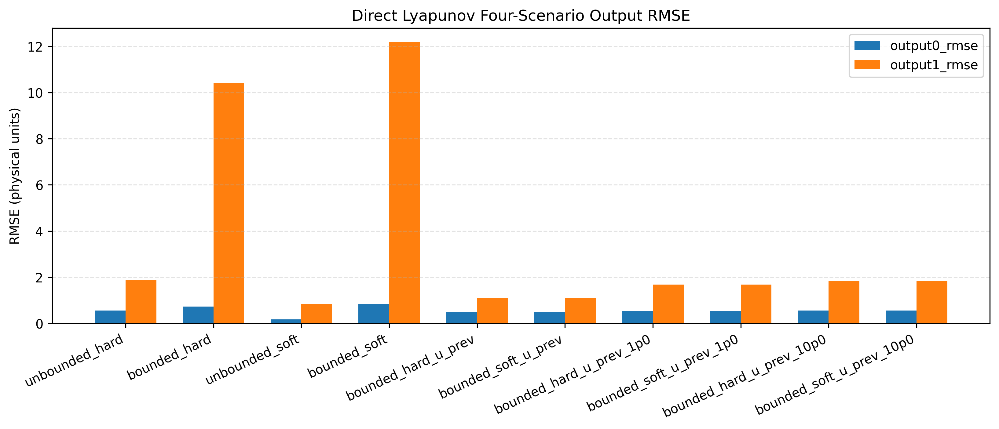

Direct sweep reward summary:

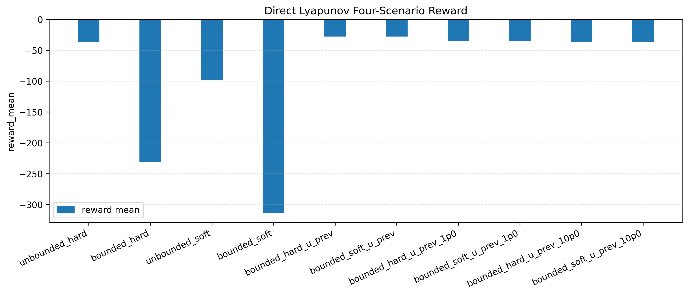

Direct sweep target residual and bounded-activity summary:

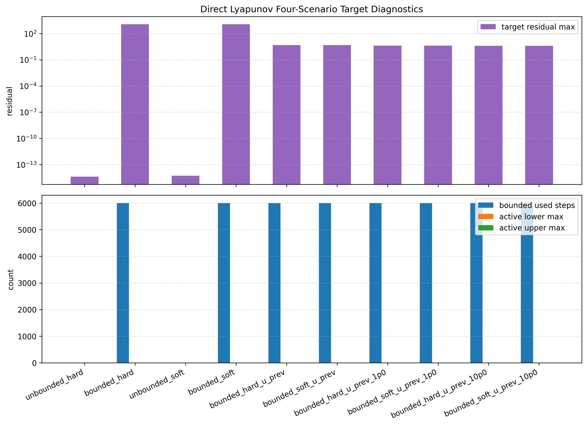

Direct bounded hard outputs:

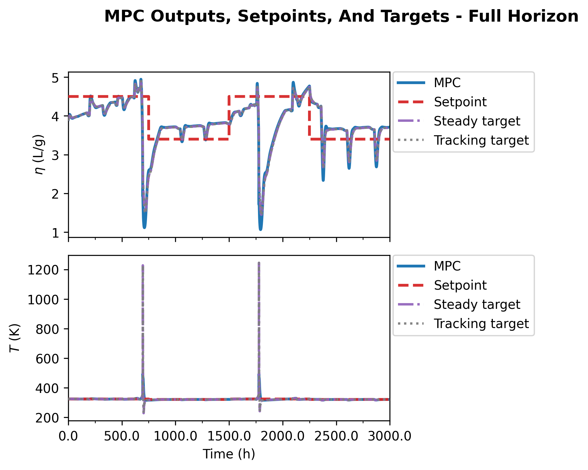

Direct bounded hard with `u_ref_weight = 0.1`:

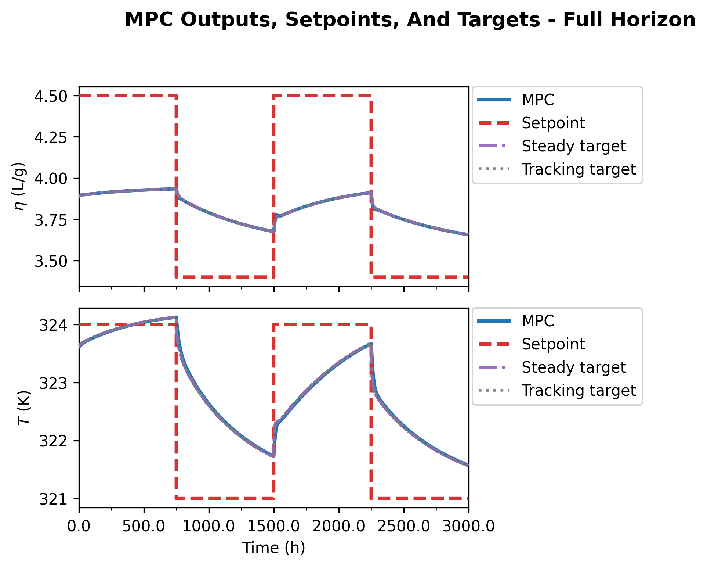

Direct unbounded soft outputs:

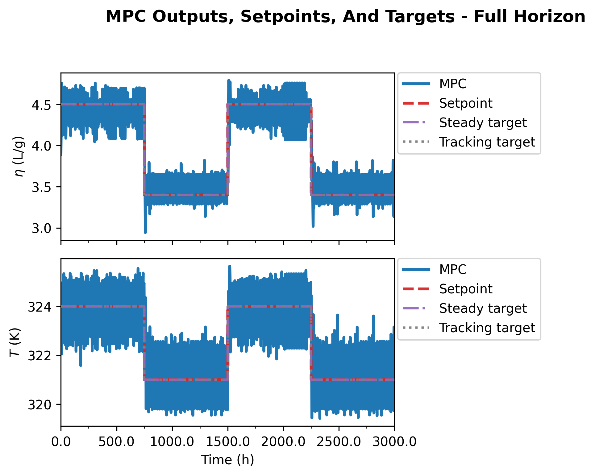

### Selector-ablation figures

Selector-ablation reward comparison:

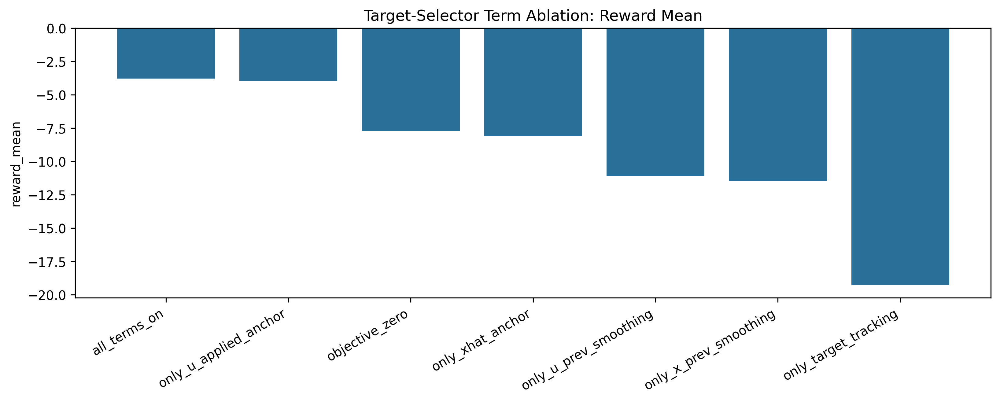

Selector-ablation output RMSE:

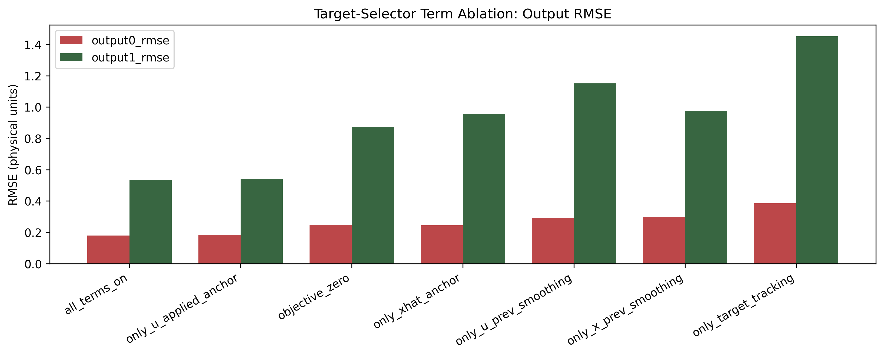

Selector-ablation target error:

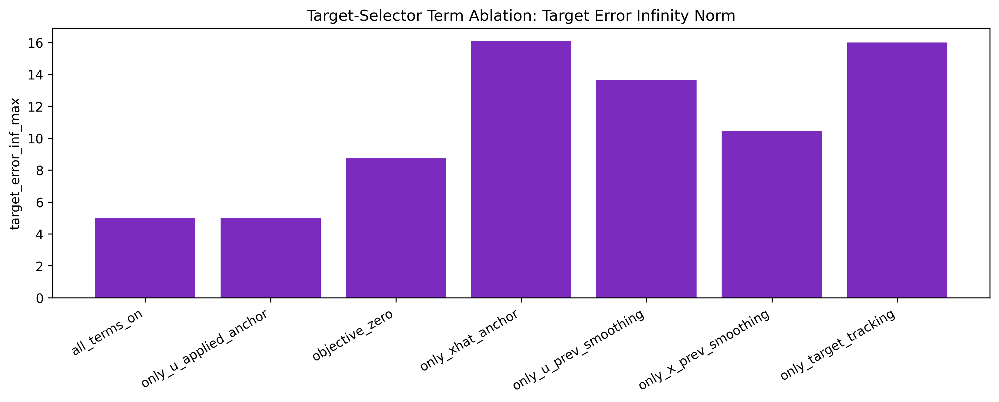

### RL safety-filter figures

RL safety-filter correction modes:

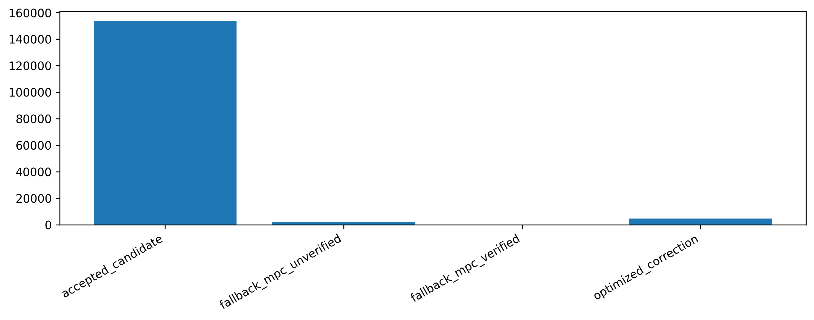

RL safety-filter QCQP status:

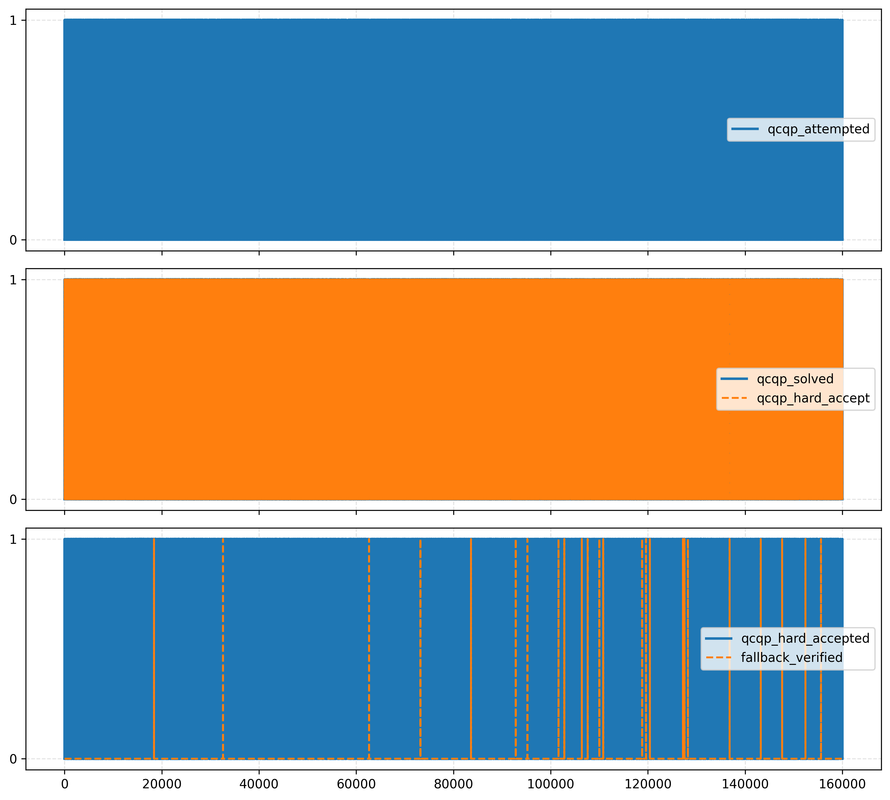

RL reward trace:

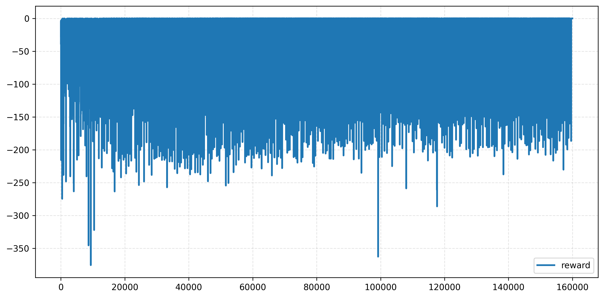

## Why `objective_zero` Can Still Work Better Than The Direct Path

This was the main mechanism question from the notebook comparison. The answer is that `objective_zero` is only superficially similar to the direct notebook.

### 1. `objective_zero` still has a strong controller upstream

In the ablation notebook, the upstream offset-free MPC still solves the main horizon problem against the raw setpoint. The selector only defines the steady target used by the safety filter. So even when the selector objective is removed, the controller is not "objective-free." The main control effort still comes from the upstream MPC.

Evidence:

- `objective_zero` accepted the candidate on 1558 of 1600 steps
- it only needed 42 QCQP attempts
- it only fell back unverified on 4 steps

So `objective_zero` is mostly "baseline offset-free MPC plus a constraint-defined Lyapunov target" rather than "a standalone direct target-tracking controller."

### 2. The safety-filter QCQP still has its own objective

Even when the selector terms are all off, the QCQP still minimizes:

- distance to the candidate input
- move size relative to the previous input
- distance to the steady input `u_s`
- output tracking error to the chosen tracking target

So `objective_zero` keeps a strong local control objective whenever correction is needed.

### 3. The saved direct run uses the modified target as the stage target

In the saved direct run used for this report, `use_target_output_for_tracking = True`. That means the stage objective tracks `y_s`, not the raw setpoint. If the bounded target is pushed onto a box corner, the direct MPC will faithfully track the wrong thing.

This is exactly what the direct metrics show:

- `bounded_hard` and `bounded_soft` have large mean target-reference mismatch
- both bounded inputs are active almost all the time
- yet solver success is still near 100 percent

So the poor direct result is not primarily "MPC infeasibility." It is "feasible tracking of a poor target."

### 4. The selector zero-objective case still retains output and input constraints

`objective_zero` removes only the selector penalties. It does not remove the steady-state equations, the input box, or the optional output bounds. Those constraints alone already encode a lot of useful process-control structure.

That means `objective_zero` is still a meaningful constrained steady target, not an unconstrained free target.

### 5. The direct bounded least-squares target is more fragile than the refined selector

The direct bounded target is solving a least-squares projection of the raw steady-state equations. Without the small input anchor, it tends to choose extreme admissible solutions. In this polymer CSTR case, those extreme targets are operationally poor.

With `all_terms_on`, the refined selector adds four practical anchoring effects that the direct bounded least-squares target does not have:

- `u_applied_anchor` keeps the steady input target close to the currently applied input
- `u_prev_smoothing` keeps the new steady input target close to the previous steady input target
- `x_prev_smoothing` keeps the new steady state close to the previous steady state
- `xhat_anchor` keeps the steady state from drifting too far from the current estimated state

So with `all_terms_on`, the selector is not only asking "which steady target satisfies the constraints." It is also asking "which admissible steady target is closest to the operating region the plant is already in." That is why it tends to return a target that is easier for the controller to use online.

The harder point is `objective_zero`, because those anchoring terms are removed there. The key is that the safety-filter architecture still gates how much influence the target has:

1. The upstream offset-free MPC first computes `u_cand` against the raw setpoint.
2. If `u_cand` already satisfies the Lyapunov and bound checks, it is applied directly.
3. Only if `u_cand` fails does the QCQP correction use `u_s`, `x_s`, and the Lyapunov target information to modify the move.

So in `objective_zero`, the target can still be poor, but it does not automatically become the commanded move at every step. Most of the time, the raw-setpoint MPC candidate still dominates the closed loop and the target acts more like a verification center or correction reference.

That is fundamentally different from the saved direct run. There, the target is inside the only online controller solve and, because `use_target_output_for_tracking = True`, the stage objective itself tracks `y_s`. In that architecture, if the target is poor, the controller is asked to follow that poor target directly. In the safety-filter architecture, a poor target matters mainly when the candidate needs correction.

### 6. The experiments are not matched

The saved direct bundle analyzed here is nominal and uses output-disturbance augmentation. The saved ablation notebook is disturbed and uses a different augmented model and safety-filter workflow. So one should not interpret the comparison as proof that the direct formulation is intrinsically worse in all settings. It does mean that the current direct implementation is not yet as mature or as forgiving as the safety-filter implementation.

## Progress So Far

### What is working

- The refined Step A selector is scientifically interpretable and operationally strong.
- The safety-filter MPC path is the most mature result. In the saved baseline it accepted the candidate at every step.
- The RL safety-filter path is stable enough to run 160000 steps with reward essentially tied to the safe MPC baseline.
- The direct path is no longer a single anecdotal run. It now has a ten-case matrix with saved comparison artifacts.
- A matched follow-up safety-filter notebook has now been prepared so the next comparison can use the same nominal single-setpoint setup as the focused direct notebook.
- The direct path has one clear positive design finding already:
  a small steady-input anchor in the bounded target solve is the first regularizer that materially fixes the target-selection pathology.

### What is not solved yet

- The standalone direct path is still too sensitive to how the steady target is chosen.
- The direct bounded target without input anchoring selects corner targets and gives poor closed-loop behavior.
- The direct unbounded soft case can look good in RMSE while violating the intended spirit of admissible steady-target design.
- The current direct and safety-filter notebooks are still not aligned on augmentation choice and disturbance mode, which makes clean scientific comparison harder.

## Main Risks And Inconsistencies Found

### 1. Existing direct report is out of date

`report/direct_lyapunov_mpc_frozen_output_disturbance_run_report.md` still describes an older direct setup. The situation is now split:

- the current notebook defaults are a focused two-case nominal single-setpoint study with `use_target_output_for_tracking = False`
- the saved bundle analyzed in this report is still the earlier ten-scenario nominal run with `use_target_output_for_tracking = True`

So that earlier report should not be treated as the latest authoritative description of either the current notebook defaults or the saved run analyzed here.

### 2. Cross-notebook comparison can be misleading unless normalized

The direct notebook and the safety-filter notebooks differ in:

- disturbance mode
- augmentation model
- setpoint segment length
- total run length
- controller architecture

That does not invalidate the mechanism analysis. It does limit any claim of direct numeric superiority.

### 3. Reward and output RMSE are not telling the same story for the direct sweep

`unbounded_soft` has the best direct output RMSE, but much worse reward than `bounded_hard_u_prev`. This is a sign that the reward is strongly penalizing aggressive moves and target inconsistency, not just output error. That is expected for this reward, but it must be kept explicit when judging "better."

## Recommended Next Experiment

The most informative next experiment is not another wide sweep. It is a matched-head comparison between:

- direct bounded target with `u_ref_weight = 0.1`
- selector `objective_zero`
- selector `all_terms_on`

Use the same conditions for all three:

- same disturbance mode
- same augmentation model
- same `n_tests`
- same `set_points_len`
- same raw setpoint schedule

Exact implementation targets:

- direct path: `DirectLyapunovMPC_FrozenOutputDisturbance.ipynb`, `Lyapunov/frozen_output_disturbance_target.py`, `Lyapunov/direct_lyapunov_mpc.py`
- safety-filter path: `LyapunovSafetyFilterMPCTargetSelectorTermAblation.ipynb`, `Simulation/run_mpc_lyapunov.py`, `Lyapunov/target_selector.py`, `Lyapunov/safety_filter.py`
- matched follow-up notebook now created: `LyapunovSafetyFilterMPCTargetSelectorDirectSetup.ipynb`

Metrics to compare:

- raw setpoint RMSE in physical units
- modified-target RMSE in scaled units
- reward mean
- QCQP attempt rate
- fallback rate
- mean inf-norm of `u_s-u_prev`
- active input-bound counts on the steady target
- Lyapunov slack usage

What would confirm the current diagnosis:

- if direct bounded `u_ref_weight = 0.1` improves mainly when its target-boundary activity drops, then the core issue is target admissibility and operating-region continuity
- if `objective_zero` still beats the direct controller under matched settings, then the main advantage is architectural, meaning upstream MPC plus local safety correction is currently a better decomposition than the one-shot direct formulation
- if the direct controller closes the gap once the target is regularized and the augmentation is matched, then the present deficit is implementation maturity rather than a fundamental limitation

## Remaining Uncertainty

- There is no rerun in this turn because the default Python environment lacks the scientific stack.
- The report is based on the latest saved notebook outputs and exported artifacts already in the repository.
- I did not add new literature citations in this report because I did not verify a repo-local bibliography or source bundle for this turn.
