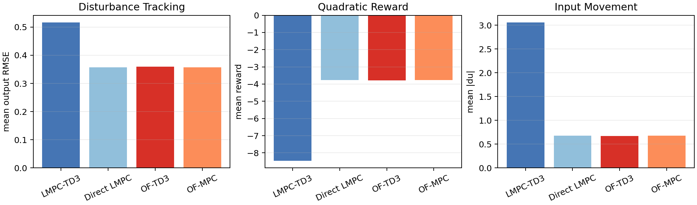
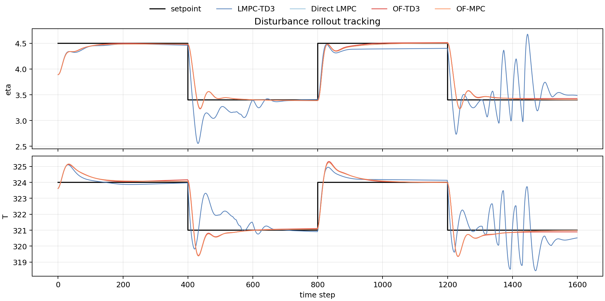
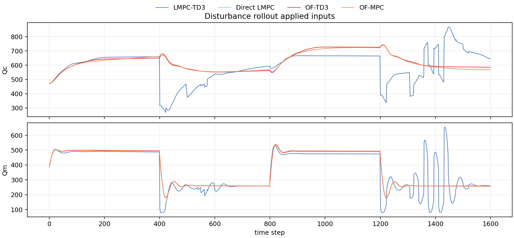
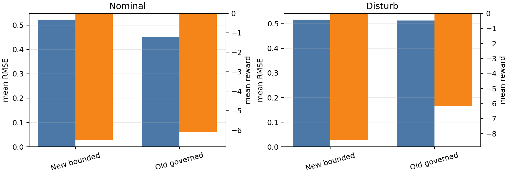
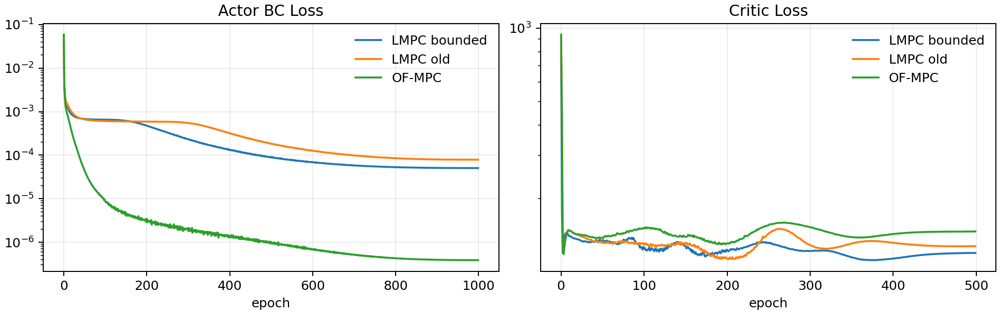
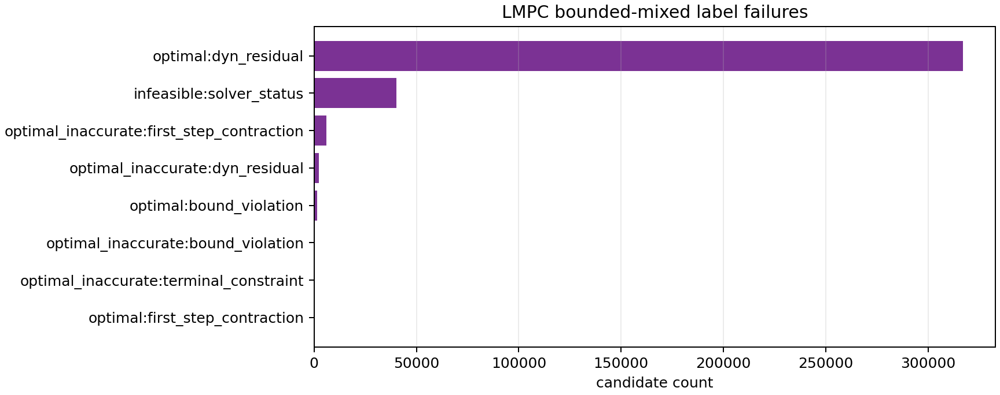

# Bounded-Mixed LMPC Pretraining Analysis

Date: 2026-06-12

This report analyzes the new Direct LMPC-pretrained TD3 checkpoint:

- LMPC pretraining: `results/PretrainLMPC/20260611_003808`
- LMPC comparison: `results/PretrainLMPCComparison/20260612_004517`
- OF-MPC reference pretraining: `results/PretrainOFMPC/20260610_005048`
- OF-MPC reference comparison: `results/PretrainOFMPCComparison/20260610_154032`
- Previous governed-reference LMPC comparison: `results/PretrainLMPCComparison/20260610_173925`

## Executive Takeaway

The new LMPC checkpoint is correctly labeled as the previous bounded-mixed selector
run and uses the same TD3 scaler/range contract as OF-MPC pretraining and comparison.
I do not see a scaler mismatch.

The weak result is mainly an imitation/generalization problem. The Direct LMPC expert
baseline and the OF-MPC baseline are nearly identical in the comparison rollouts, but
the LMPC-trained TD3 actor is much farther from its expert than the OF-MPC-trained TD3
actor is from OF-MPC. More uniform replay samples alone already helped the label pool
size, but the actor still underfits the harder LMPC action map.

## Performance Snapshot

| Mode | Controller | Reward | Mean RMSE | eta RMSE | T RMSE | Mean abs du |
| :--- | ---: | ---: | ---: | ---: | ---: | ---: |
| disturb | LMPC bounded-mixed TD3 / td3 | -8.4516 | 0.5162 | 0.2639 | 0.7685 | 3.0573 |
| disturb | LMPC bounded-mixed TD3 / direct_lmpc | -3.7734 | 0.3568 | 0.1801 | 0.5336 | 0.6775 |
| disturb | LMPC bounded-mixed TD3 / offset_free_mpc | -3.7737 | 0.3569 | 0.1801 | 0.5337 | 0.6775 |
| disturb | OF-MPC pretrained TD3 / td3 | -3.7841 | 0.3594 | 0.1801 | 0.5388 | 0.6679 |
| disturb | OF-MPC pretrained TD3 / offset_free_mpc | -3.7732 | 0.3569 | 0.1801 | 0.5338 | 0.6776 |
| nominal | LMPC bounded-mixed TD3 / td3 | -6.5280 | 0.5224 | 0.2298 | 0.8149 | 1.2670 |
| nominal | LMPC bounded-mixed TD3 / direct_lmpc | -3.7651 | 0.3553 | 0.1800 | 0.5307 | 0.6462 |
| nominal | LMPC bounded-mixed TD3 / offset_free_mpc | -3.7648 | 0.3554 | 0.1800 | 0.5307 | 0.6461 |
| nominal | OF-MPC pretrained TD3 / td3 | -3.8511 | 0.3562 | 0.1823 | 0.5302 | 0.6535 |
| nominal | OF-MPC pretrained TD3 / offset_free_mpc | -3.7648 | 0.3554 | 0.1800 | 0.5309 | 0.6461 |

## TD3-To-Expert Gap

The table below compares each pretrained actor against its own expert baseline. Lower
RMSE gap is better; reward gap is TD3 reward minus expert reward, so values closer to
zero are better.

| Mode | LMPC TD3 RMSE Gap | OF TD3 RMSE Gap | LMPC TD3 Reward Gap | OF TD3 Reward Gap | LMPC abs du ratio | OF abs du ratio |
| :--- | ---: | ---: | ---: | ---: | ---: | ---: |
| nominal | 0.1670 | 0.0008 | -2.7628 | -0.0863 | 1.9608 | 1.0115 |
| disturb | 0.1594 | 0.0025 | -4.6782 | -0.0110 | 4.5127 | 0.9857 |

The disturbance case is the important one: LMPC-TD3 has a mean RMSE gap of
0.1594, while OF-TD3 has a gap of
0.0025. LMPC-TD3 also moves the inputs about
4.5127x as much as Direct LMPC, whereas OF-TD3 is almost
matched to OF-MPC on movement.

## Old LMPC Versus New LMPC

The bounded-mixed run is better labeled and better aligned with the current online
gate/diagnostic selector, and it uses 3,100,000 replay
samples. However, the deterministic comparison metrics do not yet show a control
performance win over the older governed-reference LMPC checkpoint.

This means the new selector alignment is the right experimental hygiene, but the actor
still needs a better way to learn the LMPC label map.

## Pretraining And Label Diagnostics

| Run | Samples | Accept Rate | Solve Rate | Actor BC Last | Critic Last | Label Reward Mean | Selector |
| :--- | ---: | ---: | ---: | ---: | ---: | ---: | ---: |
| LMPC bounded-mixed | 3,100,000 | 0.8937 | 0.8939 | 5.045e-05 | 119.82 | -589.71 | bounded_mixed_u0p1_x0p1 |
| LMPC governed-ref old | 2,100,000 | 0.9918 | 0.9956 | 7.868e-05 | 127.76 | -605.60 | governed_reference |
| OF-MPC | 2,100,000 | - | - | 3.877e-07 | 146.81 | -604.06 | offset_free_mpc |

The new bounded-mixed LMPC actor BC loss reaches 5.045e-05.
That is small in absolute terms, but it is still much larger than the OF-MPC actor BC
loss (3.877e-07). Since both use the same
`[256, 256, 256]` actor/critic architecture, the difference is evidence that the LMPC
expert action map is more difficult to approximate, not evidence of different scalers.

## LMPC Label Failure Pattern

| Failure Reason | Count | Share |
| :--- | ---: | ---: |
| tracking:optimal:dyn_residual | 317,185 | 0.8617 |
| tracking:infeasible:solver_status | 40,302 | 0.1095 |
| tracking:optimal_inaccurate:first_step_contraction | 6,028 | 0.0164 |
| tracking:optimal_inaccurate:dyn_residual | 2,359 | 0.0064 |
| tracking:optimal:bound_violation | 1,555 | 0.0042 |
| tracking:optimal_inaccurate:bound_violation | 423 | 0.0011 |
| tracking:optimal_inaccurate:terminal_constraint | 192 | 0.0005 |
| tracking:optimal:first_step_contraction | 21 | 5.705e-05 |

The largest rejected class is `tracking:optimal:dyn_residual`. These are not ordinary
bad setpoints; they are samples for which the tracking solve status can look acceptable
but the post-check rejects the candidate. This creates a conditional dataset: the actor
only sees successful LMPC labels, while the boundaries near rejected regions are sparse
and likely non-smooth.

## Scaling And Range Audit

| Contract Item | Match |
| :--- | ---: |
| training min_max_dict | yes |
| training TD3 setpoint scaler | yes |
| state bounds source | yes |
| setpoint bounds source | yes |
| physical input lower bounds | yes |
| physical input upper bounds | yes |
| MPC output weights | yes |
| MPC input weights | yes |
| TD3 actor hidden layers | yes |
| TD3 critic hidden layers | yes |
| comparison setpoint scaler | yes |
| comparison y_sp_min | yes |
| comparison y_sp_max | yes |
| comparison rollout setpoints | yes |

The detailed scaler values are exported to `tables/2026-06-12_lmpc_bounded_mixed_pretraining_analysis/scaler_consistency.csv`.
The important constants are:

- TD3 setpoint scaler physical range:
  `[[  2.8, 320. ],
 [  5. , 326. ]]`
- Comparison setpoints:
  `[[  4.5, 324. ],
 [  3.4, 321. ]]`
- `y_sp_min`: `[-4.917664, -4.612049]`
- `y_sp_max`: `[5.007769, 3.065128]`
- LMPC selector:
  `target_mode=bounded`,
  `target_selector_variant=bounded_mixed_u0p1_x0p1`,
  `target_config={'u_ref_weight': 0.1, 'x_ref_weight': 0.1}`,
  `rho_lyap=0.99`,
  `lyap_eps=0.001`.

`OnlineTD3_LMPCPretrained_SafetyGate.py` is a thin entrypoint into `utils.online_disturbance_runner.main_lmpc_pretrained_safety_gate()`. That shared runner resolves the newest checkpoint under `results/PretrainLMPC`, checks the TD3 setpoint scaler against the default polymer scaler, and records `target_selector_variant=bounded_mixed_u0p1_x0p1` in new run summaries.

## Are LMPC And OF-MPC Using The Same Exact Thing?

They use the same plant, observer/scaling assets, TD3 state/action dimensions, action
scaler, setpoint scaler, comparison setpoints, MPC objective weights, and TD3 network
size. They are not the same expert-label generator:

- OF-MPC pretraining solves the offset-free MPC label directly over uniformly sampled
  augmented states, setpoints, and previous inputs.
- LMPC pretraining solves the bounded Direct LMPC target plus tracking problem, then
  keeps only candidates that pass target, tracking, bound, residual, and first-step
  contraction checks.
- LMPC labels therefore include target-stage switching and Lyapunov feasibility
  boundaries that OF-MPC labels do not have.

The baseline comparison confirms this distinction. Direct LMPC and OF-MPC themselves
track almost identically, but their offline imitation problems are not equally easy.

## Why The Result Is Still Not Good Enough

1. The LMPC expert map is more nonlinear and piecewise than OF-MPC because the target
   selector can switch stages and the contraction check imposes a hard boundary.
2. The replay distribution is broad-uniform over the full scaler box. That is good for
   coverage, but it spends a huge sample budget away from the closed-loop trajectories
   that matter most.
3. Rejected LMPC candidates leave sparse coverage near the safety/feasibility boundary.
   The actor receives successful labels but not a smooth description of what happens
   just outside the accepted set.
4. The actor BC loss is the clearest symptom. With the same architecture and more
   samples than OF-MPC, LMPC still has a substantially larger final BC loss.
5. The LMPC-TD3 actor is too aggressive in disturbance rollouts, as shown by its high
   mean input movement.

## What To Try Next

I would not first extend the physical/scaler range. The current replay already covers
the full TD3 scaler box, and the online/comparison setpoints are inside that envelope.
Going wider would mostly teach the actor outside the scale contract used online.

Recommended order:

1. Add a validation split for LMPC pretraining labels and report actor MSE by target
   stage, action saturation, and distance to the comparison rollout distribution.
2. Add targeted/stratified replay around closed-loop states, setpoint transitions, and
   accepted samples close to contraction or input-bound margins.
3. Increase actor capacity as an ablation, for example `[512, 512, 512]`, but pair it
   with validation curves. Network size is plausible, but the current evidence says
   data geometry and label complexity are at least as important.
4. Consider residualizing the TD3 action around OF-MPC or Direct LMPC for the LMPC
   pretraining task. The baselines are already good; learning a correction may be
   easier than imitating the full hard-switched LMPC map.
5. If the goal is online safety-gated TD3 rather than standalone offline imitation,
   evaluate whether the LMPC-pretrained actor improves after the warm-start BC/handoff
   schedule, because the online gate may correct exactly the regions the offline actor
   struggles with.

## Exported Tables

- `tables/2026-06-12_lmpc_bounded_mixed_pretraining_analysis/comparison_metrics_long.csv`
- `tables/2026-06-12_lmpc_bounded_mixed_pretraining_analysis/td3_expert_gaps.csv`
- `tables/2026-06-12_lmpc_bounded_mixed_pretraining_analysis/pretraining_summary.csv`
- `tables/2026-06-12_lmpc_bounded_mixed_pretraining_analysis/lmpc_failure_reasons.csv`
- `tables/2026-06-12_lmpc_bounded_mixed_pretraining_analysis/scaler_consistency.csv`
