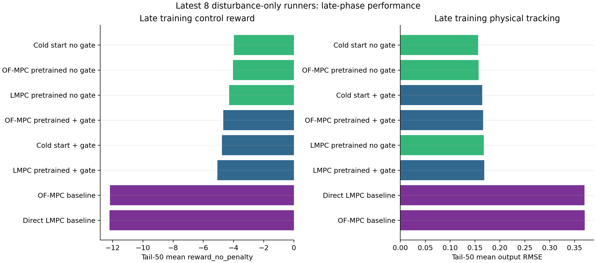
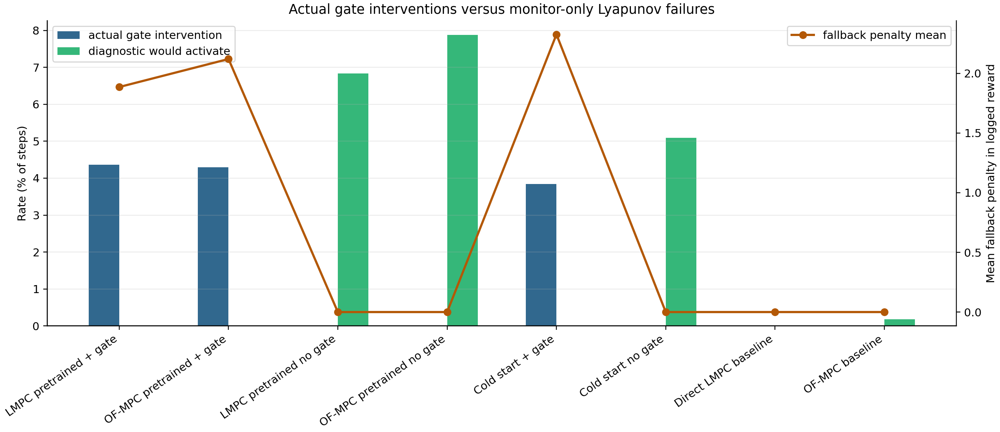
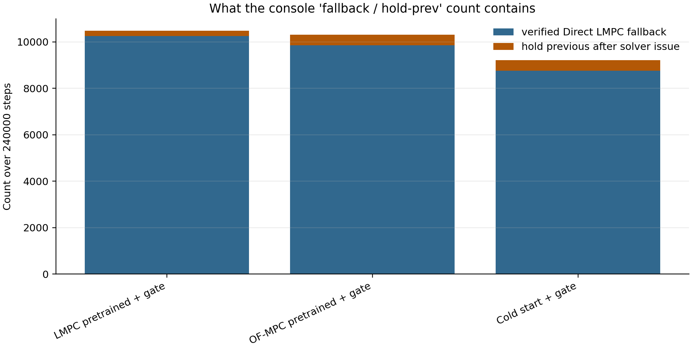
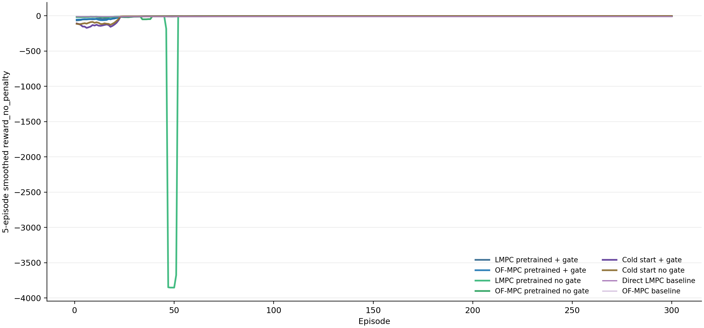
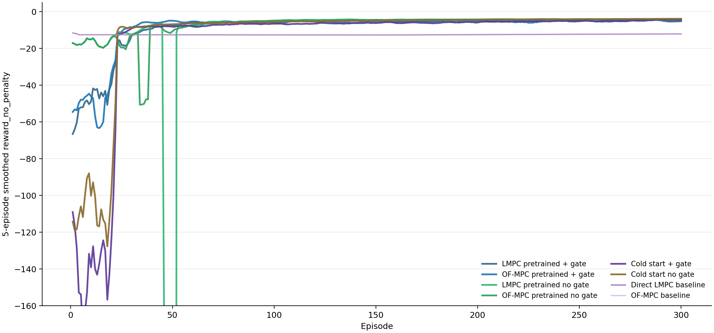
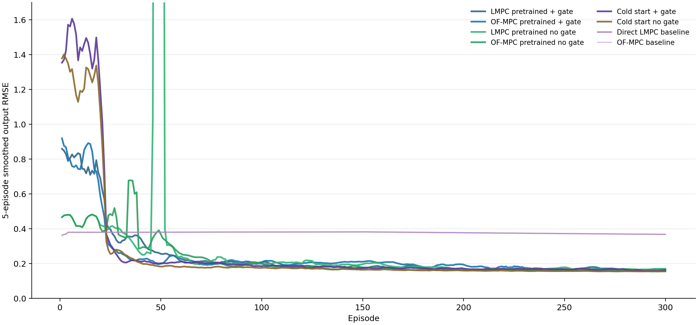
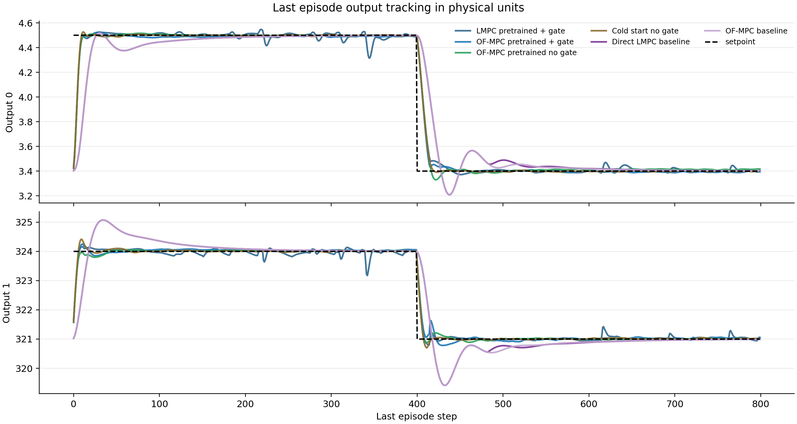
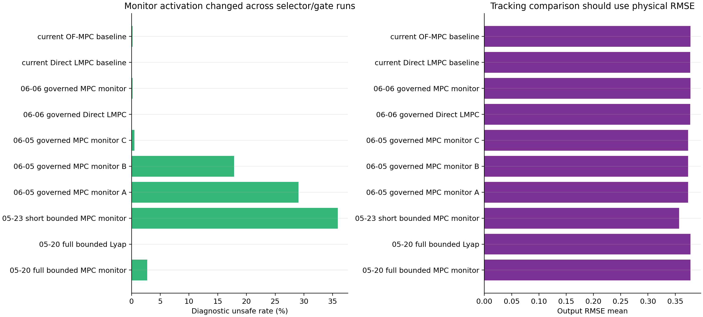

# Disturbance-Only Online TD3, Direct LMPC, and OF-MPC: 8-Runner Result Audit

Date: 2026-06-10  
Analysis script: `analysis/online_disturbance_8_runner_analysis.py`  
Figure and table folder: `report/figures/2026-06-10_online_disturbance_8_runner_analysis/`

## Executive Diagnosis

The surprising result is real, but it is not mainly a setpoint-scaling error.
The latest online TD3 runs use the same TD3 setpoint scaler that covered the offline pretraining range:

- scaler physical range: `[2.8, 320]` to `[5.0, 326]`
- disturbance rollout setpoints: `[4.5, 324]` and `[3.4, 321]`
- input-deviation bounds: `[-10, -7.5]` to `[9.96, 7.3]`

The main mechanisms are instead:

1. Safety-gate reward is worse than safety-gate control performance because the logged training reward includes fallback/event penalties. For cross-method tracking comparison, `reward_no_penalty` is the fairer metric.
2. The current governed-reference Direct LMPC diagnostic is much less active than several older target-selector/gate configurations. The latest OF-MPC baseline has only `0.183%` monitor activation, while older short or intermediate governed runs reached `17.9%` to `35.9%`.
3. The learned no-gate controllers track very well late in training, but they still violate the Direct LMPC one-step contraction diagnostic on about `1.9%` to `2.8%` of tail steps. The safety-gate versions remove those monitor failures by applying fallback, but the fallback itself is conservative and receives reward penalties.
4. The LMPC-pretrained no-gate full-run mean is misleading. It has a severe transient failure around episodes 45-55, then recovers to a competitive tail policy.
5. The older selector does not clearly dominate on full-length tracking. Full 240k-step older bounded and current governed baselines all have physical output RMSE near `0.378`. Some short or intermediate old runs had higher monitor activation and slightly lower short-run RMSE, but they are not a fair replacement conclusion yet.

## Data Used

All eight latest complete runs had `300` episodes, two `400`-step setpoint blocks per episode, disturbance mode, and `240000` saved steps.

| Case | Result bundle |
|---|---|
| LMPC pretrained + gate | `results/OnlineTD3_LMPCPretrained_SafetyGate/20260610_200545` |
| OF-MPC pretrained + gate | `results/OnlineTD3_OFMPCPretrained_SafetyGate/20260610_200552` |
| LMPC pretrained no gate | `results/OnlineTD3_LMPCPretrained_NoSafetyGate/20260610_200457` |
| OF-MPC pretrained no gate | `results/OnlineTD3_OFMPCPretrained_NoSafetyGate/20260610_200548` |
| Cold start + gate | `results/OnlineTD3_ColdStart_SafetyGate/20260610_200453` |
| Cold start no gate | `results/OnlineTD3_ColdStart_NoSafetyGate/20260610_200450` |
| Direct LMPC baseline | `results/DirectLMPCDisturbance/20260610_200442` |
| OF-MPC baseline | `results/OffsetFreeMPCDisturbance/20260610_200445` |

The historical selector/gate context was read from `results/directLyap/*/comparison_table.csv`, especially `20260520_165653`, `20260523_011436`, `20260605_*`, and `20260606_020549`.

## Method Reconstruction

The plant is the polymer CSTR in disturbed mode. The controlled output is

$$
y_k = [\eta_k,\; T_k]^T,
$$

and the two manipulated inputs are physical input deviations mapped from normalized TD3 actions. Online TD3 uses a state vector that includes the scaled plant/output information, setpoint information, previous input information, and available observer/controller diagnostics saved by the runner.

For a policy candidate,

$$
a_k = \pi_\theta(s_k) + \epsilon_k,
$$

the action is mapped into input-deviation coordinates and clipped to the configured input bounds. For no-gate runners, this TD3 action is executed directly. The Direct LMPC safety calculation is still evaluated in monitor mode, and its failure is stored as `diagnostic_unsafe`.

For safety-gate runners, the candidate first step is checked against the Direct LMPC governed target. In simplified notation, the gate accepts the candidate if the predicted first step satisfies

$$
V(x_{k+1}^{\mathrm{cand}} - x_s)
\le
\rho V(x_k - x_s) + \epsilon,
$$

with the saved configuration

$$
\rho = 0.99,\qquad \epsilon = 0.005.
$$

If the candidate fails, the runner applies a Direct LMPC fallback. If the fallback solve is not verified for that step, the runner holds the previous input. This is what the console line `fallback / hold-prev` was summarizing.

The current governed-reference target configuration is:

| Item | Value |
|---|---:|
| `governed_reference_enabled` | `True` |
| `lambda_cmd_move` | `1.0` |
| target `Qr_diag` | `[5, 1]` |
| target `W_r_diag` | `[5, 1]` |
| `u_ref_weight` | `0.0` |
| `x_ref_weight` | `0.0` |
| `input_headroom_frac` | `0.03` |
| `one_step_probe` | `True` |

Controller objectives and RL reward shaping are separate:

$$
Q_{\mathrm{MPC}} = [5,\;1], \qquad R_{\Delta u,\mathrm{MPC}} = [1,\;1],
$$

while the online RL shaped reward uses

$$
Q_{\mathrm{reward}} = [12,\;6], \qquad R_{\Delta u,\mathrm{reward}} = [1,\;1].
$$

TD3 was saved with discount `0.99`, policy delay `2`, target smoothing noise `0.01`, noise clip `0.01`, and `tau=0.005`. Pretrained runs use full-RL exploration from `0.02` to `0.005`. Cold-start runs use exploration from `0.1` to `0.005`.

The BC phase uses teacher-executed actions with Gaussian exploration while the actor is supervised toward the clean teacher action. No-gate runs use OF-MPC as the online BC/handoff teacher, so Direct LMPC is diagnostic only in the no-gate runs.

## Main Performance Evidence

Late-policy performance should be judged from the tail window because all online runs are training runs, not pure evaluation. In the final 50 episodes, learned TD3 policies outperform the two MPC baselines by a large margin in physical output RMSE.

| Case | Tail `reward_no_penalty` | Tail logged reward | Tail RMSE |
|---|---:|---:|---:|
| Cold start no gate | -3.979 | -3.979 | 0.156 |
| OF-MPC pretrained no gate | -4.036 | -4.036 | 0.157 |
| LMPC pretrained no gate | -4.286 | -4.286 | 0.168 |
| OF-MPC pretrained + gate | -4.672 | -6.224 | 0.166 |
| Cold start + gate | -4.761 | -6.478 | 0.165 |
| LMPC pretrained + gate | -5.071 | -7.634 | 0.169 |
| OF-MPC baseline | -12.177 | -12.177 | 0.370 |
| Direct LMPC baseline | -12.206 | -12.206 | 0.370 |

Interpretation:

- The no-gate policies win late on pure tracking/reward because they execute the learned TD3 action without fallback.
- Safety-gate policies are close in physical RMSE, but their logged reward is lower because fallback penalties remain active.
- Direct LMPC and OF-MPC baselines track much more slowly under the same two-block disturbance schedule.

## Reward Penalty Versus Control Performance

The safety-gate penalty explains a substantial part of the apparent underperformance.

| Safety-gate run | Reward | Reward without penalty | Penalty gap | Actual gate rate |
|---|---:|---:|---:|---:|
| LMPC pretrained + gate | -10.701 | -8.815 | 1.886 | 4.36% |
| OF-MPC pretrained + gate | -10.849 | -8.728 | 2.121 | 4.29% |
| Cold start + gate | -17.881 | -15.554 | 2.327 | 3.84% |

The penalty is not applied in no-gate runs. Therefore:

- use logged reward when asking what the RL optimizer actually trained on
- use `reward_no_penalty` and physical RMSE when comparing controller tracking performance

The console `fallback / hold-prev` count is a mixture of verified fallback and hold-previous events:

| Safety-gate run | Verified Direct LMPC fallback | Solver hold-prev | Total gate events |
|---|---:|---:|---:|
| LMPC pretrained + gate | 10253 | 221 | 10474 |
| OF-MPC pretrained + gate | 9850 | 456 | 10306 |
| Cold start + gate | 8750 | 468 | 9218 |

`hold-prev` means the gate did not execute the TD3 candidate and did not have a verified fallback input for that step, so it held the previous input. In this batch it is a small fraction of the gate activity, but it should still be plotted separately from verified fallback.

## Learning Dynamics

The full-scale reward plot is intentionally included because it exposes the LMPC-pretrained no-gate failure window.

The zoomed version makes the normal operating region readable.

The matching RMSE trend shows that all learned policies eventually enter a low-error regime, while the two MPC baselines remain near their slower-response tracking level.

Phase-level summary:

| Case | Phase | `reward_no_penalty` | RMSE | Gate/monitor rate |
|---|---|---:|---:|---:|
| LMPC pretrained + gate | BC | -50.334 | 0.791 | 1.90% actual |
| LMPC pretrained + gate | Tail 50 | -5.071 | 0.169 | 4.96% actual |
| OF-MPC pretrained + gate | BC | -52.034 | 0.809 | 3.55% actual |
| OF-MPC pretrained + gate | Tail 50 | -4.672 | 0.166 | 2.80% actual |
| LMPC pretrained no gate | BC | -17.114 | 0.456 | 7.54% monitor |
| LMPC pretrained no gate | Tail 50 | -4.286 | 0.168 | 2.81% monitor |
| OF-MPC pretrained no gate | BC | -17.114 | 0.456 | 7.54% monitor |
| OF-MPC pretrained no gate | Tail 50 | -4.036 | 0.157 | 1.88% monitor |
| Cold start + gate | BC | -145.408 | 1.484 | 2.14% actual |
| Cold start + gate | Tail 50 | -4.761 | 0.165 | 3.61% actual |
| Cold start no gate | BC | -113.190 | 1.302 | 3.16% monitor |
| Cold start no gate | Tail 50 | -3.979 | 0.156 | 2.35% monitor |

The LMPC-pretrained no-gate run is the main outlier. Its full-run mean reward is `-70.25`, but its tail-50 reward is `-4.286`. This is a training-stability issue, not a final-policy failure. The next audit should zoom into episodes 45-55 and plot `u_applied_phys`, `u_cand_dev_store`, and `diagnostic_unsafe_flags`.

## Setpoint-Block Evidence

The final policy advantage is present in both 400-step blocks.

| Case | Block | Tail reward no penalty | Tail RMSE | Gate/monitor |
|---|---|---:|---:|---:|
| Cold start no gate | S1 high `[4.5, 324]` | -3.187 | 0.141 | 2.26% monitor |
| Cold start no gate | S2 low `[3.4, 321]` | -4.770 | 0.170 | 2.44% monitor |
| OF-MPC pretrained no gate | S1 high `[4.5, 324]` | -3.213 | 0.143 | 2.44% monitor |
| OF-MPC pretrained no gate | S2 low `[3.4, 321]` | -4.859 | 0.170 | 1.31% monitor |
| OF-MPC pretrained + gate | S1 high `[4.5, 324]` | -4.014 | 0.150 | 3.37% actual |
| OF-MPC pretrained + gate | S2 low `[3.4, 321]` | -5.330 | 0.181 | 2.23% actual |
| Direct LMPC baseline | S1 high `[4.5, 324]` | -11.030 | 0.353 | controller applied |
| Direct LMPC baseline | S2 low `[3.4, 321]` | -13.381 | 0.386 | controller applied |
| OF-MPC baseline | S1 high `[4.5, 324]` | -11.035 | 0.353 | 0.00% monitor |
| OF-MPC baseline | S2 low `[3.4, 321]` | -13.319 | 0.387 | 0.50% monitor |

The low setpoint block is consistently harder, but it does not reverse the ranking.

## Last Episode Tracking

This figure explains why the learned controllers have much better late RMSE than the baselines. In the last episode, the TD3 policies move rapidly to each setpoint. The OF-MPC and Direct LMPC baselines are much slower after the block transition, especially in output 1.

The safety-gate LMPC-pretrained run shows small correction spikes. Those spikes are consistent with the nonzero actual gate rate and the penalty gap. They are not visible as catastrophic instability, but they can lower both reward and smoothness relative to no-gate policies.

## Why Is Current Monitor Activation So Low?

The user memory that the monitor used to activate much more is correct for some older configurations, but not all of them.

| Historical run | Steps | RMSE | Monitor unsafe |
|---|---:|---:|---:|
| 2026-05-23 short bounded MPC monitor | 1600 | 0.357 | 35.875% |
| 2026-06-05 governed MPC monitor A | 8000 | 0.374 | 29.050% |
| 2026-06-05 governed MPC monitor B | 8000 | 0.374 | 17.863% |
| 2026-06-05 governed MPC monitor C | 8000 | 0.374 | 0.488% |
| 2026-06-06 governed MPC monitor | 240000 | 0.378 | 0.183% |
| Current OF-MPC baseline | 240000 | 0.378 | 0.183% |

The latest current OF-MPC baseline exactly matches the June 6 governed monitor rate and RMSE pattern. That strongly suggests the new runners are not accidentally suppressing the monitor. They are reproducing the latest governed-reference diagnostic behavior.

The larger monitor rates came from older or intermediate selector/gate settings. The likely mechanism is target geometry:

- Older bounded or intermediate governed selectors could place the contraction target so that the same OF-MPC step failed the Direct LMPC contraction test more often.
- The current governed-reference selector with command movement, one-step probe, and target movement often finds a nearby governed target around which the OF-MPC step satisfies the one-step contraction inequality.
- Therefore, lower monitor activation is mostly a changed certificate/target definition, not necessarily a safer physical trajectory.

This also explains why "fallback was better before" can feel true. A stricter older diagnostic may have forced more Direct LMPC action and looked more visibly active. The current target selector allows more actions to pass because it certifies contraction around a moving governed target.

## Should We Go Back To The Previous Target Selector?

Not yet as a blanket change.

Evidence against immediately reverting:

- The full 240k-step older bounded MPC monitor from `20260520_165653` has RMSE `0.378`, essentially the same as the current OF-MPC baseline RMSE `0.378`.
- The June 6 governed Direct LMPC and current Direct LMPC baseline also match at RMSE `0.378`.
- The learned TD3 tail policies are far better than either baseline, with RMSE around `0.156` to `0.169`.

Evidence for testing the previous selector as an ablation:

- Some older bounded/intermediate governed runs produced much higher monitor activation.
- The older short bounded run had lower short-run RMSE, though it used only `1600` steps and is not directly comparable to the 300-episode disturbance batch.
- A stricter selector could be useful if the scientific story needs a visibly active safety monitor that catches more no-gate behavior.

Recommended conclusion: keep the current governed-reference target selector as the main runner for now, but add a controlled selector ablation before deciding. Reverting now risks trading away the latest consistent implementation without proving better 300-episode tracking.

## Implementation Consistency Checks

No evidence of the previous setpoint-scaling bug was found in the latest online result configs. All six online TD3 runners saved the same scaling contract and the disturbance setpoints are inside the scaler range.

The reward separation is working:

- safety-gate runs have nonzero `fallback_penalty_mean`
- no-gate runs have zero fallback penalty and zero actual intervention
- no-gate runs still populate Direct LMPC diagnostic monitor rates
- safety-gate runs use actual fallback counts rather than monitor-only unsafe counts

One reporting caveat: Direct LMPC baseline stores `actual_intervention_rate=1.0` because the Direct LMPC controller is applied every step. This is not a safety-filter intervention rate. The analysis figures therefore use `actual_gate_intervention_rate=0` for baselines and only count gate interventions for online safety-gate runs.

## Risks And Open Questions

1. The current governed-reference diagnostic may be too permissive if the goal is to detect OF-MPC contraction failures relative to a less mobile target. This is a scientific design choice, not clearly a code bug.
2. The safety-gate reward penalty may be teaching the agent to avoid fallback events rather than purely improving tracking. This is expected, but it makes logged reward less fair for comparing against no-gate and MPC-only controllers.
3. The LMPC-pretrained no-gate transient crash needs a separate failure analysis. Its final policy is good, but the training rollout contains a severe instability window.
4. The baselines do not yet save the same explicit `scaling_contract` block as the online TD3 runs. Their physical output errors match historical results, but adding that metadata would make future audits easier.

## Recommended Next Experiments

1. Selector ablation on the same 8-run schedule.
   - File likely involved: `utils/online_disturbance_runner.py` and `Lyapunov/direct_lyapunov_mpc.py`.
   - Add a CLI/config flag for `target_selector_variant=current_governed|previous_bounded`.
   - First run only OF-MPC baseline and OF-MPC pretrained no-gate monitor mode.
   - Confirming evidence: old variant increases monitor activation without worsening tail RMSE.
   - Rejecting evidence: old variant only increases monitor activation but does not improve tracking or produces more hold-prev events.

2. Penalty-off safety-gate learning ablation.
   - File likely involved: `utils/online_disturbance_runner.py` reward config.
   - Keep actual fallback active, but set fallback reward penalty to diagnostic-only.
   - Metric to watch: tail RMSE, actual gate rate, and action smoothness.
   - Purpose: separate "filter hurts tracking" from "reward penalty makes the learning curve look worse."

3. LMPC-pretrained no-gate crash audit.
   - Analyze episodes 40-60 from `results/OnlineTD3_LMPCPretrained_NoSafetyGate/20260610_200457`.
   - Plot `u_applied_phys`, `u_cand_dev_store`, output errors, contraction margin, and diagnostic unsafe flags.
   - Purpose: determine whether the crash is actor checkpoint mismatch, exploration magnitude, critic transient, or unsafe action compounding.

4. Add baseline scaling metadata.
   - File likely involved: `utils/online_disturbance_runner.py`.
   - Save the same `scaling_contract` block for Direct LMPC and OF-MPC baseline bundles.
   - Purpose: remove ambiguity during future result audits.

## Source Tables

Generated CSVs:

- `report/figures/2026-06-10_online_disturbance_8_runner_analysis/latest_metrics.csv`
- `report/figures/2026-06-10_online_disturbance_8_runner_analysis/online_phase_metrics.csv`
- `report/figures/2026-06-10_online_disturbance_8_runner_analysis/setpoint_block_metrics.csv`
- `report/figures/2026-06-10_online_disturbance_8_runner_analysis/historical_selector_context.csv`
- `report/figures/2026-06-10_online_disturbance_8_runner_analysis/run_manifest.json`
