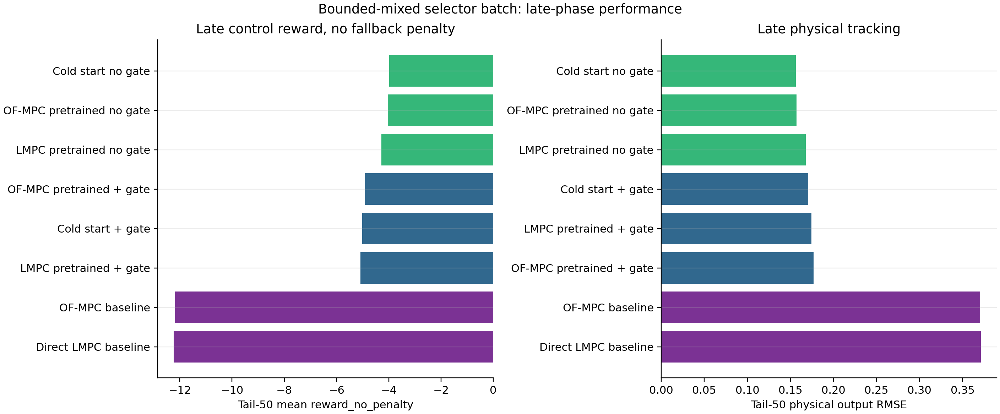
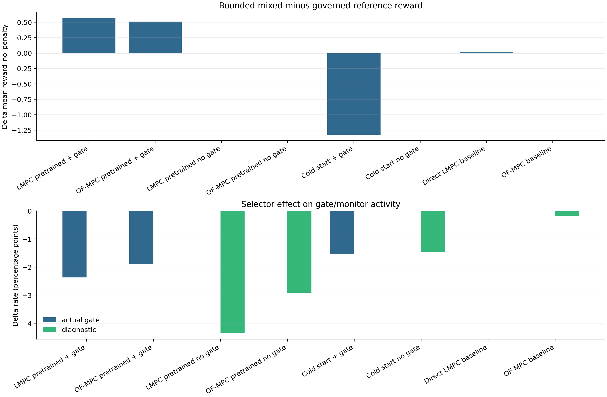
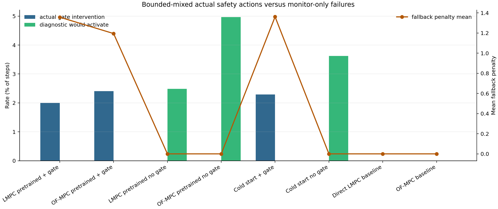
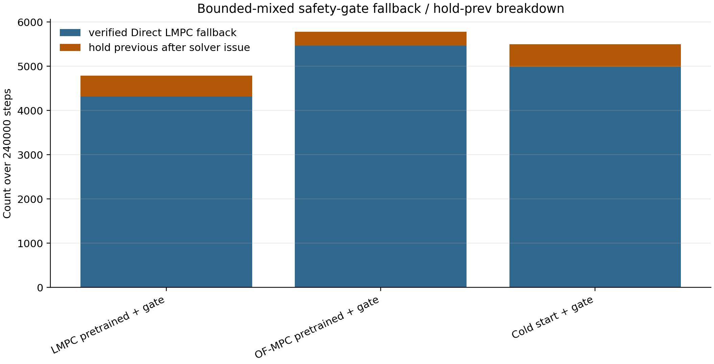
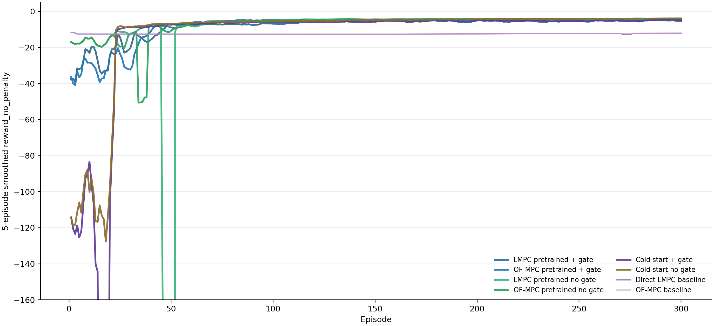
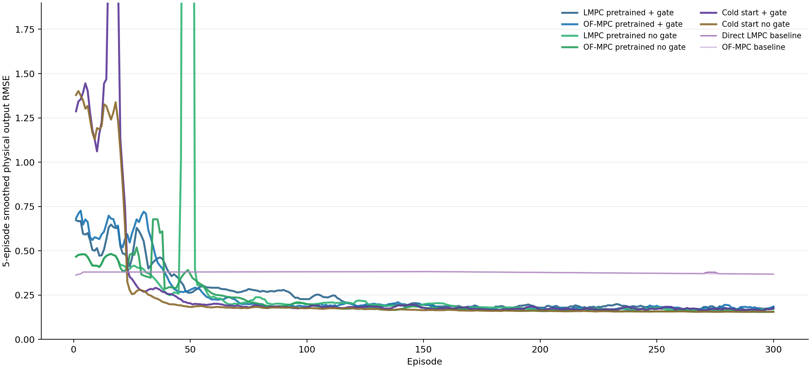
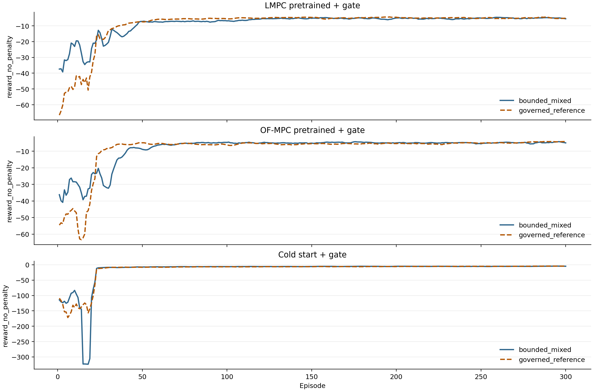
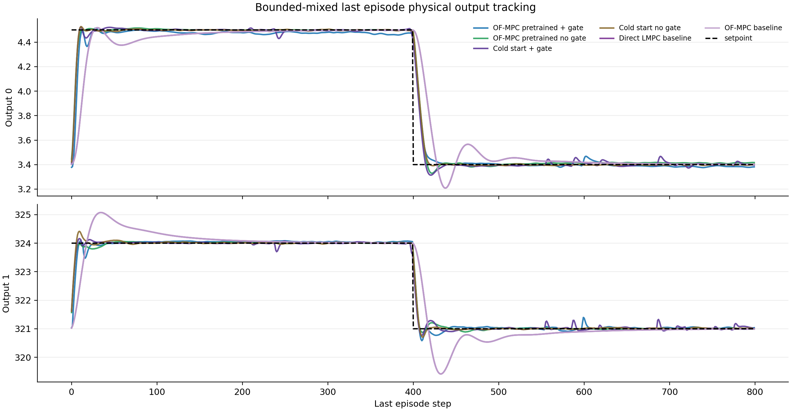
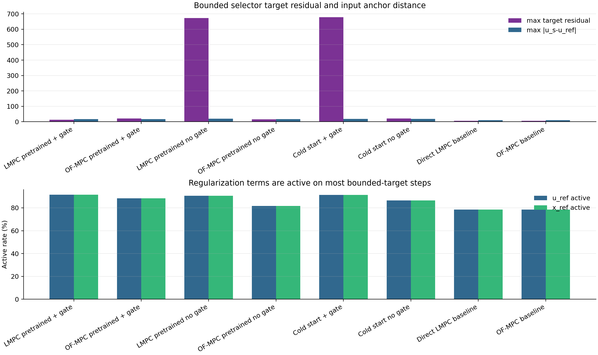

# Bounded-Mixed Selector Online Disturbance Runner Analysis

Date: 2026-06-11

## Objective

This report analyzes the eight disturbance-only runners after switching the Direct LMPC target selector from the June 10 governed-reference selector to the previous bounded mixed selector. The bounded mixed selector uses `target_mode="bounded"`, `u_ref_weight=0.1`, `x_ref_weight=0.1`, `rho_lyap=0.99`, `lyap_eps=1e-3`, and `lyap_tol=1e-10`.

The central question is whether the older bounded selector restores the behavior that previously looked better: more meaningful monitor activity, better fallback behavior, and improved tracking relative to the governed-reference batch.

## Data Used

Primary bounded-mixed runs:

| Case | Run directory |
| :-- | :-- |
| LMPC pretrained + gate | results\OnlineTD3_LMPCPretrained_SafetyGate\20260611_000544 |
| OF-MPC pretrained + gate | results\OnlineTD3_OFMPCPretrained_SafetyGate\20260611_000552 |
| LMPC pretrained no gate | results\OnlineTD3_LMPCPretrained_NoSafetyGate\20260611_000541 |
| OF-MPC pretrained no gate | results\OnlineTD3_OFMPCPretrained_NoSafetyGate\20260611_000548 |
| Cold start + gate | results\OnlineTD3_ColdStart_SafetyGate\20260611_000537 |
| Cold start no gate | results\OnlineTD3_ColdStart_NoSafetyGate\20260611_000534 |
| Direct LMPC baseline | results\DirectLMPCDisturbance\20260611_000526 |
| OF-MPC baseline | results\OffsetFreeMPCDisturbance\20260611_000530 |

Comparator governed-reference runs were the latest full runs under the same result roots with `target_mode="governed_reference"`.

## Method Summary

All runs use the polymer CSTR in disturbance mode with 300 episodes and 400-step setpoint blocks. The online TD3 action is represented in normalized action coordinates and mapped to scaled input-deviation coordinates before either gate evaluation or plant execution.

For safety-gate runs, the executed input is

$$
u_k =
\begin{cases}
u_k^{\mathrm{TD3}}, & V(x_{k+1}; x_s) \le \rho V(x_k; x_s) + \epsilon, \\
u_k^{\mathrm{LMPC}}, & \text{otherwise},
\end{cases}
$$

where $(x_s,u_s,y_s)$ is selected by the bounded output-disturbance target problem. For no-gate runs, $u_k=u_k^{\mathrm{TD3}}$ is always executed, and the same Direct LMPC check is logged as diagnostic-only. Therefore no-gate control performance should not change when only the diagnostic target selector changes, but monitor rates can change.

## Main Bounded-Mixed Results

The best overall control reward is `OF-MPC pretrained no gate` with mean `reward_no_penalty = -6.858`. The best late control reward is `Cold start no gate` with tail-50 `reward_no_penalty = -3.979`. The best late physical RMSE is `Cold start no gate` with tail-50 mean output RMSE `0.156`. The strongest overall no-gate monitor activity is `OF-MPC pretrained no gate` with diagnostic unsafe rate `4.97%`.

| Case | Reward no penalty | Training reward | Fallback penalty | Tail50 no penalty | Tail50 RMSE | Actual gate % | Diag unsafe % |
| :-- | --: | --: | --: | --: | --: | --: | --: |
| LMPC pretrained + gate | -8.248 | -9.605 | 1.357 | -5.079 | 0.175 | 2.00 | 0.00 |
| OF-MPC pretrained + gate | -8.217 | -9.411 | 1.195 | -4.903 | 0.177 | 2.41 | 0.00 |
| LMPC pretrained no gate | -70.247 | -70.247 | 0.000 | -4.286 | 0.168 | 0.00 | 2.48 |
| OF-MPC pretrained no gate | -6.858 | -6.858 | 0.000 | -4.036 | 0.157 | 0.00 | 4.97 |
| Cold start + gate | -16.880 | -18.241 | 1.361 | -5.013 | 0.171 | 2.29 | 0.00 |
| Cold start no gate | -12.361 | -12.361 | 0.000 | -3.979 | 0.156 | 0.00 | 3.62 |
| Direct LMPC baseline | -12.489 | -12.489 | 0.000 | -12.231 | 0.371 | 0.00 | 0.00 |
| OF-MPC baseline | -12.480 | -12.480 | 0.000 | -12.177 | 0.370 | 0.00 | 0.00 |

Interpretation:

- The OF-MPC-pretrained no-gate TD3 remains the strongest learned controller by overall reward. In the tail, cold-start no-gate is slightly better, but the margin is small enough that a seed repeat matters.
- The OF-MPC-pretrained safety-gate run is close behind the no-gate learned controllers and is clearly better than the MPC baselines by late reward/RMSE. It pays fallback penalties in training reward, so `reward_no_penalty` is the fair control-performance comparison.
- LMPC-pretrained no-gate remains poor because it is still the old governed-reference LMPC-pretrained checkpoint. The online selector change does not regenerate that checkpoint.
- Direct LMPC and OF-MPC baselines are very close in physical RMSE under this two-setpoint disturbed schedule.

## Bounded-Mixed Versus Governed-Reference

| Case | Delta no penalty | Delta training | Delta penalty | Delta RMSE | Delta actual gate % | Delta diag % |
| :-- | --: | --: | --: | --: | --: | --: |
| LMPC pretrained + gate | 0.567 | 1.096 | -0.529 | -0.0039 | -2.37 | 0.00 |
| OF-MPC pretrained + gate | 0.511 | 1.437 | -0.926 | 0.0020 | -1.89 | 0.00 |
| LMPC pretrained no gate | 0.000 | 0.000 | 0.000 | 0.0000 | 0.00 | -4.35 |
| OF-MPC pretrained no gate | 0.000 | 0.000 | 0.000 | 0.0000 | 0.00 | -2.91 |
| Cold start + gate | -1.326 | -0.360 | -0.966 | 0.0697 | -1.55 | 0.00 |
| Cold start no gate | 0.000 | 0.000 | 0.000 | 0.0000 | 0.00 | -1.47 |
| Direct LMPC baseline | 0.010 | 0.010 | 0.000 | 0.0004 | 0.00 | 0.00 |
| OF-MPC baseline | 0.000 | 0.000 | 0.000 | 0.0000 | 0.00 | -0.18 |

Interpretation:

- Pretrained safety-gate runs improve in both `reward_no_penalty` and logged training reward under bounded mixed. They also have lower fallback penalty and lower actual intervention rate than the governed-reference batch.
- Cold-start safety worsens in `reward_no_penalty` and physical RMSE even though the fallback penalty and intervention rate are lower. That points to fallback/target quality and learning trajectory, not merely penalty accounting.
- No-gate control rewards are exactly unchanged, which is a useful sanity check because the Direct LMPC selector is diagnostic-only in those runners. Diagnostic unsafe rates decrease, so in this batch the bounded mixed selector is less restrictive for the same executed no-gate actions than the governed-reference monitor.
- Direct LMPC and OF-MPC baselines are almost unchanged, which means the main selector effect is in how the online gate accepts/rejects learned exploratory actions.

## Safety-Gate Mechanics

| Case | Actual int. | Verified fallback | Hold-prev | Actual gate % | Diag unsafe % | Penalty mean |
| :-- | --: | --: | --: | --: | --: | --: |
| LMPC pretrained + gate | 4790 | 4316 | 474 | 2.00 | 0.00 | 1.357 |
| OF-MPC pretrained + gate | 5777 | 5469 | 308 | 2.41 | 0.00 | 1.195 |
| LMPC pretrained no gate | 0 | 0 | 0 | 0.00 | 2.48 | 0.000 |
| OF-MPC pretrained no gate | 0 | 0 | 0 | 0.00 | 4.97 | 0.000 |
| Cold start + gate | 5496 | 4986 | 510 | 2.29 | 0.00 | 1.361 |
| Cold start no gate | 0 | 0 | 0 | 0.00 | 3.62 | 0.000 |
| Direct LMPC baseline | 0 | 0 | 0 | 0.00 | 0.00 | 0.000 |
| OF-MPC baseline | 0 | 0 | 0 | 0.00 | 0.00 | 0.000 |

The console phrase `fallback / hold-prev` combines verified Direct LMPC fallback and hold-previous events after target or solver issues. In this bounded-mixed batch, most safety-gate corrections are verified fallbacks, but LMPC-pretrained safety still has nontrivial hold-prev counts. That is why comparing only the printed fallback ratio can hide the correction quality.

## Learning Phase Behavior

| Case phase | Reward no penalty | Penalty | RMSE | Actual gate % | Diag % |
| :-- | --: | --: | --: | --: | --: |
| LMPC pretrained + gate - BC | -28.772 | 0.091 | 0.577 | 0.89 | 0.00 |
| LMPC pretrained + gate - full TD3 | -6.563 | 1.472 | 0.225 | 2.10 | 0.00 |
| LMPC pretrained + gate - tail 50 | -5.079 | 1.989 | 0.175 | 4.02 | 0.00 |
| OF-MPC pretrained + gate - BC | -32.888 | 1.379 | 0.633 | 1.74 | 0.00 |
| OF-MPC pretrained + gate - full TD3 | -6.148 | 1.202 | 0.209 | 2.50 | 0.00 |
| OF-MPC pretrained + gate - tail 50 | -4.903 | 1.443 | 0.177 | 3.64 | 0.00 |
| OF-MPC pretrained no gate - BC | -17.114 | 0.000 | 0.456 | 0.00 | 1.64 |
| OF-MPC pretrained no gate - full TD3 | -5.965 | 0.000 | 0.200 | 0.00 | 5.29 |
| OF-MPC pretrained no gate - tail 50 | -4.036 | 0.000 | 0.157 | 0.00 | 5.42 |
| Cold start + gate - BC | -170.006 | 0.183 | 1.544 | 1.30 | 0.00 |
| Cold start + gate - full TD3 | -5.837 | 1.468 | 0.185 | 2.39 | 0.00 |
| Cold start + gate - tail 50 | -5.013 | 2.134 | 0.171 | 4.43 | 0.00 |
| Cold start no gate - BC | -113.190 | 0.000 | 1.302 | 0.00 | 1.98 |
| Cold start no gate - full TD3 | -5.066 | 0.000 | 0.171 | 0.00 | 3.79 |
| Cold start no gate - tail 50 | -3.979 | 0.000 | 0.156 | 0.00 | 7.89 |

During BC, the behavior action is teacher plus exploration and the actor is supervised toward the clean teacher action. During full TD3, exploration is added to the policy action before the gate/diagnostic check. The bounded-mixed selector mostly changes what the gate judges safe and what fallback it computes. It does not change no-gate execution.

## Setpoint-Block And Tracking Evidence

| Case block | Tail reward | Output0 RMSE | Output1 RMSE | Mean RMSE | Actual gate % | Diag % |
| :-- | --: | --: | --: | --: | --: | --: |
| OF-MPC pretrained + gate - S1 high | -3.983 | 0.106 | 0.218 | 0.162 | 1.99 | 0.00 |
| OF-MPC pretrained + gate - S2 low | -5.823 | 0.134 | 0.251 | 0.192 | 5.27 | 0.00 |
| OF-MPC pretrained no gate - S1 high | -3.213 | 0.099 | 0.186 | 0.143 | 0.00 | 8.62 |
| OF-MPC pretrained no gate - S2 low | -4.859 | 0.127 | 0.214 | 0.170 | 0.00 | 2.23 |
| Direct LMPC baseline - S1 high | -11.080 | 0.180 | 0.527 | 0.353 | 0.00 | 0.00 |
| Direct LMPC baseline - S2 low | -13.382 | 0.199 | 0.578 | 0.388 | 0.00 | 0.00 |
| OF-MPC baseline - S1 high | -11.035 | 0.179 | 0.527 | 0.353 | 0.00 | 0.00 |
| OF-MPC baseline - S2 low | -13.319 | 0.198 | 0.576 | 0.387 | 0.00 | 0.00 |

The last-episode traces show that the best learned no-gate policy tracks tightly, while the safety-gate and baseline controllers remain more conservative around transitions. For paper comparisons, this supports reporting both tracking RMSE and safety activity rather than relying only on reward.

## Target Diagnostics

| Case | Residual max | us-uref mean | us-uref max | u_ref active % | x_ref active % |
| :-- | --: | --: | --: | --: | --: |
| LMPC pretrained + gate | 13.344 | 0.621 | 17.432 | 91.50 | 91.50 |
| OF-MPC pretrained + gate | 21.359 | 0.762 | 16.587 | 88.32 | 88.32 |
| LMPC pretrained no gate | 672.356 | 0.622 | 19.960 | 90.51 | 90.51 |
| OF-MPC pretrained no gate | 16.165 | 1.173 | 16.883 | 81.58 | 81.58 |
| Cold start + gate | 678.202 | 0.714 | 18.483 | 91.25 | 91.25 |
| Cold start no gate | 21.551 | 0.964 | 18.300 | 86.45 | 86.45 |
| Direct LMPC baseline | 6.378 | 0.899 | 10.052 | 78.60 | 78.59 |
| OF-MPC baseline | 6.261 | 0.902 | 10.051 | 78.57 | 78.57 |

The bounded selector is active in the intended way: the input-reference and state-reference regularizers are nonzero on most steps. This confirms that the batch is not secretly running the governed-reference path.

## Main Interpretation

The bounded-mixed selector is defensible and useful, but the new evidence does not say it is universally better. It improves the pretrained safety-gate cases and gives clearer Direct LMPC diagnostic fields. It does not change no-gate execution, lowers no-gate diagnostic unsafe rates, and worsens the cold-start safety-gate reward/no-penalty metrics in this batch.

The most likely mechanism is policy quality. With a pretrained or OF-MPC-shaped candidate policy, the bounded selector provides a practical admissible target and fallback that catches unsafe exploratory steps without dominating the controller. With a weak cold-start policy, fewer interventions are not automatically better because the accepted exploratory actions and the fallback targets can still steer learning toward a poorer trajectory.

## Bugs, Inconsistencies, And Risks

- The LMPC-pretrained online runs still load an old LMPC checkpoint unless a new full `PretrainTD3LyapunovMPC.py` production run has been generated after the bounded-mixed pretraining change.
- No-gate reward equality across selectors is expected, not a bug. Only diagnostic fields should move.
- Baseline `actual_intervention_flags` are not equivalent to safety-gate fallback events, so the report uses actual gate intervention only for online safety-gate cases.
- The analysis uses a single seed/batch. Treat rankings as batch evidence, not a statistical conclusion.

## Recommended Next Experiment

1. Run a new full LMPC pretraining job with the bounded-mixed selector, then rerun the two LMPC-pretrained online runners. The current LMPC-pretrained checkpoint was trained under the old selector.
2. Add a paired two-seed or three-seed repeat for the OF-MPC-pretrained safety and no-gate runners. This will test whether the OF-MPC-pretrained no-gate advantage is robust or a single-seed artifact.
3. For cold start, test a longer OF-MPC teacher phase or a gentler transition into policy-controlled full TD3. The current bounded-mixed safety gate still leads to a worse learning path when the candidate policy is weak.

## Generated Artifacts

- Metrics CSV: `figures/2026-06-11_online_disturbance_bounded_mixed_analysis/bounded_metrics.csv`
- Phase CSV: `figures/2026-06-11_online_disturbance_bounded_mixed_analysis/bounded_phase_metrics.csv`
- Setpoint-block CSV: `figures/2026-06-11_online_disturbance_bounded_mixed_analysis/bounded_setpoint_block_metrics.csv`
- Selector comparison CSV: `figures/2026-06-11_online_disturbance_bounded_mixed_analysis/bounded_vs_governed_comparison.csv`
- Run manifest: `figures/2026-06-11_online_disturbance_bounded_mixed_analysis/run_manifest.json`
