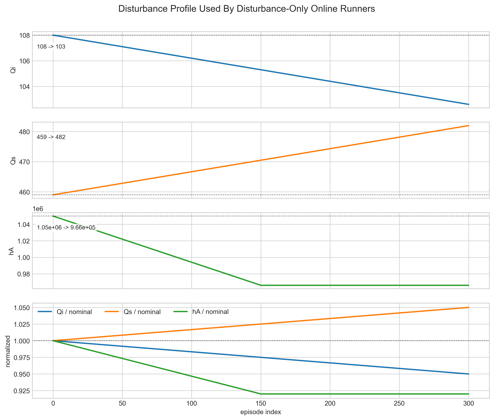

# Online Disturbance Runner Algorithm And Reward Audit

Date: 2026-06-10

## Answers First

The current disturbance-only runners keep the controller objectives and the RL reward shaping separated.

For Direct LMPC and OF-MPC, the controller objective weights are:

| Quantity | Value | Used by |
|---|---:|---|
| $Q_y$ | $[5, 1]$ | Direct LMPC tracking, OF-MPC tracking, governed target selector |
| $S_u$ | $[1, 1]$ | Direct LMPC terminal design / Lyapunov ingredients |
| $R_{\Delta u}$ | $[1, 1]$ | Direct LMPC move penalty, OF-MPC move penalty |

The online RL reward shaping weights are separate:

| Quantity | Value | Used by |
|---|---:|---|
| $Q_{\mathrm{reward}}$ | $[12, 6]$ | TD3 online reward only |
| $R_{\mathrm{reward}}$ | $[1, 1]$ | TD3 online reward move term only |
| $\gamma_{\mathrm{fallback}}$ | $3$ when gate-enabled, $0$ otherwise | Reward penalty only |
| fallback event penalty | $10$ when gate-enabled, $0$ otherwise | Reward penalty only |

The safety gate itself does not use the reward-shaping fallback penalty. The Direct LMPC gate checks bounds, movement, and first-step Lyapunov contraction using the Direct LMPC model and $P_x$. If the TD3 action is rejected, the fallback action is computed by the Direct LMPC tracking problem with $Q_y=[5,1]$ and $R_{\Delta u}=[1,1]$.

For online TD3:

- Safety-gate runners apply the fallback penalty only when the Direct LMPC gate actually changes the TD3 candidate action.
- No-safety-gate runners execute the TD3 action directly, log what the gate would have done, and use the same base reward shaping with fallback penalties disabled.
- `reward_no_penalty` is saved for fair cross-method control-performance comparisons.

## Audited Files

- `utils/online_disturbance_runner.py`
- `Simulation/run_rl_lyapunov.py`
- `TD3Agent/reward_functions.py`
- `Lyapunov/direct_lyapunov_mpc.py`
- `Lyapunov/safety_debug.py`
- `utils/td3_helpers.py`
- `utils/scaling_helpers.py`

## Coordinate System

The physical manipulated inputs are

$$
u^{\mathrm{phys}} = [Q_c,\; Q_m]^T .
$$

The controlled outputs are the polymer output pair used throughout the repository,

$$
y^{\mathrm{phys}} = [\eta,\; T]^T .
$$

The affine min-max transform is

$$
z^{\mathrm{sc}} = \frac{z^{\mathrm{phys}} - z_{\min}}{z_{\max} - z_{\min}} .
$$

Controller coordinates use scaled deviations from the steady state:

$$
u_k = u_k^{\mathrm{sc}} - u_{\mathrm{ss}}^{\mathrm{sc}}, \qquad
y_k = y_k^{\mathrm{sc}} - y_{\mathrm{ss}}^{\mathrm{sc}}, \qquad
r_k = r_k^{\mathrm{sc}} - y_{\mathrm{ss}}^{\mathrm{sc}} .
$$

The TD3 state uses `[-1, 1]` scaling of the augmented observer state, current setpoint deviation, and previous input deviation:

$$
s_k =
\left[
\mathrm{scale}_{[-1,1]}(\hat{x}_k,\hat{d}_k),\;
\mathrm{scale}_{[-1,1]}(r_k),\;
\mathrm{scale}_{[-1,1]}(u_{k-1})
\right].
$$

The actor output $a_k \in [-1,1]^2$ maps to controller input deviation by

$$
u_k^{\mathrm{TD3}} =
u_{\min} + \frac{1}{2}(a_k+1)(u_{\max}-u_{\min}) .
$$

The physical plant input is recovered by

$$
u_k^{\mathrm{phys}} =
\mathrm{reverse\_min\_max}\left(u_{\mathrm{ss}}^{\mathrm{sc}} + u_k,\; u_{\min}^{\mathrm{data}},\; u_{\max}^{\mathrm{data}}\right).
$$

## Numerical Range Audit

The new disturbance runners use the same range objects for Direct LMPC, OF-MPC, TD3 action mapping, and RL state scaling.

| Input range | $Q_c$ | $Q_m$ |
|---|---:|---:|
| physical lower | 71.6 | 78.0 |
| physical steady | 471.6 | 378.0 |
| physical upper | 870.0 | 670.0 |
| scaled steady | 0.0 | 1.0 |
| controller lower deviation | -10.0 | -7.5 |
| controller upper deviation | 9.96 | 7.30 |

Important note: the min-max transform is affine and not clipped. The physical input limits are outside the historical scaler envelope for the inputs, so scaled input values can be outside $[0,1]$. This is not an internal inconsistency because every active controller and TD3 action path uses the same deviation bounds. It does mean the actor action range covers a large physical input interval.

Setpoint deviation scaler bounds used in the TD3 state:

| Output setpoint deviation | lower | upper |
|---|---:|---:|
| output 0 | -4.918 | 5.008 |
| output 1 | -4.612 | 3.065 |

The online runner now checks this scaling contract at startup. The TD3 feature scaler must remain the broad pretraining envelope `[[2.8, 320.0], [5.0, 326.0]]`, while the rollout setpoints remain the direct comparison scenario `[[4.5, 324.0], [3.4, 321.0]]`. If the TD3 scaler is accidentally replaced by the direct two-setpoint rollout scenario, the runner raises before training.

The BC Gaussian standard deviation is in normalized actor-action coordinates. For the current action bounds, `0.02` corresponds to about one percent of the full normalized input span, or roughly `0.20` and `0.15` in controller deviation coordinates for the two inputs.

The online TD3 dimension check is:

$$
\dim(s)=13,\qquad \dim(a)=2.
$$

## Disturbance Profile

The disturbance-only runners call `generate_setpoints_training_rl_gradually(...)` with `force_final_test=False` and the default generated disturbance profile. For 300 episodes and two 400-step setpoint blocks per episode, this gives

$$
n_{\mathrm{steps}} = 300 \times 2 \times 400 = 240000 .
$$

The disturbance schedule is:

- $Q_i$: linearly ramped from $108.0$ to $102.6$, i.e. $0.95$ of nominal.
- $Q_s$: linearly ramped from $459.0$ to $481.95$, i.e. $1.05$ of nominal.
- $hA$: linearly ramped from $1.05\times 10^6$ to $9.66\times 10^5$ over the first half of the run, then held at $0.92$ of nominal.



The plotting script is `analysis/plot_online_disturbance_profile.py`.

## Direct LMPC And OF-MPC Objectives

The OF-MPC baseline uses the offset-free MPC solver with

$$
\min_{\Delta U}
\sum_i \|y_{k+i|k}-r_k\|_{Q_y}^2
+ \sum_i \|\Delta u_{k+i|k}\|_{R_{\Delta u}}^2 ,
$$

where $Q_y=[5,1]$ and $R_{\Delta u}=[1,1]$.

The Direct LMPC fallback solves

$$
\begin{aligned}
\min_U \quad
& \sum_{i=1}^{N_p} \|y_{k+i|k}-y_{\mathrm{track}}\|_{Q_y}^2
+ \|u_{k|k}-u_{k-1}\|_{R_{\Delta u}}^2 \\
&+ \sum_{i=1}^{N_c-1}\|u_{k+i|k}-u_{k+i-1|k}\|_{R_{\Delta u}}^2
\end{aligned}
$$

subject to input bounds, terminal ingredients, and the first-step Lyapunov contraction condition

$$
V(x_{k+1|k}-x_s) \le \rho V(x_k-x_s) + \epsilon .
$$

The Direct LMPC fallback objective is not the RL reward. Its weights are still $Q_y=[5,1]$ and $R_{\Delta u}=[1,1]$.

## Safety Gate Logic

Safety-gate online TD3 runners use:

```text
projection_backend = "direct_accept_or_fallback"
```

At each step:

1. TD3 proposes an action.
2. The action is mapped to scaled input deviation coordinates.
3. The governed-reference Direct LMPC target selector computes the current governed target.
4. The TD3 candidate is evaluated for input bounds, move bounds, and first-step Lyapunov contraction.
5. If accepted, the TD3 action is executed.
6. If rejected, Direct LMPC fallback is executed, or hold-prev is used if the target/fallback solve fails.
7. Reward fallback penalty is applied only if the executed action differs from the TD3 candidate.

No-safety-gate online TD3 runners use:

```text
projection_backend = "mpc_only_diagnostic"
```

At each step:

1. TD3 proposes an action.
2. The TD3 action is executed directly.
3. The Direct LMPC gate is evaluated diagnostically.
4. `diagnostic_unsafe`, `diagnostic_unstable`, and `diagnostic_safety_active_flags` are logged.
5. `actual_intervention_flags` stay zero.
6. Reward fallback penalties are disabled.

## Reward Shaping

The reward function computes a base shaped reward from tracking error, movement, inside-band shaping, and bonus terms:

$$
r_{\mathrm{base}}
= -J_{\mathrm{track}}(e_k)
- J_{\Delta u}(\Delta u_k)
+ B(e_k).
$$

When the safety gate is active and actually changes the action, the training reward becomes

$$
r_k =
r_{\mathrm{base}}
- \gamma_{\mathrm{fallback}}
\|u_k^{\mathrm{TD3}}-u_k^{\mathrm{exec}}\|_{R_{\mathrm{fallback}}}^2
- c_{\mathrm{event}} .
$$

For no-safety-gate runs,

$$
r_k = r_{\mathrm{base}}.
$$

The saved arrays separate these quantities:

- `rewards`: actual training reward.
- `reward_no_penalty`: base reward without fallback/event penalty.
- `fallback_penalty`: zero unless the safety gate actually changed the action.
- `weighted_correction_gap`: weighted action correction size.

Use `reward_no_penalty` when comparing controller quality against Direct LMPC or OF-MPC baselines.

## Online Training Phases

The phase scheduler is cycle-based. One cycle contains both setpoints, so the default cycle length is

$$
2 \times 400 = 800 \text{ steps}.
$$

Current defaults:

| Phase item | Value |
|---|---:|
| warmup buffer-only cycles | 0 |
| behavior-cloning cycles | 20 |
| handoff cycles | 5 |
| full online TD3 cycles | remaining cycles |
| default episodes | 300 |
| forced final test episode | false |

Core TD3 and Lyapunov constants:

| Quantity | Value | Meaning |
|---|---:|---|
| TD3 discount factor $\gamma_{\mathrm{TD3}}$ | 0.99 | bootstrapped critic target discount |
| TD3 policy delay | 2 | actor and target updates every second critic update |
| Direct LMPC contraction $\rho$ | 0.99 | first-step Lyapunov contraction factor |
| Direct LMPC $\epsilon$ | $5\times 10^{-3}$ | practical contraction tolerance |
| Lyapunov numerical tolerance | $10^{-10}$ | candidate/gate feasibility tolerance |

### Warmup

Current warmup length is zero, so no pure warmup phase actually runs by default.

If `warmup_buffer_only_episodes` is increased:

- `warmup_behavior_source` chooses `direct_lyapunov_mpc`, `offset_free_mpc`, or `policy`.
- The current runner config sets teacher warmup noise to `"none"`.
- Transitions go into the replay buffer.
- TD3 parameter updates are not run during warmup.

This is separate from the old `warm_start=0` argument. With `training_phase_config` active, the phase scheduler controls learning phases.

### Behavior Cloning Phase

For the first 20 cycles, the config uses:

```text
bc_behavior_source = teacher_source
bc_behavior_noise = "gaussian"
```

This means the behavior candidate during BC is the teacher action plus Gaussian exploration. The clean teacher action is also stored as the supervised actor-demo target. This is the expert-guided/off-policy pattern: the critic sees real executed transitions, including exploration and safety/no-safety execution effects, while the actor is pulled toward the clean expert action.

So the critic and actor learn from different objects during BC:

- The critic sees replay transitions with the actually executed action, post-gate reward, next state, and done flag.
- The critic update is TD-style but critic-only: `train_step(actor_update=False)`.
- The actor does not run the TD3 policy-gradient update during BC.
- The actor is trained by supervised BC updates toward the teacher demo action through `train_actor_bc_step()`.
- If the safety gate is active, the replay action is the gate-executed action; the actor demo target is still the teacher action.
- If no gate is active, the replay action is the teacher-plus-noise action with no Direct LMPC intervention; the actor demo target is still the clean teacher action.

Per step during BC:

1. Compute teacher action from Direct LMPC or OF-MPC depending on runner.
2. Add Gaussian exploration to the teacher action for the executed behavior candidate.
3. Apply safety gate or no-gate diagnostic logic.
4. Store the executed action in replay.
5. Store the teacher action in the actor demo buffer.
6. Run critic TD update.
7. Run actor BC updates, currently 4 actor BC updates per step.

Teacher source by runner:

| Runner family | Teacher source |
|---|---|
| LMPC-pretrained safety | Direct LMPC |
| OF-MPC-pretrained safety | OF-MPC |
| cold-start safety | Direct LMPC |
| LMPC-pretrained no-gate | OF-MPC |
| OF-MPC-pretrained no-gate | OF-MPC |
| cold-start no-gate | OF-MPC |

The OF-MPC-pretrained safety-gate runner uses OF-MPC for the teacher while Direct LMPC remains the safety gate.
For all no-gate runners, Direct LMPC is diagnostic only and is not used as the online BC/handoff supervisor. The LMPC-pretrained no-gate runner still starts from an LMPC-pretrained checkpoint, but its online supervisor is OF-MPC.

### Handoff

After BC, the runner uses a 5-cycle handoff. During handoff, the policy candidate is blended with the clean teacher action:

$$
u_{\mathrm{handoff}}
= \alpha u_{\mathrm{teacher}} + (1-\alpha)u_{\mathrm{policy}},
$$

with $\alpha$ decaying linearly from near 1 to 0 over the handoff window.

The policy side of the blend keeps the full-RL Gaussian exploration schedule. No extra teacher-side noise is added after blending. The blended candidate is then passed through the same safety-gate or no-gate execution path. Handoff diagnostics are logged as:

- `handoff_active_flags`
- `handoff_alpha`
- `handoff_candidate_gap_inf`
- `bc_teacher_gap_inf`

### Full Online TD3

After the handoff window:

- Behavior source is the TD3 policy.
- Current configs use Gaussian action exploration.
- TD3 actor and critic updates run online.
- Safety-gate runners still gate every candidate.
- No-gate runners still log would-be Direct LMPC gate activation.

## Exploration Settings

Current Gaussian exploration settings:

| Runner family | BC std | Full RL std start | Full RL std end |
|---|---:|---:|---:|
| pretrained | 0.02 | 0.02 | 0.005 |
| cold-start | 0.10 | 0.10 | 0.005 |

TD3 target-policy smoothing:

| Runner family | smoothing std | noise clip |
|---|---:|---:|
| pretrained | 0.01 | 0.01 |
| cold-start | 0.10 | 0.01 |

Parameter-noise exploration is implemented in the training loop but not enabled by the new runner configs. To enable it, change the relevant phase noise field, such as `full_rl_behavior_noise`, to `"parameter"` and tune the `parameter_noise_*` fields.

## Live Reward Interpretation

The console now prints three reward quantities at each cycle boundary:

- `avg. reward`: the actual training reward used by TD3.
- `avg. reward_no_penalty`: the same shaped tracking reward before safety-gate fallback/event penalties.
- `avg. fallback penalty`: the average safety-gate penalty charged in that cycle.

This matters because no-gate runners have fallback penalties disabled by construction, while safety-gate runners subtract the event and correction penalty whenever the Direct LMPC gate changes the candidate action. Therefore a no-gate run can show a much better raw reward while still reporting a nonzero `diagnostic_unsafe` or would-activate rate. In that case the interpretation is not a scaling failure: it means the no-gate candidate tracks better under the shaped reward but fails the model-based Direct LMPC contraction diagnostic on those steps.

## What To Change If Needed

Use these knobs in `utils/online_disturbance_runner.py`.

To use Direct LMPC as a BC/handoff teacher:

```python
"bc_behavior_source": "direct_lyapunov_mpc"
```

To use OF-MPC as a BC/handoff teacher:

```python
"bc_behavior_source": "offset_free_mpc"
```

To disable BC:

```python
"behavior_clone_teacher_episodes": 0
```

To lengthen or remove handoff:

```python
"handoff_episodes": 10
```

or

```python
"handoff_episodes": 0
```

To reduce cold-start aggressiveness:

```python
"bc_exploration_std": 0.05
"full_rl_exploration_std_start": 0.05
"full_rl_exploration_std_end": 0.005
```

To add a true warmup phase:

```python
"warmup_buffer_only_episodes": 5
"warmup_behavior_source": "direct_lyapunov_mpc"
"warmup_behavior_noise": "none"
```

To make BC execute ungated policy actions while only using the teacher as actor-demo supervision:

```python
"bc_behavior_source": "policy_with_lmpc_teacher_demo"
```

This is no longer the default because it makes BC critic data policy-driven instead of teacher-guided.

## Audit Findings And Caveats

1. The active new runners do not mix reward-shaping penalties into the MPC or Direct LMPC safety-gate objective.
2. The no-gate runners execute the configured behavior/policy action directly and log Direct LMPC diagnostics only; Direct LMPC is not the no-gate online BC/handoff teacher.
3. The saved no-gate reward config now disables fallback penalties explicitly, so the config matches the behavior.
4. The `fallback_rate` comparison field counts Direct LMPC fallback modes, not every intervention-like hold-prev event. For safety-gate activity, prefer `actual_intervention_rate`, `n_target_fail_hold_prev`, `n_fallback_mpc_verified`, and `n_fallback_mpc_unverified`.
5. The affine input scaler can produce scaled values outside $[0,1]$ for the physical input limits. This is consistent in the active code path but should be remembered when interpreting action magnitudes.
6. Smoke runs with very short setpoint blocks can trigger governed-reference target failures. Full 400-step blocks are the intended comparison setting.
