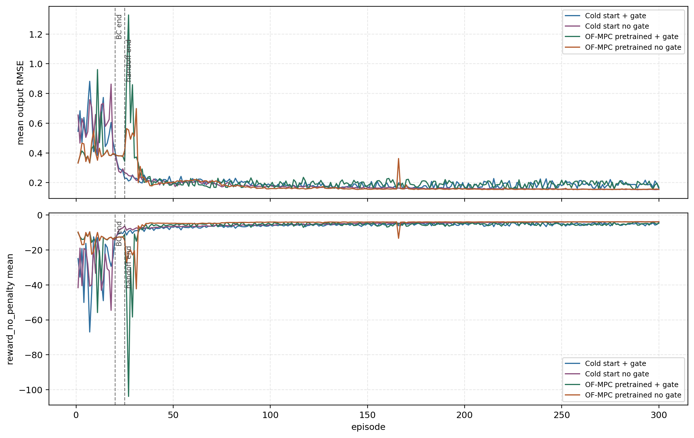
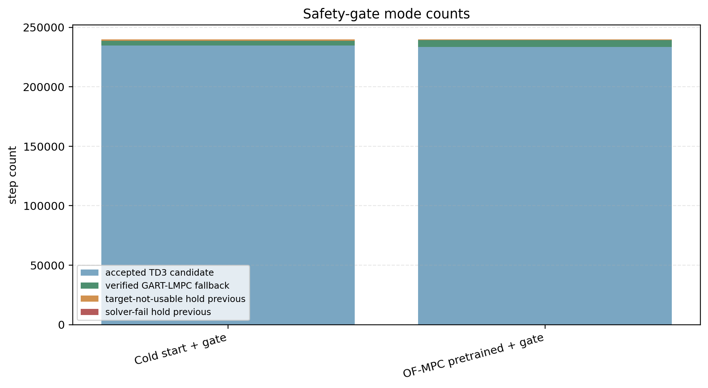
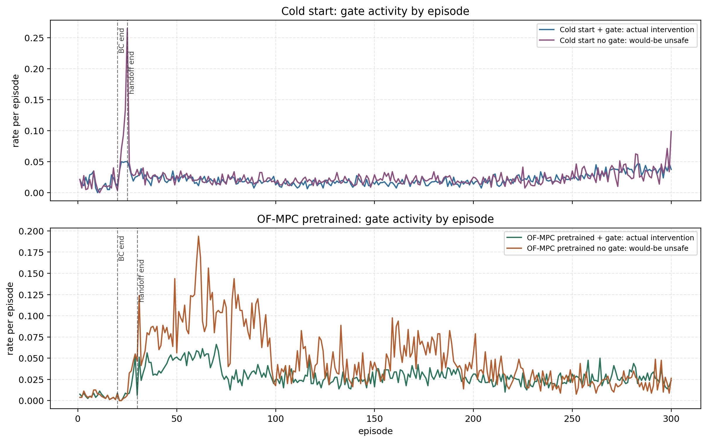
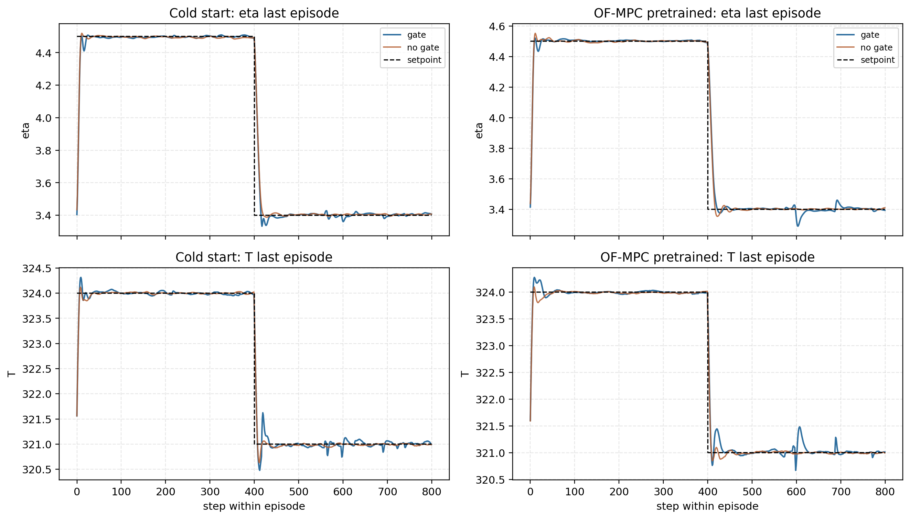

# Online GART-TD3 Gate And Fallback Analysis

Date: 2026-06-17

## Objective

This report analyzes the latest completed cold-start and OF-MPC-pretrained online TD3 disturbance runs. The focus is tracking performance, the GART safety gate, and what the fallback controller is actually doing when the gate rejects the TD3 candidate action.

The four analyzed runs are:

- `results/OnlineTD3_ColdStart_SafetyGate/20260616_210331`
- `results/OnlineTD3_ColdStart_NoSafetyGate/20260616_210331`
- `results/OnlineTD3_OFMPCPretrained_SafetyGate/20260616_210351`
- `results/OnlineTD3_OFMPCPretrained_NoSafetyGate/20260616_210349`

The analysis artifacts are saved in:

- `report/figures/2026-06-17_online_gart_gate_fallback/summary_metrics.csv`
- `report/figures/2026-06-17_online_gart_gate_fallback/phase_metrics.csv`
- `report/figures/2026-06-17_online_gart_gate_fallback/gate_detail_counts.csv`
- `report/figures/2026-06-17_online_gart_gate_fallback/episode_metrics.csv`

## Method

All four runners use the polymer CSTR disturbance setup with 300 episodes and 800 steps per episode. The GART-family online runs use a GART target selector and a GART-LMPC teacher during the behavior-cloning phase.

For the safety-gate cases, the online TD3 policy proposes a candidate input $u_{\mathrm{RL},k}$. The gate evaluates this candidate around the current GART target $(x_s,u_s,y_s,d_s)$ using the first-step Lyapunov contraction test:

$$
V(x_{k+1}^{\mathrm{cand}} - x_s)
\le
\rho V(\hat{x}_k - x_s) + \epsilon .
$$

The current runs use:

$$
\rho = 0.98,
\qquad
\epsilon = 10^{-3}.
$$

If the TD3 candidate passes the contraction and bound checks, the candidate is applied. If it fails, the fallback controller solves the GART-LMPC problem with the raw setpoint tracking objective and the same hard first-step contraction constraint:

$$
\min_{u_{0:N_c-1}}
\sum_{i=0}^{N_p-1}
\left\lVert y_{k+i+1} - y_{\mathrm{sp},k} \right\rVert_{Q}^2
+ \sum_{i=0}^{N_c-1}
\left\lVert \Delta u_{k+i} \right\rVert_{R_{\Delta u}}^2 .
$$

If GART-LMPC solves and passes the certificate, the fallback input is applied. If the GART target is not usable or the solver fails, the implementation holds the previous input. That hold-previous path is still an actual safety intervention, even though it is not a verified fallback-MPC solve.

For the no-gate cases, the code logs a diagnostic GART safety test but applies the TD3 action directly. Therefore:

- `diagnostic_unsafe_rate` in no-gate runs means "would have been rejected if the gate were active".
- `actual_intervention_rate` in gate runs means the gate changed the action or held the previous input.
- `fallback_rate` in the saved summary counts only verified GART-LMPC fallback solves, not target-unusable or solver-fail hold-previous events.

## Overall Performance

The safety gate is not improving tracking in these online training runs. It prevents unsafe candidate execution, but both gate runs have worse `reward_no_penalty` and worse output RMSE than their no-gate counterparts.

| Case | Reward No Penalty | Training Reward | Mean RMSE | eta RMSE | T RMSE |
|---|---:|---:|---:|---:|---:|
| Cold start + gate | -7.443 | -8.628 | 0.240 | 0.139 | 0.340 |
| Cold start no gate | -6.716 | -6.716 | 0.233 | 0.133 | 0.333 |
| OF-MPC pretrained + gate | -6.988 | -8.349 | 0.253 | 0.142 | 0.364 |
| OF-MPC pretrained no gate | -5.448 | -5.448 | 0.215 | 0.128 | 0.302 |

Relative to the no-gate counterpart:

- Cold-start + gate has 2.9% higher mean RMSE and 10.8% worse absolute `reward_no_penalty`.
- OF-MPC-pretrained + gate has 17.8% higher mean RMSE and 28.3% worse absolute `reward_no_penalty`.

The training reward is even worse for the gate runs because fallback penalties are included only when the gate is active. This is why `reward_no_penalty` is the better control-performance comparison.

## Gate And Fallback Results

The gate is active and is doing real work. The issue is that the interventions are not improving tracking or online learning.

| Case | Would-Be Unsafe | Actual Intervention | Verified Fallback | Target Hold | Solver Hold |
|---|---:|---:|---:|---:|---:|
| Cold start + gate | 0.000% | 2.150% | 1.579% | 0.565% | 0.005% |
| Cold start no gate | 2.430% | 0.000% | 0.000% | 0.000% | 0.000% |
| OF-MPC pretrained + gate | 0.000% | 2.770% | 2.402% | 0.363% | 0.005% |
| OF-MPC pretrained no gate | 4.730% | 0.000% | 0.000% | 0.000% | 0.000% |

For the safety-gate runs, the actual intervention count decomposes as:

| Case | Accepted TD3 | Verified GART-LMPC | Target-Unusable Hold | Solver-Fail Hold |
|---|---:|---:|---:|---:|
| Cold start + gate | 234,841 | 3,790 | 1,356 | 13 |
| OF-MPC pretrained + gate | 233,352 | 5,766 | 871 | 11 |

The rejection reasons are mostly Lyapunov contraction failures:

| Case | Lyapunov Rejects | Target Unavailable |
|---|---:|---:|
| Cold start + gate | 3,803 | 1,356 |
| OF-MPC pretrained + gate | 5,777 | 871 |

This means the gate is not mostly failing due to optimizer crashes. Most interventions are caused by the TD3 action failing the contraction certificate. The target-unusable hold path is still non-negligible, especially in the cold-start run.

## Learning-Phase Behavior

The long full-RL portion is where the performance gap matters most.

| Pair | Phase | Gate RMSE | No-Gate RMSE | Gate Reward No Penalty | No-Gate Reward No Penalty |
|---|---|---:|---:|---:|---:|
| Cold start | full RL | 0.191 | 0.173 | -5.861 | -5.041 |
| Cold start | last 50 episodes | 0.190 | 0.155 | -5.240 | -3.968 |
| OF-MPC pretrained | full RL | 0.194 | 0.175 | -5.371 | -4.373 |
| OF-MPC pretrained | last 50 episodes | 0.191 | 0.156 | -5.218 | -3.945 |

In the last 50 episodes:

- Cold-start + gate has 22.1% higher RMSE than no-gate.
- OF-MPC-pretrained + gate has 22.9% higher RMSE than no-gate.

The no-gate runs are not certified safe. They have diagnostic unsafe events. But they learn better tracking behavior under the shaped reward. The safety gate appears to protect the plant at the expense of the training signal and action continuity.

## Tracking Details

The last-episode trajectories confirm the same picture. The no-gate trajectories generally sit closer to the raw setpoint in the final learned regime, while the gate runs have extra action replacement and hold behavior that can keep the closed loop away from the best raw tracking trajectory.

The important distinction is raw setpoint tracking versus certified target-centered safety. The GART-LMPC fallback is solving a constrained target-centered problem. When the TD3 candidate is rejected, the fallback input is not chosen to imitate the best TD3 action. It is chosen to satisfy a hard practical Lyapunov contraction around the current GART target while tracking the raw setpoint as much as feasible.

## Interpretation

The safety gate is technically behaving as designed:

- It accepts most TD3 actions.
- It rejects actions that violate the first-step contraction certificate.
- It calls GART-LMPC fallback for most rejected actions.
- It holds the previous input when the GART target is not usable or the solver fails.

The performance problem is not that fallback is never triggered. It is that the triggered fallback does not make the online learner better in these runs. The likely mechanisms are:

- The fallback changes only 2 to 3 percent of steps, but those steps are concentrated around difficult transitions where tracking errors and learning gradients matter most.
- The safety-gate reward includes fallback penalties. This makes the actor see a harsher training reward in the gate runs, even when the fallback action is stabilizing.
- The TD3 transition is stored with the action actually used after filtering. This is safe from an execution standpoint, but it can make the actor learn from fallback-shaped behavior rather than from its own preferred action.
- Hold-previous events caused by unusable GART targets are not benign. They freeze the input at exactly the time the system may need a controlled move.
- GART target mismatch is not zero. The target selector can certify a governed target that differs from the raw setpoint, so safe behavior can still be worse raw setpoint tracking.

The OF-MPC-pretrained no-gate run has the best tracking and reward, but also the highest diagnostic unsafe rate: 4.73% overall. That run is therefore not a safe controller. It is a useful diagnostic showing that the actor can learn good raw tracking when it is not constrained by the gate.

## Risks And Inconsistencies Found

The result artifacts need to be interpreted carefully:

- `accepted_rate` is not meaningful for the no-gate runs. It is zero because those runs use `mpc_only_diagnostic_bypass`, not because every TD3 action failed.
- `diagnostic_unsafe_rate` is meaningful for no-gate runs, but it is not the right gate metric for active safety-gate runs. Use `actual_intervention_rate` for active gate runs.
- `fallback_rate` in the saved summary counts verified fallback-MPC replacements only. It excludes target-unusable and solver-fail hold-previous events.
- `reward_mean` is not a fair cross-method tracking metric because gate runs include fallback penalties. Use `reward_no_penalty` for control-performance comparison.
- The four runs are online-learning trajectories. The safety and no-safety versions are not identical state trajectories after the first intervention, so the gate/no-gate comparison is scenario-level rather than step-paired after divergence.

No implementation evidence in this analysis indicates that GART-LMPC fallback is simply failing all the time. Solver failure is tiny: 13 steps for cold-start and 11 steps for OF-MPC-pretrained. The bigger issue is that verified fallback and target-unusable hold events degrade learning and tracking relative to no-gate training.

## Recommended Next Experiment

The next experiment should separate three effects that are currently mixed:

1. Gate execution effect.
   Run the trained no-gate agents through the GART safety gate in evaluation-only mode with no TD3 updates. This tests whether the trained no-gate policy is good but unsafe, or whether the gate itself destroys its tracking.

2. Fallback-penalty learning effect.
   Run safety-gate training with the gate still active but with `gamma_fallback = 0` and `fallback_event_penalty = 0`. Compare `reward_no_penalty`, actual intervention rate, and final-50 RMSE against the current gate runs.

3. Hold-previous effect.
   Add a separate metric and plot for target-unusable hold events around setpoint changes. If hold events cluster at setpoint transitions, the next controller change should target GART target usability before reward tuning.

The likely files are:

- `utils/online_disturbance_runner.py` for reward and preset changes.
- `Simulation/run_rl_lyapunov.py` for evaluation-only gate logging and hold-previous diagnostics.
- `analysis/online_gart_gate_fallback_analysis.py` for repeated comparison metrics.

## Remaining Uncertainty

This analysis uses one completed seed per runner. The performance gap is large enough to act on, but it should still be verified with at least two more seeds after the next change. The main uncertainty is whether the gate hurts because the fallback changes the plant trajectory, because the fallback penalty corrupts actor learning, or because GART target-unusable hold events interrupt important transitions.

The current evidence says the gate enforces the intended safety logic, but the online training loop is not yet learning a policy that performs well under that safety logic.
