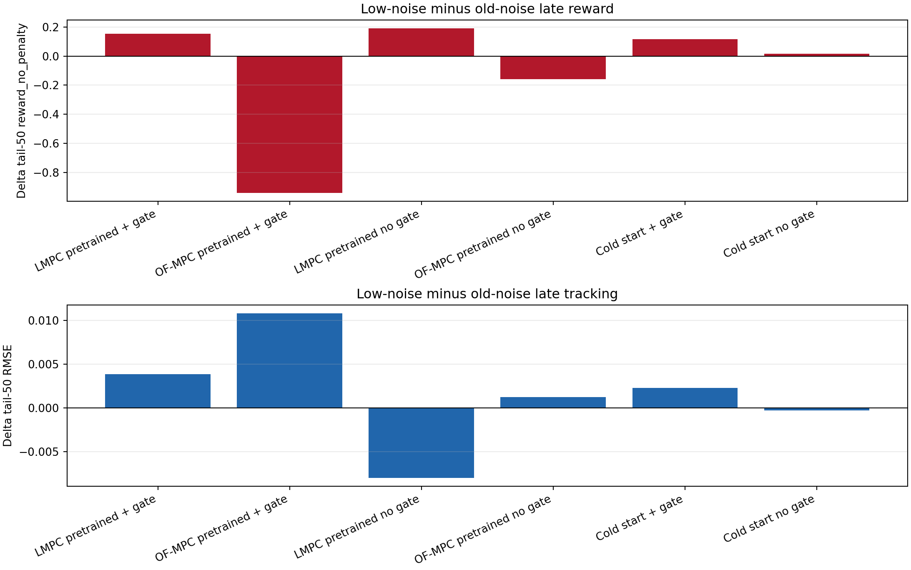
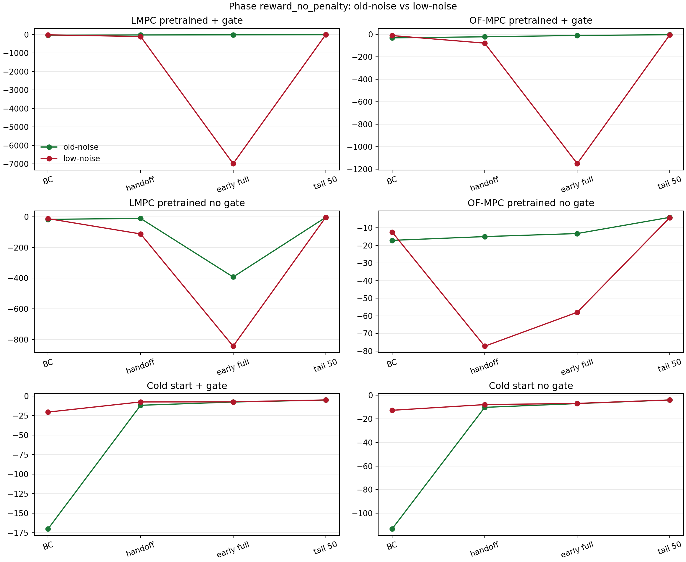
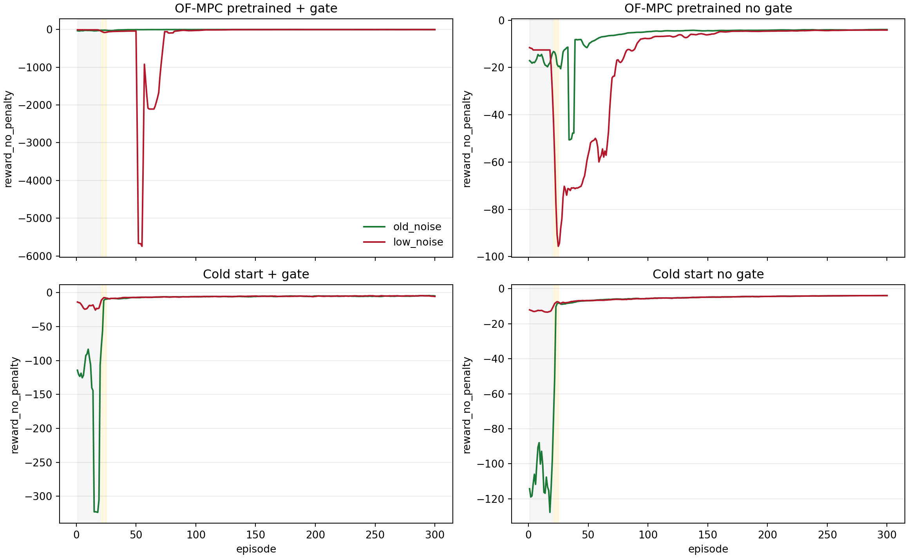

# Low-Noise Online Runner Regression Analysis

Date: 2026-06-12

## Question

The six online TD3 disturbance runners were rerun after the BC/handoff exploration
change. Performance got much worse. This report compares that low-noise batch
against the previous bounded-mixed online batch.

Short answer: the user's impression is right for the pretrained runs, especially
through handoff and early full RL. It is not true for cold-start runs. Cold-start
benefits from the lower BC noise because the old `0.1` BC noise was too large.
The pretrained runs need some local action variation during BC/handoff, or a
critic recalibration phase, before full actor updates take over.

## Data Used

| Case | Old-noise run | Low-noise run | Old agent | Low agent |
| :--- | ---: | ---: | ---: | ---: |
| LMPC pretrained + gate | results/OnlineTD3_LMPCPretrained_SafetyGate/20260611_000544 | results/OnlineTD3_LMPCPretrained_SafetyGate/20260612_011534 | lmpc_pretrained_td3_20260610_173834.pkl | lmpc_pretrained_td3_20260611_231823.pkl |
| OF-MPC pretrained + gate | results/OnlineTD3_OFMPCPretrained_SafetyGate/20260611_000552 | results/OnlineTD3_OFMPCPretrained_SafetyGate/20260612_011542 | of_mpc_pretrained_td3_20260610_153921.pkl | of_mpc_pretrained_td3_20260610_153921.pkl |
| LMPC pretrained no gate | results/OnlineTD3_LMPCPretrained_NoSafetyGate/20260611_000541 | results/OnlineTD3_LMPCPretrained_NoSafetyGate/20260612_011530 | lmpc_pretrained_td3_20260610_173834.pkl | lmpc_pretrained_td3_20260611_231823.pkl |
| OF-MPC pretrained no gate | results/OnlineTD3_OFMPCPretrained_NoSafetyGate/20260611_000548 | results/OnlineTD3_OFMPCPretrained_NoSafetyGate/20260612_011538 | of_mpc_pretrained_td3_20260610_153921.pkl | of_mpc_pretrained_td3_20260610_153921.pkl |
| Cold start + gate | results/OnlineTD3_ColdStart_SafetyGate/20260611_000537 | results/OnlineTD3_ColdStart_SafetyGate/20260612_011526 |  |  |
| Cold start no gate | results/OnlineTD3_ColdStart_NoSafetyGate/20260611_000534 | results/OnlineTD3_ColdStart_NoSafetyGate/20260612_011522 |  |  |

The low-noise batch used:

- pretrained BC: `bc_behavior_noise="none"`, `bc_exploration_std=0.0`
- cold-start BC: `bc_exploration_std=0.005`
- handoff noise ending at `0.005` for pretrained and `0.01` for cold-start
- full-RL exploration unchanged after handoff

Important caveat: the LMPC-pretrained low-noise runs also loaded the newer
bounded-mixed LMPC checkpoint. Their degradation is therefore a combined
checkpoint-plus-schedule effect. The OF-MPC-pretrained and cold-start cases are
cleaner tests of the low-noise schedule.

## Low-Noise Batch Performance

| Case | Mean no-penalty reward | Tail50 reward | Tail50 RMSE | Actual gate % | Diag unsafe % | Mean abs dU phys |
| :--- | ---: | ---: | ---: | ---: | ---: | ---: |
| LMPC pretrained + gate | -1,171 | -4.924 | 0.178 | 1.907 | 0.000 | 11.150 |
| OF-MPC pretrained + gate | -202.519 | -5.844 | 0.188 | 1.777 | 0.000 | 10.227 |
| LMPC pretrained no gate | -147.061 | -4.094 | 0.160 | 0.000 | 3.173 | 9.080 |
| OF-MPC pretrained no gate | -16.104 | -4.195 | 0.158 | 0.000 | 2.488 | 8.303 |
| Cold start + gate | -6.710 | -4.896 | 0.173 | 1.831 | 0.000 | 19.160 |
| Cold start no gate | -5.610 | -3.964 | 0.156 | 0.000 | 3.535 | 17.153 |

## Low-Noise Minus Old-Noise

Positive reward deltas are better. Negative RMSE deltas are better.

| Case | Delta mean reward | Delta tail reward | Delta tail RMSE | Delta penalty | Delta gate pp | Delta diag pp |
| :--- | ---: | ---: | ---: | ---: | ---: | ---: |
| LMPC pretrained + gate | -1,163 | 0.154 | 0.004 | 0.032 | -0.089 | 0.000 |
| OF-MPC pretrained + gate | -194.303 | -0.942 | 0.011 | 0.113 | -0.630 | 0.000 |
| LMPC pretrained no gate | -76.815 | 0.192 | -0.008 | 0.000 | 0.000 | 0.688 |
| OF-MPC pretrained no gate | -9.245 | -0.158 | 0.001 | 0.000 | 0.000 | -2.478 |
| Cold start + gate | 10.170 | 0.117 | 0.002 | -0.248 | -0.459 | 0.000 |
| Cold start no gate | 6.751 | 0.015 | -0.000 | 0.000 | 0.000 | -0.088 |

The cleanest schedule-only comparisons are the OF-MPC-pretrained and cold-start
cases because their checkpoint status did not change.

- OF-MPC-pretrained runs got worse, especially in handoff and early full RL.
- Cold-start runs got better in mean reward and early learning, with tail
  performance roughly tied or slightly better.
- LMPC-pretrained runs are confounded by a checkpoint change: the low-noise runs
  loaded the newer bounded-mixed LMPC checkpoint, while the old-noise runs loaded
  the older governed-reference checkpoint.

## Phase Diagnosis

| Case phase | Old reward | Low reward | Delta | Old RMSE | Low RMSE |
| :--- | ---: | ---: | ---: | ---: | ---: |
| LMPC pretrained + gate - BC | -28.772 | -12.421 | 16.352 | 0.577 | 0.377 |
| LMPC pretrained + gate - handoff | -18.865 | -103.215 | -84.350 | 0.460 | 0.979 |
| LMPC pretrained + gate - early full | -10.972 | -6,987 | -6,976 | 0.353 | 3.846 |
| LMPC pretrained + gate - tail 50 | -5.079 | -4.924 | 0.154 | 0.175 | 0.178 |
| OF-MPC pretrained + gate - BC | -32.888 | -12.420 | 20.468 | 0.633 | 0.377 |
| OF-MPC pretrained + gate - handoff | -23.282 | -79.562 | -56.279 | 0.593 | 0.858 |
| OF-MPC pretrained + gate - early full | -11.534 | -1,149 | -1,138 | 0.337 | 2.608 |
| OF-MPC pretrained + gate - tail 50 | -4.903 | -5.844 | -0.942 | 0.177 | 0.188 |
| LMPC pretrained no gate - BC | -17.114 | -12.420 | 4.695 | 0.456 | 0.377 |
| LMPC pretrained no gate - handoff | -11.264 | -112.108 | -100.844 | 0.394 | 0.819 |
| LMPC pretrained no gate - early full | -392.424 | -843.025 | -450.601 | 0.796 | 1.603 |
| LMPC pretrained no gate - tail 50 | -4.286 | -4.094 | 0.192 | 0.168 | 0.160 |
| OF-MPC pretrained no gate - BC | -17.114 | -12.420 | 4.695 | 0.456 | 0.377 |
| OF-MPC pretrained no gate - handoff | -14.977 | -77.257 | -62.280 | 0.399 | 0.828 |
| OF-MPC pretrained no gate - early full | -13.246 | -57.965 | -44.718 | 0.340 | 0.766 |
| OF-MPC pretrained no gate - tail 50 | -4.036 | -4.195 | -0.158 | 0.157 | 0.158 |
| Cold start + gate - BC | -170.006 | -20.432 | 149.574 | 1.544 | 0.493 |
| Cold start + gate - handoff | -11.733 | -7.437 | 4.295 | 0.399 | 0.270 |
| Cold start + gate - early full | -7.539 | -7.304 | 0.235 | 0.226 | 0.213 |
| Cold start + gate - tail 50 | -5.013 | -4.896 | 0.117 | 0.171 | 0.173 |
| Cold start no gate - BC | -113.190 | -12.727 | 100.463 | 1.302 | 0.382 |
| Cold start no gate - handoff | -10.243 | -7.902 | 2.340 | 0.324 | 0.281 |
| Cold start no gate - early full | -7.029 | -6.888 | 0.141 | 0.203 | 0.209 |
| Cold start no gate - tail 50 | -3.979 | -3.964 | 0.015 | 0.156 | 0.156 |

The important pattern is not that BC became worse. BC improves in every case.
The failure mode for pretrained runs starts at handoff and early full RL:

- OF-MPC pretrained + gate: BC improves by `+20.468`, but handoff drops by
  `-56.279` and early full RL drops by `-1138`.
- OF-MPC pretrained no gate: BC improves by `+4.695`, but handoff drops by
  `-62.280` and early full RL drops by `-44.718`.

This points to under-exploration and critic-distribution mismatch for pretrained
online learning:

1. In BC, the critic sees a narrow teacher-driven state-action distribution.
2. The actor is also pulled tightly toward the clean teacher action.
3. Handoff uses very small policy-side noise.
4. Full RL begins from a policy/critic pair that has not seen enough local action
   variation around the teacher trajectory.
5. When full exploration resumes, the critic is less prepared for the policy
   actions and the actor update can drift into poorer behavior.

So the previous noisy BC was ugly, but it may have been doing something useful:
it gave the critic online-reward data around the teacher action neighborhood.
Removing that variation made the early supervised behavior cleaner but less
useful for later TD3 learning.

## What This Means

The low-noise idea was half right:

- For cold-start, reducing BC noise from `0.1` to `0.005` clearly helped.
- For pretrained runs, setting BC noise to exactly zero was too conservative.

A better compromise is:

- pretrained BC std: `0.01` or `0.02`, not `0.0`
- cold-start BC std: keep `0.005` to `0.01`
- pretrained handoff should ramp to the full-RL std, not stop at `0.005`
- cold-start handoff can stay small or modestly increase
- keep full-RL std unchanged

That preserves teacher-centered behavior while giving the critic enough local
action perturbations to learn the online reward landscape.

## Recommended Next Step

Do not fully revert the low-noise schedule. Split the policy:

| Runner family | Recommended BC std | Recommended handoff end | Full RL start |
| :--- | ---: | ---: | ---: |
| pretrained | 0.010 to 0.020 | 0.020 | 0.020 |
| cold-start | 0.005 to 0.010 | 0.010 to 0.030 | 0.100 |

Then rerun the schedule-isolation cases first:

1. `OnlineTD3_OFMPCPretrained_SafetyGate.py`
2. `OnlineTD3_OFMPCPretrained_NoSafetyGate.py`
3. `OnlineTD3_ColdStart_SafetyGate.py`
4. `OnlineTD3_ColdStart_NoSafetyGate.py`

Those isolate the schedule without the LMPC checkpoint confound. If they recover,
then rerun the two LMPC-pretrained cases.

## Relation To The Previous Strategy Report

This result strengthens the case for critic recalibration. The issue is not just
teacher noise; it is the critic's online data distribution and reward scale.

Before implementing DAgger-style relabeling, I would now do:

1. moderate pretrained BC/handoff exploration, not zero exploration
2. actor-frozen critic recalibration for pretrained runs
3. critic last-layer reset if recalibration alone does not help

DAgger-style relabeling is still promising, but it should not be implemented as
pure clean-teacher imitation only. It should include either local action
perturbations for critic coverage or a separate critic recalibration phase.

## Exported Tables

- `tables/2026-06-12_online_low_noise_regression_analysis/metrics.csv`
- `tables/2026-06-12_online_low_noise_regression_analysis/phase_metrics.csv`
- `tables/2026-06-12_online_low_noise_regression_analysis/low_minus_old_deltas.csv`
