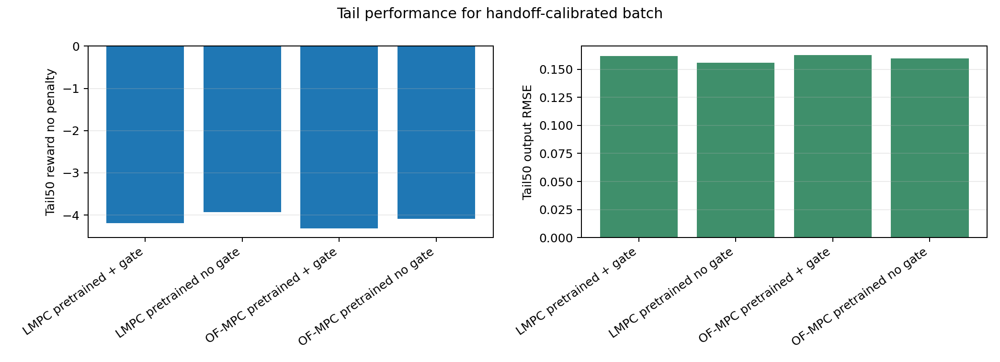
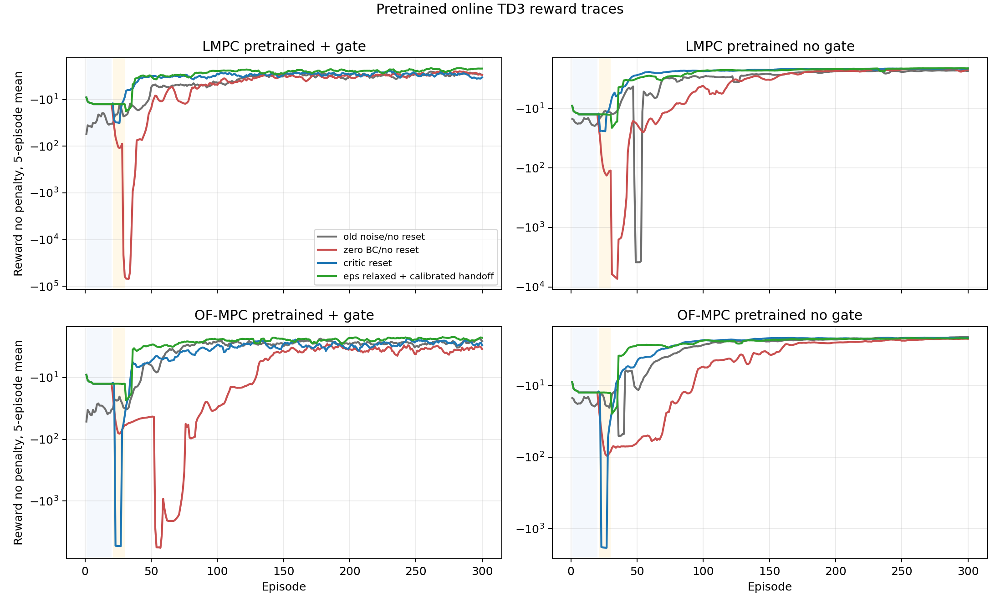
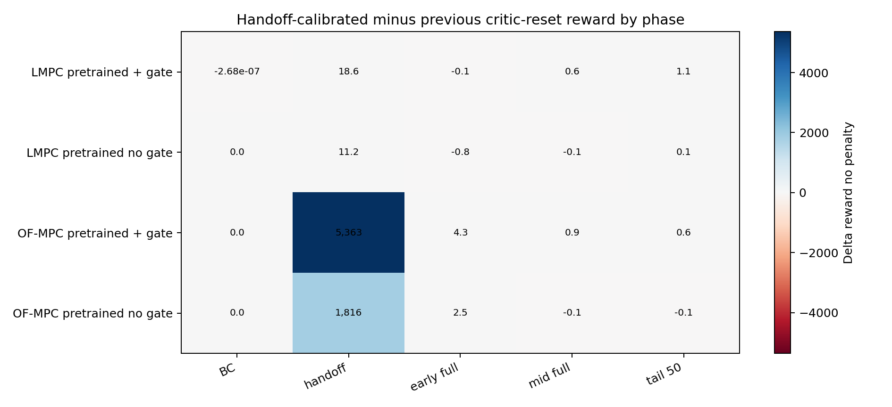
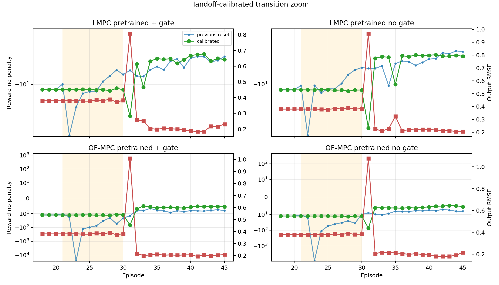
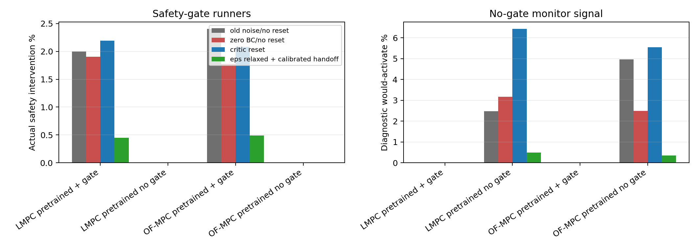
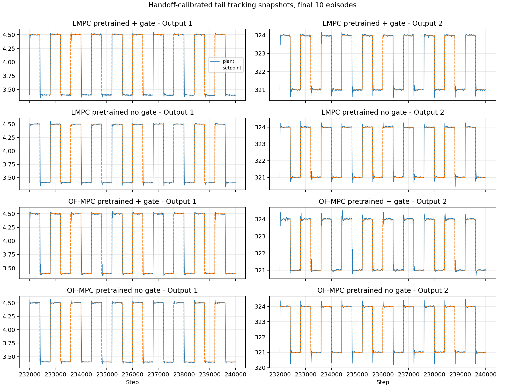

# Pretrained Online TD3 Critic-Reset Batch Analysis

Date: 2026-06-12

## Question

This report extends the earlier pretrained critic-reset analysis with the new
four-run batch using the calibrated handoff schedule. The new batch keeps the
pretrained actor, resets the pretrained critic, uses tiny BC exploration
(`1e-4`), relaxes the pretrained Lyapunov tolerance to `lyap_eps=1e-2`, and
extends handoff to 10 episodes with TD3 actor-gradient updates frozen during
handoff.

Short answer: this batch is much healthier. The catastrophic OF-MPC handoff
failure from the previous critic-reset run disappears. The remaining transient
has moved to episode 31, the first full-RL episode after handoff, and is much
smaller. The best final tracking/reward still comes from LMPC-pretrained no
gate, but all four pretrained cases now converge to a narrow performance band.

## Paper-Consistency Frame

The interpretation remains aligned with the process-control framing in our
paper and the close comparator by Khodaverdian et al.: MPC/OF-MPC provide the
engineering reference behavior, TD3 supplies a learned policy prior, and the
Lyapunov gate is a supervisory certification layer rather than a reward-shaping
device. Because the certificate is computed for the identified
output-disturbance model and a bounded mixed Direct LMPC target, the stability
claim should remain practical and model-based:

$$
V(\hat x_{k+1}-x_s)
\le
\rho V(\hat x_k-x_s)+\epsilon .
$$

For this new pretrained batch, $\rho=0.99$ and
$\epsilon=0.010$. This is intentionally less restrictive
than the previous $10^{-3}$ setting, so lower fallback frequency should not be
overstated as a stronger stability result. It is a wider practical tube.

## Data Used

| Case | Run | Agent | Teacher | Gate | Handoff |
| :--- | ---: | ---: | ---: | ---: | ---: |
| LMPC pretrained + gate | 20260612_205458 | lmpc_pretrained_td3_20260611_231823.pkl | direct_lyapunov_mpc | active | 10 |
| LMPC pretrained no gate | 20260612_205455 | lmpc_pretrained_td3_20260611_231823.pkl | offset_free_mpc | monitor only | 10 |
| OF-MPC pretrained + gate | 20260612_205504 | of_mpc_pretrained_td3_20260610_153921.pkl | offset_free_mpc | active | 10 |
| OF-MPC pretrained no gate | 20260612_205501 | of_mpc_pretrained_td3_20260610_153921.pkl | offset_free_mpc | monitor only | 10 |

All four current runs used:

- disturbance-only plant mode, 300 episodes, and 400-step setpoint blocks;
- bounded mixed Direct LMPC target selector, `bounded_mixed_u0p1_x0p1`;
- `rho_lyap=0.990`, `lyap_eps=0.010`;
- pretrained actor loaded from checkpoint and critic reset before online TD3;
- BC update mode `critic_td_plus_actor_bc`;
- handoff update mode `critic_td_plus_actor_bc`;
- handoff actor BC updates per step `1`.

The main reference is the immediately previous `critic_reset` batch:
same pretrained-actor/critic-reset idea, but `lyap_eps=1e-3`, a 5-episode
handoff, and full TD3 actor-gradient updates active during handoff. The older
`low_noise` and `old_noise` batches remain context for the critic-reset story.

## Method Reconstruction

The TD3 state remains the scaled augmented observer state, setpoint, and
previous input:

$$
s_k =
\left[
\operatorname{scale}(\hat z_k)^\top,
\operatorname{scale}(y_{sp,k})^\top,
\operatorname{scale}(u_{k-1})^\top
\right]^\top .
$$

The actor output $a_k\in[-1,1]^{n_u}$ is mapped to the admissible input
deviation interval by

$$
u_k^\pi =
u_{\min} + \frac{a_k+1}{2}(u_{\max}-u_{\min}).
$$

The online BC phase is now:

$$
u_k^{\mathrm{exec}} =
u_k^T + \xi_k,
\qquad
\xi_k\sim\mathcal N(0,10^{-4}I),
$$

with replay receiving $(s_k,a_k^{\mathrm{exec}},r_k,s_{k+1})$ for critic TD
learning, while the actor-demo buffer receives the clean teacher action
$a_k^T$. The actor BC loss is

$$
\mathcal L_{BC}(\theta)=
\mathbb E_{(s,a_T)\sim\mathcal D_{BC}}
\left\|\pi_\theta(s)-a_T\right\|_2^2 .
$$

The calibrated handoff phase executes

$$
u_k^{\mathrm{exec}} =
\alpha_k u_k^T + (1-\alpha_k)u_k^\pi,
\qquad
\alpha_k \downarrow 0,
$$

but keeps TD3 actor-gradient updates off. During handoff, the critic still
learns from the executed blended transitions and the actor remains supervised
toward the clean teacher action. Full TD3 actor-gradient updates begin only
after handoff.

## Current Batch Performance

| Case | Mean Rnp | Tail Rnp | Tail RMSE | Gate % | Diag % | Worst ep |
| :--- | ---: | ---: | ---: | ---: | ---: | ---: |
| LMPC pretrained + gate | -5.580 | -4.196 | 0.162 | 0.448 | 0.000 | 31 |
| LMPC pretrained no gate | -5.361 | -3.927 | 0.156 | 0.000 | 0.496 | 31 |
| OF-MPC pretrained + gate | -5.603 | -4.318 | 0.163 | 0.492 | 0.000 | 31 |
| OF-MPC pretrained no gate | -5.467 | -4.091 | 0.160 | 0.000 | 0.354 | 31 |

The four current runs are now tightly clustered. LMPC-pretrained no gate has
the best tail reward (`-3.927`) and the
lowest tail RMSE (`0.156`). The
safety-gate versions are only slightly behind, with actual interventions below
`0.492%`.
OF-MPC-pretrained safety gate is no longer collapsing during handoff; its
full-run mean is now `-5.603` rather than
being dominated by a multi-thousand reward outlier.

## Change From Previous Critic-Reset Batch

Positive reward deltas are better. Negative RMSE deltas are better. This is not
a pure handoff ablation because `lyap_eps` also changed from `1e-3` to `1e-2`.

| Case | Mean Rnp | Handoff | Early | Tail Rnp | Tail RMSE | Gate pp | Diag pp |
| :--- | ---: | ---: | ---: | ---: | ---: | ---: | ---: |
| LMPC pretrained + gate | 0.714 | 18.614 | -0.056 | 1.096 | -0.021 | -1.743 | 0.000 |
| LMPC pretrained no gate | -0.113 | 11.188 | -0.796 | 0.053 | 0.001 | 0.000 | -5.942 |
| OF-MPC pretrained + gate | 90.567 | 5,363 | 4.311 | 0.589 | -0.017 | -1.588 | 0.000 |
| OF-MPC pretrained no gate | 30.466 | 1,816 | 2.489 | -0.069 | 0.001 | 0.000 | -5.188 |

The main win is the handoff phase. Relative to the previous critic-reset batch,
handoff reward improves by `18.614`
for LMPC + gate, `11.188`
for LMPC no gate, `5,363`
for OF-MPC + gate, and `1,816`
for OF-MPC no gate. That is the mechanism we were trying to fix.

## Phase Diagnosis

| Case | BC | Handoff | Early | Tail50 |
| :--- | ---: | ---: | ---: | ---: |
| LMPC pretrained + gate | -12.422 | -12.584 | -6.340 | -4.196 |
| LMPC pretrained no gate | -12.423 | -12.658 | -6.505 | -3.927 |
| OF-MPC pretrained + gate | -12.423 | -12.577 | -6.565 | -4.318 |
| OF-MPC pretrained no gate | -12.423 | -12.683 | -6.583 | -4.091 |

The BC phase remains teacher-dominated and almost identical across the four
runs. The calibrated handoff is now also controlled: reward is around `-12.6`
instead of the previous OF-MPC handoff averages of roughly `-5376` with gate and
`-1828` without gate. The new worst episode is episode 31 in every case, which
is exactly the first episode after the 10-episode handoff. This means the
remaining transient is now the release into full actor-gradient TD3, not the
handoff blend itself.

| Case | Prev worst | New worst | Prev handoff | New handoff | New worst R |
| :--- | ---: | ---: | ---: | ---: | ---: |
| LMPC pretrained + gate | 22 | 31 | -31.198 | -12.584 | -39.361 |
| LMPC pretrained no gate | 22 | 31 | -23.845 | -12.658 | -54.750 |
| OF-MPC pretrained + gate | 23 | 31 | -5,376 | -12.577 | -67.012 |
| OF-MPC pretrained no gate | 23 | 31 | -1,828 | -12.683 | -73.134 |

Mechanistically, the actor-frozen handoff did what it was supposed to do. The
critic learns on the blended distribution before the actor is allowed to follow
TD3 policy gradients. The remaining episode-31 shock suggests that the next
possible refinement is a short post-handoff actor-gradient ramp, not another BC
noise change.

## Safety And Monitor Behavior

The relaxed Lyapunov epsilon reduces actual interventions in the safety-gate
pretrained runs and also reduces the no-gate diagnostic would-activate rate.
The no-gate diagnostic rates are now only `0.496%`
for LMPC-pretrained no gate and `0.354%`
for OF-MPC-pretrained no gate. This is favorable for practical operation, but
the interpretation must be careful: a larger $\epsilon$ accepts a wider
practical contraction tube.

The safety gate still does not optimize only for raw tracking. The Direct LMPC
fallback solves a tracking problem toward the raw setpoint in the objective,
but the contraction certificate is centered on the bounded mixed target
$(x_s,u_s,y_s)$. Therefore tracking quality and safety-certificate activity
must remain separate reported quantities.

## Tail Tracking

The tail tracking plots support the scalar metrics: the learned controllers
recover after the transition and settle into a similar regime. The no-gate
runners retain slightly better tail reward, while safety-gate runners buy a
deployment mechanism with a small performance cost.

## Context Against The No-Reset Low-Noise Batch

| Case | Mean Rnp | Early | Tail Rnp | Tail RMSE |
| :--- | ---: | ---: | ---: | ---: |
| LMPC pretrained + gate | 1,166 | 6,980 | 0.729 | -0.016 |
| LMPC pretrained no gate | 141.700 | 836.521 | 0.167 | -0.004 |
| OF-MPC pretrained + gate | 196.916 | 1,143 | 1.526 | -0.025 |
| OF-MPC pretrained no gate | 10.637 | 51.382 | 0.103 | 0.001 |

Against the no-reset low-noise batch, the new setup remains strongly better in
the early online learning region. This preserves the earlier critic-reset
conclusion: the pretrained actor is useful, but the offline critic should not
be trusted as the initial online Q-function for the shaped closed-loop reward.

## Interpretation

The new evidence supports four conclusions.

First, critic reset should stay. It avoids the offline-to-online Q mismatch.

Second, the calibrated handoff should stay for pretrained agents. It directly
removed the OF-MPC handoff collapse.

Third, the remaining weak point is now the first full-RL episode after handoff.
That is a much smaller and more localized issue than the previous handoff
failure.

Fourth, `lyap_eps=1e-2` appears operationally helpful, but it changes the safety
tube. Reports and papers should state that this is a practical contraction
certificate with a larger additive tolerance, not a tighter stability result.

## Recommended Next Experiment

Keep the current setup as the new preferred pretrained online schedule and test
one focused refinement:

1. Keep critic reset, BC std `1e-4`, and 10-episode calibrated handoff.
2. Add a 3-5 episode post-handoff actor-gradient ramp:
   critic TD remains active, actor BC may decay, and TD3 actor-gradient updates
   start at reduced frequency or after a short delay.
3. Compare specifically episodes 31-40, tail-50 reward, diagnostic unsafe rate,
   and actual gate intervention rate.
4. Run one pure ablation later with `lyap_eps=1e-3` under the calibrated
   handoff, so the handoff effect and epsilon effect can be separated.

The current result is good enough that I would avoid changing BC noise again
until the episode-31 release behavior is understood.

## Report Artifacts

- Metrics table: `report/tables/2026-06-12_online_pretrained_critic_reset_analysis/pretrained_handoff_calibrated_metrics.csv`
- Phase table: `report/tables/2026-06-12_online_pretrained_critic_reset_analysis/pretrained_handoff_calibrated_phase_metrics.csv`
- Delta table: `report/tables/2026-06-12_online_pretrained_critic_reset_analysis/pretrained_handoff_calibrated_deltas.csv`
- Figures: `report/figures/2026-06-12_online_pretrained_critic_reset_analysis`

## Limitations

- These are single-seed training runs, not seed-averaged final evidence.
- The latest batch changes both handoff logic and Lyapunov epsilon, so it is not
  a pure handoff-only ablation.
- `reward_no_penalty` is the fairer control-performance metric; training reward
  includes gate/fallback shaping.
- Frozen saved-agent evaluation is still needed before claiming final
  deployment performance.
