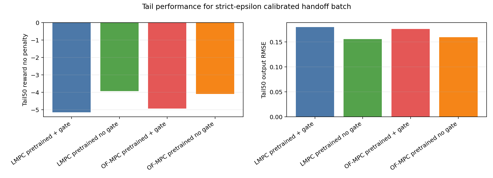
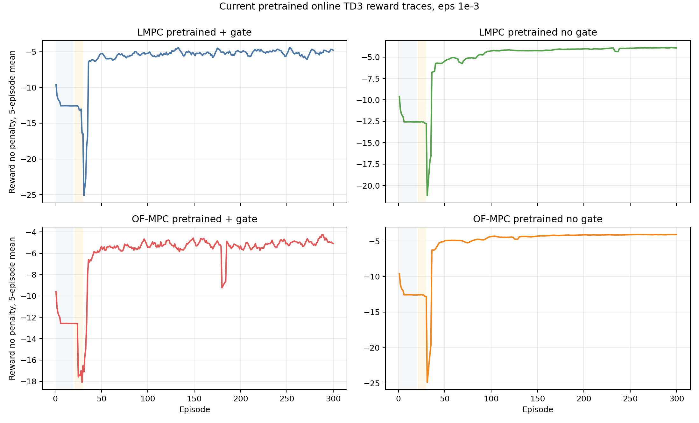
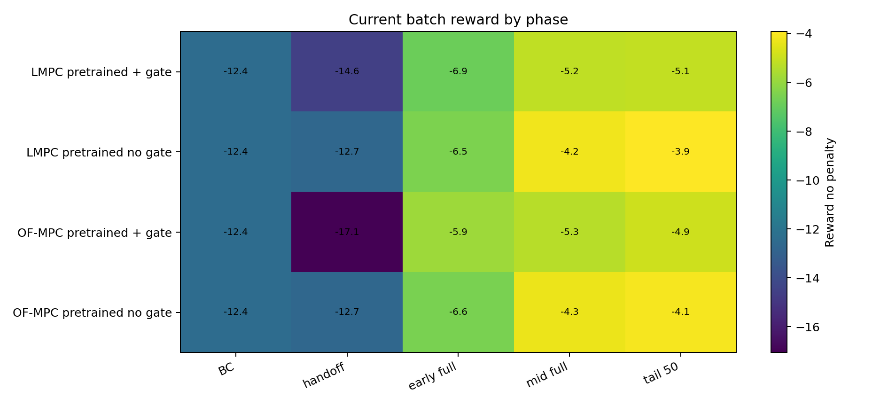
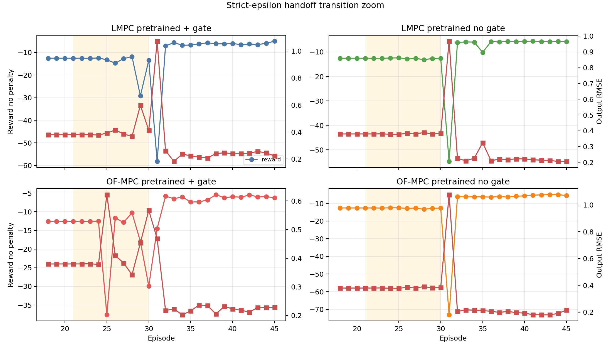
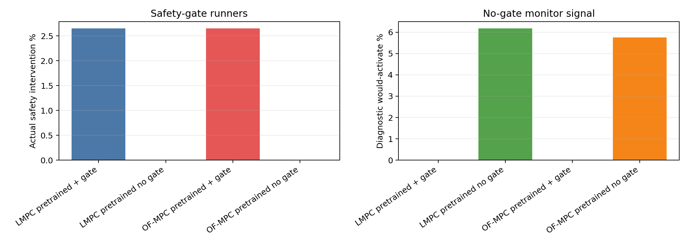
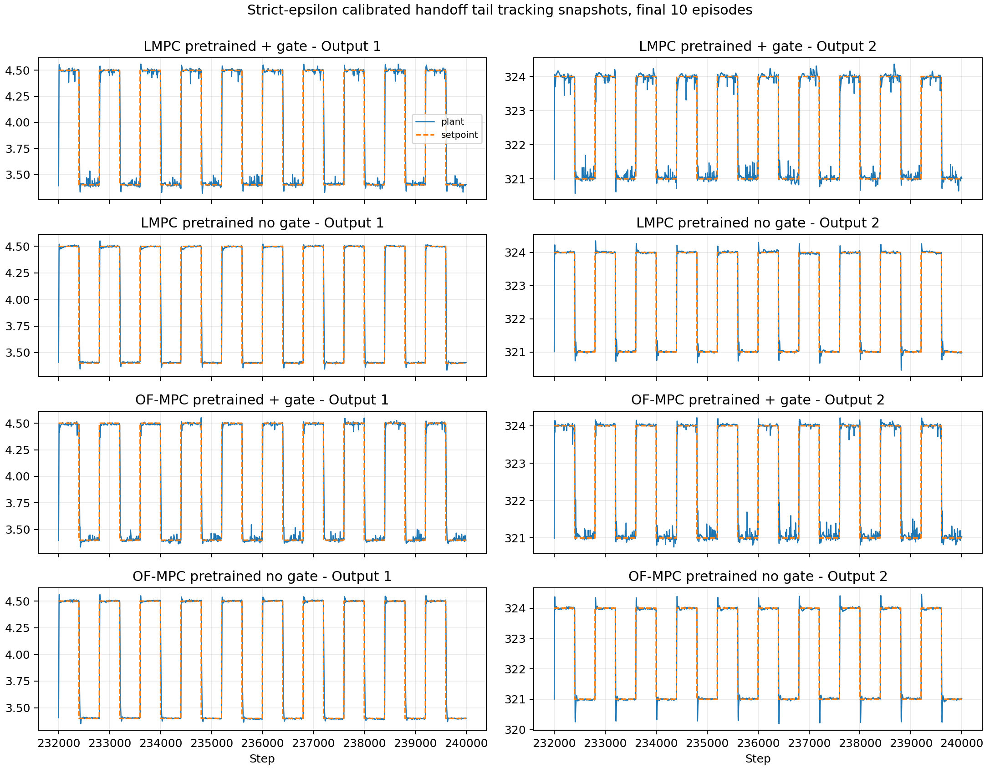

# Pretrained Online TD3 Critic-Reset Final Batch Analysis

Date: 2026-06-12, current-only update 2026-06-13

## Question

This report now keeps only the final pretrained online TD3 setup:
pretrained actor loading, critic reset, tiny BC exploration (`1e-4`),
10-episode actor-frozen handoff, bounded-mixed Direct LMPC target selector, and
`lyap_eps=1e-3`.

Short answer: the handoff catastrophe is fixed for this final setup. The
handoff window stays on an ordinary reward scale in all four pretrained runs,
and no run shows the earlier collapse behavior. The best tail reward is
`-3.927` from `LMPC pretrained no gate`, and the lowest tail
RMSE is `0.156` from `LMPC pretrained no gate`.

## Data Used

| Case | Run | Agent | Teacher | Gate | Handoff |
| :--- | ---: | ---: | ---: | ---: | ---: |
| LMPC pretrained + gate | 20260612_231616 | lmpc_pretrained_td3_20260611_231823.pkl | direct_lyapunov_mpc | active | 10 |
| LMPC pretrained no gate | 20260612_231608 | lmpc_pretrained_td3_20260611_231823.pkl | offset_free_mpc | monitor only | 10 |
| OF-MPC pretrained + gate | 20260612_231623 | of_mpc_pretrained_td3_20260610_153921.pkl | offset_free_mpc | active | 10 |
| OF-MPC pretrained no gate | 20260612_231619 | of_mpc_pretrained_td3_20260610_153921.pkl | offset_free_mpc | monitor only | 10 |

All four runs used:

- disturbance-only plant mode, 300 episodes, and 400-step setpoint blocks;
- `target_selector_variant = bounded_mixed_u0p1_x0p1`;
- `rho_lyap=0.990`, `lyap_eps=0.001`;
- pretrained actor loaded from checkpoint and critic reset before online TD3;
- BC update mode `critic_td_plus_actor_bc`;
- handoff update mode `critic_td_plus_actor_bc`;
- handoff actor BC updates per step `1`;
- full-RL exploration std decays from `0.020` to `0.005`.

## Method

The TD3 state remains the scaled augmented observer state, setpoint, and
previous input:

$$
s_k =
\left[
\operatorname{scale}(\hat z_k)^\top,
\operatorname{scale}(y_{sp,k})^\top,
\operatorname{scale}(u_{k-1})^\top
\right]^\top .
$$

The actor output $a_k\in[-1,1]^{n_u}$ is mapped to the admissible input
deviation interval by

$$
u_k^\pi =
u_{\min} + \frac{a_k+1}{2}(u_{\max}-u_{\min}).
$$

During BC, replay stores the executed teacher-plus-noise transition while the
actor demo buffer stores the clean teacher action:

$$
u_k^{\mathrm{exec}} = u_k^T+\xi_k,\qquad
\xi_k\sim\mathcal N(0,10^{-4}I).
$$

During handoff, the executed action is the teacher-policy blend

$$
u_k^{\mathrm{exec}} =
\alpha_k u_k^T + (1-\alpha_k)u_k^\pi ,
\qquad \alpha_k \downarrow 0,
$$

and actor-gradient TD3 updates remain off. The critic learns on the blended
closed-loop distribution, while the actor is still supervised toward the clean
teacher action. Full TD3 actor-gradient updates begin after handoff.

The safety-gate certificate remains the model-based practical contraction test

$$
V(\hat x_{k+1}-x_s)
\le
\rho V(\hat x_k-x_s)+\epsilon ,
$$

with $\rho=0.99$ and $\epsilon=10^{-3}$.

## Current Batch Performance

| Case | Mean Rnp | Tail Rnp | Tail RMSE | Gate % | Diag % | Worst ep |
| :--- | ---: | ---: | ---: | ---: | ---: | ---: |
| LMPC pretrained + gate | -6.247 | -5.149 | 0.180 | 2.650 | 0.000 | 31 |
| LMPC pretrained no gate | -5.361 | -3.927 | 0.156 | 0.000 | 6.182 | 31 |
| OF-MPC pretrained + gate | -6.214 | -4.929 | 0.176 | 2.654 | 0.000 | 25 |
| OF-MPC pretrained no gate | -5.467 | -4.091 | 0.160 | 0.000 | 5.760 | 31 |

The final setup is controlled across all four pretrained cases. The no-gate
runners have the best tail reward, while the safety-gate runners are more
conservative because fallback is actually applied. The maximum actual
intervention rate among gated runs is `2.654%`. The
maximum no-gate diagnostic would-activate rate is `6.182%`.

## Phase Behavior

| Case | BC | Handoff | Early | Tail50 |
| :--- | ---: | ---: | ---: | ---: |
| LMPC pretrained + gate | -12.422 | -14.560 | -6.893 | -5.149 |
| LMPC pretrained no gate | -12.423 | -12.658 | -6.505 | -3.927 |
| OF-MPC pretrained + gate | -12.423 | -17.060 | -5.859 | -4.929 |
| OF-MPC pretrained no gate | -12.423 | -12.683 | -6.583 | -4.091 |

The handoff phase is no longer the failure point. Handoff rewards remain near
the BC reward scale for the no-gate runners and are moderately lower for the
gated runners, which is consistent with a stricter safety certificate rather
than a learning collapse.

| Case | Worst ep | Worst Rnp | Worst RMSE | Mean abs du |
| :--- | ---: | ---: | ---: | ---: |
| LMPC pretrained + gate | 31 | -58.174 | 1.073 | 7.927 |
| LMPC pretrained no gate | 31 | -54.750 | 0.968 | 5.773 |
| OF-MPC pretrained + gate | 25 | -37.632 | 0.622 | 7.925 |
| OF-MPC pretrained no gate | 31 | -73.134 | 1.077 | 5.699 |

The remaining transients are localized to the handoff/release window. The next
algorithmic risk is therefore not BC or handoff itself, but the release into
full actor-gradient TD3 under a stricter safety filter.

## Safety And Monitor Behavior

The safety-gate runners show actual interventions because Direct LMPC can
replace a TD3 candidate action. The no-gate runners show zero actual
intervention by construction, while their Direct LMPC monitor signal records
how often the gate would have been active. This separation should stay in all
future reports: actual fallback and diagnostic would-activate are different
quantities.

The Direct LMPC fallback tracks the raw setpoint in the MPC objective, but the
Lyapunov certificate is centered on the bounded mixed target $(x_s,u_s,y_s)$.
Therefore tracking quality and certificate activity remain separate metrics.

## Tail Tracking

The final tracking snapshots show the same conclusion as the scalar metrics:
all four runs recover after the handoff/release window and settle into a
similar tail regime, with the no-gate cases retaining the best reward.

## Interpretation

The final setup is good enough to close the handoff-catastrophe debugging loop.

First, critic reset should stay. It keeps the useful pretrained actor prior and
removes the offline-to-online Q mismatch.

Second, the 10-episode actor-frozen handoff should stay for pretrained agents.
It gives the critic time to learn on the blended online distribution before the
actor follows TD3 gradients.

Third, `lyap_eps=1e-3` is usable with the calibrated handoff. It keeps the
safety filter active without reintroducing the catastrophic handoff reward
failure.

## Recommended Next Experiment

Keep this final setup fixed and test only a post-handoff release refinement:

1. Keep critic reset, BC std `1e-4`, 10-episode handoff, and `lyap_eps=1e-3`.
2. Add a 3-5 episode post-handoff actor-gradient ramp or delayed actor-gradient
   start.
3. Compare episodes 21-40, tail-50 reward, actual intervention rate, diagnostic
   would-activate rate, and mean absolute input movement.

## Report Artifacts

- Metrics table: `report/tables/2026-06-12_online_pretrained_critic_reset_analysis/pretrained_handoff_eps1e3_current_metrics.csv`
- Phase table: `report/tables/2026-06-12_online_pretrained_critic_reset_analysis/pretrained_handoff_eps1e3_current_phase_metrics.csv`
- Figures: `report/figures/2026-06-12_online_pretrained_critic_reset_analysis`

## Limitations

- These are single-seed training runs, not seed-averaged final evidence.
- `reward_no_penalty` is the fairer control-performance metric; training reward
  includes gate/fallback shaping for safety-gate runs.
- Frozen saved-agent evaluation is still needed before claiming final
  deployment performance.
