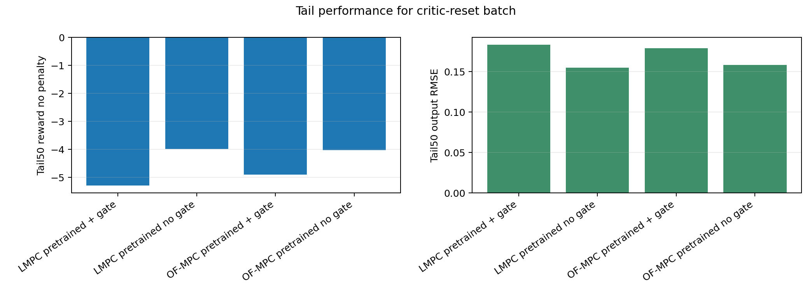
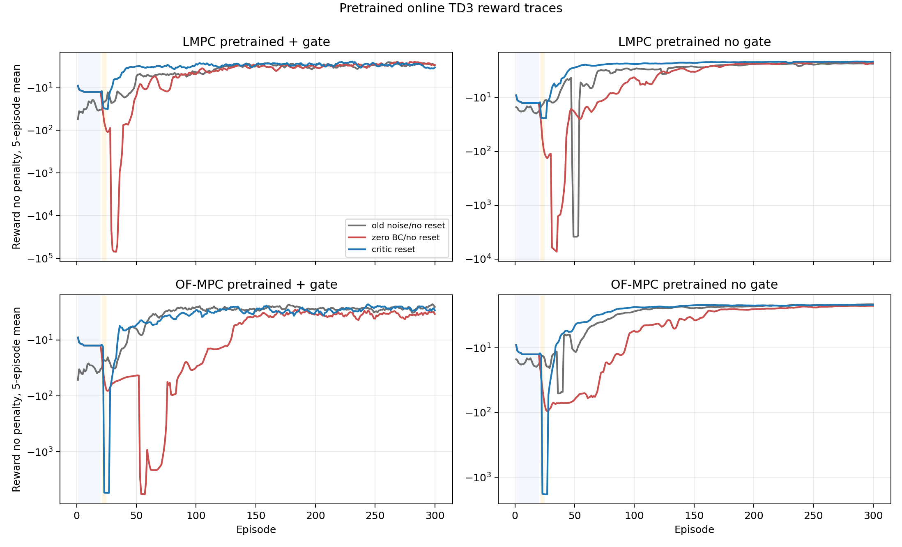
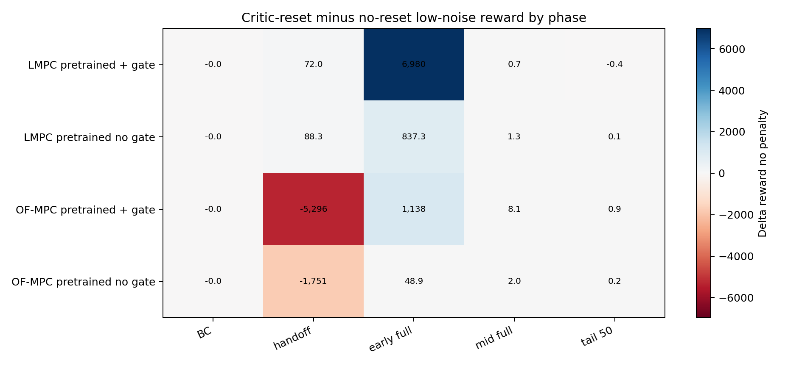
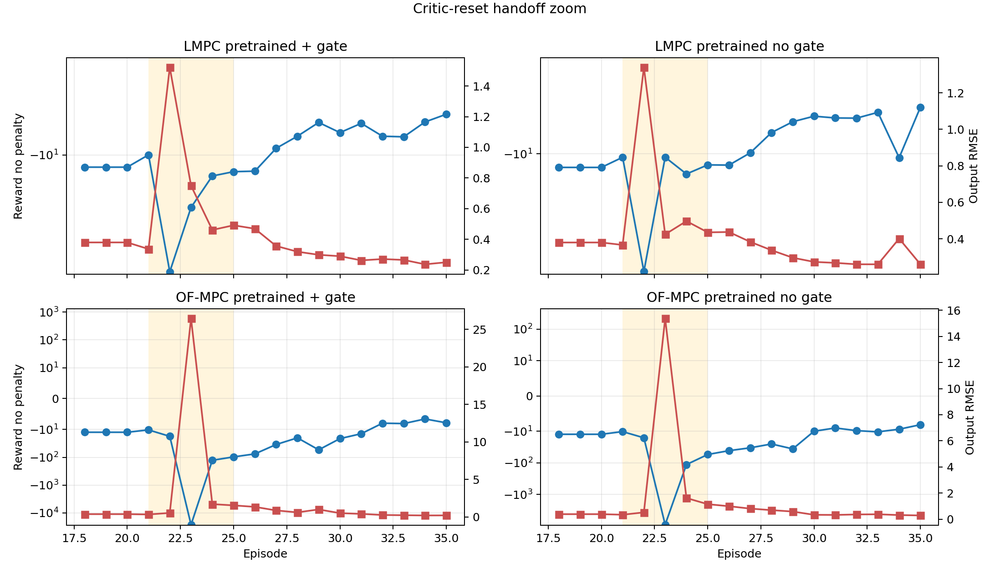
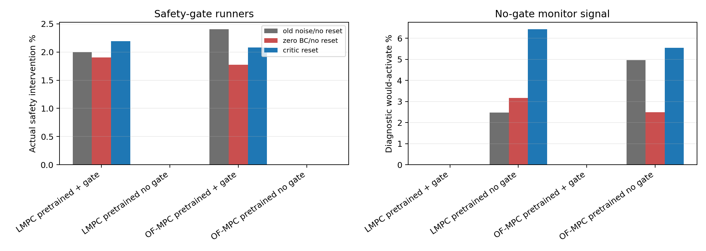
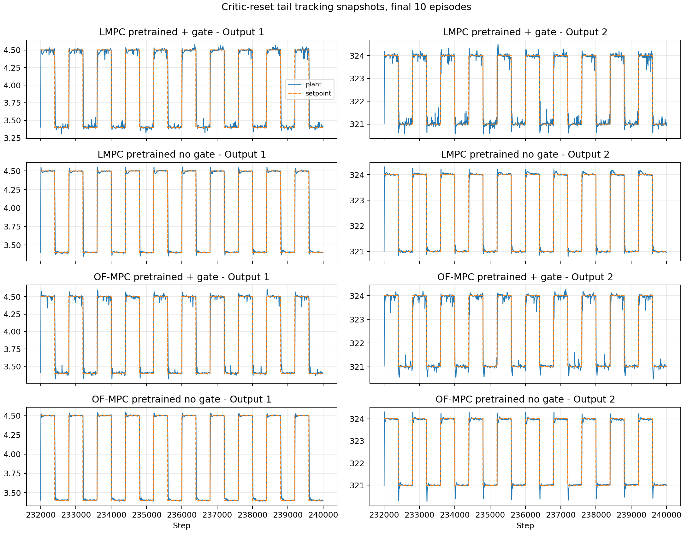

# Pretrained Online TD3 Critic-Reset Batch Analysis

Date: 2026-06-12

## Question

Four pretrained online TD3 disturbance runners were rerun after two targeted
changes: the online BC phase for pretrained agents now uses tiny teacher-action
noise, and the pretrained critic is reset before online training. This report
analyzes whether the new runs support keeping the pretrained actor while
discarding the offline critic.

Short answer: the critic reset is strongly supported for the LMPC-pretrained
runs and it removes the catastrophic early-full-RL collapse in all four
pretrained cases. The remaining weakness is not the full-RL phase; it is a
localized handoff transient in the OF-MPC-pretrained cases, especially episode
23. The evidence therefore points toward keeping critic reset, but making the
handoff more conservative when the critic is fresh.

## Paper-Consistency Frame

The framing follows the practical process-control style of Hamedi et al. (2026):
MPC and OF-MPC remain the engineering reference points, RL is introduced as a
policy-improvement mechanism, and unsafe online exploration is treated as a
deployment limitation rather than a generic machine-learning inconvenience. It
also follows the close-comparator logic of Khodaverdian et al. (2025): the RL
actor proposes a control action, while a Lyapunov-based supervisory layer has
final authority when the safety gate is active. The distinction here is that the
certificate is computed for the identified output-disturbance model and a
bounded Direct LMPC target, so the result should be stated as model-based
practical one-step contraction rather than global nonlinear asymptotic
stability to the raw setpoint.

## Data Used

| Case | Run | Agent | Teacher | Gate |
| :--- | ---: | ---: | ---: | ---: |
| LMPC pretrained + gate | 20260612_130549 | lmpc_pretrained_td3_20260611_231823.pkl | direct_lyapunov_mpc | active |
| LMPC pretrained no gate | 20260612_130546 | lmpc_pretrained_td3_20260611_231823.pkl | offset_free_mpc | monitor only |
| OF-MPC pretrained + gate | 20260612_130557 | of_mpc_pretrained_td3_20260610_153921.pkl | offset_free_mpc | active |
| OF-MPC pretrained no gate | 20260612_130553 | of_mpc_pretrained_td3_20260610_153921.pkl | offset_free_mpc | monitor only |

All four current runs used:

- disturbance-only plant mode, 300 episodes, and 400-step setpoint blocks;
- bounded mixed Direct LMPC target selector, `bounded_mixed_u0p1_x0p1`;
- `rho_lyap=0.990`, `lyap_eps=0.001`;
- pretrained online BC std `0.0001` with Gaussian teacher-action perturbation;
- pretrained actor loaded from checkpoint and critic reset before online TD3.

The comparison batch `low_noise` is the immediately preceding pretrained
low-noise batch with no critic reset and BC std `0`. The older `old_noise` batch
is retained as context because it used moderate BC exploration (`0.02`) and no
critic reset. The LMPC comparison to `old_noise` is partly confounded because
the LMPC checkpoint changed between the old and current batches.

## Method Reconstruction

The controller uses the identified output-disturbance state-space model in
scaled deviation coordinates,

$$
\begin{aligned}
\hat z_{k+1} &= A_a \hat z_k + B_a u_k + L\left(y_k-C_a\hat z_k\right), \\
\hat y_k &= C_a\hat z_k,
\end{aligned}
$$

where $\hat z_k=[\hat x_k^\top,\hat d_k^\top]^\top$ is the estimated
augmented state. The TD3 actor observes

$$
s_k = \left[
\mathrm{scale}_{[-1,1]}(\hat z_k)^\top,
\mathrm{scale}_{[-1,1]}(y_{sp,k})^\top,
\mathrm{scale}_{[-1,1]}(u_{k-1})^\top
\right]^\top .
$$

The actor output $a_k\in[-1,1]^{n_u}$ is mapped to the admissible input
deviation interval as

$$
u_k^\pi = u_{\min} + \frac{a_k+1}{2}(u_{\max}-u_{\min}).
$$

The online TD3 critic update uses the standard clipped double-Q target,

$$
\begin{aligned}
\tilde a_{k+1} &=
\mathrm{clip}\left(
\pi_{\bar\theta}(s_{k+1})+\epsilon,
-1,1
\right), \\
y_k^Q &= r_k + \gamma(1-d_k)
\min_i Q_{\bar\phi_i}(s_{k+1},\tilde a_{k+1}),
\end{aligned}
$$

with $\gamma=0.99$ and policy delay 2. In BC, the critic receives executed
online transitions, while the actor is supervised toward the clean teacher
action:

$$
\min_\theta \; \mathbb{E}_{(s,a_T)\sim\mathcal D_{BC}}
\left\|\pi_\theta(s)-a_T\right\|_2^2 .
$$

For the current batch, the pretrained initialization is

$$
\theta_0 \leftarrow \theta_{\mathrm{ckpt}}, \qquad
\phi_0 \sim \mathrm{Init}, \qquad
\bar\phi_0 \leftarrow \phi_0,
$$

so the actor prior is retained but the offline critic is discarded.

When the safety gate is active, a bounded Direct LMPC target
$(x_s,u_s,y_s)$ is selected with visible regularization weights
$w_u=w_x=0.1$. A candidate action is accepted only if the predicted first-step
Lyapunov value satisfies

$$
V(\hat x_{k+1}^{cand}-x_s)
\le
\rho V(\hat x_k-x_s)+\epsilon,
\qquad
\rho=0.99,\quad \epsilon=10^{-3}.
$$

If the inequality fails, Direct LMPC supplies the applied fallback action. In
the no-gate runners, the same Direct LMPC computation is retained only as a
monitor: the TD3 action is applied, actual intervention remains zero, and the
diagnostic unsafe count estimates how often the safety layer would have acted.

## Algorithm

1. Load the pretrained TD3 checkpoint and infer actor/critic layer sizes.
2. Copy the pretrained actor into the online agent.
3. Reset the critic and target critic; reinitialize the critic optimizer.
4. For BC episodes, execute the teacher action plus $\mathcal N(0,10^{-4})$
   noise, store the executed transition for critic learning, and store the clean
   teacher action for actor BC.
5. For handoff episodes, blend the teacher input and policy candidate with a
   linearly decreasing teacher weight.
6. For full RL episodes, execute the TD3 candidate subject to the selected
   gate/no-gate logic.
7. In safety-gate cases, apply the Direct LMPC fallback only when the candidate
   fails the model-based contraction test.
8. In no-gate cases, apply the TD3 action directly and log the Direct LMPC
   diagnostic would-activate signal.

## Current Batch Performance

| Case | Mean Rnp | Tail Rnp | Tail RMSE | Gate % | Diag % | Mean abs dU |
| :--- | ---: | ---: | ---: | ---: | ---: | ---: |
| LMPC pretrained + gate | -6.293 | -5.292 | 0.183 | 2.191 | 0.000 | 7.885 |
| LMPC pretrained no gate | -5.249 | -3.980 | 0.155 | 0.000 | 6.438 | 5.725 |
| OF-MPC pretrained + gate | -96.170 | -4.907 | 0.179 | 2.080 | 0.000 | 7.967 |
| OF-MPC pretrained no gate | -35.933 | -4.023 | 0.159 | 0.000 | 5.543 | 6.066 |

The LMPC-pretrained cases are now the strongest cases in the current batch.
The LMPC no-gate run gives the best tail reward (`-3.980`)
and lowest tail RMSE (`0.155`). The LMPC safety-gate
case is also stable in the learning sense, although its tail reward is slightly
worse than its no-gate counterpart and it applies actual gate interventions in
about `2.191%` of steps.

The OF-MPC-pretrained cases should not be interpreted from their mean reward
alone. Their tail behavior recovers to approximately the old bounded-mixed
level, but their full-run mean is dominated by the handoff outlier discussed
below.

## Critic Reset Versus No-Reset Low-Noise Batch

Positive reward deltas are better. Negative RMSE deltas are better.

| Case | Mean Rnp | Early | Tail Rnp | Tail RMSE | Gate pp | Diag pp |
| :--- | ---: | ---: | ---: | ---: | ---: | ---: |
| LMPC pretrained + gate | 1,165 | 6,980 | -0.368 | 0.005 | 0.284 | 0.000 |
| LMPC pretrained no gate | 141.813 | 837.317 | 0.114 | -0.005 | 0.000 | 3.265 |
| OF-MPC pretrained + gate | 106.349 | 1,138 | 0.937 | -0.009 | 0.304 | 0.000 |
| OF-MPC pretrained no gate | -19.829 | 48.893 | 0.172 | 0.000 | 0.000 | 3.055 |

The central effect is clear: critic reset removes the early-full-RL collapse.
Relative to the no-reset low-noise batch, early full-RL reward improves by
`6,980` for LMPC + gate,
`837.317` for LMPC no gate,
`1,138` for OF-MPC + gate,
and `48.893` for OF-MPC no gate.

This supports the hypothesis that the offline critic was mismatched to the
online reward scale and closed-loop state-action distribution. The actor
pretraining remains useful, but the Q-function trained on offline synthetic
labels is not a reliable online initialization.

## Phase Diagnosis

| Case | BC | Handoff | Early | Tail50 |
| :--- | ---: | ---: | ---: | ---: |
| LMPC pretrained + gate | -12.422 | -31.198 | -6.284 | -5.292 |
| LMPC pretrained no gate | -12.423 | -23.845 | -5.708 | -3.980 |
| OF-MPC pretrained + gate | -12.423 | -5,376 | -10.876 | -4.907 |
| OF-MPC pretrained no gate | -12.423 | -1,828 | -9.072 | -4.023 |

The BC phase is almost identical across the four current runs because the
teacher action dominates and the added action noise is tiny. The important
difference appears at handoff. For the OF-MPC-pretrained safety-gate run, the
handoff average is `-5,376` and the full-run mean is
`-96.170` because episode 23 has a very large
tracking failure. The same pattern appears, though less severely, in the OF-MPC
no-gate run.

| Case | Worst ep | Phase | Reward | RMSE |
| :--- | ---: | ---: | ---: | ---: |
| LMPC pretrained + gate | 22 | handoff | -90.586 | 1.521 |
| LMPC pretrained no gate | 22 | handoff | -71.938 | 1.339 |
| OF-MPC pretrained + gate | 23 | handoff | -26,625 | 26.450 |
| OF-MPC pretrained no gate | 23 | handoff | -8,946 | 15.372 |

This is a mechanism-level result. Critic reset fixes the Q-scale mismatch, but
the handoff currently begins full TD3 actor updates while the critic is still
fresh and while the behavior action is a teacher-policy blend. That is a fragile
combination: the critic is being calibrated online, the actor begins to trust
its gradients, and the blend changes the executed distribution over only five
episodes. The OF-MPC-pretrained actor is most sensitive to this transition.

## Safety And Diagnostic Behavior

Safety-gate interventions remain low in the current batch. This should be
interpreted carefully: low intervention frequency does not mean the gate is
irrelevant. It means the tested candidates usually satisfied the model-based
one-step contraction condition. The no-gate monitor signal is more revealing
for comparing policy aggressiveness. Diagnostic would-activate rates increase
in both no-gate reset runs, reaching `6.438%` for
LMPC no gate and `5.543%` for OF-MPC no gate. Thus, the reset
policy is better for reward/tracking in the LMPC no-gate case, but it also
visits more actions that the Direct LMPC monitor would reject.

The safety gate is not a raw tracking optimizer. It certifies a contraction
condition around the bounded Direct LMPC target. During the OF-MPC handoff
spike, the gate can accept or only lightly intervene because the model-based
contraction condition is satisfied, even though raw setpoint tracking reward
becomes poor. This is exactly why reports and the paper should separate
practical safety certification from tracking-performance claims.

## Tail Tracking

The tail plots show that the critic-reset batch recovers after the handoff
transient. Tail differences are modest compared with the early and handoff
differences. This supports treating the OF-MPC issue as a transition-design
problem rather than a final-policy failure.

## Context Against The Older Moderate-Noise Batch

| Case | Mean Rnp | Tail Rnp | Tail RMSE | Gate pp | Diag pp |
| :--- | ---: | ---: | ---: | ---: | ---: |
| LMPC pretrained + gate | 1.955 | -0.213 | 0.008 | 0.195 | 0.000 |
| LMPC pretrained no gate | 64.998 | 0.306 | -0.013 | 0.000 | 3.954 |
| OF-MPC pretrained + gate | -87.953 | -0.004 | 0.002 | -0.327 | 0.000 |
| OF-MPC pretrained no gate | -29.075 | 0.014 | 0.001 | 0.000 | 0.577 |

Against the older moderate-noise batch, the strongest clean conclusion is for
OF-MPC because the checkpoint is the same across batches. The reset version
recovers OF-MPC tail reward almost exactly, but still has a worse full-run mean
because of the handoff spike. For LMPC, comparison to the old batch is less
clean because the LMPC checkpoint changed; the reset batch should primarily be
compared to the immediately preceding low-noise LMPC batch that used the same
bounded-mixed checkpoint.

## Interpretation

The current evidence supports three conclusions.

First, critic reset is a useful correction. It keeps the useful policy prior
from pretraining while forcing the Q-functions to learn the online shaped reward,
the safety/fallback penalty structure, and the closed-loop rollout
distribution.

Second, tiny BC exploration is not the source of the remaining problem. The BC
episodes are well behaved. The failure is concentrated at handoff, after the
system moves from pure teacher-executed behavior into teacher-policy blending
and full TD3 actor updates.

Third, the safety-gate and no-gate comparisons should be read as deployment
mechanism comparisons, not only tracking comparisons. In the no-gate cases,
actual interventions are zero by design, but the Direct LMPC monitor indicates
whether the same actions would have been rejected under the gate.

## Recommended Next Experiment

Keep critic reset for pretrained online runs, but change the handoff update
logic before the next full batch:

1. Keep the pretrained actor and reset critic.
2. Keep pretrained BC std at `1e-4` or test `1e-3` as a small local-coverage
   ablation.
3. During handoff, collect blended teacher-policy transitions but freeze TD3
   actor-gradient updates; use critic-only updates plus optional actor BC.
4. Start full TD3 actor updates only after handoff, or after an additional
   short critic-calibration window.
5. Extend handoff from 5 episodes to 10-20 episodes for OF-MPC-pretrained runs,
   or cap the policy weight increase per episode.

This next experiment directly targets the observed mechanism. Simply changing
BC noise again would miss the main issue: the critic reset helped, but the fresh
critic needs a more conservative transition before actor-gradient updates are
allowed to dominate.

## Report Artifacts

- Metrics table: `report/tables/2026-06-12_online_pretrained_critic_reset_analysis/pretrained_reset_metrics.csv`
- Phase table: `report/tables/2026-06-12_online_pretrained_critic_reset_analysis/pretrained_reset_phase_metrics.csv`
- Delta table: `report/tables/2026-06-12_online_pretrained_critic_reset_analysis/pretrained_reset_deltas.csv`
- Figures: `report/figures/2026-06-12_online_pretrained_critic_reset_analysis`

## Limitations

- These are single-seed training runs, not seed-averaged final evidence.
- The reported reward comparison uses `reward_no_penalty` for control
  performance; training reward remains relevant for learning but is not a fair
  cross-method control metric.
- Frozen saved-agent evaluation is still needed before claiming final controller
  performance.
- The LMPC old-batch comparison is checkpoint-confounded; the reset-vs-low
  comparison is the cleaner LMPC critic-reset test.
