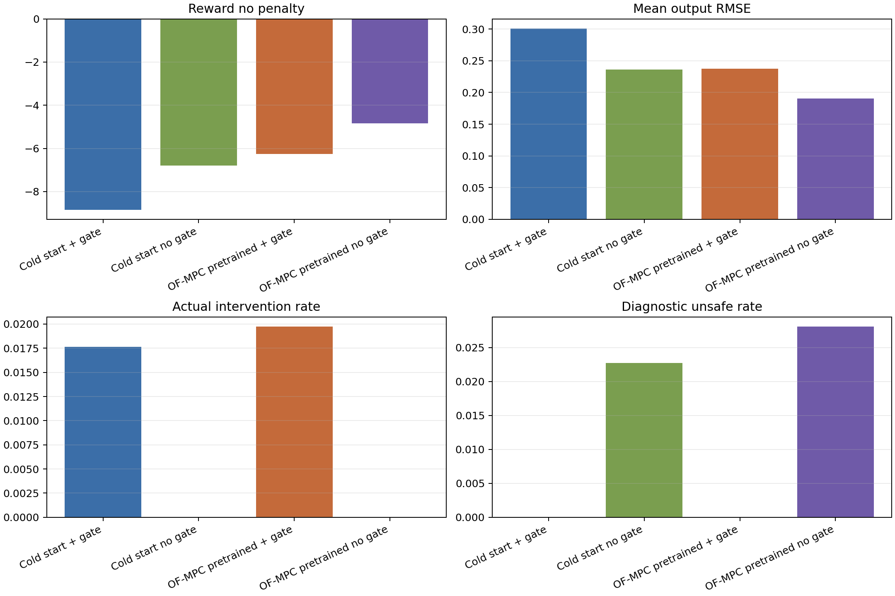
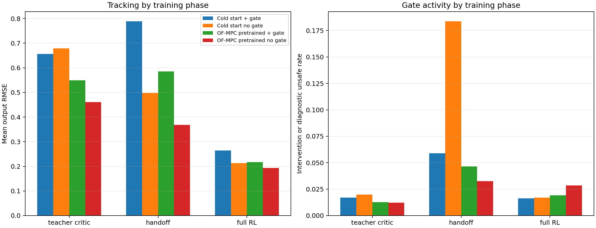
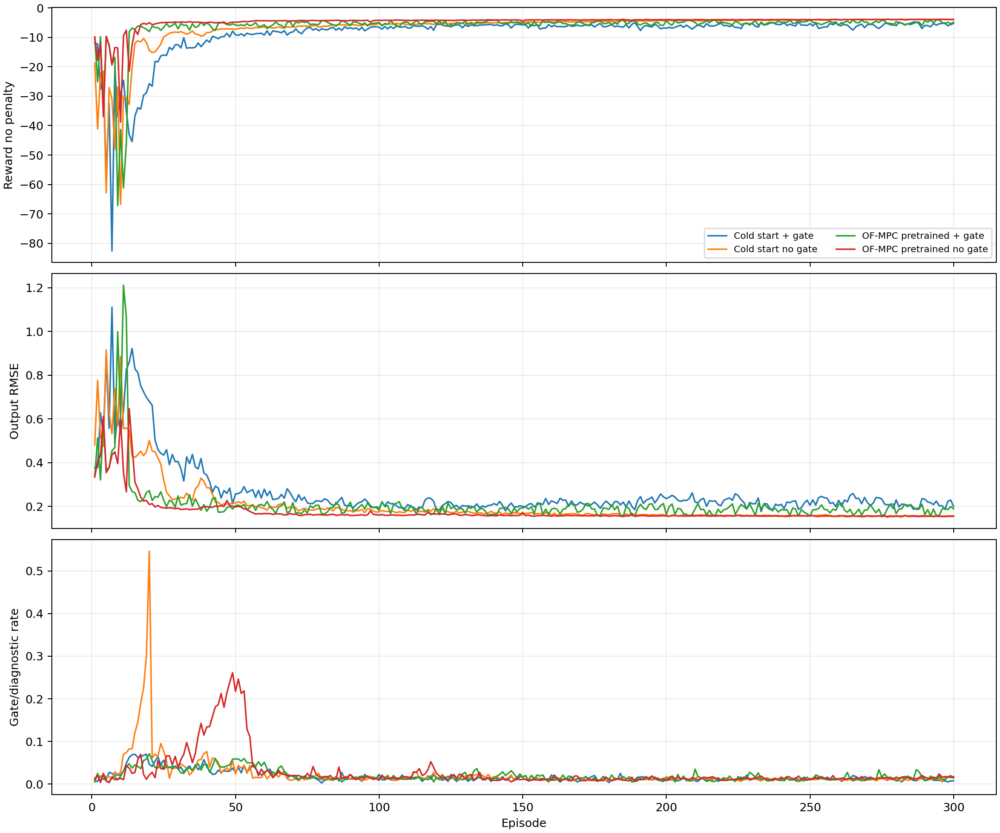
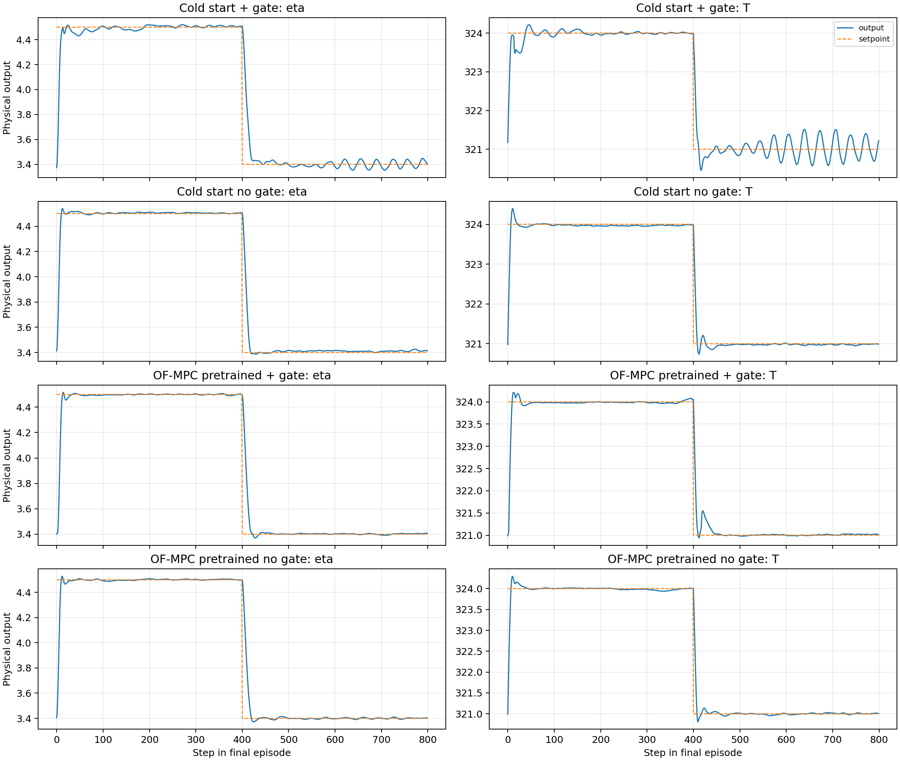
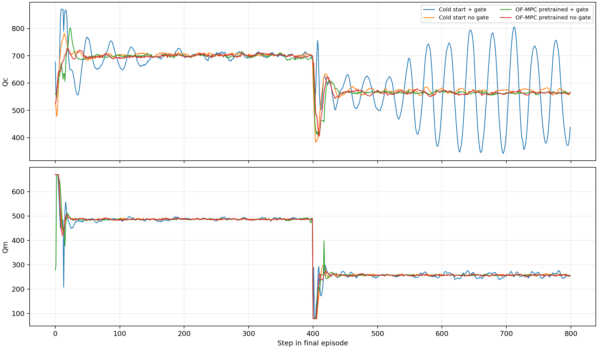

# Latest Online TD3 Comparison

Date: 2026-06-19

## Objective

This report compares the latest completed online TD3 disturbance runs for the
four active runners:

- cold start with GART-LMPC safety gate
- cold start without active safety gate
- OF-MPC-pretrained with GART-LMPC safety gate
- OF-MPC-pretrained without active safety gate

The analysis uses the latest completed 300-episode result folders available at
report-generation time. Four newer `20260619_1316xx` jobs were detected but did
not yet contain final `step_table.csv` or `episode_table.csv` exports, so they
are listed as pending rather than mixed into the completed-run comparison.

## Data Used

| case | run_id | episodes | steps |
| --- | ---: | ---: | ---: |
| Cold start + gate | 20260618_191134 | 300 | 240000 |
| Cold start no gate | 20260618_191130 | 300 | 240000 |
| OF-MPC pretrained + gate | 20260618_191141 | 300 | 240000 |
| OF-MPC pretrained no gate | 20260618_191137 | 300 | 240000 |

Full selected paths are recorded in
`report/figures/2026-06-19_online_td3_latest/summary_metrics.csv`.

Pending current runs:

- `results\OnlineTD3_ColdStart_SafetyGate\20260619_131645` has no final `step_table.csv` yet.
- `results\OnlineTD3_ColdStart_NoSafetyGate\20260619_131640` has no final `step_table.csv` yet.
- `results\OnlineTD3_OFMPCPretrained_SafetyGate\20260619_131652` has no final `step_table.csv` yet.
- `results\OnlineTD3_OFMPCPretrained_NoSafetyGate\20260619_131649` has no final `step_table.csv` yet.

Generated analysis artifacts:

- `report/figures/2026-06-19_online_td3_latest/summary_metrics.csv`
- `report/figures/2026-06-19_online_td3_latest/phase_metrics.csv`
- `report/figures/2026-06-19_online_td3_latest/episode_metrics.csv`
- `report/figures/2026-06-19_online_td3_latest/pending_runs.csv`

## Method

All four completed runs use the polymer CSTR disturbance setup with 300
episodes and 800 steps per episode. The analyzed completed runs include the
noisy GART-LMPC teacher critic warmup schedule:

$$
\text{teacher episodes} = 10,
\qquad
\text{update mode} = \text{critic TD only},
\qquad
\text{handoff episodes} = 10.
$$

The safety-gate cases evaluate the TD3 candidate action using the GART target
and first-step Lyapunov contraction test. If the candidate fails, the applied
input is replaced by the GART-LMPC fallback. The no-gate cases still record a
diagnostic gate decision, but execute the candidate action without replacement.

Important timing note: the completed runs analyzed here predate the final
probe-style full-RL exploration commit. The currently running `20260619_1316xx`
jobs are the runs expected to reflect that final exploration change.

## Overall Performance

| case | reward_no_penalty | training_reward | output_rmse_mean | eta_rmse | T_rmse |
| --- | ---: | ---: | ---: | ---: | ---: |
| Cold start + gate | -8.841 | -10.111 | 0.301 | 0.137 | 0.465 |
| Cold start no gate | -6.802 | -6.802 | 0.236 | 0.133 | 0.339 |
| OF-MPC pretrained + gate | -6.258 | -7.453 | 0.237 | 0.134 | 0.340 |
| OF-MPC pretrained no gate | -4.847 | -4.847 | 0.191 | 0.122 | 0.259 |

## Gate And Diagnostic Reliability

| case | candidate_pass_rate | actual_intervention_rate | fallback_rate | diagnostic_unsafe_rate | target_failures |
| --- | ---: | ---: | ---: | ---: | ---: |
| Cold start + gate | 98.236% | 1.764% | 1.258% | 0.000% | 1207 |
| Cold start no gate | 97.727% | 0.000% | 0.000% | 2.273% | 1301 |
| OF-MPC pretrained + gate | 98.024% | 1.976% | 1.502% | 0.000% | 1128 |
| OF-MPC pretrained no gate | 97.188% | 0.000% | 0.000% | 2.812% | 1449 |

For gate runs, `candidate_pass_rate` is the actual accepted-candidate rate. For
no-gate runs, it is the diagnostic candidate pass rate. `actual_intervention_rate`
is the fraction of gate-run steps where the gate changed the candidate input
through fallback or hold-previous logic. For no-gate runs,
`diagnostic_unsafe_rate` is the would-have-been rejected rate under the
diagnostic GART gate.

## Phase Breakdown

| case | phase | steps | reward_no_penalty | output_rmse_mean | intervention_or_diag_rate |
| --- | ---: | ---: | ---: | ---: | ---: |
| Cold start + gate | teacher critic | 8000 | -33.374 | 0.656 | 1.713% |
| Cold start + gate | handoff | 8000 | -33.757 | 0.789 | 5.900% |
| Cold start + gate | full RL | 224000 | -7.074 | 0.264 | 1.618% |
| Cold start no gate | teacher critic | 8000 | -36.633 | 0.679 | 2.000% |
| Cold start no gate | handoff | 8000 | -18.502 | 0.498 | 18.375% |
| Cold start no gate | full RL | 224000 | -5.319 | 0.213 | 1.708% |
| OF-MPC pretrained + gate | teacher critic | 8000 | -24.724 | 0.550 | 1.275% |
| OF-MPC pretrained + gate | handoff | 8000 | -16.410 | 0.585 | 4.638% |
| OF-MPC pretrained + gate | full RL | 224000 | -5.236 | 0.217 | 1.906% |
| OF-MPC pretrained no gate | teacher critic | 8000 | -18.405 | 0.461 | 1.225% |
| OF-MPC pretrained no gate | handoff | 8000 | -8.923 | 0.368 | 3.250% |
| OF-MPC pretrained no gate | full RL | 224000 | -4.217 | 0.194 | 2.853% |

## Episode Trends

The episode curves show that the safety-gate runs pay an explicit training
reward penalty whenever fallback is active. Therefore, `reward_no_penalty` is
the cleaner control-performance comparison across gate and no-gate cases.

## Final-Episode Tracking And Inputs

## Interpretation

The latest completed runs show the same broad pattern as the earlier
2026-06-17 analysis: the no-gate cases have better average tracking and better
`reward_no_penalty` on these completed runs, while the gate cases prevent or
replace a subset of candidate actions. The safety gate is therefore acting as a
robustness layer, but these completed results do not yet show a tracking
advantage for the gate.

The OF-MPC-pretrained no-gate run is the strongest completed result by average
`reward_no_penalty` and mean output RMSE. The OF-MPC-pretrained gate run has a
larger intervention burden and worse tracking, which suggests the gate is
constraining or replacing candidate actions often enough to reduce nominal
performance in this configuration.

For the cold-start pair, the gate protects against rejected candidates but also
introduces fallback penalties and some tracking degradation. This is not
necessarily a failure of the gate: it means the comparison is currently a
robustness-versus-performance tradeoff rather than a clean tracking win.

## Risks And Consistency Checks

- The newest probe-style full-RL exploration runs are still pending. Do not use
  this report as final evidence for the new full-RL exploration change.
- The completed runs include noisy teacher critic warmup but do not expose the
  newer `behavior_exploration_space` columns in `step_table.csv`, confirming
  they were produced before the latest diagnostic/export changes.
- Gate and no-gate training rewards are not directly comparable because only
  gate runs include fallback penalties. Use `reward_no_penalty` for
  cross-method control-performance comparison.

## Recommended Next Experiment

After the four `20260619_1316xx` runs finish, rerun this analysis script without
changing the selection logic. The next report should compare:

- accepted candidate rate before and after probe-style full-RL exploration
- intervention rate in safety-gate runs
- diagnostic unsafe rate in no-gate runs
- final 100-episode `reward_no_penalty` and output RMSE
- whether cold-start no-gate becomes less rough when the same exploration scale
  is applied directly in `u_dev` coordinates

The result that would support the new exploration change is a lower diagnostic
unsafe/intervention rate without losing exploration-driven improvement in
`reward_no_penalty`.
