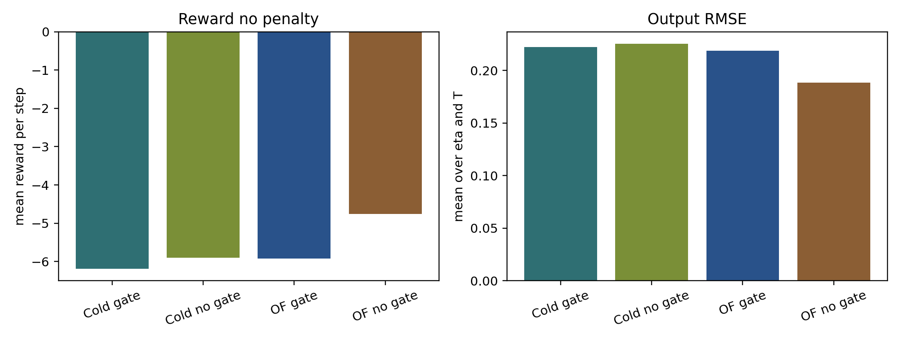
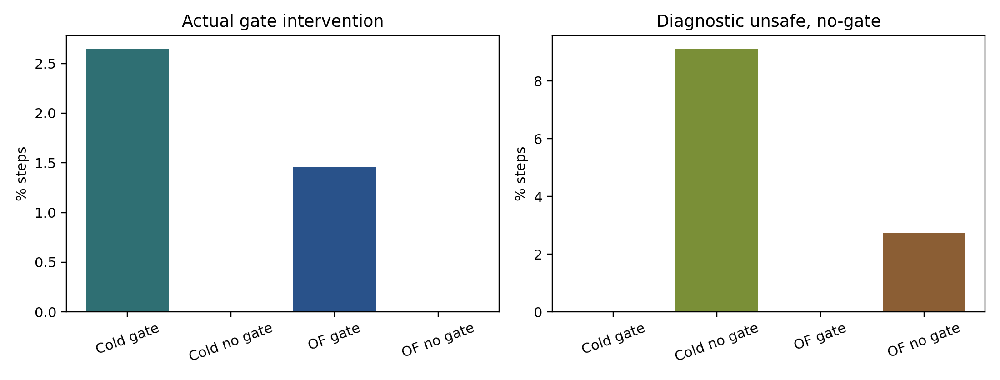
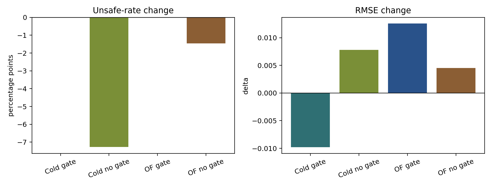

# Latest Online TD3 Runner Results

Date: 2026-06-20

## Objective

This report analyzes the latest completed online TD3 disturbance runs for the four active online runners. The goal is to assess whether the latest configuration is close to the desired behavior: good nominal tracking, low unsafe-action burden, and active safety-gate intervention that is rare rather than dominant.

## Data Used

| case | run id | gate | pretrain |
| --- | ---: | ---: | ---: |
| Cold start no gate | 20260620_003041 | no | no |
| Cold start + gate | 20260620_003031 | yes | no |
| OF-MPC pretrained no gate | 20260620_003020 | no | yes |
| OF-MPC pretrained + gate | 20260620_002952 | yes | yes |

Each run contains 300 episodes and 240000 closed-loop steps. The raw exports used here are each run's `summary.json`, `run_summary.json`, `comparison_table.csv`, and `episode_table.csv`. Derived analysis files are saved under `report/figures/2026-06-20_online_td3_latest_good/`.

## Method

All four runners use the polymer CSTR disturbance setup with the standard TD3 observation. The online observation is the scaled/deviation controller state containing the observer state, setpoint features, and previous input features. The TD3 actor proposes a scaled input-deviation action.

For the gate cases, the candidate action is checked by the GART-LMPC target selector and first-step Lyapunov contraction test. The target selector uses the final GART settings:

$$
\rho = 0.99,
\qquad
\epsilon = 10^{-3},
\qquad
\Delta x_s^{\max} = 0.05,
\qquad
\Delta u_s^{\max} = [0.2, 0.2],
$$

$$
\Delta y_s^{\max} = 0.25,
\qquad
\alpha_d = 0.05,
\qquad
\text{input headroom} = 0.05,
\qquad
W_y = \operatorname{diag}(2, 1).
$$

The no-gate cases execute the TD3 candidate action but still log the diagnostic GART safety decision. The gate cases replace rejected candidates with the GART-LMPC fallback.

The online reward now has fallback/event penalties disabled in all four root runners:

$$
r_k = r_{\mathrm{no\ penalty}, k},
\qquad
\gamma_{\mathrm{fallback}} = 0,
\qquad
r_{\mathrm{fallback\ event}} = 0.
$$

This makes `training_reward` and `reward_no_penalty` identical in the latest results. The reward and controller objectives remain separate: online TD3 reward uses the shaped reward weights, while GART-LMPC and target selection use their own MPC and Lyapunov objectives.

The training schedule uses 10 GART-LMPC teacher episodes with critic-TD-only updates, 10 handoff episodes, then full online TD3. Full-RL exploration is applied in `input_dev` coordinates. The cold-start runners use exploration from 0.1 to 0.005. The OF-MPC-pretrained runners use exploration from 0.05 to 0.005.

## Overall Performance

| case | reward no penalty | output RMSE | eta RMSE | T RMSE |
| --- | ---: | ---: | ---: | ---: |
| OF-MPC pretrained no gate | -4.757 | 0.188 | 0.122 | 0.255 |
| Cold start no gate | -5.899 | 0.226 | 0.132 | 0.319 |
| OF-MPC pretrained + gate | -5.928 | 0.219 | 0.132 | 0.305 |
| Cold start + gate | -6.191 | 0.222 | 0.135 | 0.309 |

The best nominal controller remains the OF-MPC-pretrained no-gate run. This is expected because it executes all TD3 actions, including actions that the diagnostic gate marks unsafe. The more important safety-relevant result is that the active-gate runs are now close to the no-gate runs in tracking while maintaining certified execution through the GART fallback mechanism.

The cold-start gate run slightly outperforms cold-start no-gate in full-run output RMSE, 0.222 versus 0.226. The OF-MPC gate run has a higher RMSE than OF-MPC no-gate, 0.219 versus 0.188, but it does this while intervening on only 1.45% of all steps.

## Safety And Intervention

| case | unsafe diagnostic | actual intervention | fallback | target failure |
| --- | ---: | ---: | ---: | ---: |
| Cold start no gate | 9.13% | 0.00% | 0.00% | 0.27% |
| Cold start + gate | 0.00% | 2.65% | 2.43% | 0.21% |
| OF-MPC pretrained no gate | 2.74% | 0.00% | 0.00% | 0.23% |
| OF-MPC pretrained + gate | 0.00% | 1.45% | 1.19% | 0.26% |

The safety signal is strong. OF-MPC pretraining cuts the no-gate diagnostic unsafe rate from 9.13% to 2.74%. With the active gate, OF-MPC pretraining cuts actual intervention from 2.65% to 1.45%. In other words, pretraining moves the policy closer to the GART-safe action manifold, and the gate has less work to do.

Target-selector quality is also stable: all runs have target-quality-ok rates around 99.7%, with target failure rates near 0.2-0.3% of steps.

## Late-Training Behavior

The last 100 episodes are the most relevant slice because the policy is beyond teacher and handoff.

| case | reward no penalty | output RMSE | unsafe or intervention | fallback |
| --- | ---: | ---: | ---: | ---: |
| OF-MPC pretrained no gate | -3.991 | 0.157 | 2.14% unsafe | 0.00% |
| Cold start no gate | -4.050 | 0.160 | 3.26% unsafe | 0.00% |
| Cold start + gate | -5.019 | 0.185 | 2.33% intervention | 2.11% |
| OF-MPC pretrained + gate | -5.086 | 0.185 | 1.06% intervention | 0.77% |

The late-training no-gate runs converge to very similar nominal tracking, with OF-MPC no-gate slightly ahead. The two gate runs also converge to very similar late output RMSE near 0.185. The OF-MPC gate result is particularly attractive because its late intervention rate is only 1.06%, and fallback is below 0.8% of steps.

## Change Relative To Previous Reference

The reference is the previous June 19 same-seed two-run analysis in `report/online_td3_two_run_analysis_2026-06-20.md`.

| case | key improvement | value |
| --- | --- | ---: |
| Cold start no gate | diagnostic unsafe reduction | -7.27 percentage points |
| Cold start + gate | actual intervention reduction | -2.98 percentage points |
| OF-MPC pretrained no gate | diagnostic unsafe reduction | -1.46 percentage points |
| OF-MPC pretrained + gate | actual intervention reduction | -0.86 percentage points |

The main improvement is not a large nominal tracking gain. The main improvement is that the controller now reaches almost the same tracking regime while generating fewer unsafe or corrected actions. Target failures also dropped by roughly 53-68% across the four cases. For the active gate cases, the training reward improved strongly because fallback/event penalties are now disabled, so `training_reward` reflects the same control-quality signal as `reward_no_penalty`.

## Interpretation

These results are close to the desired behavior. The OF-MPC-pretrained no-gate runner is the nominal upper bound, with the best reward and best full-run RMSE. It is not the safest result because it still executes about 2.74% diagnostically unsafe actions. The OF-MPC-pretrained safety-gate runner is the best safety-compatible result: it has the lowest active intervention burden, below 1.5% overall and near 1.0% in the last 100 episodes.

The cold-start results are also better than before. Cold no-gate still has a meaningful diagnostic unsafe rate, but it is much lower than in the previous report. Cold gate now has full-run RMSE comparable to cold no-gate, while replacing unsafe proposals rather than executing them.

The current picture supports this claim:

- no-gate is the nominal performance upper bound,
- active gate is the certified execution layer,
- OF-MPC pretraining improves both nominal tracking and safety compatibility,
- the final exploration schedule is large enough to learn but no longer producing the very high diagnostic unsafe load seen earlier.

## Bugs, Inconsistencies, Or Risks

- The four latest runs use the same seed, 123. This is a strong controlled comparison, but it is not a multi-seed robustness result.
- No-gate diagnostic unsafe rate is not an actual intervention rate. Those actions were executed, so no-gate results should not be described as safe closed-loop controllers.
- Disabling fallback penalties makes reward comparisons cleaner, but it also means safety burden must be tracked explicitly through intervention and fallback rates.
- The latest OF-MPC-pretrained online runs load an existing OF-MPC actor and reset the critic. If the offline OF-MPC pretraining checkpoint is regenerated, this report should be repeated.
- The analysis used summary, episode, and comparison exports. It did not manually inspect all 240000-step trajectories beyond the exported figures and tables.

## Literature Connection

The result is consistent with a standard safe-RL interpretation: an MPC or Lyapunov backup controller can act as a certification layer, while pretraining reduces how often the learned policy asks for unsafe actions. No new external citations were added here because this report is an internal result audit based on local artifacts.

## Recommended Next Experiment

Freeze this configuration and run a small seed sweep before further tuning:

- Files: `OnlineTD3_ColdStart_NoSafetyGate.py`, `OnlineTD3_ColdStart_SafetyGate.py`, `OnlineTD3_OFMPCPretrained_NoSafetyGate.py`, and `OnlineTD3_OFMPCPretrained_SafetyGate.py`.
- Change: rerun with at least three seeds, for example 123, 456, and 789, keeping the current exploration and no-penalty reward settings fixed.
- Metrics to confirm: late-100 output RMSE, `reward_no_penalty`, diagnostic unsafe rate for no-gate, actual intervention rate for gate, fallback rate, and target failure rate.
- Confirmation criterion: OF-MPC gate stays below 2% overall intervention, below 1.5% late intervention, target failures stay below 0.3%, and late output RMSE stays near 0.18-0.19.

After the seed sweep, the only tuning I would consider is a small cold-start exploration refinement from 0.1 to 0.075 if the cold no-gate diagnostic unsafe rate remains above about 8-10% across seeds. I would not change the OF-MPC-pretrained exploration yet because its no-gate unsafe rate and gate intervention rate are already in a good range.

## Remaining Uncertainty

The strongest uncertainty is seed robustness. The second uncertainty is whether the OF-MPC-pretrained actor improves further after regenerating the offline pretraining checkpoint with the latest interruption-safe workflow and reward-label conventions. The current evidence is already good enough to treat the configuration as a candidate final setting for multi-seed validation.

## Generated Artifacts

- `report/figures/2026-06-20_online_td3_latest_good/summary_metrics.csv`
- `report/figures/2026-06-20_online_td3_latest_good/phase_metrics.csv`
- `report/figures/2026-06-20_online_td3_latest_good/late100_metrics.csv`
- `report/figures/2026-06-20_online_td3_latest_good/delta_vs_2026-06-19_reference.csv`
- `report/figures/2026-06-20_online_td3_latest_good/latest_reward_tracking_bars.png`
- `report/figures/2026-06-20_online_td3_latest_good/latest_safety_bars.png`
- `report/figures/2026-06-20_online_td3_latest_good/delta_vs_reference_bars.png`
