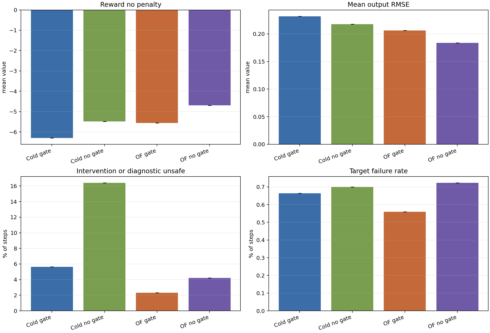
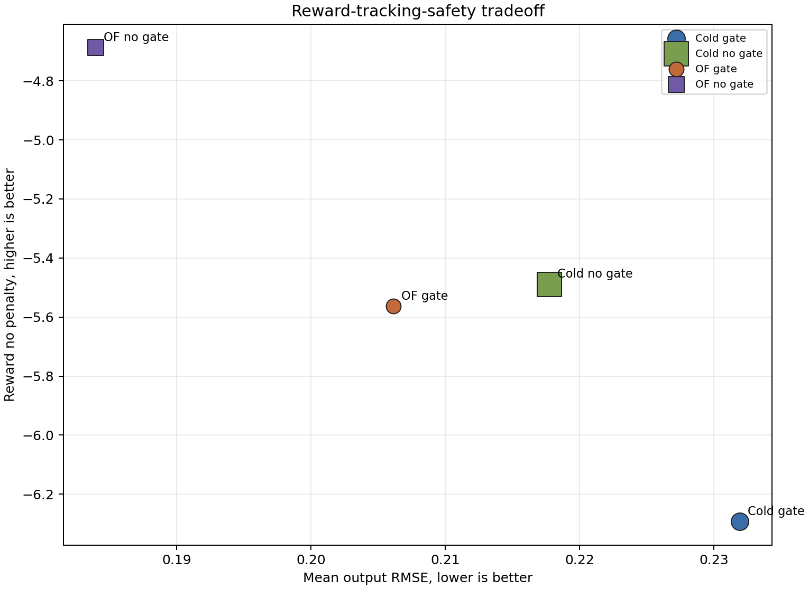
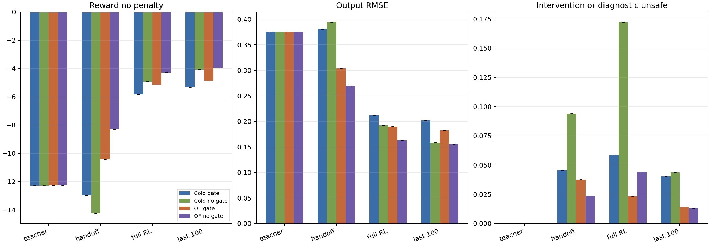
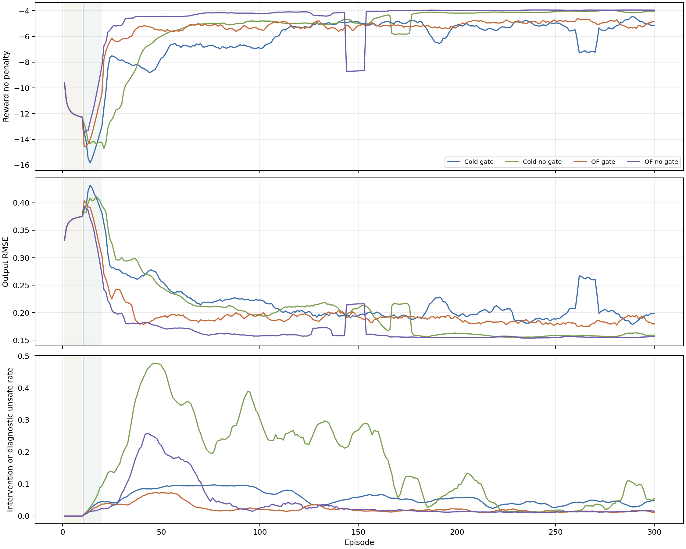
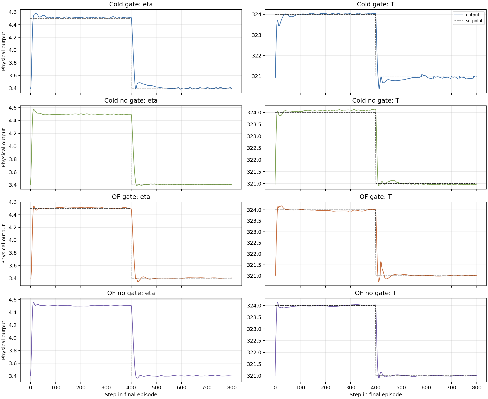
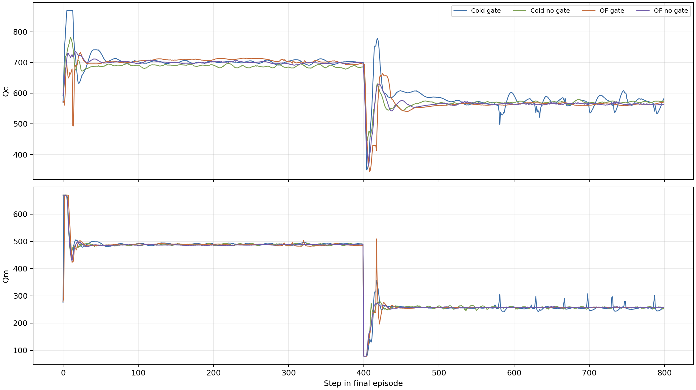

# Two-Run Online TD3 Analysis

Date: 2026-06-20

## Objective

This report compares the two latest completed executions of each active online
TD3 disturbance runner:

- cold start with the GART-LMPC safety gate
- cold start without active safety intervention
- OF-MPC-pretrained with the GART-LMPC safety gate
- OF-MPC-pretrained without active safety intervention

The comparison focuses on three questions: reward, tracking, and intervention
burden. It also checks whether the two executions are independent stochastic
runs or deterministic repeats.

## Data Used

| case | run_ids | seed | episodes | steps |
| --- | ---: | ---: | ---: | ---: |
| Cold start + gate | 20260619_131645, 20260619_174127 | 123, 123 | 300 | 240000 |
| Cold start no gate | 20260619_131640, 20260619_174127 | 123, 123 | 300 | 240000 |
| OF-MPC pretrained + gate | 20260619_131652, 20260619_174130 | 123, 123 | 300 | 240000 |
| OF-MPC pretrained no gate | 20260619_131649, 20260619_174127 | 123, 123 | 300 | 240000 |

Full metric exports are stored under
`report/figures/2026-06-20_online_td3_two_run/`.

## Reproducibility Check

| case | same_seed | episode_equal | arrays_equal | max_abs_diff |
| --- | ---: | ---: | ---: | ---: |
| Cold start + gate | True | True | True | 0.0e+00 |
| Cold start no gate | True | True | True | 0.0e+00 |
| OF-MPC pretrained + gate | True | True | True | 0.0e+00 |
| OF-MPC pretrained no gate | True | True | True | 0.0e+00 |

The two executions per runner used the same configured seed, `123`. Their
episode tables and selected trajectory arrays are identical for every case.
Therefore the two executions are useful as deterministic reproducibility checks,
but they are not independent seed replicates. The aggregate tables below report
mean +/- standard deviation across the two executions, but the zero standard
deviation should not be interpreted as statistical robustness.

## Method

All selected runs use the current active online schedule:

$$
N_{\mathrm{teacher}} = 10,
\qquad
\text{teacher update} = \text{critic TD only},
\qquad
N_{\mathrm{handoff}} = 10.
$$

The teacher behavior is noisy GART-LMPC in scaled input-deviation coordinates.
The handoff and full-RL exploration are also applied in `input_dev` coordinates.
The online reward uses

$$
r_k = r_{\mathrm{track/move}, k}
      - r_{\mathrm{fallback/event}, k},
$$

where `reward_no_penalty` is the tracking and move-quality component before
safety fallback penalties. Because gate runs can receive fallback/event
penalties while no-gate runs do not, `reward_no_penalty` is the fairer
cross-controller control-performance comparison. The `training_reward` column is
still reported because it is what TD3 actually optimizes online.

For safety-gate runs, `activity` means actual intervention rate: the fraction
of steps where the executed action differs from the TD3 candidate because of
fallback or hold-previous logic. For no-gate runs, `activity` means diagnostic
unsafe rate: the fraction of candidate actions that would have failed the GART
diagnostic gate, while the candidate was still executed.

Important timing note: these online runs were completed before the later
OF-MPC offline pretraining reward-label change. They evaluate the current online
runner configuration, not a regenerated OF-MPC-pretrained checkpoint.

## Reward And Tracking

| case | reward_no_penalty | training_reward | output_rmse | eta_rmse | T_rmse |
| --- | ---: | ---: | ---: | ---: | ---: |
| Cold start + gate | -6.293 +/- 0.000 | -8.172 +/- 0.000 | 0.232 +/- 0.000 | 0.130 +/- 0.000 | 0.334 +/- 0.000 |
| Cold start no gate | -5.489 +/- 0.000 | -5.489 +/- 0.000 | 0.218 +/- 0.000 | 0.127 +/- 0.000 | 0.308 +/- 0.000 |
| OF-MPC pretrained + gate | -5.564 +/- 0.000 | -6.766 +/- 0.000 | 0.206 +/- 0.000 | 0.129 +/- 0.000 | 0.283 +/- 0.000 |
| OF-MPC pretrained no gate | -4.688 +/- 0.000 | -4.688 +/- 0.000 | 0.184 +/- 0.000 | 0.121 +/- 0.000 | 0.247 +/- 0.000 |

The nominal rankings are close but not identical. By `reward_no_penalty`, the
order is:

1. OF-MPC pretrained no gate
2. cold start no gate
3. OF-MPC pretrained + gate
4. cold start + gate

By mean output RMSE, the order is:

1. OF-MPC pretrained no gate
2. OF-MPC pretrained + gate
3. cold start no gate
4. cold start + gate

This mismatch is useful: the OF-MPC gate run tracks better than cold no-gate,
but the reward still reflects move usage and gate-compatible behavior, not only
output RMSE.

OF-MPC pretraining improves the active-gate tracking RMSE by
11.1% relative to cold start with gate. It improves
the no-gate tracking RMSE by 15.5% relative to
cold start no gate. This supports the methodological value of starting online
TD3 from an MPC-shaped policy rather than relying only on cold-start online
learning.

## Intervention And Safety Burden

| case | candidate_pass | activity | actual_intervention | fallback | target_failure |
| --- | ---: | ---: | ---: | ---: | ---: |
| Cold start + gate | 94.37 +/- 0.00% | 5.63 +/- 0.00% | 5.63 +/- 0.00% | 4.96 +/- 0.00% | 0.66 +/- 0.00% |
| Cold start no gate | 83.60 +/- 0.00% | 16.40 +/- 0.00% | 0.00 +/- 0.00% | 0.00 +/- 0.00% | 0.70 +/- 0.00% |
| OF-MPC pretrained + gate | 97.69 +/- 0.00% | 2.31 +/- 0.00% | 2.31 +/- 0.00% | 1.75 +/- 0.00% | 0.56 +/- 0.00% |
| OF-MPC pretrained no gate | 95.80 +/- 0.00% | 4.20 +/- 0.00% | 0.00 +/- 0.00% | 0.00 +/- 0.00% | 0.72 +/- 0.00% |

The safety story is different from the nominal reward story. The no-gate cases
achieve better nominal tracking, but they also execute actions that the
diagnostic GART gate marks unsafe. The cold-start no-gate case has the largest
diagnostic unsafe rate, while OF-MPC pretraining reduces that diagnostic burden
by 74.4%.

Among active-gate runs, OF-MPC pretraining reduces the intervention burden by
58.9% relative to cold start with gate. This
is the strongest evidence in this batch for the combined methodology: pretraining
moves the policy closer to the safe controller manifold, and the gate handles
the remaining unsafe candidates.

## Phase Behavior

| case | phase | reward_no_penalty | output_rmse | activity |
| --- | ---: | ---: | ---: | ---: |
| Cold start + gate | teacher critic | -12.291 | 0.375 | 0.00% |
| Cold start + gate | handoff | -12.972 | 0.381 | 4.56% |
| Cold start + gate | full RL | -5.840 | 0.212 | 5.87% |
| Cold start no gate | teacher critic | -12.291 | 0.375 | 0.00% |
| Cold start no gate | handoff | -14.258 | 0.395 | 9.40% |
| Cold start no gate | full RL | -4.933 | 0.192 | 17.24% |
| OF-MPC pretrained + gate | teacher critic | -12.275 | 0.375 | 0.00% |
| OF-MPC pretrained + gate | handoff | -10.437 | 0.304 | 3.76% |
| OF-MPC pretrained + gate | full RL | -5.150 | 0.190 | 2.34% |
| OF-MPC pretrained no gate | teacher critic | -12.275 | 0.375 | 0.00% |
| OF-MPC pretrained no gate | handoff | -8.278 | 0.270 | 2.36% |
| OF-MPC pretrained no gate | full RL | -4.289 | 0.163 | 4.42% |

The teacher phase is almost identical across cold-start and pretrained cases
because behavior is supplied by GART-LMPC and actor BC is disabled. Differences
emerge during handoff and full RL. The no-gate cold-start run improves reward
and tracking in full RL, but its diagnostic unsafe rate also grows. The OF-MPC
pretrained no-gate run keeps the best full-RL tracking while reducing the
diagnostic unsafe load.

## Late-Training Behavior

| case | reward_no_penalty | output_rmse | activity | fallback |
| --- | ---: | ---: | ---: | ---: |
| Cold start + gate | -5.325 +/- 0.000 | 0.202 +/- 0.000 | 4.04 +/- 0.00% | 3.42 +/- 0.00% |
| Cold start no gate | -4.077 +/- 0.000 | 0.158 +/- 0.000 | 4.37 +/- 0.00% | 0.00 +/- 0.00% |
| OF-MPC pretrained + gate | -4.883 +/- 0.000 | 0.182 +/- 0.000 | 1.44 +/- 0.00% | 0.84 +/- 0.00% |
| OF-MPC pretrained no gate | -3.954 +/- 0.000 | 0.155 +/- 0.000 | 1.32 +/- 0.00% | 0.00 +/- 0.00% |

The last 100 episodes show the same ranking as the full-run averages. The
OF-MPC no-gate run is the best nominal tracker, but it is not intervention-safe.
The OF-MPC gate run is the strongest active-gate result and has a lower late
intervention rate than the cold-start gate run.

## Representative Final-Episode Trajectories

Because the two executions per case are trajectory-identical, the plots below
use the newest execution for each runner as the representative final episode.

## Interpretation

The result supports a balanced methodological claim rather than a simple
"safety gate always improves tracking" claim.

- The no-gate controllers are useful nominal-performance upper bounds, but they
  execute candidate actions that the diagnostic GART gate rejects.
- The active safety gate reduces risk by replacing unsafe candidates, but the
  replacement produces a reward and tracking cost, especially for cold start.
- OF-MPC pretraining improves both nominal performance and safety compatibility.
  It gives the best no-gate tracker and the best active-gate tracker.
- The strongest argument for the method is therefore the combination:
  pretraining reduces how often the gate must intervene, and the gate remains as
  a certification layer for the residual unsafe actions.

## Risks And Consistency Checks

- The two executions per runner are same-seed deterministic repeats, not
  independent seeds.
- Existing OF-MPC-pretrained checkpoints were not regenerated after the offline
  reward-label change, so this report should not be used to evaluate that later
  change.
- `training_reward` is not directly fair across gate and no-gate cases because
  gate cases include fallback/event penalties. Use `reward_no_penalty` for the
  main control-performance comparison.
- No-gate `activity` is diagnostic-only. It does not mean the action was
  replaced.

## Recommended Next Experiment

Run the same four active online runners with distinct seeds, for example
`123`, `124`, and `125`, while preserving the current schedule and probe-style
input exploration. The confirming result would be:

- OF-MPC pretrained + gate keeps lower RMSE than cold start + gate.
- OF-MPC pretrained + gate keeps lower intervention and fallback rates than
  cold start + gate.
- OF-MPC pretrained no gate keeps a lower diagnostic unsafe rate than cold start
  no gate.
- The qualitative ranking remains stable across independent seeds.

After regenerating OF-MPC-pretrained checkpoints with the aligned offline reward
labels, repeat this same report. That will separate the benefit of online
configuration changes from the benefit of the corrected offline critic reward
labels.
