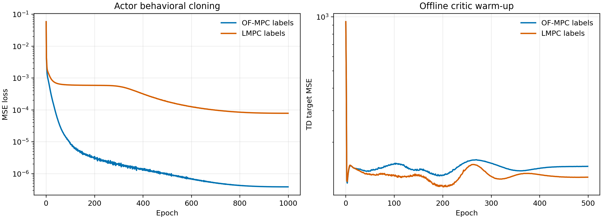
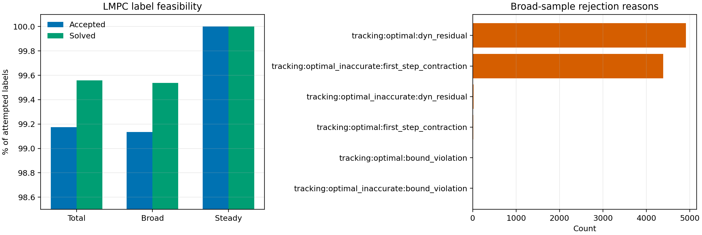
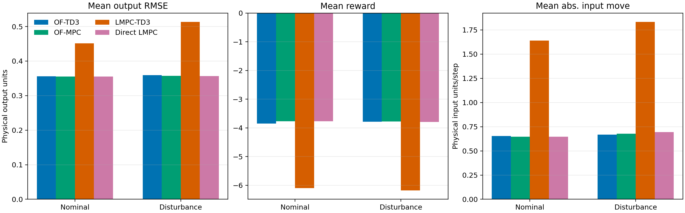
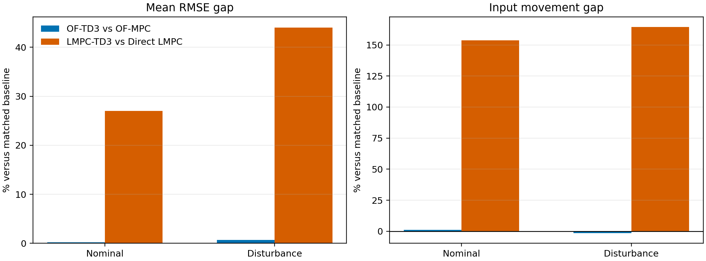
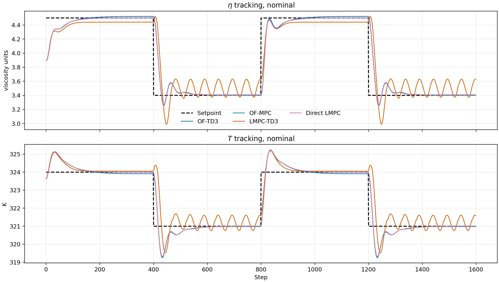
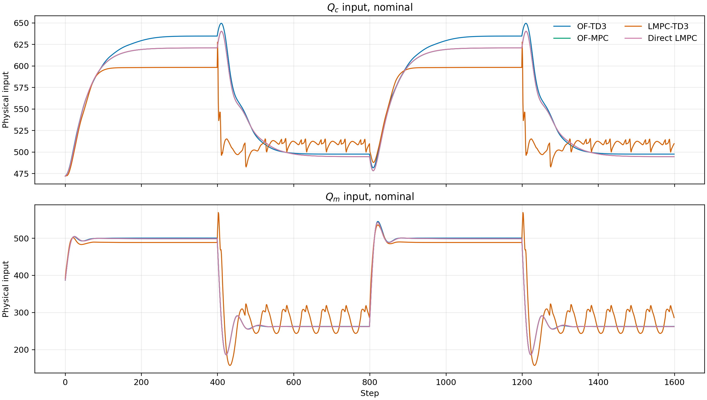
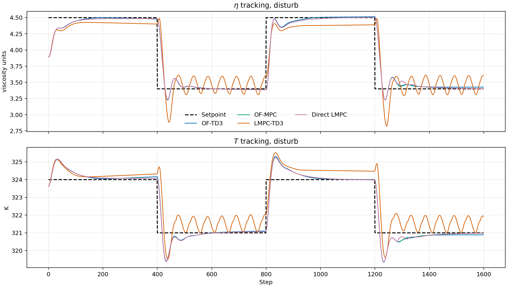
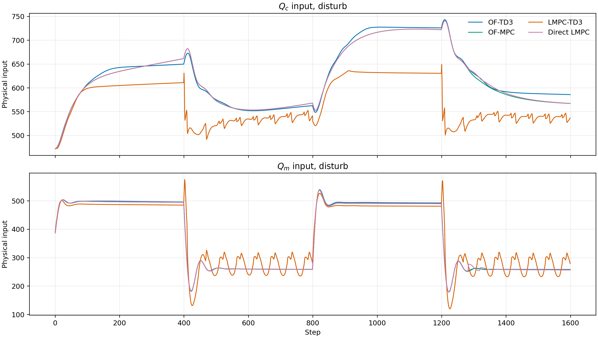

# TD3 Pretraining Full-Scale Analysis

This report analyzes the full-scale TD3 pretraining runs completed on June 10, 2026 for the polymer CSTR case study. It supersedes the earlier June 9 pilot interpretation in this same report file.

The comparison asks one practical question: after pretraining TD3 from expert first moves, how close is the saved actor to the controller that generated its labels?

- OF-MPC-pretrained TD3 is compared against offset-free MPC.
- Direct-LMPC-pretrained TD3 is compared against Direct Lyapunov MPC and the diagnostic OF-MPC baseline.
- Both comparison runs use two 400-step setpoint episodes, giving 1,600 simulated plant steps per mode.

## Result Bundles

**Pretraining runs**

| Expert labels | Run directory | Broad labels | Steady labels | Replay size |
|---|---:|---:|---:|---:|
| OF-MPC | `results/PretrainOFMPC/20260610_005048` | 2,000,000 | 100,000 | 2,100,000 |
| Direct LMPC | `results/PretrainLMPC/20260610_005100` | 2,000,000 | 100,000 | 2,100,000 |

**Comparison runs**

| Saved actor | Run directory | Modes | Steps |
|---|---|---|---:|
| OF-MPC-pretrained TD3 | `results/PretrainOFMPCComparison/20260610_154032` | nominal, disturb | 1,600 |
| LMPC-pretrained TD3 | `results/PretrainLMPCComparison/20260610_173925` | nominal, disturb | 1,600 |

The figures and compact source tables for this report were regenerated from those artifacts by:

```powershell
python analysis/td3_pretraining_latest_analysis.py
```

The regenerated figures are saved under `report/figures/2026-06-10_td3_pretraining_full_scale/`.

## Method Reconstruction

Both pretraining workflows use the same TD3 state and action convention. The actor state is

$$
s_k =
\begin{bmatrix}
\tilde{x}_{aug,k} \\
\tilde{y}_{sp,k} \\
\tilde{u}_{k-1}
\end{bmatrix},
$$

where $\tilde{x}_{aug,k}$ is the scaled output-disturbance augmented observer state, $\tilde{y}_{sp,k}$ is the scaled setpoint in deviation coordinates, and $\tilde{u}_{k-1}$ is the previous input in scaled deviation coordinates. The actor output is the expert first move scaled to $[-1,1]$:

$$
a_k^\star = \operatorname{scale}_{[-1,1]}(u_k^\star).
$$

The actor is initialized by behavioral cloning:

$$
\min_\theta
\mathbb{E}_{(s,a^\star)}
\left[
\|\pi_\theta(s)-a^\star\|_2^2
\right].
$$

The critics are then warmed up offline with the cloned actor frozen. The TD target is

$$
y_k =
r_k + \gamma \min_i Q_i^-(s_{k+1}, \pi^-(s_{k+1}) + \epsilon).
$$

The offline reward is the one-step MPC quadratic reward,

$$
r_k =
-
\left[
(y_{k+1}-y_{sp,k})^\top Q_{MPC}(y_{k+1}-y_{sp,k})
+
(u_k-u_{k-1})^\top R_{MPC}(u_k-u_{k-1})
\right],
$$

with $Q_{MPC}=\operatorname{diag}(5,1)$ and $R_{MPC}=\operatorname{diag}(1,1)$. This is the controller-objective reward used for offline labels. It is separate from the shaped online safety-gate RL reward family.

The Direct LMPC expert uses the governed-reference target path with hard first-step contraction:

$$
V(x_{k+1}-x_s) - \rho V(x_k-x_s) \le -\epsilon \|x_k-x_s\|^2,
$$

with $\rho=0.99$ and $\epsilon=0.005$. This is a practical model-based first-step contraction around the moving governed target, not a global nonlinear asymptotic stability proof to the raw setpoint.

## Implementation Consistency

The June 10 full-scale runs remove two pilot-era confounders. Both saved agents now use:

| Quantity | Value |
|---|---:|
| State dimension | 13 |
| Action dimension | 2 |
| Actor layers | `[256, 256, 256]` |
| Critic layers | `[256, 256, 256]` |
| Actor LR | 1e-4 |
| Critic LR | 3e-4 |
| Discount factor | 0.99 |
| Policy delay | 4 |
| Actor BC epochs | 1,000 |
| Critic warm-up epochs | 500 |

The scaling and objective conventions also match the intended repository rules:

- comparison setpoints are `[[4.5, 324.0], [3.4, 321.0]]` in physical output units
- TD3 setpoint scaler is `[[2.8, 320.0], [5.0, 326.0]]`
- input bounds are `[71.6, 78.0]` to `[870.0, 670.0]`
- OF-MPC and LMPC objectives use $Q=[5,1]$ and $R=[1,1]$
- offline pretraining rewards use the same $Q=[5,1]$ and $R=[1,1]$
- no online shaped reward terms are used to form these rollout comparison metrics

## Loss Analysis



| Expert labels | Actor first | Actor last | Last/first | Critic first | Critic last | Last/first |
|---|---:|---:|---:|---:|---:|---:|
| OF-MPC | 5.803e-2 | 3.877e-7 | 6.68e-6 | 937.90 | 146.81 | 0.157 |
| Direct LMPC | 5.867e-2 | 7.868e-5 | 1.34e-3 | 940.17 | 127.76 | 0.136 |

The OF-MPC actor reaches a much lower final behavioral-cloning loss. The LMPC actor still learns strongly, but its final loss is about 203 times larger than the OF-MPC actor's final loss. That difference is consistent with a harder expert map: the Direct LMPC expert includes governed-reference target selection and a contraction-constrained first move, which can introduce sharper local changes in the label function than plain OF-MPC.

The critic warm-up losses fall for both workflows. The critic results should be read as offline value preconditioning, not as final online value quality, because later safety-gate RL will use a different shaped reward.

## LMPC Label Feasibility



The Direct LMPC label generator is not the bottleneck in this run.

| Quantity | Value |
|---|---:|
| Accepted labels | 2,100,000 |
| Attempted candidates | 2,117,462 |
| Acceptance rate | 99.18% |
| Solve success rate | 99.56% |
| Broad acceptance rate | 99.13% |
| Steady acceptance rate | 100.00% |

The main broad-sample rejection reasons were:

- `tracking:optimal:dyn_residual`: 4,911
- `tracking:optimal_inaccurate:first_step_contraction`: 4,385
- `tracking:optimal_inaccurate:dyn_residual`: 21
- `tracking:optimal:first_step_contraction`: 15
- bound-violation labels: 4 total

This is a strong feasibility result. The weaker LMPC-pretrained TD3 rollout cannot be explained by a sparse or mostly failed LMPC label generator. The more likely issue is imitation of a harder and less smooth expert action map.

## Rollout Metrics





**Matched baseline gap**

| Mode | OF-TD3 RMSE gap | OF-TD3 input gap | LMPC-TD3 RMSE gap | LMPC-TD3 input gap |
|---|---:|---:|---:|---:|
| Nominal | +0.23% | +1.15% | +27.03% | +153.81% |
| Disturbance | +0.70% | -1.43% | +44.03% | +164.41% |

The result has changed substantially from the pilot. OF-MPC-pretrained TD3 is now essentially baseline-level on this two-episode comparison. LMPC-pretrained TD3 has improved, but it remains clearly worse than Direct LMPC in both tracking and input smoothness.

### Nominal Rollout

| Controller | Reward mean | Mean RMSE | Eta RMSE | T RMSE |
|---|---:|---:|---:|---:|
| OF-TD3 | -3.851 | 0.356 | 0.182 | 0.530 |
| OF-MPC | -3.765 | 0.355 | 0.180 | 0.531 |
| LMPC-TD3 | -6.093 | 0.451 | 0.229 | 0.674 |
| Direct LMPC | -3.765 | 0.355 | 0.180 | 0.531 |

| Controller | Eta IAE | T IAE | Mean abs. du |
|---|---:|---:|---:|
| OF-TD3 | 109.93 | 426.24 | 0.654 |
| OF-MPC | 101.00 | 399.14 | 0.646 |
| LMPC-TD3 | 222.93 | 596.98 | 1.640 |
| Direct LMPC | 100.95 | 398.58 | 0.646 |

### Disturbance Rollout

| Controller | Reward mean | Mean RMSE | Eta RMSE | T RMSE |
|---|---:|---:|---:|---:|
| OF-TD3 | -3.784 | 0.359 | 0.180 | 0.539 |
| OF-MPC | -3.773 | 0.357 | 0.180 | 0.534 |
| LMPC-TD3 | -6.177 | 0.513 | 0.224 | 0.803 |
| Direct LMPC | -3.789 | 0.356 | 0.181 | 0.532 |

| Controller | Eta IAE | T IAE | Mean abs. du |
|---|---:|---:|---:|
| OF-TD3 | 113.48 | 470.40 | 0.668 |
| OF-MPC | 112.70 | 451.95 | 0.678 |
| LMPC-TD3 | 240.84 | 948.58 | 1.833 |
| Direct LMPC | 114.98 | 450.38 | 0.693 |

Direct LMPC and OF-MPC are nearly indistinguishable in this comparison. Direct LMPC also reports solver success, target success, and first-step contraction satisfaction rates of 1.0 in both nominal and disturbance modes. The diagnostic OF-MPC baseline inside the LMPC comparison has four would-be unsafe contraction checks in the disturbance mode, but its raw tracking metrics remain almost identical to Direct LMPC.

## Rollout Traces









The traces explain the metric table.

OF-TD3 almost overlays OF-MPC and Direct LMPC in both modes. It is not exactly identical, but the remaining mismatch is small enough that it should be considered a successful offline imitation result for this rollout scenario.

LMPC-TD3 tracks the correct qualitative direction, but it uses a lower and more oscillatory input pattern after the downward setpoint changes. The oscillation is visible in both $Q_c$ and $Q_m$, and it propagates into periodic eta and temperature deviations. That is why the LMPC-pretrained actor has much larger input movement and worse reward even though the labels themselves were feasible.

## Main Interpretation

The OF-MPC pretraining workflow is now mature enough to use as the baseline pretrained actor for the next online safety-gate experiment. The actor almost matches OF-MPC on mean RMSE, reward, and input movement in both nominal and disturbed rollouts.

The LMPC pretraining workflow is scientifically promising but not yet controller-quality by itself. The key positive result is label feasibility at 2.1M samples. The key negative result is that the learned actor has not captured the Direct LMPC transient policy smoothly enough near setpoint transitions. This looks like an imitation-density and action-smoothness problem, not a broken Lyapunov label generator.

The full-scale result also changes the old pilot conclusion. The earlier report said both TD3 agents were worse than their baselines. That is no longer true for OF-MPC-pretrained TD3. It remains true for LMPC-pretrained TD3.

## Risks And Inconsistencies Found

- The previous pilot report was stale relative to the June 10 full-scale artifacts.
- The latest comparisons are still small: two episodes and one seed per expert workflow.
- TD3 rollout rows do not carry Lyapunov contraction certificates. Only the Direct LMPC and diagnostic OF-MPC baseline payloads report contraction diagnostics.
- The LMPC-pretrained actor can create oscillatory inputs after downward transitions. It should not be treated as a safe standalone controller without the safety gate.
- No held-out expert-action test is saved yet, so the report cannot separate pure one-step imitation error from closed-loop amplification.
- No new literature citations were added in this code-side report. The conclusions are drawn from local saved artifacts only.

## Recommended Next Experiments

1. Add a held-out expert-action benchmark for both label sources.

Purpose: measure pure imitation quality before closed-loop rollout.

Likely files: `utils/of_mpc_td3_workflow.py`, `utils/lmpc_td3_workflow.py`, or a new analysis script under `analysis/`.

What to report: actor action MAE/RMSE in scaled action units and physical input units, per input channel, plus saturation-rate mismatch.

Success criterion: OF-TD3 stays near the current low loss, and LMPC-TD3 identifies whether the remaining gap is concentrated near transition states or across the full state space.

2. Densify LMPC labels around transition-like states.

Purpose: reduce the oscillatory LMPC-TD3 behavior after downward setpoint changes.

Likely file: `utils/lmpc_td3_workflow.py`.

What to change: add a transition-focused sampling slice with states near the comparison setpoints and with previous inputs close to the Direct LMPC transient manifold.

Metrics that should improve: LMPC-TD3 mean abs. du, reward mean, and T IAE in the disturbance rollout.

3. Try online safety-gate adaptation starting from the OF-MPC-pretrained actor.

Purpose: use the strongest pretrained actor as the next controlled online-training baseline.

Likely file: `DirectLyapunovSafetyGateRL_Pretrained.py`.

What to watch: fallback rate, `reward_no_penalty`, action correction size, and whether online critic adaptation preserves the OF-MPC-level tracking already achieved offline.

4. For LMPC pretraining, compare pure BC against BC plus a smoothness-aware action target.

Purpose: penalize learned oscillations without weakening the LMPC expert itself.

Likely files: `TD3Agent/agent.py` and the LMPC pretraining path in `utils/lmpc_td3_workflow.py`.

What to watch: do not overwrite MPC/LMPC objective weights. Keep any BC smoothness term strictly in the actor imitation loss or replay sampling logic.

## Remaining Uncertainty

The current evidence is strong for OF-MPC imitation on this saved scenario, but not yet a broad robustness claim. The next report should add held-out action metrics, more seeds or scenarios, and safety-gate online adaptation metrics. For LMPC, the open question is whether the actor needs more targeted data, a smoother imitation loss, or online relabeling to learn the contraction-constrained transient map.

## Bottom Line

The June 10 full-scale results are encouraging. OF-MPC-pretrained TD3 has effectively reached OF-MPC baseline behavior on the saved nominal and disturbance rollouts. LMPC-pretrained TD3 is feasible and directionally correct, but it still produces oscillatory input transients and should be improved before being used as a standalone pretrained policy.
