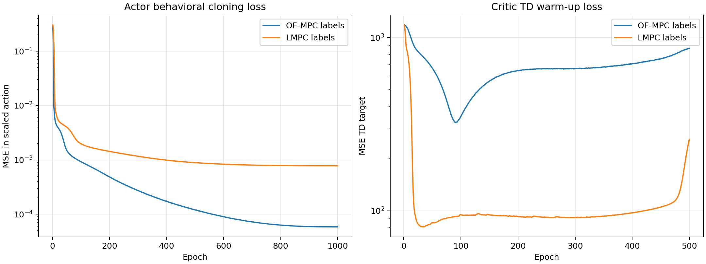
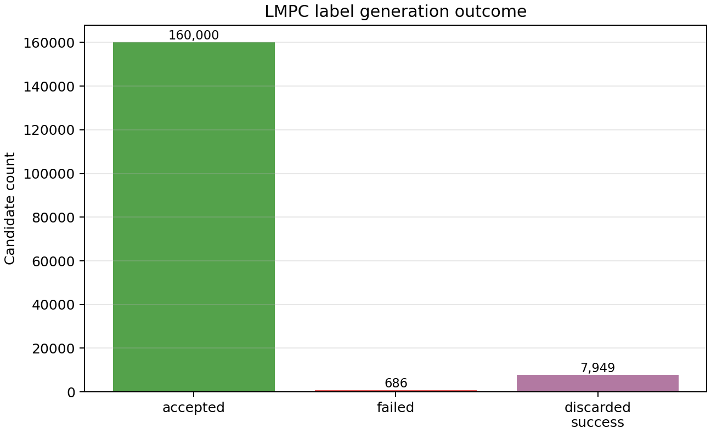
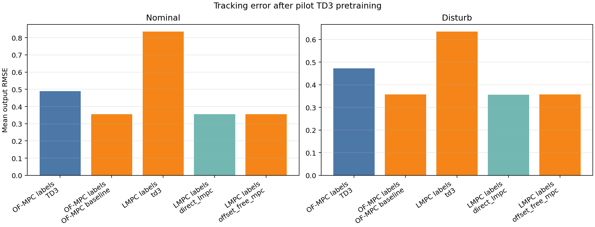
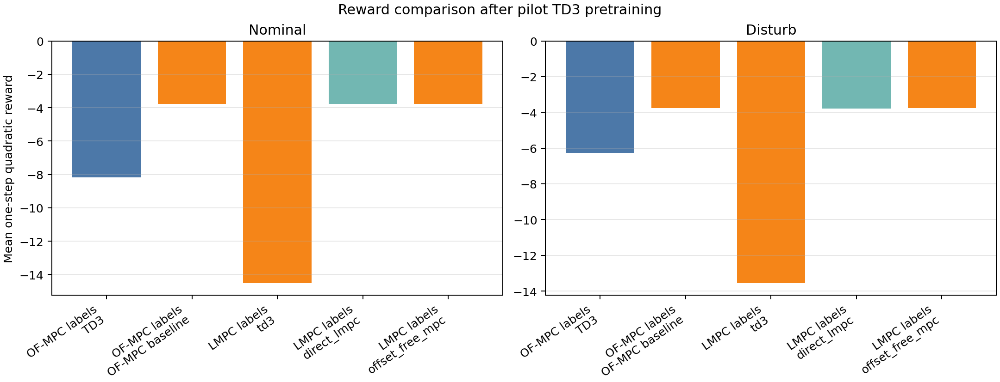
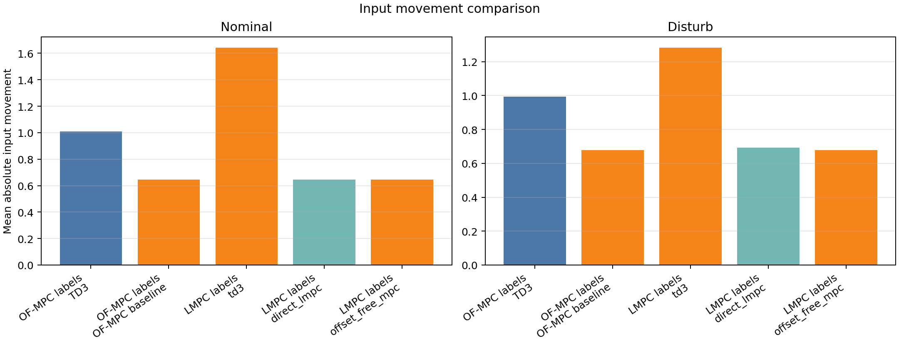
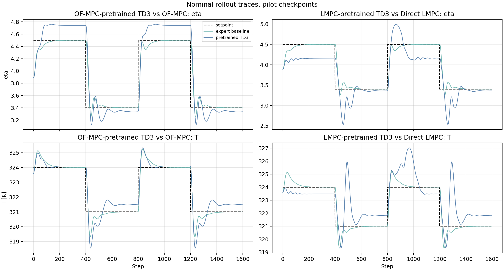
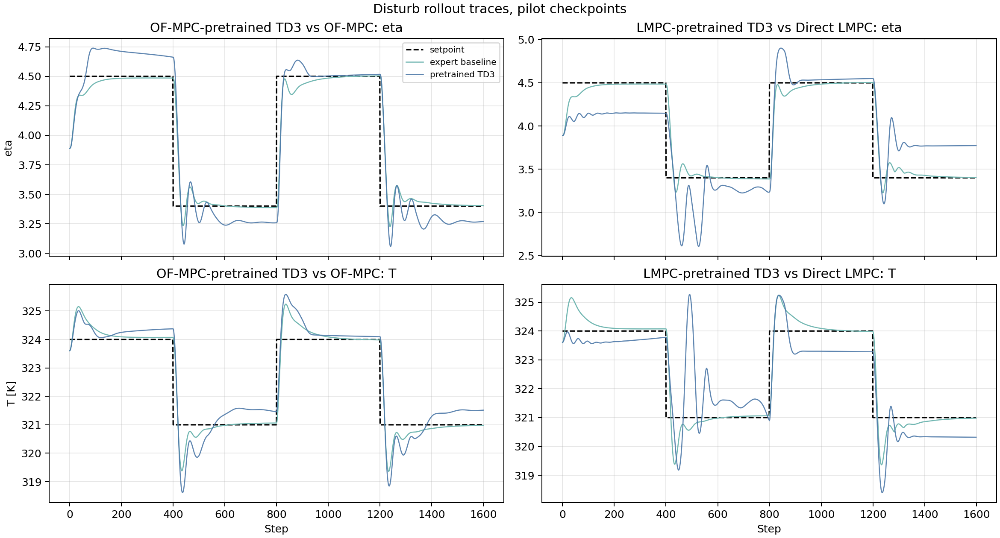

# TD3 Pretraining Pilot Analysis

This report analyzes the small-sample TD3 pretraining pilots completed on June 9, 2026 for both expert-label workflows:

- offset-free MPC expert labels
- Direct Lyapunov MPC expert labels

The goal is not to claim final controller performance. The goal is to decide whether the pretraining method, losses, saved agents, and comparison rollouts are healthy enough to justify larger runs.

## Result Bundles

**Pretraining runs**

| Method | Run directory | Broad labels | Steady labels | Buffer size |
|---|---:|---:|---:|---:|
| OF-MPC labels | `results/PretrainOFMPC/20260609_222522` | 150,000 | 10,000 | 160,000 |
| LMPC labels | `results/PretrainLMPC/20260609_220058` | 150,000 | 10,000 | 160,000 |

**Comparison runs**

| Method | Run directory | Modes | Horizon |
|---|---|---|---:|
| OF-MPC-pretrained TD3 vs OF-MPC | `results/PretrainOFMPCComparison/20260609_233011` | nominal, disturb | 1,600 steps |
| LMPC-pretrained TD3 vs Direct LMPC and OF-MPC | `results/PretrainLMPCComparison/20260609_232747` | nominal, disturb | 1,600 steps |

All reported values below come from the saved JSON, CSV, and pickle artifacts in those directories. Figures were generated from the same artifacts and saved under `report/figures/td3_pretraining_pilot_analysis_2026-06-10/`.

## Method Reconstruction

Both workflows pretrain the TD3 actor from expert first moves. The TD3 state is

$$
s_k =
\left[
\tilde{x}_{aug,k},
\tilde{y}_{sp,k},
\tilde{u}_{k-1}
\right],
$$

where $\tilde{x}_{aug,k}$ is the scaled augmented output-disturbance observer state, $\tilde{y}_{sp,k}$ is the scaled setpoint, and $\tilde{u}_{k-1}$ is the previous input in scaled deviation coordinates. The action is the expert first move scaled to $[-1,1]$:

$$
a_k = \operatorname{scale}_{[-1,1]}(u_k^\star).
$$

Actor pretraining uses behavioral cloning:

$$
\min_\theta
\mathbb{E}_{(s,a^\star)}
\left[
\|\pi_\theta(s)-a^\star\|_2^2
\right].
$$

Critic warm-up then freezes the cloned actor and trains the twin critics with TD targets:

$$
y_k =
r_k + \gamma \min_i Q_i^-(s_{k+1}, \pi^-(s_{k+1}) + \epsilon),
$$

using the offline one-step MPC quadratic reward

$$
r_k =
-
\left[
(y_{k+1}-y_{sp,k})^\top Q_{MPC}(y_{k+1}-y_{sp,k})
+(u_k-u_{k-1})^\top R_{MPC}(u_k-u_{k-1})
\right],
$$

with $Q_{MPC}=\operatorname{diag}(5,1)$ and $R_{MPC}=\operatorname{diag}(1,1)$. This is intentionally separate from the online shaped RL reward used later in the safety-gate training runners.

## Agent Configuration

Both pilots used the same saved actor and critic architecture:

| Method | State dim | Action dim | Actor layers | Critic layers |
|---|---:|---:|---|---|
| OF-MPC labels | 13 | 2 | `[256, 256, 256]` | `[256, 256, 256]` |
| LMPC labels | 13 | 2 | `[256, 256, 256]` | `[256, 256, 256]` |

The optimizer and TD3 hyperparameters were not identical:

| Method | $\gamma$ | Actor LR | Critic LR | Policy delay |
|---|---:|---:|---:|---:|
| OF-MPC labels | 0.995 | 1e-4 | 1e-4 | 4 |
| LMPC labels | 0.99 | 5e-5 | 5e-4 | 2 |

This matters for interpreting critic losses. The actor imitation losses are directly comparable because the architecture, sample count, state scaler, and action scaler match. The critic losses are less directly comparable because the learning rates, discount factor, and policy delay differ.

## Scaling And Objective Consistency

The pilot artifacts confirm that the corrected Polymer TD3 scaling convention is being used:

- TD3 setpoint scaler: `[[2.8, 320.0], [5.0, 326.0]]`
- rollout/comparison setpoints: `[[4.5, 324.0], [3.4, 321.0]]`
- TD3 state bounds: the manually defined Polymer-example `x_min/x_max`
- input bounds: `[71.6, 78.0]` to `[870.0, 670.0]`

The controller objective weights are also consistent with the intended convention:

- OF-MPC and LMPC objective: $Q=[5,1]$, $R=[1,1]$
- offline pretraining reward: one-step quadratic with $Q=[5,1]$, $R=[1,1]$
- online shaped RL reward: separate reward family, not used as the MPC or LMPC objective

This removes the earlier range and reward/objective mismatch as the likely source of the observed pilot differences.

## Loss Analysis

| Method | Actor first | Actor last | Actor last/first | Critic first | Critic last | Critic last/first |
|---|---:|---:|---:|---:|---:|---:|
| OF-MPC labels | 2.958e-1 | 5.858e-5 | 1.98e-4 | 1183.30 | 867.02 | 0.733 |
| LMPC labels | 3.050e-1 | 7.799e-4 | 2.56e-3 | 1175.33 | 258.86 | 0.220 |

The actor behavioral-cloning stage works for both experts. The OF-MPC actor reaches a much lower final imitation loss at the same sample count, while the LMPC actor remains about one order of magnitude higher. This is not surprising: the LMPC expert includes governed-reference target selection and hard contraction logic, so its action map is less smooth than the OF-MPC map over the broad synthetic state distribution.

The critic losses need a more careful reading. LMPC critic loss decreases much more strongly than OF-MPC critic loss, but the critic is only learning an offline one-step reward/value approximation. It is not yet calibrated to the online shaped safety-gate reward. For future online training, the actor imitation quality and rollout behavior are more important than raw offline critic loss. The online actor-frozen critic phase should be used to recalibrate the critics on the actual online reward.

The OF-MPC critic curve dips and then rises late in training. This suggests that 500 critic epochs may be excessive for the OF-MPC pilot with this critic learning rate and replay distribution. The LMPC critic curve also rises after its minimum, but its final value remains substantially below its starting value.

## LMPC Label Feasibility

The LMPC label generator accepted 160,000 replay labels from 168,635 candidates.

| Quantity | Value |
|---|---:|
| Accepted labels | 160,000 |
| Attempted candidates | 168,635 |
| Acceptance rate | 94.88% |
| Successful LMPC solves | 167,949 |
| Solve success rate | 99.59% |
| Failed candidates | 686 |
| Discarded successful solves | 7,949 |

The discarded successful solves are a parallel-batch artifact: workers can finish extra successful solves after the requested accepted count is reached. They are not failed labels and are not inserted into the replay buffer.

The broad-sample failure reasons were mostly numerical or contraction-filter rejections:

- `tracking:optimal:dyn_residual`: 368
- `tracking:optimal_inaccurate:first_step_contraction`: 313
- `tracking:optimal:first_step_contraction`: 4
- `tracking:optimal:bound_violation`: 1

This is a good feasibility profile. The hard LMPC expert is not rejecting a large fraction of the sampled training distribution.

## Rollout Comparison

### Nominal Rollout

| Controller | Reward mean | Mean RMSE | Eta RMSE | T RMSE | Mean abs. du |
|---|---:|---:|---:|---:|---:|
| OF-MPC-pretrained TD3 | -8.185 | 0.490 | 0.269 | 0.711 | 1.010 |
| OF-MPC baseline | -3.765 | 0.355 | 0.180 | 0.531 | 0.646 |
| LMPC-pretrained TD3 | -14.508 | 0.836 | 0.337 | 1.334 | 1.643 |
| Direct LMPC baseline | -3.765 | 0.355 | 0.180 | 0.531 | 0.646 |
| OF-MPC baseline in LMPC comparison | -3.765 | 0.355 | 0.180 | 0.531 | 0.646 |

### Disturbance Rollout

| Controller | Reward mean | Mean RMSE | Eta RMSE | T RMSE | Mean abs. du |
|---|---:|---:|---:|---:|---:|
| OF-MPC-pretrained TD3 | -6.261 | 0.472 | 0.231 | 0.714 | 0.994 |
| OF-MPC baseline | -3.773 | 0.357 | 0.180 | 0.534 | 0.678 |
| LMPC-pretrained TD3 | -13.554 | 0.635 | 0.345 | 0.925 | 1.283 |
| Direct LMPC baseline | -3.789 | 0.356 | 0.181 | 0.532 | 0.693 |
| OF-MPC baseline in LMPC comparison | -3.774 | 0.357 | 0.180 | 0.534 | 0.678 |

The TD3 agents are not yet matching their expert baselines. The OF-MPC-pretrained TD3 is closer: its mean RMSE is about 38% higher than OF-MPC in nominal mode and 32% higher in disturbance mode. The LMPC-pretrained TD3 is farther away: about 135% higher than Direct LMPC in nominal mode and 78% higher in disturbance mode.

The input movement metrics show the same pattern. Both TD3 agents move more aggressively than their baselines, and the LMPC-pretrained TD3 has the largest movement. This is consistent with an imitation policy that has learned the broad action map but still overshoots near switching transients.

## Rollout Traces

The traces show that both TD3 policies have learned the qualitative direction of the expert moves. The problem is not random behavior or broken action scaling. The visible issue is transient mismatch: the TD3 policies overshoot and oscillate more after setpoint changes.

For the OF-MPC-pretrained TD3, the tracking shape is close enough that more data and online critic/BC refinement are likely to help. For the LMPC-pretrained TD3, the policy also tracks the correct direction, but the transient deviations are larger. That points to an undertrained imitation map rather than a failed LMPC label generator.

## Interpretation

The pilot results support continuing, but they do not yet support using either pilot checkpoint as a final pretrained controller.

**What is working**

- Loss logging is now complete and analyzable.
- Both actors learn a meaningful expert-imitation map.
- The LMPC label generator is feasible at this sampling envelope.
- The comparison runners load the saved checkpoints and produce stable rollout artifacts.
- Scaling, objective weights, and offline reward convention are consistent.
- The TD3 policies track in the correct qualitative direction.

**What is not yet good enough**

- Both TD3 agents are worse than MPC baselines in reward, tracking error, and input movement.
- The LMPC-pretrained actor is underfit relative to OF-MPC at the same 160k replay size.
- The offline critics should not be trusted as final online value functions because the online safety-gate reward is different.
- The OF-MPC critic warm-up may be overtrained or poorly tuned in the later epochs.
- The OF-MPC and LMPC pilots used different TD3 hyperparameters, so the critic-loss comparison is not a clean method-only comparison.

## Are We On The Right Path?

Yes, with an important qualifier. The current results say the method is structurally correct and worth scaling, but the small-sample checkpoints are not yet expert-level. The strongest evidence for continuing is that the TD3 policies are not failing catastrophically: they track the right direction, use the right scaling, and produce coherent closed-loop behavior. The remaining gap looks like an imitation accuracy and transient-shaping problem, not a broken formulation.

The LMPC workflow is especially promising because label feasibility is high. The weaker LMPC rollout is likely due to the harder expert action map and insufficient label density, not because the Direct LMPC expert itself is unsuitable for pretraining.

## Recommended Next Runs

Before the largest run, use one intermediate scale-up:

- OF-MPC: 500k to 1M broad labels plus 50k to 100k steady labels
- LMPC: 500k broad labels plus 50k steady labels first, then scale toward 2M if the actor BC and rollout improve
- keep `[256, 256, 256]` initially for comparability
- align TD3 hyperparameters between OF-MPC and LMPC if the purpose is a clean expert-label comparison

Add one held-out imitation test before long online training:

1. sample a held-out candidate set
2. label it with OF-MPC or LMPC
3. evaluate actor action MAE/RMSE in scaled and physical input units
4. report per-input error and saturation rate

This will separate pure imitation quality from closed-loop dynamics.

For online training, keep the current staged approach:

- load the pretrained actor
- keep the actor frozen or BC-guided while critics adapt
- train critics on the actual online shaped reward
- keep LMPC teacher relabeling during early online rollout
- track `bc_teacher_gap_inf` as the online DAgger-style imitation diagnostic

For critic handling, the safest next experiment is not a three-critic ensemble yet. First compare:

- pretrained actor with pretrained critics, followed by online critic-only recalibration
- pretrained actor with last-layer critic reset, followed by online critic-only recalibration

The second option may adapt faster than a full critic reset while avoiding some offline-reward mismatch.

## Bottom Line

The pretraining workflow is now in a scientifically usable state. The pilot checkpoints are not final, but they provide a healthy signal:

- OF-MPC pretraining is already close enough to the baseline shape to justify a larger run.
- LMPC pretraining is feasible and coherent, but needs more labels or stronger online relabeling to reduce transient mismatch.
- The next major effort should scale label count and add held-out imitation validation, not redesign the whole algorithm.
